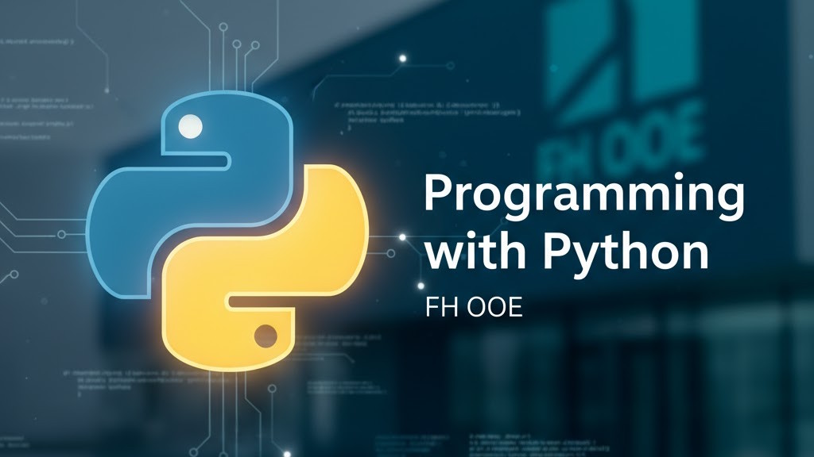
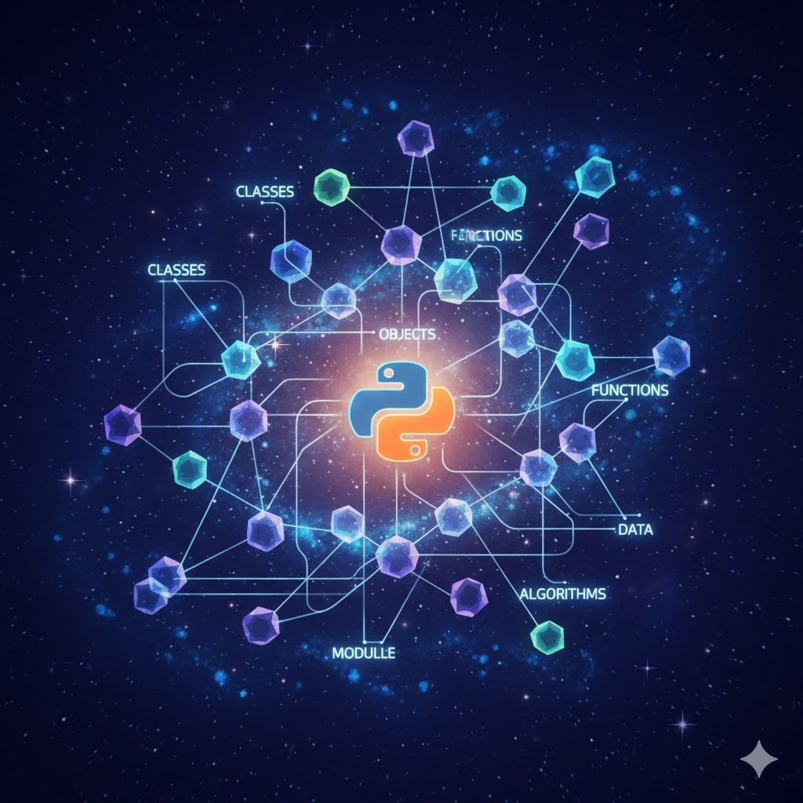

# Programming with Python

Welcome to the "Programming with Python" course materials repository!

This repository contains all the necessary materials for the course, including slides, homework assignments, and exams for each session.

## Sessions Overview

Here you will find an overview of all sessions and links to their respective presentation slides:

| Session Image | Session Title & Sections |
|---|---|
|  | **[Session 01: Introduction to Python & Programming Basics](./Sessions/Session_01/Session_01_Slides.md)** 1.1: What is Programming? 1.2: Why Python? 1.3: Setting up Your Environment 1.4: Basic Syntax: Variables and Data Types 1.5: Input and Output |
|  | **[Session 02: Control Flow & Data Structures I](./Sessions/Session_02/Session_02_Slides.md)** 2.1: Conditional Statements (if/else) 2.2: Loops (for/while) 2.3: Lists 2.4: Tuples |
|  | **[Session 03: Data Structures II & Functions](./Sessions/Session_03/Session_03_Slides.md)** 3.1: Dictionaries 3.2: Sets 3.3: Defining Functions 3.4: Function Arguments and Return Values |
|  | **[Session 04: Modules, Packages & File I/O](./Sessions/Session_04/Session_04_Slides.md)** 4.1: Importing Modules 4.2: Creating Custom Modules 4.3: Reading from Files 4.4: Writing to Files |
|  | **[Session 05: Error Handling & Debugging](./Sessions/Session_05/Session_05_Slides.md)** 5.1: Types of Errors 5.2: Try-Except Blocks 5.3: Raising Exceptions 5.4: Basic Debugging Techniques |
|  | **[Session 06: Object-Oriented Programming (OOP) I](./Sessions/Session_06/Session_06_Slides.md)** 6.1: Introduction to OOP 6.2: Classes and Objects 6.3: Attributes and Methods 6.4: The `__init__` Method |
|  | **[Session 07: Object-Oriented Programming (OOP) II](./Sessions/Session_07/Session_07_Slides.md)** 7.1: Inheritance 7.2: Polymorphism 7.3: Encapsulation 7.4: Abstract Classes 7.5: Composition vs. Inheritance |
|  | **[Session 08: Advanced Data Structures & Algorithms](./Sessions/Session_08/Session_08_Slides.md)** 8.1: Stacks and Queues 8.2: Linked Lists 8.3: Recursion 8.4: Basic Sorting Algorithms |
|  | **[Session 09: Working with External Libraries](./Sessions/Session_09/Session_09_Slides.md)** 9.1: Installing Packages with pip 9.2: Introduction to NumPy 9.3: Introduction to Pandas 9.4: Introduction to Matplotlib |
|  | **[Session 10: Web APIs, Testing & Documentation](./Sessions/Session_10/Session_10_Slides.md)** 10.1: Introduction to Web APIs (REST) 10.2: Consuming APIs with the `requests` Library 10.3: Automated Testing with `pytest` 10.4: Documentation and Professional Best Practices |
