<!-- Abstract illustration of interconnected nodes and lines representing programming concepts, with a glowing Python logo subtly integrated, all set against a dark, swirling galaxy background. The overall aesthetic is futuristic and conceptual. -->


# Chapter 1: Introduction to Python & Programming Basics

This chapter includes the following sections:

- 1.1: What is Programming?
- 1.2: Why Python?
- 1.3: Setting up Your Environment
- 1.4: Basic Syntax: Variables and Data Types
- 1.5: Input and Output

---

<!-- Abstract illustration of a human hand interacting with lines of code and binary data, symbolizing the act of programming, set against a dark galaxy background with subtle light trails. -->


## 1.1: What is Programming?

This section includes the following content:

- What is Programming?
- What Programmers Do
- Algorithms and Logic
- Machine Code vs. High-Level Languages
- Interpreted vs. Compiled Languages
- Why Learn Programming?
- Problem-Solving Approach
- Example: Simple Instructions

---

<div class="columns">
<div class="two">

### What is Programming?

- **Definition:** Giving instructions to a computer to perform a task.
- **Goal:** Automate tasks, solve problems, create applications.
- **Language:** Computers understand machine code (binary). We use high-level languages (like Python) that are translated.

**Illustration:**


---

<div class="columns">
<div class="two">

### What Programmers Do

- **Analyze:** Programmers first thoroughly understand the problem they need to solve.
- **Design:** They then plan a step-by-step solution, often referred to as an algorithm.
- **Code:** This involves writing the actual instructions using a specific programming language.
- **Test:** After coding, they rigorously check if the solution functions as intended and meets all requirements.
- **Debug:** If errors or unexpected behavior occur, programmers identify and correct these issues.
- **Deploy:** Finally, they make the developed software or solution accessible and operational for users.

**Illustration:**


---

<div class="columns">
<div class="two">

### Algorithms and Logic

- **Algorithm:** A precise, step-by-step procedure or formula for solving a problem or accomplishing a task. Algorithms are fundamental to programming, providing the blueprint for any computational process.
- **Logic:** The underlying principles and reasoning that dictate how the steps of an algorithm are structured and executed. This involves using conditional statements and loops to control the flow of execution.
- **Example:** A common real-world analogy is a recipe for baking a cake, which serves as a clear algorithm, detailing each step from ingredients to final product.

</div>
<div>

```
Algorithm: Make Coffee
1. Get water
2. Heat water
3. Add coffee grounds
4. Pour water over grounds
5. Serve
```

</div>
</div>

---

<div class="columns">
<div class="three">

### Machine Code vs. High-Level Languages

- **Machine Code:** These are low-level binary instructions (sequences of 0s and 1s) that are directly executed by the computer's Central Processing Unit (CPU).
- **High-Level Languages:** These are human-readable programming languages (such as Python, Java, or C++) that abstract away the complexities of machine code.
- **Translators:** Software tools are required to convert high-level code into machine code:
    - **Compilers:** Translate the entire source code into machine code before the program is executed.
    - **Interpreters:** Translate and execute the source code line by line during runtime.

</div>
<div>


</div>
</div>

---

<div class="columns">
<div>

### Interpreted vs. Compiled Languages

- **Interpreted (e.g., Python):** Code is executed line by line by an interpreter at runtime. This offers easier debugging and greater flexibility, but generally results in slower execution speeds.
- **Compiled (e.g., C++):** The entire source code is translated into machine code before execution. This achieves faster performance, but debugging can be more challenging as errors might only appear after full compilation, and flexibility is often reduced.

</div>
<div>


</div>
</div>

---

<div class="columns">
<div>

### Why Learn Programming?

- **Problem Solving:** Fosters strong logical thinking and analytical skills.
- **Automation:** Automate tedious and repetitive tasks, saving time and increasing efficiency.
- **Creativity:** Build innovative tools, applications, and digital experiences from scratch.
- **Career Opportunities:** High demand for programming skills across various industries.
- **Understanding Technology:** Gain deeper insight into how software and technology function.

</div>
<div>

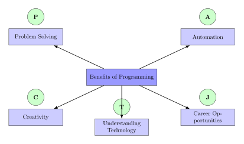

</div>
</div>

---

<div class="columns">
<div class="three">

### Problem-Solving Approach

1.  **Understand the Problem:** Clearly define what the problem is and what the desired outcome should be.
2.  **Break Down:** Decompose the complex problem into smaller, more manageable, and solvable sub-problems.
3.  **Plan:** Develop a detailed, step-by-step solution or algorithm for each sub-problem and the overall task.
4.  **Implement:** Translate the planned solution into actual code using a chosen programming language.
5.  **Test & Refine:** Rigorously test the implemented code to ensure it works correctly, then debug and optimize it for efficiency and accuracy.

</div>
<div>


</div>
</div>

---

<div class="columns">
<div class="two">

### Example: Simple Instructions

- **Task:** Demonstrate a basic programming task by calculating the sum of two given numbers.
- **Algorithm:**
    1.  **Input First Number:** Obtain the initial numerical value.
    2.  **Input Second Number:** Obtain the second numerical value.
    3.  **Perform Addition:** Add the two obtained numbers together.
    4.  **Output Result:** Present the calculated sum to the user.

</div>
<div class="two">

```python
# Python example: Basic arithmetic
# Assign first number
num1 = 10
# Assign second number
num2 = 20
# Add numbers
sum_result = num1 + num2
# Display sum
print(sum_result)
```

</div>
</div>

---

<!-- Abstract illustration highlighting Python's versatility with various icons (web, data science, AI, automation) emerging from a central, glowing Python logo, all against a dark galaxy backdrop. -->

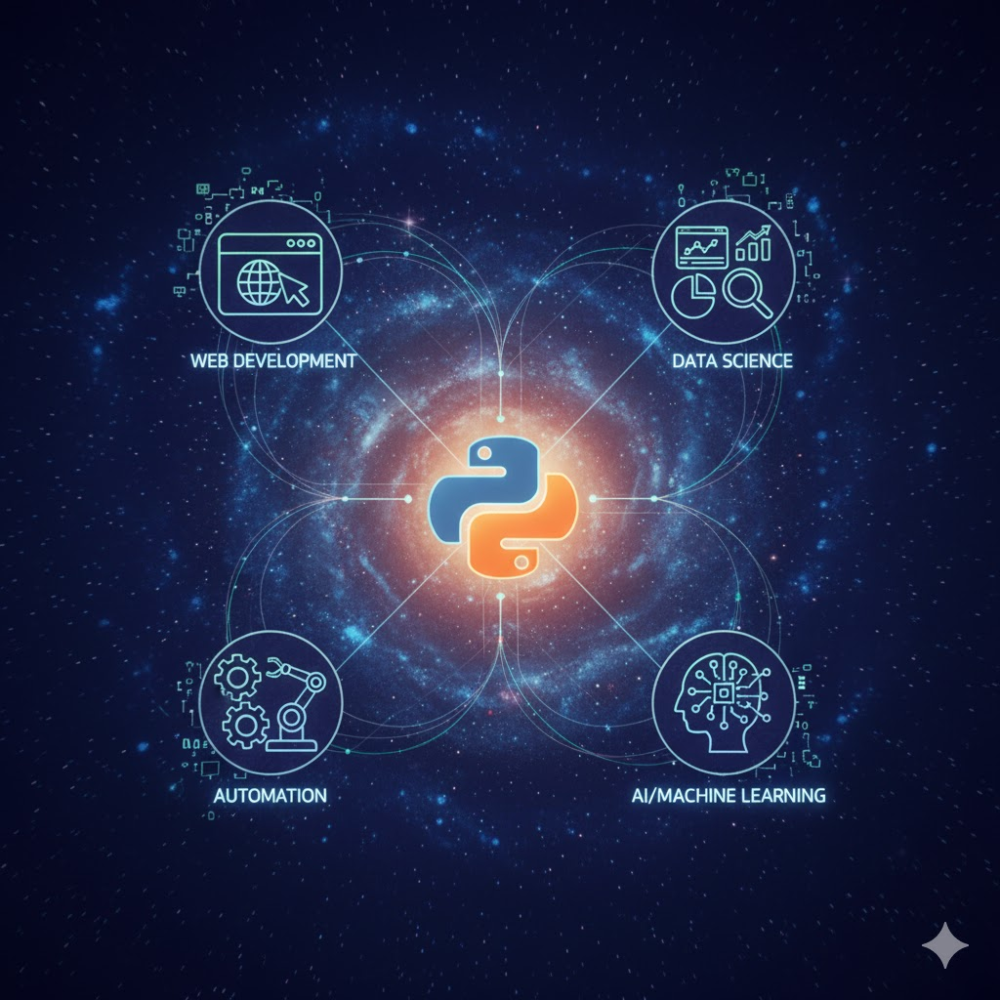

## 1.2: Why Python?

This section includes the following content:

- Readability and Simplicity
- Versatility
- Large Community and Libraries
- Cross-Platform Compatibility
- High Demand in Industry
- Comparison with Other Languages (Briefly)
- Python's Philosophy (Zen of Python)
- Example: "Hello, World!" in Python

---

<div class="columns">
<div class="two">

### Readability and Simplicity

- **English-like Syntax:** Python's syntax is designed to be very close to natural English, making it easy for beginners to read and understand.
- **Less Boilerplate:** It allows developers to achieve significant functionality with fewer lines of code compared to many other languages, reducing boilerplate.
- **Indentation:** Python uses indentation to define code blocks, which naturally enforces a clean, consistent, and highly readable code structure.

</div>
<div class="two">

*Python*

```python
# Python: Simple conditional statement
# Check if x is positive
if x > 0:
    # Print "Positive" if true
    print("Positive")
```

*Java*

```java
// Java: Simple conditional statement
// Check if x is positive
if (x > 0) {
    # Print "Positive" if true
    System.out.println("Positive");
}
```

</div>
</div>

---

<div class="columns">
<div>

### Versatility

- **Web Development:** Used for robust web applications and APIs (Django, Flask).
- **Data Science & AI:** Leading language in data science, machine learning, and AI (NumPy, Pandas, TensorFlow).
- **Automation & Scripting:** Excels in automating various tasks, from system administration to general automation.
- **Desktop Applications:** Create cross-platform desktop applications (PyQt, Kivy).
- **Game Development:** Can be used for game development (Pygame).

</div>
<div>

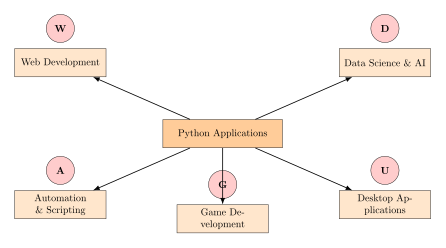

</div>
</div>

---

<div class="columns">
<div class="two">

### Large Community and Libraries

- **Vibrant Community:** Python boasts a massive and active global community, providing extensive support through documentation, tutorials, online forums, and conferences.
- **Rich Ecosystem:** There are thousands of third-party libraries and packages available on PyPI (Python Package Index), catering to almost any programming need.
- **"Batteries Included":** Python's comprehensive standard library comes with a wide array of modules and functions, covering many common programming tasks right out of the box.

</div>
<div class="two">


</div>
</div>

---

<div class="columns">
<div class="two">

### Cross-Platform Compatibility

- **Write Once, Run Anywhere:** Python code is highly portable, allowing it to run seamlessly across various operating systems such as Windows, macOS, Linux, and numerous other specialized platforms without modification.
- This inherent cross-platform capability eliminates the need to recompile the code specifically for each different operating system, significantly saving development time and effort.

</div>
<div class="two">


</div>
</div>

---

<div class="columns">
<div class="two">

### High Demand in Industry

- **Top Programming Language:** Python consistently ranks as one of the most popular and in-demand programming languages globally.
- **Job Market:** There is a significant and growing demand for skilled Python developers across a multitude of industries and sectors.
- **Companies Using Python:** Leading technology companies and organizations such as Google, Instagram, Spotify, Netflix, and NASA extensively utilize Python in their operations.

</div>
<div class="two">

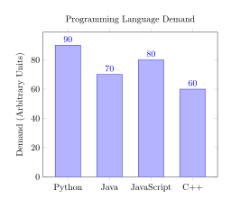

</div>
</div>

---

### Comparison with Other Languages (Briefly)

To provide context, below is a brief comparison of Python with other popular programming languages. This table highlights their key characteristics and primary use cases, helping to understand Python's position in the broader programming landscape.

| Language   | Key Characteristics                     | Primary Use Cases                               |
| :--------- | :-------------------------------------- | :---------------------------------------------- |
| **Python** | General-purpose, easy to read           | Web, Data Science, AI, Automation               |
| **Java**   | Statically typed, fast                  | Enterprise Apps, Android                        |
| **JavaScript** | Primarily for web frontend, asynchronous | Web Frontend, Backend (Node.js)                 |
| **C++**    | High performance, system-level          | Game Dev, OS, Embedded Systems                  |

---

<div class="columns">
<div class="two">

### Python's Philosophy (Zen of Python)

- **`import this`:** Executing `import this` in a Python interpreter reveals 19 guiding principles, known as "The Zen of Python," for writing good Python code.
- **Key Principles:** These principles emphasize clarity, simplicity, and elegance in code design, promoting a consistent and readable style. They include:
    - Beautiful is better than ugly.
    - Explicit is better than implicit.
    - Simple is better than complex.
    - Readability counts.

</div>
<div class="two">

```python
# Import 'this' to display the Zen of Python.
import this
```

</div>
</div>

---

<div class="columns">
<div class="two">

### Example: "Hello, World!" in Python

- This is the classic first program that almost every programmer writes when learning a new language, serving as a traditional and fundamental initiation into coding.
- It demonstrates the most basic form of output in Python, specifically how to print a simple textual message to the console using the `print()` function.
- The program is simple, straightforward, and effectively illustrates the core concept of displaying information to the user.

</div>
<div class="two">

```python
# Classic "Hello, World!" program.
# Prints a simple message.
print("Hello, World!")
```

</div>
</div>

---

<!-- Abstract illustration of a developer's workstation with glowing screens displaying code and terminal windows, surrounded by floating virtual environment symbols, set against a dark galaxy background. -->


## 1.3: Setting up Your Environment

This section includes the following content:

- Python Installation
- IDE/Editor Choices
- Virtual Environments (venv)
- Running Python Scripts from Terminal
- Interactive Mode (REPL)
- Basic VS Code Setup for Python
- First Script Execution
- Troubleshooting Common Setup Issues

---

<div class="columns">
<div class="two">

### Python Installation

- **Official Website:** Always download Python from its official website: `python.org/downloads`.
- **Choose Version:** Select the latest stable version of Python (e.g., Python 3.x) for new projects.
- **Important:** During the installation process on Windows, ensure you check the box "Add Python to PATH" to make it accessible from the command line.
- **Verify:** After installation, open your terminal or command prompt and type `python --version` to confirm a successful installation.

</div>
<div class="two">

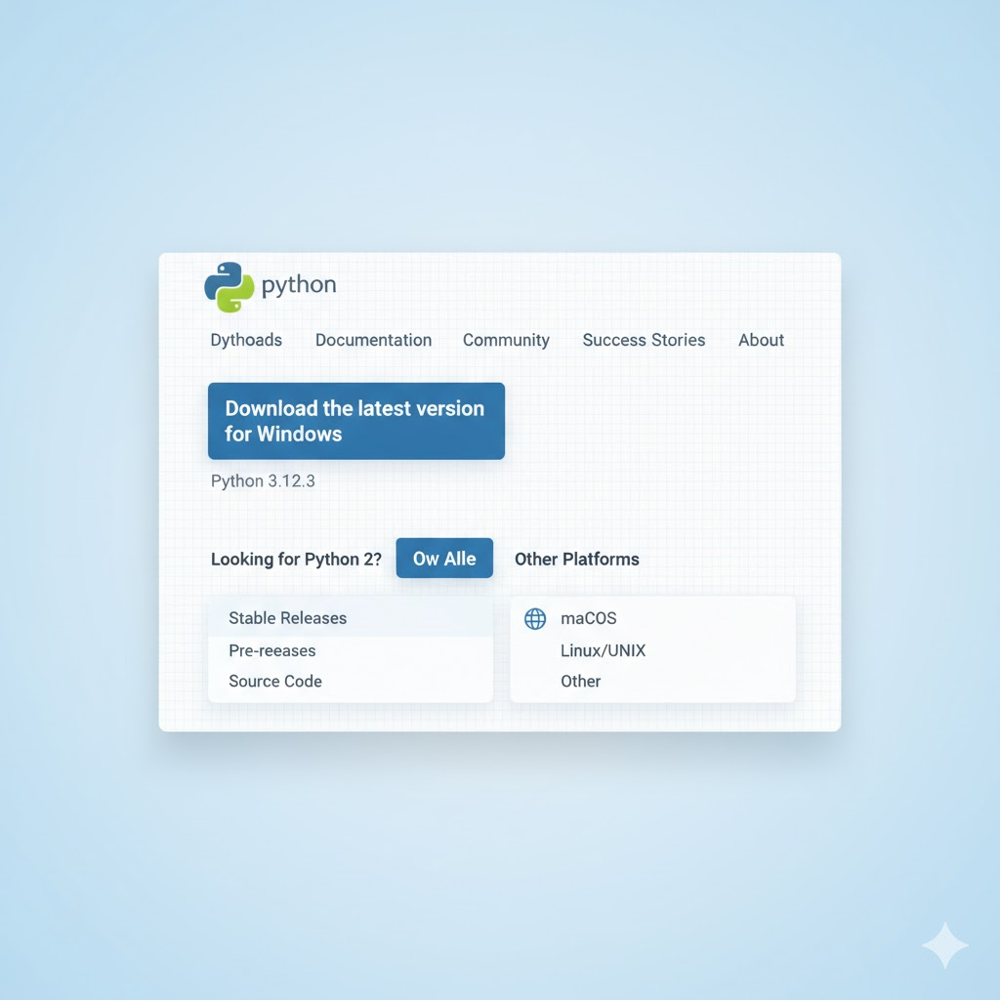

</div>
</div>

---

<div class="columns">
<div class="two">

### IDE/Editor Choices

- **Integrated Development Environment (IDE):** Comprehensive software suites consolidating developer tools.
    - **PyCharm:** Powerful, full-featured IDE for Python development (free Community Edition available).
    - **VS Code:** Lightweight, highly customizable code editor with extensive extensions.
- **Text Editors:** Simpler tools for quick edits or minimalist environments.
    - Examples: Sublime Text, Atom (fewer integrated features, highly configurable).

</div>
<div class="two">

Visual Studio Code


*PyCharm*


</div>
</div>

---

<div class="columns">
<div class="two">

### Virtual Environments (venv)

- **Purpose:** Isolate dependencies for different Python projects.
- **Avoids Conflicts:** Each project maintains its own libraries and versions, preventing conflicts with other projects or global Python installations.
- **Creation:** `python -m venv myenv`
- **Activation:**
    - **Windows:** `.\myenv\Scripts\activate`
    - **macOS/Linux:** `source myenv/bin/activate`

</div>
<div class="two">

```bash
# Create a new virtual environment.
python -m venv myproject_env

# Activate virtual environment (Windows).
.\myproject_env\Scripts\activate

# Activate virtual environment (macOS/Linux).
source myproject_env/bin/activate
```

</div>
</div>

---

<div class="columns">
<div class="two">

### Running Python Scripts from Terminal

- **Save File:** Create your Python code and save it with a `.py` extension (e.g., `my_script.py`). This file contains the instructions for your program.
- **Navigate:** Open your terminal or command prompt and navigate to the directory where you saved your `.py` file using the `cd` command.
- **Execute:** Run the script by typing `python` followed by the script's filename (e.g., `python my_script.py`). The Python interpreter will then execute the code.

</div>
<div class="two">

*Python*

```python
# my_script.py: Simple script.
# Prints a greeting.
print("This is my first script!")
```

*Terminal*

```bash
# Terminal commands to execute script.
# Change directory.
cd my_project_folder
# Execute Python script.
python my_script.py
```

</div>
</div>

---

<div class="columns">
<div class="two">

### Interactive Mode (REPL)

- **REPL:** This stands for Read-Eval-Print Loop, an interactive programming environment.
- **Purpose:** It allows you to experiment with Python code snippets, test ideas, and get immediate feedback without saving a file.
- **Launch:** To enter the interactive mode, simply type `python` in your terminal or command prompt and press Enter.
- **Exit:** You can exit the REPL by typing `exit()` and pressing Enter, or by using `Ctrl+Z` followed by Enter on Windows, or `Ctrl+D` on macOS/Linux.

</div>
<div class="two">

```python
# Python interactive mode (REPL).
# '>>>' is the prompt.

# Simple addition.
>>> 2 + 2
# Result displayed.
4

# String concatenation.
>>> "hello" + " world"
# Result displayed.
'hello world'

# Assign value to x.
>>> x = 10

# Multiply x by 5.
>>> x * 5
# Result displayed.
50
```

</div>
</div>

---

<div class="columns">
<div class="two">

### Basic VS Code Setup for Python

- **Install Python Extension:** Install the official Python extension from the VS Code Marketplace for rich language support.
- **Select Interpreter:** Use Command Palette (`Ctrl+Shift+P`) to select your Python environment (e.g., a virtual environment).
- **Run & Debug:** Use the "Run" button or `F5` to execute Python scripts or start the debugger.
- **Integrated Terminal:** Access the integrated terminal with `Ctrl+` ` (backtick) for running commands and scripts.

</div>
<div class="two">

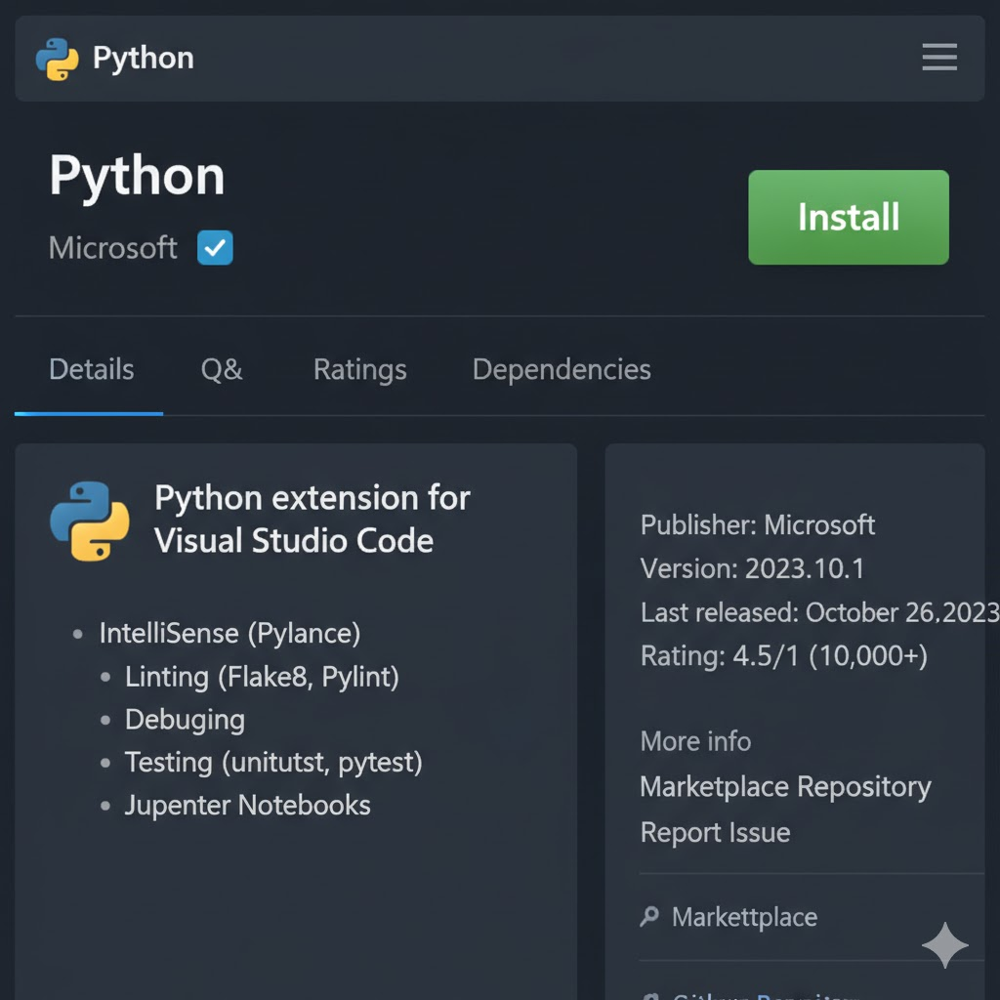

</div>
</div>---

<div class="columns">
<div class="two">

### First Script Execution

- **Create `hello.py`:** Start by creating a new file named `hello.py` and add the Python code on the right side
- **Open Terminal:** Open your terminal or command prompt and navigate to the directory where you saved `hello.py`.
- **Run:** Execute the script using the command: `python hello.py`.
- **Expected Output:** Upon successful execution, the terminal should display the message: `Hello, Python Course!`.

</div>
<div class="two">

*Python*

```python
# Prints a welcoming message.
# Verifies Python installation and script execution.
print("Hello, Python Course!")
```

*Terminal*

```bash
# Execute 'hello.py' script.
# Change directory.
cd my_project_folder
# Run Python script.
python hello.py
```

</div>
</div>

---

<div class="columns">
<div class="two">

### Troubleshooting Common Setup Issues

- **`'python' is not recognized`:** This error typically indicates that the Python executable was not added to your system's PATH environment variable during installation.
- **Module Not Found Error:** This occurs when a required module or library is not found, often because you are not in the correct virtual environment or the module has not been installed (`pip install module_name`).
- **Syntax Errors:** These are mistakes in the structure or grammar of your code, such as typos, missing colons, or incorrect indentation, which prevent Python from understanding it.
- **Solution:** To resolve these issues, always double-check your Python installation, ensure your virtual environment is activated, and carefully read the error messages for clues.

</div>
<div>

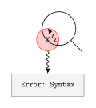

</div>
</div>

---

<!-- Abstract illustration of glowing data structures (integers, floats, strings, booleans) flowing and connecting, representing variables and data types, against a dark galaxy background. -->


## 1.4: Basic Syntax: Variables and Data Types

This section includes the following content:

- Comments
- Variables: Naming Rules, Assignment
- Basic Data Types: Integers, Floats, Strings, Booleans
- Type Checking (`type()`)
- Type Conversion (`int()`, `str()`, `float()`)
- Operators: Arithmetic, Assignment, Precedence

---

<div class="columns">
<div class="two">

### Comments

- **Purpose:** Comments are essential for explaining your code, making it more understandable and maintainable for both yourself and other developers.
- **Ignored by Interpreter:** The Python interpreter completely ignores comments; they are not executed as part of the program's logic.
- **Single-line:** For single-line comments, begin the line with a hash symbol (`#`).
- **Multi-line (Docstrings):** Multi-line comments, often used as docstrings for functions or classes, are enclosed within triple quotes (`"""Your multi-line comment here"""`).

</div>
<div class="two">

```python
# Single-line comment.

"""
Multi-line comment (docstring).
Explains code block.
"""
# Assign integer to x.
x = 10
```

</div>
</div>

---

<div class="columns">
<div class="two">

### Variables: Naming Rules, Assignment

- **Variables:** Symbolic names for data storage locations.
- **Naming Rules:**
    - Start with a letter or underscore.
    - Can contain letters, numbers, and underscores.
    - Case-sensitive (`age` is different from `Age`).
    - Cannot use Python's reserved keywords.
- **Assignment:** Use the `=` operator to assign a value.

</div>
<div class="two">

```python
# Assign string to 'name'.
name = "Alice"
# Assign integer to 'age'.
age = 30
# Assign string to '_private_var' (internal use).
_private_var = "secret"
# Assign integer to 'my_variable_1'.
my_variable_1 = 100
```

</div>
</div>

---

<div class="columns">
<div class="two">

### Basic Data Types: Integers, Floats, Strings, Booleans

- **Integers (`int`):** Whole numbers (positive, negative, zero) without decimal points (e.g., `5`, `-100`).
- **Floats (`float`):** Real numbers with a decimal point or in exponential form (e.g., `3.14`, `-0.5`).
- **Strings (`str`):** Sequences of characters (text), enclosed in single or double quotes (e.g., `'hello'`, `"world"`).
- **Booleans (`bool`):** Represent `True` or `False`, used for logical operations and conditionals.

</div>
<div class="two">

```python
# Integer (whole number).
my_int = 10

# Float (decimal number).
my_float = 3.14

# String (text).
my_string = "Hello"

# Boolean (True/False).
my_bool = True
```

</div>
</div>

---

<div class="columns">
<div class="two">

### Type Checking (type())

- **Function:** Python provides a built-in function called `type()`, which is essential for understanding data structures.
- **Purpose:** This function is used to dynamically determine the data type of any variable or value at runtime, returning the type object.
- **Useful for:** It is particularly useful during debugging to inspect variable types, validate inputs, and understand how different data types behave and interact within your code.

</div>
<div class="two">

```python
# Assign integer.
num = 10
# Assign string.
text = "Python"
# Assign boolean.
is_active = True

# Print type of num.
print(type(num))
# Print type of text.
print(type(text))
# Print type of is_active.
print(type(is_active))
```

</div>
</div>

---

<div class="columns">
<div class="two">

### Type Conversion (int(), str(), float())

- **Purpose:** Explicitly change a value's data type (type casting).
- **Functions:** Built-in functions like `int()` (to integer), `float()` (to floating-point), and `str()` (to string).
- **Caution:** Not all conversions are logically possible; incompatible conversions (e.g., "hello" to int) will raise a `ValueError`.

</div>
<div class="two">

```python
# String to number.
num_str = "123"
# Convert string to integer.
num_int = int(num_str)

# Float to string.
float_num = 3.14
# Convert float to string.
float_str = str(float_num)

# Integer to float.
int_val = 5
# Convert integer to float.
int_float = float(int_val)
```

</div>
</div>

---

<div class="columns">
<div class="two">

### Operators: Arithmetic

- **Addition:** `+` performs addition.
- **Subtraction:** `-` performs subtraction.
- **Multiplication:** `*` performs multiplication.
- **Division:** `/` performs standard division (float result).
- **Floor Division:** `//` performs division, returns integer part.
- **Modulo:** `%` returns the remainder of division.
- **Exponentiation:** `**` raises first operand to the power of the second.

</div>
<div class="two">

```python
# Addition.
print(10 + 3)
# Subtraction.
print(10 - 3)
# Multiplication.
print(10 * 3)
# Float division.
print(10 / 3)
# Floor division.
print(10 // 3)
# Modulo (remainder).
print(10 % 3)
# Exponentiation.
print(2 ** 3)
```

</div>
</div>

---

<div class="columns">
<div class="two">

### Operators: Assignment

- **Assignment:** `=` assigns a value to a variable.
- **Add and Assign:** `+=` adds right operand to left, assigns result (e.g., `x += 1` is `x = x + 1`).
- **Subtract and Assign:** `-=` subtracts right operand from left, assigns result.
- **Multiply and Assign:** `*=` multiplies left operand by right, assigns result.
- **Divide and Assign:** `/=` divides left operand by right, assigns float result.
- **Other:** `//=`, `%=`, `**=` for floor division, modulo, and exponentiation.

</div>
<div class="two">

```python
# Initialize x.
x = 5
# Add 2 to x.
x += 2
# Initialize y.
y = 10
# Multiply y by 3.
y *= 3
```

</div>
</div>

---

<div class="columns">
<div class="two">

### Operator Precedence

- **Order of Operations:** Operator precedence defines the order in which operations are evaluated in an expression, ensuring consistent results.
- **PEMDAS/BODMAS:** Python adheres to standard mathematical rules of precedence, often remembered by acronyms like PEMDAS (Parentheses, Exponents, Multiplication and Division, Addition and Subtraction).
- **Use parentheses `()`:** When in doubt or to ensure a specific order of evaluation, always use parentheses to explicitly group operations and control their execution order.

</div>
<div class="two">

```python
# Default precedence (multiplication first).
result1 = 10 + 5 * 2

# Parentheses override precedence.
result2 = (10 + 5) * 2

# Print result1.
print(result1)

# Print result2.
print(result2)
```

</div>
</div>

---

<!-- Abstract illustration of data flowing into and out of a central processing unit, depicted as glowing streams of information, symbolizing input and output operations, against a dark galaxy background. -->


## 1.5: Input and Output

This section includes the following content:

- `print()` function: Basics
- `print()` with multiple arguments, `sep`, `end`
- Formatted Output (f-strings, `.format()`)
- `input()` function: Getting User Input
- Input Type Conversion
- Combining Input and Output
- Example: Simple Interactive Program
- Practice Exercise

---

<div class="columns">
<div class="two">

### `print()` function: Basics

- **Purpose:** The `print()` function is a fundamental built-in function in Python, primarily used to display output to the standard console, making information visible to the user.
- **Syntax:** You can pass one or more values to `print()`, separating them with commas: `print(value1, value2, ...)`. These values can be variables, literals, or expressions.
- **Default Behavior:** By default, `print()` will output each provided value, separate them with a single space, and conclude with a newline character, which moves the cursor to the beginning of the next line for subsequent output.

</div>
<div>

```python
# Print with newline.
print("Hello")
# Print with newline.
print("World")

# Print with space separator.
print("Hello", "World")
```

</div>
</div>

---

<div class="columns">
<div class="two">

### `print()` with multiple arguments, `sep`, `end`

- **`sep` (separator):** The `sep` parameter allows you to specify a custom string that will be inserted between multiple arguments passed to the `print()` function. By default, it's a single space.
- **`end` (end character):** The `end` parameter determines what character(s) will be printed at the very end of the output. The default value is a newline character (`\n`), which causes subsequent `print()` calls to start on a new line.

</div>
<div class="two">

```python
# Use 'sep' to define separator.
print("apple", "banana", "cherry", sep=", ")

# Use 'end' to change line ending.
print("Loading", end="...")
# Continues on same line.
print("Done!")
```

</div>
</div>

---

<div class="columns">
<div class="two">

### Formatted Output (f-strings, `.format()`)

- **f-strings (Formatted String Literals):** Introduced in Python 3.6, f-strings provide a concise and readable way to embed expressions inside string literals.
    - To create an f-string, simply prefix the string literal with `f` or `F`.
    - You can then embed Python expressions directly within curly braces `{}` inside the string.
- **`.format()` method:** This is an older but still widely used method for string formatting, offering flexibility in how values are inserted into a string template.

</div>
<div class="two">

```python
# Define name.
name = "Alice"

# Define age.
age = 30

# Use f-string for formatting.
print(f"My name is {name} and I am {age} years old.")

# Use .format() method for formatting.
print("My name is {} and I am {} years old.".format(name, age))
```

</div>
</div>

---

<div class="columns">
<div class="two">

### `input()` function: Getting User Input

- **Purpose:** The `input()` function is a fundamental built-in Python function used to obtain textual input directly from the user through the console, allowing for interactive programs.
- **Syntax:** It typically takes an optional string argument, which serves as a prompt message displayed to the user before they enter input: `variable = input("Prompt message: ")`.
- **Return Type:** Crucially, the `input()` function always reads the user's input as a string data type, regardless of whether the user types numbers, text, or symbols.

</div>
<div class="two">

```python
# Get user's name.
user_name = input("Enter your name: ")

# Print personalized greeting.
print(f"Hello, {user_name}!")
```

</div>
</div>

---

<div class="columns">
<div class="two">

### Input Type Conversion

- **Necessity:** `input()` always returns a string; conversion is often needed for numerical operations or comparisons.
- **Conversion Functions:** Use built-in functions like `int()` (to integer), `float()` (to floating-point), and `str()` (to string).
- **Error Handling:** Incompatible conversions (e.g., "hello" to int) raise a `ValueError`; proper error handling is essential.

</div>
<div class="two">

```python
# Get user's age (as string).
age_str = input("Enter your age: ")

# Convert age string to integer.
age_int = int(age_str)

# Calculate and print age next year.
print(f"You will be {age_int + 1} next year.")
```

</div>
</div>

---

<div class="columns">
<div class="two">

### Combining Input and Output

- **Interactive Programs:** The majority of interactive programs involve a continuous flow of both taking input from the user and providing output back to them.
- **Prompt for Information:** The program typically starts by prompting the user to enter necessary information or data.
- **Process Information:** Once the input is received, the program then processes this information according to its logic.
- **Display Result:** Finally, the program displays the results of its processing or any relevant feedback to the user.

</div>
<div class="two">

```python
# Get first number (as float).
num1 = float(input("Enter first number: "))

# Get second number (as float).
num2 = float(input("Enter second number: "))

# Calculate sum.
sum_result = num1 + num2

# Print the sum.
print(f"The sum is: {sum_result}")
```

</div>
</div>

---

<div class="columns">
<div class="two">

### Example: Simple Interactive Program

- **Task:** This example demonstrates how to create a basic interactive program that prompts the user for their name and favorite color, and then uses this information to generate a personalized greeting.
- **Steps:**
    1.  **Obtain Name:** Use the `input()` function to ask the user for their name.
    2.  **Obtain Color:** Prompt the user to enter their favorite color.
    3.  **Display Greeting:** Construct and print a personalized greeting message using the collected name and color.

</div>
<div class="two">

```python
# Get user's name.
name = input("What is your name? ")

# Get user's favorite color.
color = input("What is your favorite color? ")

# Print personalized greeting.
print(f"Hello, {name}! Your favorite color is {color}.")
```

</div>
</div>

---

### Practice Exercise

<div class="columns">
<div class="two">

- **Task:** Develop a Python program that computes the area of a rectangle based on user-provided dimensions.
- **Requirements:**
    - The program should first prompt the user to input the length of the rectangle.
    - Next, it should ask the user to provide the width of the rectangle.
    - After receiving both inputs, calculate the area using the formula: `Area = Length * Width`.
    - Finally, display the calculated area to the user in a clear and user-friendly format.

</div>
<div class="two">

```python
# Write your code here to solve the practice exercise.
# Get length and width from user.
# Calculate area (length * width).
# Print result.
```

</div>
</div>
