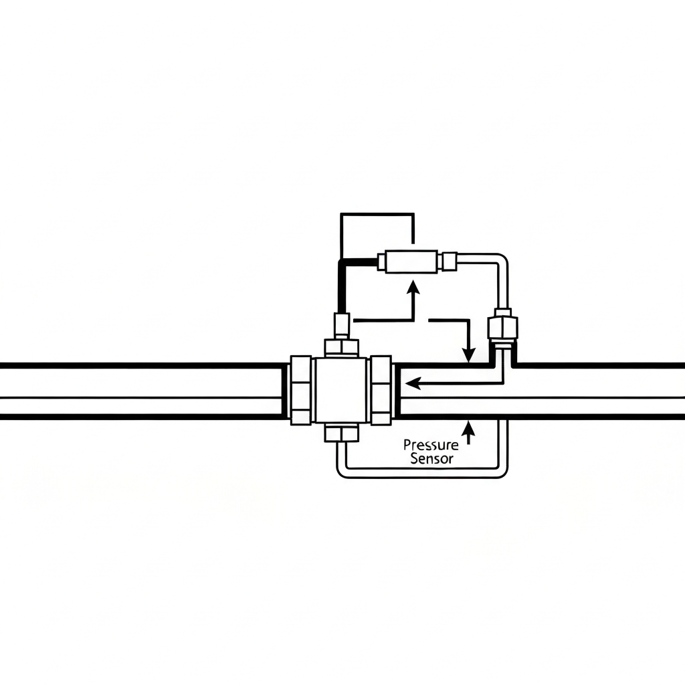
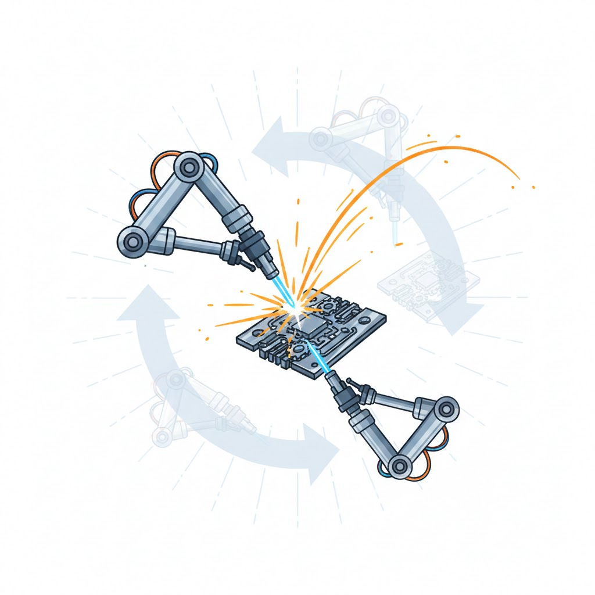
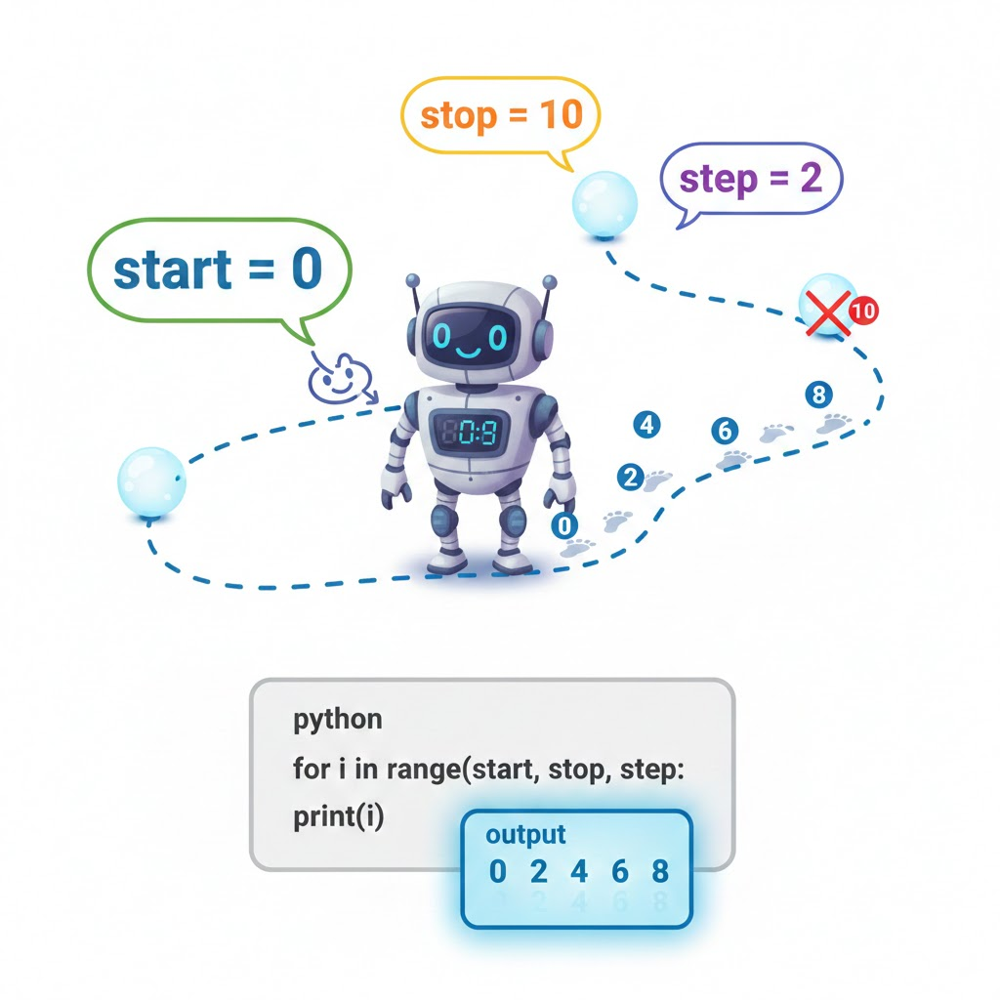

# Chapter 2: Control Flow & Data Structures I

This chapter includes the following sections:

- 2.1: Conditional Statements (if/else)
- 2.2: Loops (for/while)
- 2.3: Lists
- 2.4: Tuples

---


## 2.1: Conditional Statements (if/else)

Making decisions is fundamental in programming and engineering.

- What conditional statements are and why they are important
- The `if`, `elif`, and `else` keywords
- Comparison operators for creating conditions
- Logical operators (`and`, `or`, `not`) for combining conditions
- Engineering examples: safety interlocks, quality control

---

<div class="columns">
<div class="three">

### What are Conditional Statements?

Conditional statements allow a program to execute different actions depending on whether a specific condition is `True` or `False`.

Think of it as a **smart traffic light** for your code's execution path.

</div>
<div>



</div>
</div>

---

### The `if` Statement

The simplest form of a conditional statement. It executes a block of code **only if** a condition is true.

**Syntax:**
```python
if condition:
    # This code runs if 'condition' is True
    # Note the indentation!
    statement_1
    statement_2
```
Indentation (usually 4 spaces) is crucial in Python. It defines the code block.

---



### Engineering Example: Pressure Check

Imagine a system monitoring the pressure in a hydraulic line.

```python
pressure_psi = 1200
pressure_limit_psi = 1000

# Check if the pressure exceeds the limit
if pressure_psi > pressure_limit_psi:
    print("WARNING: Pressure is critical!")
    # In a real system, you might trigger an alarm here.
    # trigger_alarm_system()
```
**Question:** What happens if `pressure_psi` is 900?
**Answer:** Nothing is printed. The `if` block is skipped.

---

### Conditions and Boolean Logic

A condition in an `if` statement must evaluate to a **Boolean** value:
- `True`
- `False`

These are the fundamental building blocks of logical operations.

```python
is_safe = True
system_active = False

if is_safe:
    print("System status: SAFE") # This will be printed

if system_active:
    print("System is ACTIVE") # This will NOT be printed
```

---

### Comparison Operators

Used to compare values and create conditions.

| Operator | Description              | Example (`a=5`, `b=10`) | Result |
| :------: | :------------------------ | :---------------------: | :----: |
| `==`     | Equal to                 | `a == 5`                | `True` |
| `!=`     | Not equal to             | `a != b`                | `True` |
| `<`      | Less than                | `a < b`                 | `True` |
| `>`      | Greater than             | `a > b`                 | `False`|
| `<=`     | Less than or equal to    | `b <= 10`               | `True` |
| `>=`     | Greater than or equal to | `a >= 6`                | `False`|

---

### The `else` Statement

What if you want to do something when the condition is **false**? Use `else`.

**Syntax:**
```python
if condition:
    # This block runs if 'condition' is True
    ...
else:
    # This block runs if 'condition' is False
    ...
```
An `else` block provides an alternative path.

---

### Engineering Example: Temperature Control

A simple thermostat logic for a chemical reactor.

```python
current_temp_C = 85
target_temp_C = 90

if current_temp_C < target_temp_C:
    print("Activating heater...")
    # activate_heater()
else:
    print("Temperature is stable. Heater is off.")
    # deactivate_heater()
```
This ensures one of the two actions is always taken.

---

### The `elif` Statement

For handling more than two possibilities, use `elif` (short for "else if").

**Syntax:**
```python
if condition_1:
    # Runs if condition_1 is True
    ...
elif condition_2:
    # Runs if condition_1 is False and condition_2 is True
    ...
else:
    # Runs if all preceding conditions are False
    ...
```

---

<div class="columns">
<div class="three">

### Engineering Example: Material Testing

Classifying a steel sample based on its tensile strength.

```python
tensile_strength_MPa = 450

if tensile_strength_MPa > 500:
    grade = "High-Strength"
elif tensile_strength_MPa > 300:
    grade = "Structural-Grade"
else:
    grade = "Low-Carbon"

print(f"Material Grade: {grade}")
```
**Output:** `Material Grade: Structural-Grade`

</div>
<div class="two">



</div>
</div>

---

### Logical Operators: `and`, `or`, `not`

Combine multiple conditions for more complex logic.

| Operator | Description                                   | Example (`temp=95`, `pressure=1010`) |
| :------: | :-------------------------------------------- | :----------------------------------: |
| `and`    | `True` if **both** conditions are true        | `temp > 90 and pressure > 1000`      |
| `or`     | `True` if **at least one** condition is true  | `temp > 100 or pressure > 1200`      |
| `not`    | Inverts the boolean value (`True` -> `False`) | `not temp < 90`                      |

---

### Engineering Example: System Check

A pre-flight check for a drone.

```python
battery_ok = True
gps_lock = True
motor_status = "nominal"

# System is ready if battery is ok AND gps has a lock.
if battery_ok and gps_lock:
    print("System ready for takeoff.")

# Abort if motor status is NOT nominal OR battery is NOT ok.
if motor_status != "nominal" or not battery_ok:
    print("ABORT: System check failed.")
```

---

### Exercises: Conditional Statements

1.  **Safety Interlock:** Write a program that simulates a machine safety door. If the `door_is_closed` and `safety_sensor_active` are both `True`, print "Machine can start". Otherwise, print "SAFETY ALERT: Cannot start machine."

2.  **Quality Control:** A component's length should be between 24.9mm and 25.1mm. Write code that checks a `measured_length` and prints "Pass", "Reject: Too short", or "Reject: Too long".

3.  **Engine Diagnostics:** Write a program that checks `engine_temp` and `oil_pressure`. Print "Shutdown!" if temp is over 110°C or pressure is below 5 PSI. Print "Warning" if temp is over 90°C. Otherwise, print "Normal".

---


## 2.2: Loops (for/while)

Automating repetitive tasks is a core strength of programming.

- The purpose of loops for automation
- The `while` loop for repeating tasks based on a condition
- The `for` loop for iterating over sequences
- Using `range()` to generate number sequences
- Loop control with `break` and `continue`
- Engineering examples: batch processing, data filtering

---



### What are Loops?

Loops allow you to execute a block of code multiple times. This is known as **iteration**.

**Why use loops?**
- **Efficiency:** Don't repeat yourself (DRY principle).
- **Automation:** Process large amounts of data or perform tasks without manual intervention.
- **Consistency:** Ensures a task is performed the same way every time.

Analogy: A robotic arm on an assembly line performing the same weld over and over.

---

### The `while` Loop

The `while` loop repeats a block of code **as long as** a condition remains `True`.

**Syntax:**
```python
while condition:
    # This code runs repeatedly
    # as long as 'condition' is True.
    # Be sure to update the condition variable!
    ...
```

---

### Anatomy of a `while` Loop

<div class="columns">
<div class="three">

```python
# 1. Initialization
count = 0 

# 2. Condition
while count < 3:
    print(f"Processing item {count}")
    # 3. Update
    count = count + 1 

print("Loop finished.")
```

**Output:**

```
Processing item 0
Processing item 1
Processing item 2
Loop finished.
```

</div>
<div class="two">



</div>
</div>

---

<div class="columns">
<div class="three">

### The Infinite Loop

If the condition never becomes `False`, the loop runs forever!

```python
# DANGER: Infinite Loop
while True:
    print("Help, I'm stuck!")
```

</div>
<div>



</div>
</div>

---

### Engineering Example: Battery Discharge

Simulate a device operating until its battery is low.

```python
battery_level = 98.5  # in percent
min_level = 10.0
power_draw_per_hour = 5.5

hours_of_operation = 0
while battery_level > min_level:
    print(f"Hour {hours_of_operation}: Battery at {battery_level:.1f}%")
    battery_level -= power_draw_per_hour # same as battery_level = battery_level - ...
    hours_of_operation += 1 # same as hours_of_operation = hours_of_operation + 1

print(f"\nShutdown after {hours_of_operation} hours. Final battery: {battery_level:.1f}%")
```

---

### The `for` Loop

The `for` loop iterates over a **sequence** of items (like a list, a tuple, or a string).

**Syntax:**
```python
for item in sequence:
    # This code runs once for each 'item'
    # in the 'sequence'.
    ...
```
It's often simpler and safer than a `while` loop because you don't need to manage the loop variable manually.

---



### The `range()` function

A common partner for `for` loops. `range()` generates a sequence of numbers.

- `range(stop)`: Numbers from `0` up to (but not including) `stop`.
  - `range(3)` -> `0, 1, 2`
- `range(start, stop)`: From `start` to `stop-1`.
  - `range(1, 4)` -> `1, 2, 3`
- `range(start, stop, step)`: With a custom increment (`step`).
  - `range(0, 10, 2)` -> `0, 2, 4, 6, 8`

---

### Engineering Example: Batch Processing

Run a calibration test 5 times.

```python
num_tests = 5

for test_number in range(num_tests):
    print(f"Starting calibration test #{test_number + 1}...")
    # run_calibration_procedure()
    print("Test complete.")
    
print("\nAll calibration tests finished.")
```

---

### Loop Control: `break`

The `break` statement **exits a loop immediately**, regardless of the loop's condition.

```python
# Find the first multiple of 7
for number in range(1, 100):
    if number % 7 == 0:
        print(f"Found it! {number} is the first multiple of 7.")
        break # Exit the loop now
```
**Use Case:** Stop a process when a critical error is found or a target value is reached.

---

### Loop Control: `continue`

The `continue` statement **skips the rest of the current iteration** and moves to the next one.

```python
# Process only valid sensor readings (positive numbers)
readings = [2.1, 2.3, -99.0, 2.4, 2.2, -98.0]

for reading in readings:
    if reading < 0:
        print("Invalid reading found. Skipping.")
        continue # Go to the next reading
    
    print(f"Processing reading: {reading}")
```
**Use Case:** Ignore bad data points but continue processing the rest of the dataset.

---

### Exercises: Loops

1.  **Countdown:** Write a `while` loop that counts down from 10 to 1 and then prints "Liftoff!".

2.  **Sum of Squares:** Use a `for` loop and `range()` to calculate the sum of the squares of the first 10 integers (1² + 2² + ... + 10²). The formula for the sum is $\sum_{i=1}^{n} i^2 = \frac{n(n+1)(2n+1)}{6}$. Check if your code matches the formula's result for n=10.

3.  **Data Filtering:** You have a list of temperature readings: `temps = [35.2, 36.1, 37.5, 40.2, 35.9, 33.4]`. Use a `for` loop to iterate through them. If a temperature is above 38.0, print a "Fever Alert!" and `break` the loop. Use `continue` to skip any temperature below 35.0.

---


## 2.3: Lists

The most fundamental and versatile data structure in Python.

- What lists are: ordered and mutable collections
- Creating, accessing, and slicing lists
- Modifying lists with methods like `append()`, `remove()`, and `sort()`
- Representing 2D data with nested lists (matrices)
- Looping through lists to process data
- Engineering examples: managing maintenance tasks, signal processing

---

### What is a List?

A list is an **ordered**, **mutable** (changeable) collection of items.

- **Ordered:** Items have a defined position (index).
- **Mutable:** You can add, remove, or change items after the list is created.
- **Heterogeneous:** Can contain items of different data types.

Analogy: A well-organized toolbox. You can add new tools, remove old ones, and rearrange them.

```python
# A list of part specifications
part_specs = ["X-45", 3.14, 10, True]
```

---

<div class="columns">
<div>

### Creating and Accessing Lists

Use square brackets `[]` to create a list. Use indices to access elements.

```python
# A list of sensor IDs
sensor_ids = ["TEMP-01", "PRES-01", "VIB-01", "HUM-01"]

# Accessing elements
first_sensor = sensor_ids[0]  # "TEMP-01"
third_sensor = sensor_ids[2]  # "VIB-01"
last_sensor = sensor_ids[-1] # "HUM-01" (negative index)

print(f"First sensor is {first_sensor}")
```
**Remember:** Indexing starts at **0**!

</div>
<div>



</div>
</div>

---

### Slicing Lists

Extract a portion (a sub-list) from a list using a "slice".

<div class="columns">
<div>

**Syntax:** `my_list[start:stop:step]`
- `start`: The index to begin the slice (inclusive).
- `stop`: The index to end the slice (exclusive).
- `step`: The increment (optional, defaults to 1).

</div>
<div class="two">

```python
measurements = [0.5, 1.2, 1.9, 2.5, 3.1, 3.8, 4.4]

# Get first three measurements
first_three = measurements[0:3]  # [0.5, 1.2, 1.9]

# Get measurements from index 2 to 4
middle_part = measurements[2:5] # [1.9, 2.5, 3.1]

# Get every second measurement
every_other = measurements[0:7:2] # [0.5, 1.9, 3.1, 4.4]

# A common shortcut
first_three_again = measurements[:3] # Omitting 0 is allowed
from_index_4_on = measurements[4:]   # Omitting end is allowed
```

</div>
</div>

---

### Modifying Lists

Because lists are mutable, you can change them "in-place".

```python
# A list of robot arm joint angles (in degrees)
joint_angles = [90, 45, 0, -30]

# Change the second joint's angle
joint_angles[1] = 50 
print(f"Updated angles: {joint_angles}") # [90, 50, 0, -30]

# Add a new joint angle to the end
joint_angles.append(15)
print(f"Appended: {joint_angles}") # [90, 50, 0, -30, 15]

# Insert an angle at a specific position
joint_angles.insert(2, 10) # Insert 10 at index 2
print(f"Inserted: {joint_angles}") # [90, 50, 10, 0, -30, 15]
```

---

### More List Methods

| Method | Description | Example |
| :--- | :--- | :--- |
| `list.remove(value)` | Removes the **first** occurrence of `value`. | `angles.remove(0)` |
| `list.pop(index)` | Removes and **returns** the item at `index`. If no index, removes the last item. | `removed = angles.pop(2)`|
| `list.sort()` | Sorts the list in ascending order. | `numbers.sort()` |
| `list.reverse()` | Reverses the order of elements. | `numbers.reverse()` |
| `len(list)` | A built-in function to get the number of items. | `num_items = len(angles)` |

---

### Engineering Example: Data Cleanup

Let's process a list of recorded voltages.

```python
voltages = [5.1, 4.9, 5.0, 0.0, 5.2, 4.8, 0.0]

# Remove the errorneous '0.0' readings
while 0.0 in voltages:
    voltages.remove(0.0)

# Sort the valid readings
voltages.sort()

print(f"Number of valid readings: {len(voltages)}")
print(f"Cleaned and sorted data: {voltages}")
# Expected output: [4.8, 4.9, 5.0, 5.1, 5.2]
```

---

### Lists of Lists (2D Lists)

You can have lists inside other lists to represent grids, tables, or matrices.

```python
# A 3x3 matrix representing a simple kinematic transformation
# (a simplified rotation matrix)
rotation_matrix = [
    [1, 0, 0],  # Row 0
    [0, 0.707, -0.707], # Row 1
    [0, 0.707, 0.707]  # Row 2
]

# Access element in row 1, column 2
element_1_2 = rotation_matrix[1][2] # -0.707
print(f"Element at (1, 2) is: {element_1_2}")
```

---

### Looping Through a 2D List

Use nested `for` loops to iterate through a matrix.

```python
matrix = [
    [1, 2, 3],
    [4, 5, 6],
    [7, 8, 9]
]

# Print each element
for row in matrix:
    for element in row:
        print(element, end=" ") # 'end=" "' prints a space instead of a newline
    print() # Newline after each row
```
Output:
```
1 2 3 
4 5 6 
7 8 9 
```
---

### List Comprehensions (A Glimpse)

A powerful, concise way to create lists.

**Traditional Way:**
```python
squares = []
for i in range(5):
    squares.append(i * i)
# squares is [0, 1, 4, 9, 16]
```
**With List Comprehension:**
```python
squares = [i * i for i in range(5)]
# squares is [0, 1, 4, 9, 16]
```
Read as: "Create a new list with `i*i` for each `i` in the range 0 to 4".
This is an advanced but very common "Pythonic" pattern.

---

### Exercises: Lists

1.  **Maintenance Log:** Create a list of maintenance tasks `tasks = ["Check Oil", "Calibrate Sensor", "Replace Filter"]`.
    -   Add "Inspect Belts" to the end of the list.
    -   Remove "Calibrate Sensor".
    -   Sort the list alphabetically and print it.

2.  **Signal Processing:** You have a list of noisy signal data: `signal = [1, 5, 2, 8, 3, 9, 4]`. Create a new list called `processed_signal` that contains only the values from `signal` that are greater than 4. (Use a loop and an `if` condition).

3.  **Matrix Trace:** Given a 3x3 matrix (list of lists), write code to calculate its trace (the sum of the elements on the main diagonal: top-left to bottom-right).
    `matrix = [[1, 2, 3], [4, 5, 6], [7, 8, 9]]` -> Trace is 1 + 5 + 9 = 15.

---


## 2.4: Tuples

Ordered, but unchangeable. The reliable sibling of lists.

- What tuples are: ordered and immutable collections
- Key differences between lists and tuples
- Creating, accessing, and unpacking tuples
- Use cases for tuples: data integrity, multiple return values
- Combining lists and tuples for complex data structures
- Engineering examples: storing fixed configurations, robot path coordinates

---

### What is a Tuple?

A tuple is an **ordered**, **immutable** (unchangeable) collection of items.

- **Ordered:** Items have a defined position (index).
- **Immutable:** Once a tuple is created, you **cannot** add, remove, or change its items.
- **Heterogeneous:** Can contain items of different data types.

Analogy: The fixed (x, y, z) coordinates of a point in space. They define a position and shouldn't be altered accidentally.

---

### Creating and Using Tuples

Use parentheses `()` to create a tuple. Accessing elements is the same as with lists.

```python
# A tuple for storing fixed configuration data
# (Device Name, Baud Rate, Port Number)
device_config = ("Serial-Logger", 9600, 3)

# Creating a tuple with one item (note the comma!)
single_item_tuple = (42,)

# Accessing elements
device_name = device_config[0] # "Serial-Logger"
port = device_config[2]        # 3

# Trying to change it will cause an error!
# device_config[1] = 19200 # This line will raise a TypeError
```

---

### Lists vs. Tuples: Key Differences

| Feature     | List (`[]`)                             | Tuple (`()`)                               |
| :------ | :-------------------------------------- | :----------------------------------------- |
| **Mutability** | **Mutable** (can be changed)            | **Immutable** (cannot be changed)          |
| **Syntax**     | `my_list = [1, 'a', True]`              | `my_tuple = (1, 'a', True)`                |
| **Use Case**   | For collections that need to change, like a list of tasks. | For data that should not change, like GPS coordinates or configuration settings. |
| **Performance**| Slightly slower                         | Slightly faster (due to immutability)      |
| **Methods**    | Many methods to modify (append, pop, etc.) | Very few methods (only `count`, `index`) |

---

### Why Use Tuples?

1.  **Data Integrity:** Protects your data from accidental modification. If your function receives a tuple, you can be sure it won't be changed.
    ```python
    # These RGB values for "safety green" should never change.
    SAFETY_GREEN = (0, 255, 0)
    ```

2.  **Function Return Values:** A clean way to return multiple values from a function.
    ```python
    def get_sensor_reading():
        # ... logic to read temp and humidity
        return (25.5, 60.1) # Returns a tuple (temperature, humidity)
    ```
3.  **Dictionary Keys:** Lists cannot be used as keys in a dictionary (more on this later), but tuples can.

---

### Tuple Packing and Unpacking

This is a very elegant and widely used Python feature.

```python
# PACKING: a, b, and c are "packed" into a tuple
point_3d = (10, 20, 5) 

# UNPACKING: the values from the tuple are assigned to variables
x, y, z = point_3d

print(f"X coordinate: {x}") # 10
print(f"Y coordinate: {y}") # 20
print(f"Z coordinate: {z}") # 5
```
This also works when receiving return values from a function:
```python
# temp and humidity are unpacked directly
temp, humidity = get_sensor_reading()
```

---

### Engineering Example: Robot Path

Store a robot's path as a list of (x, y) coordinate tuples. The path can grow (the list is mutable), but each coordinate point is fixed (the tuples are immutable).

```python
# Path starts with the origin point
robot_path = [(0, 0)]

# Robot moves
robot_path.append((0, 1)) # Move 1 unit in y
robot_path.append((1, 1)) # Move 1 unit in x

print("Robot Path:")
for point in robot_path:
    # Unpack each tuple for clarity
    x, y = point
    print(f"  Moved to ({x}, {y})")
```
This structure provides a perfect blend of mutability (for the overall path) and immutability (for the individual points).

---

### Exercises: Tuples

1.  **Configuration:** Create a tuple to store a motor's configuration: `("DC", 12, 5000)` for (Type, Voltage, Max RPM). Try to change the voltage to 24. What happens?

2.  **Multi-Return Function:** Write a function `calculate_stats(numbers)` that takes a list of numbers and returns a tuple containing the minimum, maximum, and average of those numbers. Test it with a sample list.

3.  **Unpacking:** A function returns a tuple `result = ("Success", 192.168.1.100")`. Unpack this tuple into two variables, `status` and `ip_address`, and print them.