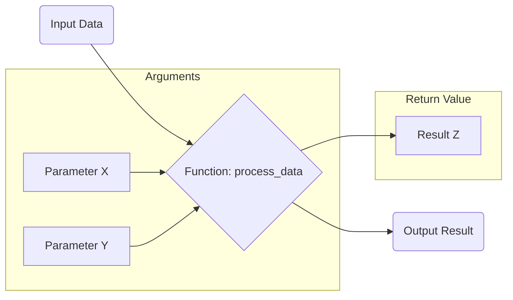

# Chapter 3: Data Structures II & Functions

This chapter includes the following sections:

- 3.1: Dictionaries
- 3.2: Sets
- 3.3: Defining Functions
- 3.4: Function Arguments and Return Values

---


## 3.1: Dictionaries

TODO brief overview of key learnings from section 3.1

---

### What are Dictionaries?

Imagine a real-world dictionary or a phone book:
- Each **word** has a unique **definition**.
- Each **name** has a unique **phone number**.

In Python, a **dictionary** is a collection that stores data in `key-value` pairs.
- Each `key` is unique, like a word in a dictionary.
- Each `value` is the data associated with that key, like the definition.
- Dictionaries are **unordered** (in Python versions before 3.7, ordered in 3.7+).
- Dictionaries are **mutable**, meaning you can change their content.

---

### Creating Dictionaries

Dictionaries are created using curly braces `{}`.

**Empty Dictionary:**
```python
# An empty dictionary
my_dictionary = {}
print(my_dictionary) # Output: {}
```

**Dictionary with Initial Data:**
```python
# Dictionary for sensor data
sensor_readings = {
    "temperature": 23.5,
    "humidity": 60,
    "pressure": 1012.8
}
print(sensor_readings)
# Output: {'temperature': 23.5, 'humidity': 60, 'pressure': 1012.8}
```

---

### Dictionary Keys and Values

- **Keys** must be unique and immutable (e.g., strings, numbers, tuples).
- **Values** can be of any data type and can be duplicated.

```python
# Valid keys: strings, numbers, tuples
student_info = {
    "name": "Alice",
    12345: "Student ID",
    (1, 2): "Coordinate"
}

# Invalid keys (mutable types like lists cannot be keys)
# my_dict = { ["a", "b"]: "list as key" } # This would cause an error
```

---

### Accessing Dictionary Values

You can access values using their corresponding keys.

**Using square brackets `[]`:**
```python
sensor_readings = {"temperature": 23.5, "humidity": 60}

current_temp = sensor_readings["temperature"]
print(f"Current temperature: {current_temp}") # Output: Current temperature: 23.5

# What if the key doesn't exist? -> KeyError
# current_light = sensor_readings["light"] # This would raise a KeyError
```

**Using the `get()` method:**
```python
sensor_readings = {"temperature": 23.5, "humidity": 60}

# Returns None if key not found (no error)
current_light = sensor_readings.get("light")
print(f"Current light: {current_light}") # Output: Current light: None

# You can provide a default value if the key is not found
current_light_with_default = sensor_readings.get("light", 0)
print(f"Current light (with default): {current_light_with_default}") # Output: Current light (with default): 0
```

---

### Modifying Dictionaries (Adding & Updating)

You can easily add new key-value pairs or update existing ones.

**Adding a new key-value pair:**
```python
sensor_readings = {"temperature": 23.5, "humidity": 60}
sensor_readings["pressure"] = 1012.8
print(sensor_readings)
# Output: {'temperature': 23.5, 'humidity': 60, 'pressure': 1012.8}
```

**Updating an existing value:**
```python
sensor_readings = {"temperature": 23.5, "humidity": 60}
sensor_readings["temperature"] = 24.1
print(sensor_readings)
# Output: {'temperature': 24.1, 'humidity': 60}
```

---

### Modifying Dictionaries (Deleting)

You can remove key-value pairs from a dictionary.

**Using `del` statement:**
```python
sensor_readings = {"temperature": 23.5, "humidity": 60, "pressure": 1012.8}
del sensor_readings["humidity"]
print(sensor_readings)
# Output: {'temperature': 23.5, 'pressure': 1012.8}
```

**Using `pop()` method:**
- Removes the item with the specified key and returns its value.
```python
sensor_readings = {"temperature": 23.5, "humidity": 60, "pressure": 1012.8}
removed_pressure = sensor_readings.pop("pressure")
print(f"Removed pressure: {removed_pressure}") # Output: Removed pressure: 1012.8
print(sensor_readings)
# Output: {'temperature': 23.5, 'humidity': 60}
```

---

### Iterating Through Dictionaries

You can loop through dictionaries in several ways.

**Looping through keys (default):**
```python
system_status = {"CPU": "80%", "RAM": "65%", "Disk": "90%"}
for component in system_status:
    print(f"{component}: {system_status[component]}")
# Output:
# CPU: 80%
# RAM: 65%
# Disk: 90%
```

**Looping through values:**
```python
system_status = {"CPU": "80%", "RAM": "65%", "Disk": "90%"}
for usage in system_status.values():
    print(f"Usage: {usage}")
# Output:
# Usage: 80%
# Usage: 65%
# Usage: 90%
```

---

### Iterating Through Dictionaries (cont.)

**Looping through key-value pairs (`items()`):**
```python
system_status = {"CPU": "80%", "RAM": "65%", "Disk": "90%"}
for component, usage in system_status.items():
    print(f"Component {component} has usage {usage}")
# Output:
# Component CPU has usage 80%
# Component RAM has usage 65%
# Component Disk has usage 90%
```

---

### Practical Example: Machine Component Status

Let's say we monitor different components of a machine in a factory.

```python
machine_components = {
    "motor_temp": 75.2, # Celsius
    "pump_pressure": 5.8, # Bar
    "conveyor_speed": 1.2, # m/s
    "motor_status": "OPERATIONAL",
    "last_maintenance": "2025-11-20"
}

print("Machine Status Report:")
for component, value in machine_components.items():
    print(f"- {component.replace('_', ' ').title()}: {value}")

# Check for a specific alert
if machine_components["motor_temp"] > 80:
    print("\nALERT: Motor temperature is too high!")

# Update maintenance date
machine_components["last_maintenance"] = "2025-12-05"
print(f"\nNew maintenance date for motor: {machine_components['last_maintenance']}")
```

---

### Other Useful Dictionary Operations

**Checking if a key exists (`in` operator):**
```python
config = {"theme": "dark", "language": "en"}
if "theme" in config:
    print("Theme setting exists.")
if "font_size" not in config:
    print("Font size setting does not exist.")
```

**Getting the number of items (`len()`):**
```python
sensor_data = {"temp": 25, "hum": 70}
print(f"Number of sensors: {len(sensor_data)}") # Output: Number of sensors: 2
```

**Clearing a dictionary (`clear()`):**
```python
my_dict = {"a": 1, "b": 2}
my_dict.clear()
print(my_dict) # Output: {}
```

---

<!-- This Mermaid diagram illustrates a dictionary structure.
The diagram should show "Dictionary" as the main node.
Connected to "Dictionary" are several "Key" nodes.
Each "Key" node is connected to a "Value" node.
Example key-value pairs:
Key: "name", Value: "Alice"
Key: "age", Value: 30
Key: "city", Value: "New York"
The connections should be labeled with "maps to".
-->
```mermaid
graph TD
    A[Dictionary] --> B(Key: "name")
    B --> C(Value: "Alice")
    A --> D(Key: "age")
    D --> E(Value: 30)
    A --> F(Key: "city")
    F --> G(Value: "New York")
```

### Visualizing Dictionaries

Dictionaries map unique keys to values.

---

### Exercise Ideas: Dictionaries

1.  **Inventory Management:** Create a dictionary to store product inventory (e.g., product name as key, quantity as value). Add new products, update quantities, and remove products.
2.  **Student Grades:** Create a dictionary where student names are keys and their grades (as a list of numbers) are values. Calculate the average grade for each student.
3.  **Error Code Lookup:** Create a dictionary where error codes (numbers) are keys and their descriptions (strings) are values. Write a function that takes an error code and returns its description, or "Unknown Error" if not found.
4.  **Configuration Loader:** Simulate loading configuration from a file into a dictionary. Allow users to change a setting and save it back (conceptually).
5.  **Sensor Aggregation:** You have multiple sensor readings coming in. Store them in a dictionary where the sensor ID is the key, and the latest reading is the value. Update the readings as new data arrives.

---


## 3.2: Sets

TODO brief overview of key learnings from section 3.2

---

### What are Sets?

Imagine a collection of items where every item is distinct and the order doesn't matter.

In Python, a **set** is an **unordered collection of unique items**.
- Each element in a set must be unique. Duplicates are automatically removed.
- Sets are **unordered**, so you cannot access items by index.
- Sets are **mutable**, meaning you can add or remove elements.
- Elements themselves must be immutable (like numbers, strings, tuples).

---

### Creating Sets

Sets are created using curly braces `{}` or the `set()` constructor.

**Creating a set with initial elements:**
```python
# A set of unique numbers
unique_ids = {101, 203, 101, 405, 203}
print(unique_ids) # Output: {405, 101, 203} (order may vary)

# A set from a list (removes duplicates)
data_points = [1.1, 2.2, 1.1, 3.3, 2.2]
unique_data_points = set(data_points)
print(unique_data_points) # Output: {3.3, 1.1, 2.2} (order may vary)
```

**Creating an empty set:**
```python
# IMPORTANT: Use set() for an empty set, not {} which creates an empty dictionary.
empty_set = set()
print(empty_set) # Output: set()

# This creates an empty dictionary, not a set!
# empty_dict = {}
```

---

### Adding and Removing Elements

Sets allow you to add new unique elements and remove existing ones.

**Adding elements (`add()`):**
```python
sensor_names = {"TempSensor", "PressureSensor"}
sensor_names.add("FlowSensor")
print(sensor_names) # Output: {'TempSensor', 'FlowSensor', 'PressureSensor'}
sensor_names.add("TempSensor") # Adding an existing element has no effect
print(sensor_names) # Output: {'TempSensor', 'FlowSensor', 'PressureSensor'}
```

**Removing elements (`remove()` and `discard()`):**
```python
sensor_names = {"TempSensor", "PressureSensor", "FlowSensor"}

# remove() raises KeyError if item not found
sensor_names.remove("PressureSensor")
print(sensor_names) # Output: {'TempSensor', 'FlowSensor'}

# discard() does NOT raise an error if item not found
sensor_names.discard("LightSensor")
print(sensor_names) # Output: {'TempSensor', 'FlowSensor'}
```

**Removing a random element (`pop()`):**
- Since sets are unordered, `pop()` removes and returns an arbitrary element.
```python
my_set = {1, 2, 3}
popped_element = my_set.pop()
print(f"Popped: {popped_element}, Remaining set: {my_set}")
```

---

### Set Operations: Union and Intersection

Sets are very useful for mathematical set operations.

**Union:** All unique elements from both sets.
- Operator: `|`
- Method: `.union()`
```python
set_a = {1, 2, 3}
set_b = {3, 4, 5}

union_set = set_a | set_b
print(f"Union (operator): {union_set}") # Output: {1, 2, 3, 4, 5}

union_set_method = set_a.union(set_b)
print(f"Union (method): {union_set_method}") # Output: {1, 2, 3, 4, 5}
```

**Intersection:** Common elements in both sets.
- Operator: `&`
- Method: `.intersection()`
```python
set_a = {1, 2, 3}
set_b = {3, 4, 5}

intersection_set = set_a & set_b
print(f"Intersection (operator): {intersection_set}") # Output: {3}

intersection_set_method = set_a.intersection(set_b)
print(f"Intersection (method): {intersection_set_method}") # Output: {3}
```

---

### Set Operations: Difference and Symmetric Difference

**Difference:** Elements in the first set but not in the second.
- Operator: `-`
- Method: `.difference()`
```python
set_a = {1, 2, 3}
set_b = {3, 4, 5}

diff_set_ab = set_a - set_b
print(f"A - B (operator): {diff_set_ab}") # Output: {1, 2}

diff_set_ab_method = set_a.difference(set_b)
print(f"A - B (method): {diff_set_ab_method}") # Output: {1, 2}

diff_set_ba = set_b - set_a
print(f"B - A (operator): {diff_set_ba}") # Output: {4, 5}
```

**Symmetric Difference:** Elements in either set, but not in both.
- Operator: `^`
- Method: `.symmetric_difference()`
```python
set_a = {1, 2, 3}
set_b = {3, 4, 5}

sym_diff_set = set_a ^ set_b
print(f"Symmetric Difference (operator): {sym_diff_set}") # Output: {1, 2, 4, 5}

sym_diff_set_method = set_a.symmetric_difference(set_b)
print(f"Symmetric Difference (method): {sym_diff_set_method}") # Output: {1, 2, 4, 5}
```

---

### Practical Use Cases for Sets

**1. Removing Duplicates from a List:**
```python
data_log = ["start", "process", "error", "process", "start", "finish"]
unique_events = list(set(data_log))
print(f"Original log: {data_log}")
print(f"Unique events: {unique_events}") # Output: ['error', 'start', 'finish', 'process'] (order may vary)
```

**2. Efficient Membership Testing:**
- Checking if an item is in a set is generally faster than checking in a list for large collections.
```python
approved_users = {"Alice", "Bob", "Charlie"}
current_user = "Alice"

if current_user in approved_users:
    print(f"{current_user} is an approved user.")

unauthorized_attempt = "David"
if unauthorized_attempt not in approved_users:
    print(f"{unauthorized_attempt} is not authorized.")
```

---

### Practical Use Cases for Sets (cont.)

**3. Finding Unique Elements Across Multiple Collections:**
Imagine two lists of part numbers for different production lines.
```python
line_a_parts = {"P101", "P102", "P103", "P104"}
line_b_parts = {"P103", "P104", "P105", "P106"}

# Parts used in both lines
common_parts = line_a_parts.intersection(line_b_parts)
print(f"Common parts: {common_parts}") # Output: {'P103', 'P104'}

# Parts unique to Line A
unique_to_a = line_a_parts.difference(line_b_parts)
print(f"Unique to Line A: {unique_to_a}") # Output: {'P101', 'P102'}

# All parts used across both lines
all_parts = line_a_parts.union(line_b_parts)
print(f"All parts: {all_parts}") # Output: {'P106', 'P103', 'P105', 'P102', 'P104', 'P101'} (order may vary)
```

---

<!-- This Mermaid diagram illustrates basic set operations using Venn diagrams.
The diagram should show two main sets, Set A and Set B, as overlapping circles.
The first part should highlight the "Union" (A U B), showing both circles completely filled.
The second part should highlight the "Intersection" (A ∩ B), showing only the overlapping region filled.
The third part should highlight the "Difference" (A - B), showing only the part of A not overlapping with B filled.
The fourth part should highlight the "Symmetric Difference" (A Δ B), showing parts of A and B that do not overlap filled.
This would require a series of diagrams or a more complex single one.
Let's simplify:
Show two circles, A and B, overlapping.
Label the circles.
Show the union with a descriptive text.
Show the intersection with a descriptive text.
-->
```mermaid
graph TD
    subgraph "Set Operations"
        A[Set A]
        B[Set B]
        A --- "Union (A U B)" --> C{All elements in A or B}
        A --- "Intersection (A ∩ B)" --> D{Elements common to A and B}
        A --- "Difference (A - B)" --> E{Elements in A but not in B}
        B --- "Difference (B - A)" --> F{Elements in B but not in A}
        C -- "Union" --> G(Set A U Set B)
        D -- "Intersection" --> H(Set A ∩ Set B)
        E -- "Difference" --> I(Set A - Set B)
        F -- "Difference" --> J(Set B - Set A)
    end
```

### Visualizing Set Operations

Understanding how sets combine and differentiate.

---

### Exercise Ideas: Sets

1.  **Unique Visitors:** You have two lists of IP addresses representing visitors to two different pages on your website. Use sets to find:
    *   All unique visitors to either page.
    *   Visitors who visited both pages.
    *   Visitors who visited only the first page.
2.  **Required Skills:** You have a set of skills a job requires and another set of skills an applicant has. Determine:
    *   Which required skills the applicant is missing.
    *   Which skills the applicant has that are not required for the job.
3.  **Blacklist/Whitelist:** Create a `blacklist` set of disallowed usernames and a `whitelist` set of approved administrators. Write code to check if a new user's name is valid (not on blacklist) and if an existing user is an admin (on whitelist).
4.  **Data Filtering:** Given a list of numbers, remove all duplicates and then identify how many unique even numbers and unique odd numbers are present.
5.  **Course Enrollment:** You have sets of students enrolled in "Programming 101" and "Database Fundamentals". Find:
    *   Students enrolled in both courses.
    *   Students enrolled in only one of the courses.
    *   The total number of unique students across both courses.

---


## 3.3: Defining Functions

TODO brief overview of key learnings from section 3.3

---

### What are Functions?

In programming, a **function** is a block of organized, reusable code that is used to perform a single, related action.

Think of it like a specialized machine in a factory:
- You give it some materials (inputs).
- It performs a specific task.
- It produces a product (output).

Or like a recipe:
- You follow the steps (code).
- You get a dish (result).

---

### Why Use Functions?

Functions are fundamental to writing good software for several reasons:

1.  **Modularity:** Break down complex problems into smaller, manageable chunks. This makes the code easier to understand, write, and debug.
2.  **Reusability:** Write a piece of code once, and use it multiple times throughout your program, or even in different programs. This avoids repetition (Don't Repeat Yourself - DRY principle).
3.  **Readability:** Functions give names to blocks of code, making it clearer what that code is supposed to do.
4.  **Maintainability:** If you need to change a piece of logic, you only need to change it in one place (the function definition) rather than everywhere it's used.
5.  **Abstraction:** Hide the complex details of an operation inside a function, allowing you to focus on *what* it does rather than *how* it does it.

---

### Basic Function Syntax

Defining a function in Python uses the `def` keyword, followed by the function name, parentheses `()`, and a colon `:`.

```python
# 'def' keyword marks the start of a function definition
def my_first_function():
    # This is the function body, it must be indented
    print("Hello from my first function!")
    print("This code runs when the function is called.")

# An unindented line marks the end of the function body
print("This line is outside the function.")
```

**Key components:**
- `def`: Keyword to define a function.
- `my_first_function`: The name of the function (should be descriptive).
- `()`: Parentheses (can contain arguments, which we'll cover next).
- `:`: A colon marks the end of the function header.
- Indented block: The body of the function, containing the code to be executed.

---

### Defining a Simple Function: `greet()`

Let's define a function that simply prints a greeting message.

```python
def greet():
    """
    This function prints a simple greeting message.
    """
    print("--------------------")
    print("Hello, Engineer!")
    print("Welcome to Python functions.")
    print("--------------------")

# The function is defined, but nothing has happened yet.
# It needs to be 'called' to execute its code.
```

- The triple quotes `"""Docstring"""` are used to write a docstring, which is a brief explanation of what the function does. This is good practice for documenting your code.

---

### Calling a Function

Defining a function only creates it; to execute the code inside it, you must **call** or **invoke** the function.

You call a function by typing its name followed by parentheses `()`.

```python
def greet():
    """
    This function prints a simple greeting message.
    """
    print("--------------------")
    print("Hello, Engineer!")
    print("Welcome to Python functions.")
    print("--------------------")

# Now, let's call the function
print("About to call the greet function...")
greet() # This line executes the code inside the greet function
print("Greet function has finished executing.")

# You can call a function multiple times
print("\nCalling greet again:")
greet()
```

---

### Function Scope: Local vs. Global Variables

Understanding scope is crucial for avoiding unexpected behavior.

- **Global Variable:** A variable defined outside any function. It can be accessed (read) from anywhere in the program, including inside functions.
- **Local Variable:** A variable defined inside a function. It can only be accessed from within that function. It ceases to exist once the function finishes executing.

```python
# Global variable
global_message = "I am a global message."

def display_messages():
    # Local variable
    local_message = "I am a local message inside the function."
    print(global_message) # Can access global_message
    print(local_message)  # Can access local_message

def another_function():
    print(global_message) # Can access global_message
    # print(local_message) # ERROR: NameError, local_message is not defined here

display_messages()
another_function()
# print(local_message) # ERROR: NameError, local_message is not defined here
```
Best practice: Limit the use of global variables inside functions to avoid complex dependencies.

---

### Practical Example: System Health Check

Let's define a function that simulates checking the status of a system component.

```python
def perform_health_check():
    """
    Simulates performing a health check on a system component
    and prints its status.
    """
    component_name = "Engine Controller"
    status_code = 0 # 0 for OK, 1 for Warning, 2 for Error
    temperature = 85.3
    pressure = 120.5

    print(f"--- Health Check for {component_name} ---")
    if status_code == 0:
        print("Status: OK")
    else:
        print("Status: WARNING or ERROR")
    print(f"Temperature: {temperature}°C")
    print(f"Pressure: {pressure} PSI")
    print("---------------------------------")

# We can call this function anytime we want to check the system
print("Initial system startup check:")
perform_health_check()

# Later, after some operation
print("\nPost-operation system check:")
perform_health_check()
```

---

<!-- This Mermaid diagram illustrates the execution flow of a program with a function call.
It should show:
1. "Start Program" node.
2. An arrow from "Start Program" to "Main Code Block".
3. From "Main Code Block", an arrow to "Call Function A".
4. From "Call Function A", an arrow to "Function A Code".
5. From "Function A Code", an arrow back to "Main Code Block" (representing return).
6. From "Main Code Block", an arrow to "End Program".
-->
```mermaid
graph TD
    A[Start Program] --> B(Main Code Execution)
    B --> C{Call my_function()}
    C --> D[Execute my_function() Body]
    D --> E{Return to Main Code}
    E --> F(Continue Main Code Execution)
    F --> G[End Program]
```

### Visualizing Function Call Flow

Functions help organize code execution.

---

### Exercise Ideas: Defining Functions

1.  **Greeting Generator:**
    *   Write a function named `say_hello` that prints "Hello, world!".
    *   Call the function several times.
2.  **Simple Calculator Menu:**
    *   Write a function named `display_menu` that prints a simple menu like:
        ```
        --- Calculator Menu ---
        1. Add
        2. Subtract
        3. Multiply
        4. Divide
        ---------------------
        ```
    *   Call this function at the start of your program.
3.  **Sensor Initialization:**
    *   Create a function `initialize_sensor()` that prints messages simulating sensor setup (e.g., "Connecting to sensor...", "Calibrating...", "Sensor ready!").
    *   Call this function when your "program" starts.
4.  **Automated Report Header:**
    *   Write a function `print_report_header()` that prints a formatted header for a report (e.g., "--- Daily Production Report ---", "Date: YYYY-MM-DD", etc.).
    *   Use this function whenever you "generate" a new report.
5.  **Local vs. Global Practice:**
    *   Define a global variable `firm_name = "Tech Innovators"`.
    *   Define a function `print_firm_info()` that tries to print `firm_name` and also defines its own local variable `department = "Engineering"`, which it prints.
    *   Try to print `department` outside the function and observe the `NameError`.

---


## 3.4: Function Arguments and Return Values

TODO brief overview of key learnings from section 3.4

---

### Function Communication: Arguments & Return Values

Functions are not isolated; they often need to interact with the rest of your program. This communication happens in two primary ways:

1.  **Arguments (Inputs):** Data passed into a function when it is called. These are like the ingredients you give to a recipe or the materials you feed into a machine.
2.  **Return Values (Outputs):** Data that a function sends back to the part of the program that called it. This is like the finished dish from a recipe or the product from a machine.

---

### Positional Arguments

The simplest way to pass information to a function is using positional arguments.
- The order in which you pass the arguments **matters**.
- The function assigns these values to its parameters based on their position.

```python
def calculate_area(length, width):
    """
    Calculates the area of a rectangle.
    """
    area = length * width
    print(f"A rectangle with length {length} and width {width} has an area of {area}.")

# Calling the function with positional arguments
calculate_area(10, 5)   # length=10, width=5
calculate_area(5, 10)   # length=5, width=10 (order matters!)

# What happens if we pass too few or too many arguments?
# calculate_area(10)       # TypeError: missing 1 required positional argument
# calculate_area(10, 5, 2) # TypeError: takes 2 positional arguments but 3 were given
```

---

### Keyword Arguments

Keyword arguments allow you to pass values by explicitly naming the parameter they should correspond to.
- The order of keyword arguments **does not matter**.
- This improves readability, especially for functions with many parameters.

```python
def generate_report(title, author, date):
    """
    Generates a simple report header.
    """
    print(f"Report Title: {title}")
    print(f"Author: {author}")
    print(f"Date: {date}")

# Calling the function using keyword arguments
generate_report(title="Production Summary", author="Dr. Hackenberg", date="2025-12-05")

# Order doesn't matter with keyword arguments
generate_report(author="Jane Doe", date="2025-11-28", title="Quality Control Findings")
```

---

### Default Arguments

You can provide default values for function parameters.
- If an argument is not provided when calling the function, its default value is used.
- If an argument is provided, it overrides the default value.
- Parameters with default values must come *after* parameters without default values.

```python
def log_message(message, level="INFO"):
    """
    Logs a message with a specified level.
    Default level is INFO.
    """
    print(f"[{level}]: {message}")

# Using the default argument
log_message("System started successfully.") # level defaults to "INFO"

# Overriding the default argument
log_message("Disk usage is high!", level="WARNING")

# Example of incorrect order (will cause a SyntaxError)
# def func(a="default", b): # SyntaxError: non-default argument follows default argument
#     pass
```

---

### Combining Positional and Keyword Arguments

You can mix positional and keyword arguments when calling a function, but there's a rule:
- **All positional arguments must come before any keyword arguments.**

```python
def configure_sensor(sensor_id, type="temperature", unit="C", min_val=0, max_val=100):
    """
    Configures a sensor with various parameters.
    """
    print(f"Configuring Sensor ID: {sensor_id}")
    print(f"Type: {type}, Unit: {unit}")
    print(f"Range: {min_val} to {max_val}")

# All positional
configure_sensor(101, "pressure", "bar", 0, 10)

# Positional and Keyword (correct)
configure_sensor(102, type="humidity", unit="%", max_val=95)

# Incorrect: keyword argument before positional argument
# configure_sensor(type="flow", 103, unit="l/s") # SyntaxError: positional argument follows keyword argument
```

---

### Arbitrary Positional Arguments (`*args`)

Sometimes you don't know in advance how many positional arguments a function will receive.
- The `*args` syntax allows a function to accept an arbitrary number of positional arguments.
- These arguments are collected into a **tuple** inside the function.

```python
def calculate_average(*numbers):
    """
    Calculates the average of an arbitrary number of numbers.
    """
    if not numbers:
        return 0 # Avoid division by zero
    total = sum(numbers)
    average = total / len(numbers)
    return average

# Call with different numbers of arguments
avg1 = calculate_average(10, 20, 30)
print(f"Average of 10, 20, 30: {avg1}") # Output: 20.0

avg2 = calculate_average(5, 10, 15, 20, 25)
print(f"Average of 5, 10, 15, 20, 25: {avg2}") # Output: 15.0

avg3 = calculate_average()
print(f"Average of no numbers: {avg3}") # Output: 0
```

---

### Arbitrary Keyword Arguments (`**kwargs`)

Similarly, you might not know how many keyword arguments a function needs to handle.
- The `**kwargs` syntax allows a function to accept an arbitrary number of keyword arguments.
- These arguments are collected into a **dictionary** inside the function, where keys are parameter names and values are their assigned values.

```python
def process_settings(**settings):
    """
    Processes an arbitrary number of configuration settings.
    """
    print("Processing settings:")
    for key, value in settings.items():
        print(f"  {key}: {value}")

# Call with different keyword arguments
process_settings(mode="production", debug=False, log_level="ERROR")

process_settings(user_id=123, theme="dark", notifications=True, language="en_US")
```

---

### Return Values

Functions often need to send back a result to the caller.
- The `return` statement is used to send data out of a function.
- When `return` is executed, the function immediately stops, and the returned value is sent back.
- If a function doesn't have an explicit `return` statement, it implicitly returns `None`.

```python
def add_numbers(a, b):
    """
    Adds two numbers and returns their sum.
    """
    result = a + b
    return result

def say_nothing():
    """
    This function doesn't explicitly return anything.
    """
    print("I'm not returning anything.")

sum_val = add_numbers(7, 3)
print(f"The sum is: {sum_val}") # Output: The sum is: 10

none_val = say_nothing()
print(f"The return value of say_nothing is: {none_val}") # Output: The return value of say_nothing is: None
```

---

### Returning Multiple Values

Python functions can "return multiple values" by returning them as a **tuple**.
- The caller can then unpack this tuple into separate variables.

```python
def get_sensor_status():
    """
    Simulates getting sensor readings and status.
    Returns temperature, pressure, and status message.
    """
    temperature = 25.7
    pressure = 1015.2
    status = "Operational"
    return temperature, pressure, status # Returns a tuple (25.7, 1015.2, 'Operational')

# Unpacking the returned tuple
temp, pres, stat = get_sensor_status()
print(f"Temperature: {temp}°C")
print(f"Pressure: {pres} hPa")
print(f"Status: {stat}")

# You can also receive it as a single tuple variable
all_data = get_sensor_status()
print(f"All data as tuple: {all_data}")
```

---

### Practical Example: Data Validation Function

Let's create a function to validate input parameters for a system.

```python
def validate_sensor_reading(value, min_limit, max_limit, sensor_type="generic"):
    """
    Validates a sensor reading against min/max limits.
    Returns True if valid, False otherwise, along with a message.
    """
    if not isinstance(value, (int, float)):
        return False, f"Error: Reading '{value}' for {sensor_type} is not a number."
    if value < min_limit:
        return False, f"Warning: {sensor_type} reading {value} is below min limit {min_limit}."
    if value > max_limit:
        return False, f"Warning: {sensor_type} reading {value} is above max limit {max_limit}."
    return True, f"{sensor_type} reading {value} is within limits."

# Test cases
is_valid, msg = validate_sensor_reading(23.5, 20, 30, "temperature")
print(f"Valid: {is_valid}, Message: {msg}")

is_valid, msg = validate_sensor_reading(15.0, 20, 30, "temperature")
print(f"Valid: {is_valid}, Message: {msg}")

is_valid, msg = validate_sensor_reading(35.0, 20, 30, "temperature")
print(f"Valid: {is_valid}, Message: {msg}")

is_valid, msg = validate_sensor_reading("abc", 0, 100, "pressure")
print(f"Valid: {is_valid}, Message: {msg}")
```

---

<!-- This Mermaid diagram illustrates a function with arguments and a return value.
It should show:
1.  A box labeled "Function `process_data`".
2.  Arrows pointing into the `process_data` box labeled "Argument 1", "Argument 2", etc.
3.  An arrow pointing out of the `process_data` box labeled "Return Value".
This diagram visually represents the input-process-output concept of a function.
-->


### Visualizing Function I/O

Functions take inputs and produce outputs.

---

### Exercise Ideas: Function Arguments and Return Values (1 / 3)

1.  **Temperature Converter:**
    *   Write a function `celsius_to_fahrenheit(celsius)` that takes a temperature in Celsius and returns its equivalent in Fahrenheit.
    *   Write another function `fahrenheit_to_celsius(fahrenheit)`.
    *   Test both functions with various values.
2.  **Simple Calculator:**
    *   Create functions for `add(a, b)`, `subtract(a, b)`, `multiply(a, b)`, and `divide(a, b)`.
    *   Each function should take two arguments and return the result.
    *   Handle division by zero in the `divide` function, returning a message like "Error: Cannot divide by zero" instead of a number.

---

### Exercise Ideas: Function Arguments and Return Values (2 / 3)

3.  **Sensor Reading Processor:**
    *   Write a function `process_sensor_data(sensor_id, readings, unit="mV")` that takes a sensor ID (string), a list of numerical readings, and an optional `unit` (default "mV").
    *   The function should calculate and return the average and maximum reading in a tuple `(average, maximum)`.
    *   Print the results including the sensor ID and unit.
4.  **User Profile Creator:**
    *   Write a function `create_user_profile(username, email, age=None, country="Unknown")` that takes a username and email (required), and optional age and country.
    *   It should return a dictionary containing all the user's profile information.
    *   Demonstrate calling it with only required arguments, with all arguments, and with some optional arguments.

---

### Exercise Ideas: Function Arguments and Return Values (3 / 3)

5.  **Dynamic Report Generator (`*args`, `**kwargs`):**
    *   Write a function `generate_flexible_report(report_name, *sections, **details)`:
        *   `report_name` is a required string.
        *   `*sections` should collect an arbitrary number of section titles (strings).
        *   `**details` should collect arbitrary keyword arguments like `author="...", date="..."`, `version="..."`.
    *   The function should print the report name, then list all sections, and finally print all additional details.
