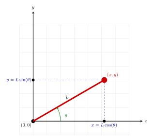
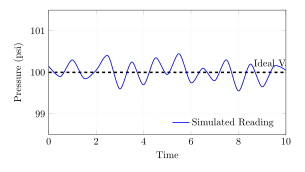
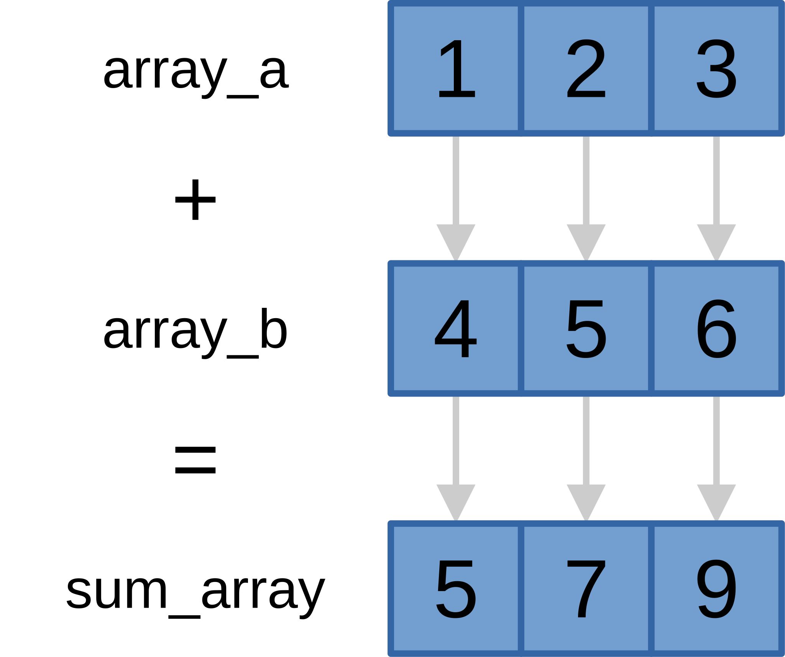
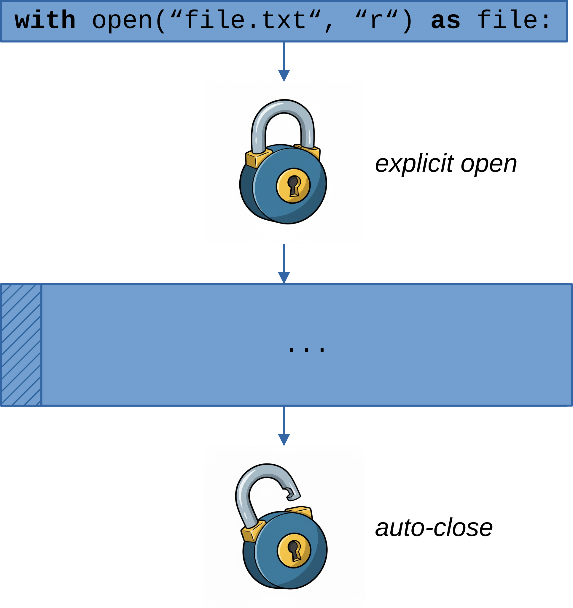
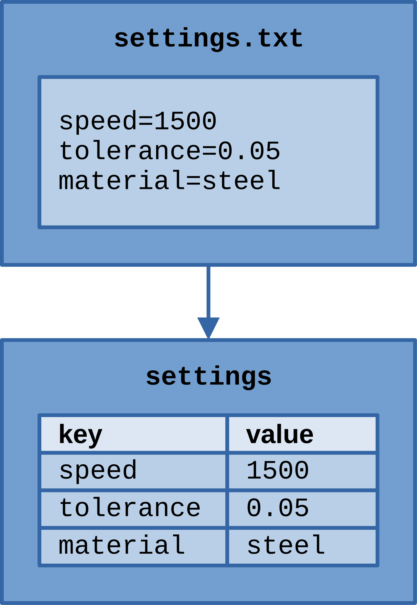
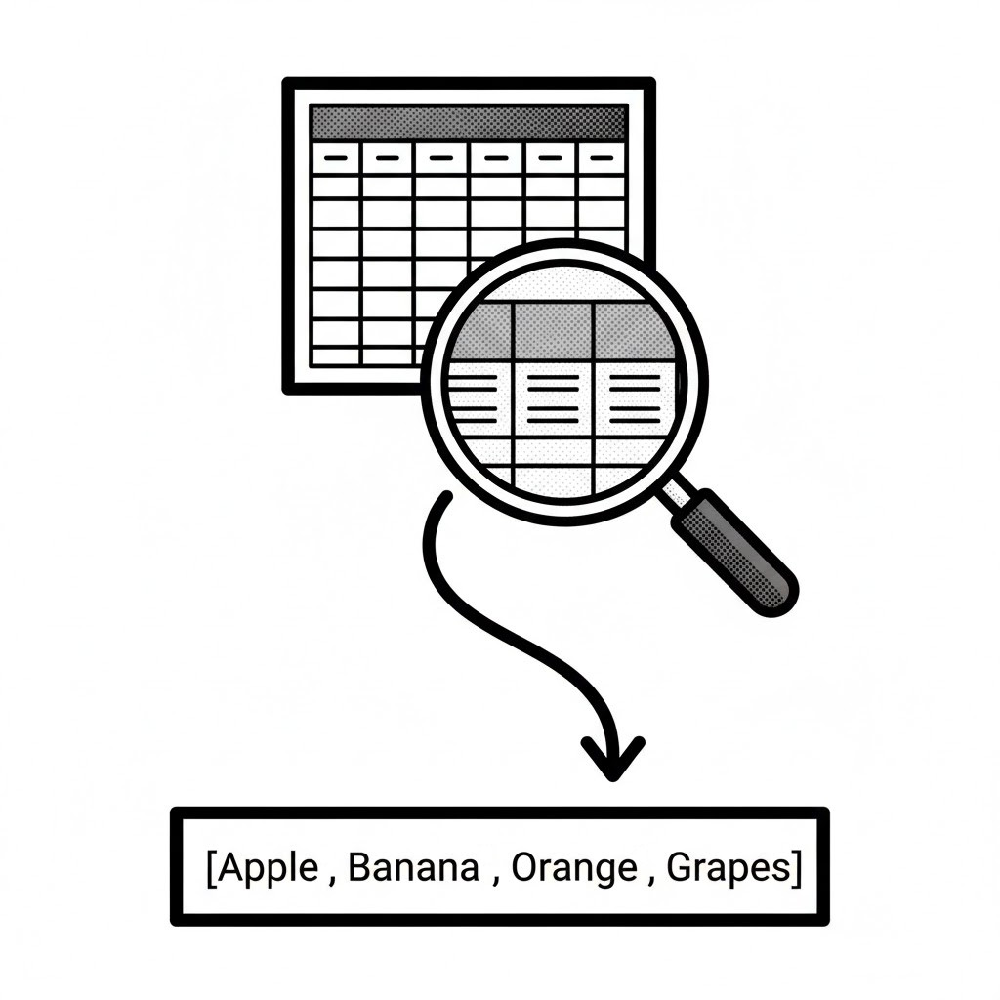
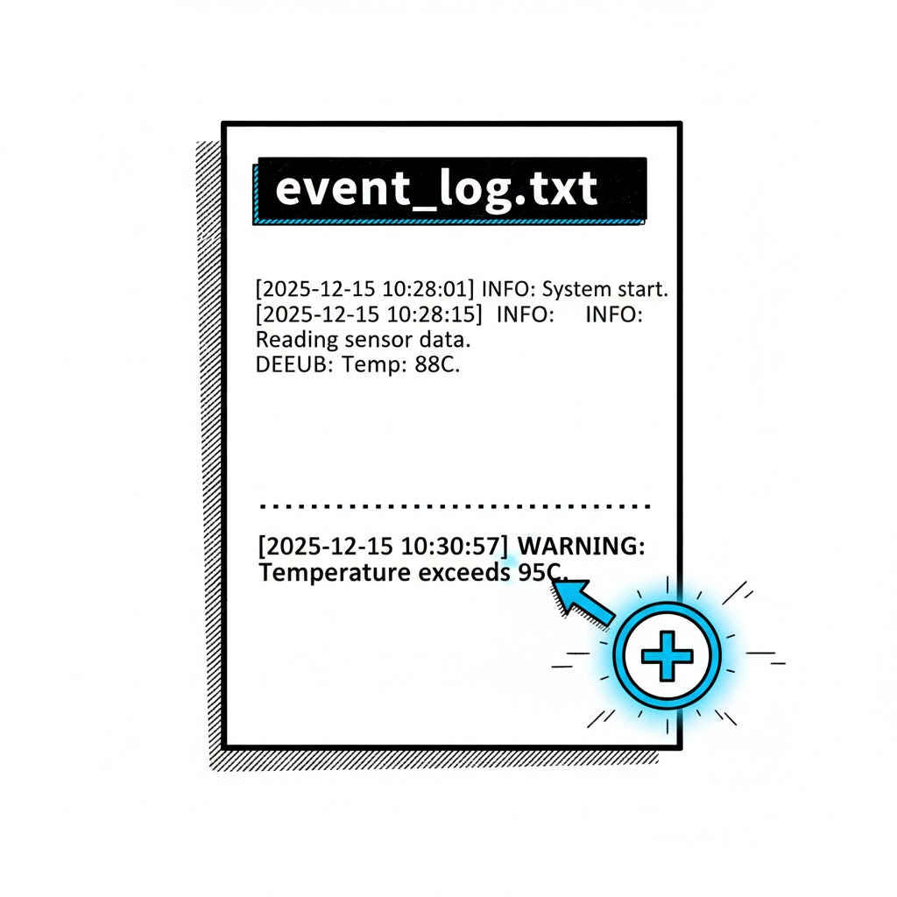

# Chapter 4: Modules, Packages & File I/O

This chapter includes the following sections:

- 4.1: Importing Modules
- 4.2: Creating Custom Modules
- 4.3: Reading from Files
- 4.4: Writing to Files

---


## 4.1: Importing Modules

Building bigger projects requires organizing your code. Modules are the first step.

- What modules are and why they are essential
- The Python Standard Library
- Importing modules: `import`, `from ... import`
- Using aliases with `as`
- Installing external packages with `pip`
- Engineering examples: `math`, `datetime`, `numpy`

---

### What is a Module?

A module is simply a Python file (`.py`) containing functions, variables, and classes that you can use in other Python files.

**Why use modules?**
- **Organization:** Keep related code together.
- **Reusability:** Write code once and use it everywhere.
- **Maintainability:** Avoid having one gigantic, unmanageable file.

Think of them as toolboxes for specific jobs. You grab the toolbox you need (`import`) and use its tools.

---

<div class="columns">
<div class="four">

### The `import` Statement

The `import` statement makes the code from one module available in another.

```python
# We want to use mathematical functions.
# Let's import the 'math' module.
import math

# Now we can use functions from the math module
# using the syntax: module_name.function_name

circle_radius = 5.0
area = math.pi * math.pow(circle_radius, 2)
# math.pi is a constant from the module
# math.pow() is a function from the module

print(f"The area is: {area:.2f}")

# Calculate the square root
sqrt_of_16 = math.sqrt(16)
print(f"The square root of 16 is: {sqrt_of_16}")
```

</div>
<div>


</div>
</div>

---

<div class="columns">
<div class="two">

### Engineering Example: `math` Module

The `math` module is essential for engineering calculations.

```python
import math

# A robot arm link of length 1.5m is at an angle of 60 degrees.
# Find its (x, y) coordinates.

length = 1.5 # meters
angle_deg = 60 # degrees

# Math functions work with radians, so we must convert.
angle_rad = math.radians(angle_deg)

x_coord = length * math.cos(angle_rad)
y_coord = length * math.sin(angle_rad)

print(f"Angle: {angle_deg} degrees ({angle_rad:.3f} radians)")
print(f"X coordinate: {x_coord:.3f} m")
print(f"Y coordinate: {y_coord:.3f} m")
```

</div>
<div>



</div>
</div>

---

### The `from ... import` Statement

This lets you import specific functions or variables directly into your current namespace.

**Benefit:** You don't have to type the module name every time.
**Caution:** Can cause name conflicts if you import functions with the same name from different modules.

```python
# Import only the pi constant and the sqrt function
from math import pi, sqrt

circle_radius = 10.0
area = pi * (circle_radius ** 2) # No 'math.' prefix needed
root = sqrt(64) # No 'math.' prefix needed

print(f"Area: {area:.2f}")
print(f"Square root of 64: {root}")

# This will fail, as 'pow' was not imported
# power_of_2 = pow(3, 2) # NameError: name 'pow' is not defined
```

---

### Aliasing with `as`

You can give a module or an imported function a shorter or different name using `as`.

This is extremely common, especially with libraries that have long names.

```python
# Give the 'math' module a short alias 'm'
import math as m

# This is the standard alias for the popular numpy library
import numpy as np

area = m.pi * m.pow(5, 2)
print(f"Area calculated with alias: {area}")

# Create a numpy array
my_array = np.array([1, 2, 3, 4])
print(f"Numpy array: {my_array}")
```

---

### The Python Standard Library

Python comes with a huge "standard library" of modules, ready to be imported. This is often called the "batteries-included" philosophy.

Some key modules for engineers:
- **`math`**: Advanced math functions.
- **`datetime`**: For working with dates and times (e.g., timestamps).
- **`random`**: For generating random numbers (e.g., for simulations).
- **`os`**: Interacting with the operating system (e.g., file paths, directories).
- **`csv`**: For reading and writing comma-separated value (CSV) files.
- **`json`**: For working with JSON data structures.

---

<div class="columns">
<div class="three">

### Engineering Example: `datetime`

Timestamping data is crucial in experiments and logging.

```python
from datetime import datetime

# Get the current time
now = datetime.now()

# Format it into a readable string
# YYYY-MM-DD HH:MM:SS
timestamp_str = now.strftime("%Y-%m-%d %H:%M:%S")

sensor_value = 42.5
log_entry = f"[{timestamp_str}] - Sensor Reading: {sensor_value}"

print(log_entry)
# Output might be:
# [2025-12-15 10:30:55] - Sensor Reading: 42.5
```

</div>
<div>


</div>
</div>

---

<div class="columns">
<div class="three">

### Engineering Example: `random`

Simulate noisy sensor data for testing your analysis scripts.

```python
import random

ideal_pressure = 100.0 # psi
noise_level = 0.5 # +/- psi

# Generate 5 simulated readings
for i in range(5):
    # random.uniform gives a float in a range
    noise = random.uniform(-noise_level, noise_level)
    
    simulated_reading = ideal_pressure + noise
    
    print(f"Simulated Reading {i+1}: {simulated_reading:.2f} psi")
```

</div>
<div>



</div>
</div>

---

### External Packages and `pip`

The Python community has created hundreds of thousands of external packages that are not in the standard library.

- **PyPI (Python Package Index)**: The official repository for these packages.
- **`pip`**: The command-line tool used to install packages from PyPI.

**To install a package:**
```bash
# In your terminal (make sure your virtual environment is active!)
pip install package-name

# Example: Install NumPy, the fundamental package for scientific computing
pip install numpy

# Example: Install Matplotlib, a powerful plotting library
pip install matplotlib
```

**Note: *You will learn more about external packages and `pip` in the last session!***

---

<div class="columns">
<div class="two">

### Engineering Example: `numpy`

`numpy` makes working with arrays (vectors, matrices) fast and easy.

```python
import numpy as np

# Python lists
list_a = [1, 2, 3]
list_b = [4, 5, 6]
# list_a + list_b would be [1, 2, 3, 4, 5, 6] (concatenation)

# Numpy arrays
array_a = np.array(list_a)
array_b = np.array(list_b)

# Perform element-wise addition (vector addition)
sum_array = array_a + array_b

print(f"List addition: {list_a + list_b}")
print(f"Numpy array addition: {sum_array}")
```

</div>
<div>



</div>
</div>

---


### Exercises: Importing Modules

1.  **Circle Calculations:** Import the `math` module. Write a script that asks the user for the radius of a circle and prints its circumference (`2 * pi * r`) and area (`pi * r^2`).

2.  **Dice Roll Simulator:** Import the `random` module. Write a script that simulates rolling two six-sided dice and prints their sum. Use `random.randint(1, 6)`.

3.  **Time Delay:** Import the `time` module. Write a script that prints "Starting process...", then waits for 3 seconds using `time.sleep(3)`, and finally prints "Process complete."

---


## 4.2: Creating Custom Modules

Organize your own project code into reusable, logical blocks.

- Why and how to create your own modules
- How to import from your own custom modules
- The special `if __name__ == "__main__":` block
- How to structure a project with packages
- Engineering example: A module for unit conversions

---

### Why Create Your Own Modules?

As your projects grow, you'll want to avoid putting all your code into a single file.

**Benefits:**
- **Readability:** A file named `kinematics.py` clearly indicates its purpose.
- **Reusability:** A `conversions.py` module can be used in many different projects.
- **Collaboration:** Different team members can work on different modules simultaneously.
- **Debugging:** It's easier to isolate and test smaller, self-contained modules.

---

### How to Create a Module

It's simple: **Any Python file can be a module.**

Let's create a module for common engineering unit conversions.

**File: `conversions.py`**
```python
# This file is our module.
# It contains functions for unit conversion.

# Constant for converting psi to pascals
PSI_TO_PASCAL = 6894.76

def psi_to_pa(psi):
    """Converts pressure from PSI to Pascals."""
    return psi * PSI_TO_PASCAL

def celsius_to_kelvin(celsius):
    """Converts temperature from Celsius to Kelvin."""
    return celsius + 273.15
```

---

### Importing Your Own Module

To import your custom module, it must be in the same directory as your main script, or in a directory Python knows about (part of `sys.path`).

**Project Structure:**
```
my_project/
├── main.py
└── conversions.py
```

**File: `main.py`**
```python
# Import our custom module
import conversions

# Now use the functions and constants from it
pressure_psi = 14.7
pressure_pa = conversions.psi_to_pa(pressure_psi)
print(f"{pressure_psi} PSI is equal to {pressure_pa:.2f} Pascals.")
```

---

### The `if __name__ == "__main__":` block

What if you want a file to be both **importable** as a module and **runnable** as a standalone script (e.g., for testing)?

This is the standard Python way to do it.
- Python sets a special variable `__name__` for every script.
- If the file is run directly, `__name__` is set to `"__main__"`.
- If the file is imported, `__name__` is set to the module's filename (e.g., `"conversions"`).

---

<div class="columns">
<div class="three">

### Example: `if __name__ == "__main__"`

Let's add a test block to our `conversions.py` module. This code will only run when we execute `python conversions.py` directly.

**File: `conversions.py`**
```python
# ... (functions from before) ...

# This block only runs when the script
# is executed directly.
if __name__ == "__main__":
    print("Running tests...")
    
    # Test case 1
    p_psi = 100
    p_pa = psi_to_pa(p_psi)
    print(f"Test: {p_psi} PSI -> {p_pa:.0f} Pa")
```

</div>
<div class="two">

**Running it:**
```bash
# This will run the test block
> python conversions.py
Running tests...
Test: 100 PSI -> 689476 Pa

# Importing it in main.py
> python main.py
14.7 PSI is equal to 101353.07 Pascals.
```

</div>
</div>

---

### Packages: Modules in a Directory

For larger projects, you can group related modules into a **package**. A package is just a directory containing:
1.  One or more module files (`.py`).
2.  An `__init__.py` file (can be empty).

The `__init__.py` file tells Python that the directory should be treated as a package.

---

### Engineering Project Structure

Here is a more organized structure for a small analysis project.

```
stress_analysis_project/
├── main.py
├── data/
│   └── bridge_loads.csv
└── analysis/
    ├── __init__.py
    ├── calculations.py
    └── plotting.py
```
- `main.py`: The main script that runs the analysis.
- `analysis/`: A package for all our analysis code.
- `analysis/calculations.py`: Module with stress calculation functions.
- `analysis/plotting.py`: Module for creating result plots.

--- 

### Importing from a Package

To import from our new package structure, use dot notation.

**File: `main.py`**
```python
# Import the specific functions we need from our package
from analysis.calculations import calculate_stress
from analysis.plotting import plot_results

# Assume we have some input data
force = 1500 # Newtons
area = 0.02 # square meters

# 1. Use a function from the calculations module
stress = calculate_stress(force, area)
print(f"Calculated Stress: {stress / 1e6:.2f} MPa")

# 2. Use a function from the plotting module
# (This is conceptual - plotting requires more code)
plot_results(stress_data=[stress], title="Bridge Stress Analysis")
```

---

### A Word on `__init__.py`

The `__init__.py` file is executed when the package is imported. It can be empty, but supports:
- Package-level initialization code.
- Making functions from modules directly available at the package level.

**Example: `analysis/__init__.py`**
```python
# Make this function available when someone imports 'analysis'
from .calculations import calculate_stress

print("Analysis package has been imported.")
```
**In `main.py`, you could then write:**
```python
import analysis

# 'calculate_stress' is now directly on 'analysis'
stress = analysis.calculate_stress(1500, 0.02)
```

---


### Exercises: Custom Modules

1.  **Create a `validators.py` module.**
    -   Inside it, create a function `is_positive(number)` that returns `True` if a number is greater than zero, `False` otherwise.
    -   Create a main script `app.py` that imports your module and uses the function to check if a user's input is positive.

2.  **Add a test block.**
    -   In `validators.py`, add an `if __name__ == "__main__":` block.
    -   Inside it, write a few `print` statements to test your `is_positive` function with different numbers (e.g., 10, -5, 0).

---


## 4.3: Reading from Files

Programs need to read data from the outside world.

- Why file reading is critical for engineers (data logs, config files)
- The `with open(...)` statement for safe file handling
- Reading methods: `.read()`, `.readlines()`, and iterating
- Handling plain text, CSV, and JSON files
- Error handling with `try...except FileNotFoundError`

---

### Why is File Reading Critical?

Engineers constantly work with data that lives in files.
- **Data Logging:** Sensor readings from an experiment are often saved to a `.csv` or `.txt` file.
- **Configuration:** Machine settings can be stored in a `config.json` or `settings.ini` file so they can be changed without editing code.
- **Reports:** Reading data from multiple sources to generate a summary report.
- **Simulation Input:** Reading a set of parameters from a file to run a simulation.

---

<div class="columns">
<div class="three">

### The `with open(...)` Statement

This is the modern, recommended way to open files in Python.

```python
# 'r' is for 'read' mode
with open('data.txt', 'r') as file:
    # The file is now open and assigned
    #  to the variable 'file'.
    # The code inside this indented block
    #  can work with the file.
    
    content = file.read()
    print(content)

# Once the block is exited, Python AUTOMATICALLY
#  closes the file.
# This prevents errors and resource leaks.
```
**Always use `with open(...)`!** It's safer and cleaner.

</div>
<div class="two">



</div>
</div>

---

### Reading Methods

There are several ways to read content from a file object.

- **`file.read()`**: Reads the *entire* content of the file into a single string. Be careful with very large files!
- **`file.readlines()`**: Reads all lines into a *list* of strings. Each string in the list ends with a newline character `\n`.
- **`for line in file:`**: The most memory-efficient way. It reads the file line by line, which is great for large files.

---

<div class="columns">
<div class="two">

### Engineering Example: Reading Config

Let's read simple key-value settings from a config file.

**File: `machine_settings.txt`**
```
speed=1500
tolerance=0.05
material=steel
```

**Python code:**
```python
settings = {} # Store settings in a dictionary
with open('machine_settings.txt', 'r') as f:
    for line in f:
        key, value = line.strip().split('=')
        settings[key] = value
        
speed = float(settings['speed'])
print(f"Machine speed set to: {speed}")
```

</div>
<div>



</div>
</div>

---

### Handling CSV Files

CSV (Comma-Separated Values) is a very common format for tabular data.

**File: `sensor_log.csv`**
```
timestamp,temperature,pressure
2025-12-15 11:00:00,25.3,1012.5
2025-12-15 11:00:01,25.4,1012.4
2025-12-15 11:00:02,25.4,1012.6
```
Manually splitting by commas can be tricky if values contain commas. It's better to use Python's built-in `csv` module.

---

<div class="columns">
<div class="three">

### The `csv` Module

The `csv` module makes parsing CSV files simple and robust.

**Python code:**
```python
import csv

readings = []
with open('sensor_log.csv', 'r') as f:
    csv_reader = csv.reader(f)
    # Read the header row
    header = next(csv_reader)
    # Iterate over the remaining rows
    for row in csv_reader:
        # Each row is a list of strings
        # ['2025-12-15 11:00:01', '25.4', '1012.4']
        readings.append(row)

print("First reading:")
print(readings[0])
```

</div>
<div class="two">



</div>
</div>

---

### Reading JSON Files

JSON (JavaScript Object Notation) is perfect for storing structured data like lists and dictionaries.

**File: `robot_config.json`**
```json
{
  "robot_id": "RX-78",
  "max_speed": 1.5,
  "joint_limits": [
    {"joint": "J1", "min": -180, "max": 180},
    {"joint": "J2", "min": -90, "max": 90}
  ]
}
```
Use the `json` module to load this directly into a Python dictionary.

---

<div class="columns">
<div class="two">

### The `json` Module

```python
import json

with open('robot_config.json', 'r') as f:
    config_data = json.load(f)

# config_data is now a Python dictionary
print(f"Robot ID: {config_data['robot_id']}")
print(f"Max Speed: {config_data['max_speed']} m/s")

# Access nested data
j1_max = config_data['joint_limits'][0]['max']
print(f"Joint 1 Max Angle: {j1_max} degrees")
```
The `json` module handles the conversion from a JSON string to a Python object automatically.

</div>
<div>


</div>
</div>

---

### Error Handling: `FileNotFoundError`

What happens if the file you're trying to read doesn't exist? Your program will crash.

Use a `try...except` block to handle this gracefully.

```python
try:
    with open('non_existent_file.txt', 'r') as f:
        content = f.read()
        print(content)
except FileNotFoundError:
    print("ERROR: The file could not be found.")
    # You could set default values or exit gracefully here
except Exception as e:
    print(f"An unexpected error occurred: {e}")

print("Program continues to run...")
```

**Note: *You will learn more about error handling in the next session!***

---


### Exercises: Reading Files

1.  **Read and Print:** Create a text file named `info.txt` with a few lines of text. Write a Python script that reads the entire file and prints its content to the console.

2.  **Line by Line:** Create a file `tasks.txt` with a list of tasks, one per line. Write a script that reads the file line by line and prints each task prefixed with "Task: ".

3.  **CSV Data:** Create a `data.csv` file with a few rows of numbers (e.g., `1,2,3` on the first line, `4,5,6` on the second). Use the `csv` module to read the file and calculate the sum of the numbers in each row.

---


## 4.4: Writing to Files

Persisting your results and logging events.

- File modes for writing (`'w'`) and appending (`'a'`)
- Writing strings with `.write()` and `.writelines()`
- Generating text reports, CSV files, and JSON files
- Engineering examples: creating a log file, saving analysis results

---

### File Modes: Write (`w`) vs. Append (`a`)

- **`'w'` (Write mode):**
  - **Opens a file for writing. If the file does not exist, it creates it.**
  - **DANGER:** If the file *does* exist, its entire contents are **deleted** before writing.
  - Use this when you want to create a new file or completely overwrite an old one.

- **`'a'` (Append mode):**
  - Opens a file for writing. If the file does not exist, it creates it.
  - The "cursor" is placed at the **end** of the file. New data is added without deleting old data.
  - Use this for things like adding new entries to a log file.

---

<div class="columns">
<div class="two">

### The `.write()` Method

The `file.write(string)` method writes a string to the file.

**Important:** It does **not** automatically add a newline character (`\n`). You must add it manually if you want to write on a new line.

```python
# Using 'w' to create a new report file
with open('report.txt', 'w') as f:
    f.write("Analysis Report\n")
    f.write("===============\n")
    f.write("Stress analysis results are as follows:\n")

print("report.txt has been created.")
```

</div>
<div>


</div>
</div>

---

<div class="columns">
<div class="two">

### Engineering Example: Appending to a Log

Use append mode (`'a'`) to add time-stamped events to a log file without deleting previous entries.

```python
from datetime import datetime

def log_event(message):
    """Appends a timestamped message to event_log.txt."""
    now = datetime.now().strftime("%Y-%m-%d %H:%M:%S")
    log_entry = f"[{now}] {message}\n"
    
    with open('event_log.txt', 'a') as f:
        f.write(log_entry)

# Simulate some events
log_event("System startup.")
log_event("Motor speed set to 3000 RPM.")
log_event("WARNING: Temperature exceeds 95C.")
print("Events have been logged.")
```

</div>
<div>



</div>
</div>

---

### Writing to CSV Files with `csv.writer`

Just as `csv.reader` helps read CSVs, `csv.writer` helps write them correctly.

```python
import csv

# Data to write (header and rows)
header = ['SensorID', 'AverageValue', 'Unit']
data_rows = [
    ['TEMP01', 28.5, 'C'],
    ['PRES01', 1015.2, 'hPa'],
    ['HUM01', 55.3, '%']
]

with open('summary_results.csv', 'w', newline='') as f:
    writer = csv.writer(f)
    writer.writerow(header) # Write the header row
    writer.writerows(data_rows) # Write all data rows

print("summary_results.csv has been created.")
```
**Note:** `newline=''` is important to prevent blank rows between data rows on some operating systems.

---

### Writing to JSON Files with `json.dump`

The `json` module makes it easy to save Python dictionaries or lists to a `.json` file.

```python
import json

# A dictionary holding our configuration
machine_config = {
    "id": "MC-101",
    "active": True,
    "parameters": {
        "speed": 2500,
        "feed_rate": 1.2,
    },
    "maintenance_log": ["2025-10-15", "2025-11-20"]
}

with open('machine_config.json', 'w') as f:
    # json.dump writes the object to the file (indent=4 makes the file human-readable)
    json.dump(machine_config, f, indent=4)

print("machine_config.json has been saved.")
```

---

<div class="columns">
<div class="two">

### Workflow: Read, Process, Write

A common engineering task is to read raw data, perform calculations, and write a summary.

**Goal:** Read a CSV of raw sensor data, calculate the average, and save it to a report file.

**File `raw_data.csv`:**
```
timestamp,reading
...
2025-12-15 12:00:00,50.1
2025-12-15 12:00:01,52.3
2025-12-15 12:00:02,49.8
...
```

</div>
<div class="two">

**Python script:**
```python
import csv

readings = []

# 1. READ data from CSV
with open('raw_data.csv', 'r') as f_in:
    reader = csv.reader(f_in)
    next(reader) # Skip header
    for row in reader:
        readings.append(float(row[1]))

# 2. PROCESS the data
average = sum(readings) / len(readings)

# 3. WRITE the summary report
with open('analysis_summary.txt', 'w') as f_out:
    f_out.write("Analysis Summary\n")
    f_out.write(f"Total readings: {len(readings)}\n")
    f_out.write(f"Average value: {average:.2f}\n")

print("Analysis complete. Summary saved.")
```

</div>
</div>

---


### Exercises: Writing Files

1.  **Create a Report:** Ask the user for their name and their favorite engineering subject. Write a sentence like "[Name]'s favorite subject is [Subject]." to a file named `user_report.txt`.

2.  **Log User Activity:** Create a function `log_login(username)` that appends a line to `logins.txt` every time it's called. The line should include the current timestamp and the username. Call it a few times for different users.

3.  **Generate CSV:** Create a list of lists, where each inner list contains a part name, an ID, and a price (e.g., `[['Bolt', 'B-001', 0.25], ['Nut', 'N-001', 0.15]]`). Write this data to a `parts_inventory.csv` file using the `csv` module, including a header row.

---

# Chapter 4: Summary

- **Modules** (`.py` files) help organize code. Use `import` and `from` to access their contents.
- The **Standard Library** provides many powerful modules (`math`, `datetime`, `csv`, `json`).
- Use **`pip`** to install external packages like `numpy`.
- You can create your own modules and group them into **packages** (directories with `__init__.py`).
- Use `if __name__ == "__main__":` to make files both importable and runnable.
- **File I/O** is crucial for data logging, configuration, and reporting.
- Always use `with open(...)` for safe file handling.
- Use the right mode: `'r'` (read), `'w'` (write), `'a'` (append).
- Use the `csv` and `json` modules for structured data.
- Handle `FileNotFoundError` with `try...except`.