# Chapter 5: Error Handling & Debugging

This chapter includes the following sections:

- 5.1: Types of Errors
- 5.2: Try-Except Blocks
- 5.3: Raising Exceptions
- 5.4: Basic Debugging Techniques

---


## 5.1: Types of Errors

Errors are an inevitable part of programming. Understanding them is the first step to fixing them.

- The reality of bugs in software development
- Syntax Errors: The "Grammar" mistakes
- Runtime Errors (Exceptions): Crashes during execution
- Logical Errors: The silent killers
- Distinguishing between these error types
- Engineering examples: Misinterpretations vs. System failures

---

<div class="columns">
<div>

### The Reality of Bugs

> "If debugging is the process of removing software bugs, then programming must be the process of putting them in." – Edsger W. Dijkstra

- **Bugs are normal:** Every developer, from beginner to expert, makes mistakes.
- **Feedback:** Errors are not failures; they are feedback mechanisms telling you what needs to be fixed.
- **Categories:** Python errors generally fall into three categories: Syntax, Runtime, and Logical.

</div>
<div>

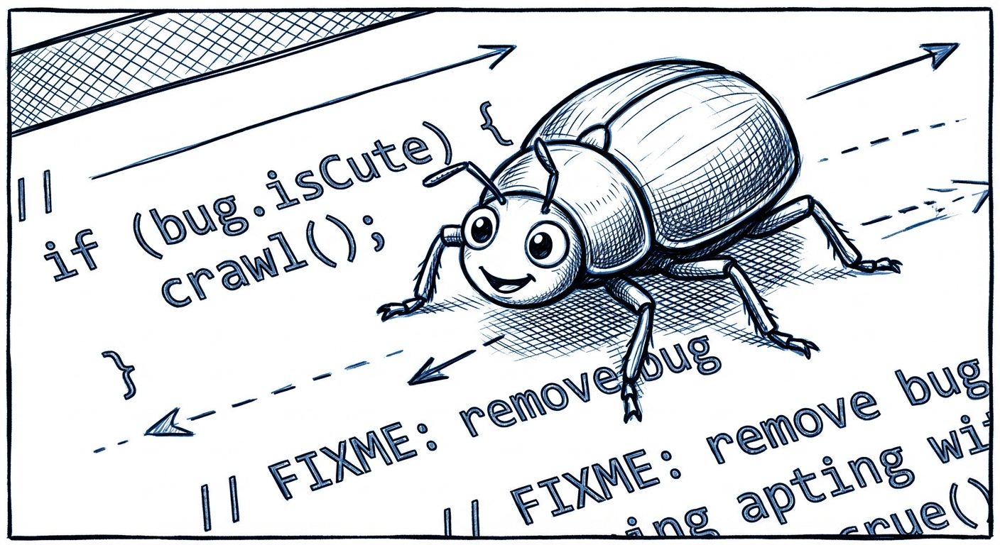

</div>
</div>

---

<div class="columns">
<div class="two">

### **Syntax** Errors

**"The Grammar Police"**

- Occur **before** the code is executed.
- Python cannot understand what you are trying to say.
- Common causes:
    - Missing colons (`:`)
    - Mismatched parentheses `()`
    - Indentation errors
    - Typos in keywords (`whille` instead of `while`)

</div>
<div class="two">

```python
# SyntaxError: expected ':'
if x > 5
    print("Greater")

# SyntaxError: unmatched ')'
print("Hello world"))

# IndentationError
def my_func():
print("Wrong indentation")
```

*VS Code usually highlights these with red squiggly lines immediately.*

</div>
</div>

---

<div class="columns">
<div class="two">

### Common Syntax Errors: **Missing Colon**

The colon `:` is crucial in Python. It marks the start of a code block.

**You need a colon after:**
- `if`, `elif`, `else` statements
- `for` and `while` loops
- `def` (function definitions)
- `class` (class definitions)

</div>
<div class="two">

```python
# ERROR
if x > 10
    print("Large")

# CORRECT
if x > 10:
    print("Large")

# ERROR
def greet(name)
    print(f"Hi {name}")

# CORRECT
def greet(name):
    print(f"Hi {name}")
```

</div>
</div>

---

<div class="columns">
<div class="two">

### Common Syntax Errors: **Mismatched Brackets**

Parentheses `()`, brackets `[]`, and braces `{}` must always come in pairs.

- If you forget a closing `)`, Python might report the error on the **next** line!
- **Tip:** Count your open and close brackets.

</div>
<div class="two">

```python
# ERROR: Missing closing )
result = (5 + 3 * (2 - 1)

# Python keeps looking for the )
# and crashes on the next line.
print("Done") 
# SyntaxError often points here!

# CORRECT
result = (5 + 3 * (2 - 1))
```

</div>
</div>

---

<div class="columns">
<div class="two">

### Common Syntax Errors: **Confusion `=` vs `==`**

This is a classic mistake.

- `=` is for **Assignment** (putting a value into a variable).
- `==` is for **Comparison** (checking if two values are equal).

**You cannot use `=` inside an `if` condition.**

</div>
<div class="two">

```python
# ERROR
if score = 100:
    print("Winner!")

# SyntaxError: invalid syntax
# (Python thinks you are trying 
# to assign inside an if)

# CORRECT
if score == 100:
    print("Winner!")
```

</div>
</div>

---

<div class="columns">
<div class="two">

### **Runtime** Errors (Exceptions)

**"The Crash"**

- Occur **during** execution, after the syntax has been checked.
- The code is grammatically correct, but performs an illegal operation.
- Common exceptions:
    - `ZeroDivisionError`: Dividing by zero.
    - `NameError`: Using a variable that doesn't exist.
    - `TypeError`: Adding a string to a number.
    - `IndexError`: Accessing a list index that is out of range.

</div>
<div class="two">

```python
# ZeroDivisionError
result = 10 / 0

# NameError
print(my_undefined_variable)

# TypeError
total = "Price: " + 100

# IndexError
my_list = [1, 2, 3]
print(my_list[5])
```

*These cause the program to stop immediately unless handled.*

</div>
</div>

---

<div class="columns">
<div class="two">

### Common Built-in Exceptions (1/2)

- **`ValueError`**: Right type, but inappropriate value.
  - Example: `int("abc")` (expects digits).
- **`KeyError`**: Looking up a dictionary key that doesn't exist.
  - Example: `my_dict['id']` where `'id'` is missing.
- **`AttributeError`**: Trying to use a method or property that doesn't exist for that object.
  - Example: `my_list.push(5)` (should be `append`).

</div>
<div class="two">

```python
# ValueError
age = int("old")

# KeyError
prices = {"apple": 0.5}
print(prices["banana"])

# AttributeError
text = "Python"
text.reverse() 
# strings have no reverse() method
```

</div>
</div>

---

<div class="columns">
<div class="two">

### Common Built-in Exceptions (2/2)

- **`FileNotFoundError`**: Trying to open a file that doesn't exist on the disk.
  - Example: `open("config.json")`
- **`ModuleNotFoundError`**: Trying to import a library that isn't installed.
  - Example: `import pandas` (if not installed).
- **`OverflowError`**: A calculation exceeds the maximum limit for a numeric type.
  - Example: `2.0**10000`

</div>
<div class="two">

```python
# FileNotFoundError
with open("missing_data.csv") as f:
    pass

# ModuleNotFoundError
import super_cool_ai_library

# OverflowError
import math
print(math.exp(1000))
```

</div>
</div>

---

<div class="columns">
<div class="two">

### **Logical** Errors

**"The Silent Failure"**

- The program runs without crashing, but produces the **wrong result**.
- These are the hardest to detect because Python doesn't give you an error message.
- Common causes:
    - Incorrect formulas.
    - Wrong order of operations.
    - Misunderstanding requirements.

</div>
<div class="two">

```python
# Goal: Calculate average of 2 and 4
# Expected: 3.0

# Logical Error: Operator precedence
avg = 2 + 4 / 2 
print(avg) 
# Result: 4.0 (Wrong!)

# Correction
avg = (2 + 4) / 2
print(avg)
# Result: 3.0 (Correct)
```

</div>
</div>

---

<div class="columns">
<div class="two">

### Common Logical Errors: **Off-By-One**

A classic error in loops where you iterate one time too many or too few.

- Often happens with `range()`.
- Remember: `range(n)` goes from `0` to `n-1`.

</div>
<div class="two">

```python
# Goal: Print numbers 1 to 5
# ERROR: Prints 0, 1, 2, 3, 4
for i in range(5):
    print(i)

# CORRECT
for i in range(1, 6):
    print(i)
```

</div>
</div>

---

<div class="columns">
<div class="two">

### Common Logical Errors: **Infinite Loops**

If the condition in a `while` loop never becomes `False`, the program hangs forever.

- **Cause:** Forgetting to update the loop variable.
- **Symptom:** Program freezes, fans spin up.

</div>
<div class="two">

```python
count = 10
while count > 0:
    print(count)
    # Forgot to decrease count!
    # count -= 1
    
# This loop runs forever!
# Use Ctrl+C to stop it.
```

</div>
</div>

---

<div class="columns">
<div class="two">

### Common Logical Errors: **Floating Point Precision**

Computers store decimals in binary, which isn't always exact.

- Comparing floats directly with `==` is dangerous.
- Use a small "epsilon" or `math.isclose`.

</div>
<div class="two">

```python
result = 0.1 + 0.2
print(result)
# Output: 0.30000000000000004

# ERROR: Returns False!
if result == 0.3:
    print("Equal")

# CORRECT
import math
if math.isclose(result, 0.3):
    print("Equal")
```

</div>
</div>

---

### Comparison of Error Types

| Type | When it happens | Feedback | Difficulty to Fix |
| :--- | :--- | :--- | :--- |
| **Syntax Error** | Parsing (Pre-run) | Immediate syntax error message | Easy (usually typos) |
| **Runtime Error** | Execution | Crash with Traceback | Medium (Traceback helps) |
| **Logical Error** | Execution | Wrong output / Behavior | Hard (Requires testing) |

---

<div class="columns">
<div class="two">

### Engineering Example: Robot Arm

Imagine coding a robot arm to move to a coordinate.

- **Syntax Error:** You forgot the colon in the `if` statement checking the position. The code won't run at all.
- **Runtime Error:** You try to calculate the angle, but divide by zero because `x=0`. The program crashes mid-movement.
- **Logical Error:** You used `sin` instead of `cos`. The robot moves smoothly, but punches a hole in the wall instead of picking up the part.

</div>
<div>



</div>
</div>

---

### Exercises: Types of Errors

Identify the type of error (Syntax, Runtime, or Logical) in the following scenarios:

1.  **Code:** `print("Hello World"` (missing closing parenthesis).
2.  **Code:** `area = radius * 2` (when the formula should be `radius ** 2` for a square).
3.  **Code:** `value = int("ten")` (trying to convert a non-numeric string).
4.  **Code:** `def my_func() print("Hi")` (missing colon).
5.  **Code:** You write a loop to count to 10, but it counts to 9.
6.  **Code:** `data = {"temp": 25.5}; print(data["humidity"])` (key is missing).
7.  **Code:** `import math; print(math.calculat_sqrt(4))` (typo in method name).

---


## 5.2: Try-Except Blocks

Robust software must anticipate and handle problems, not just crash.

- The concept of Exception Handling
- The `try` and `except` syntax
- Handling specific error types (`ValueError`, `TypeError`, etc.)
- The `else` and `finally` blocks
- Engineering examples: Safe data parsing, resilient sensor reading

---

<div class="columns">
<div>

### What is **Exception Handling**?

In the "Happy Path," everything goes right. In the real world, files are missing, networks fail, and users enter bad data.

**Exception Handling** allows us to "catch" errors (exceptions) when they occur and handle them gracefully, preventing the program from crashing.

**Analogy:** wearing a safety harness. If you slip (error), you don't fall (crash); the harness catches you.

</div>
<div>

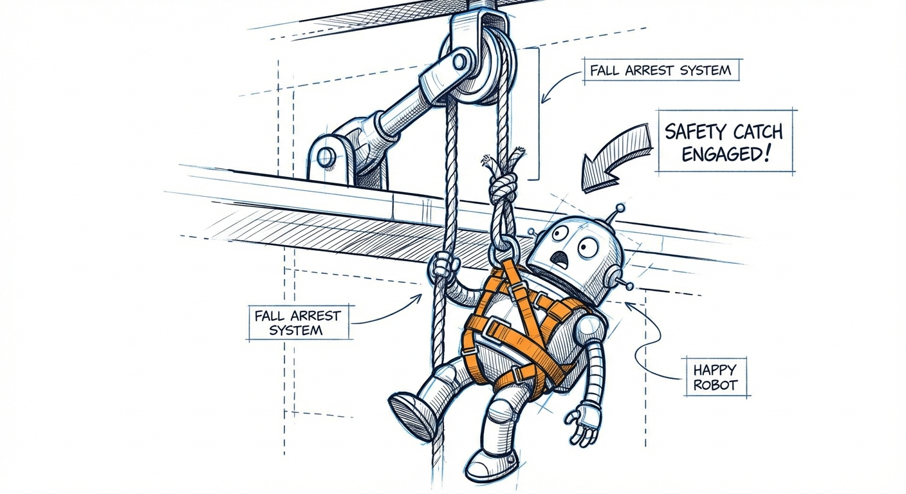

</div>
</div>

---

<div class="columns">
<div class="two">

### Basic Syntax: `try...except`

1.  **`try` block:** Put the code that *might* cause an error here.
2.  **`except` block:** Put the code to run *if* an error happens.

If no error occurs, the `except` block is skipped.
If an error occurs, execution jumps immediately to the `except` block.

</div>
<div class="two">

**Example:**

```python
try:
    # Attempt to divide
    numerator = 10
    denominator = 0
    result = numerator / denominator
    print(f"Result: {result}")

except:
    # Handle the error
    print("Error: Cannot divide by zero.")

print("Program continues...")
```

**Output:**
```
Error: Cannot divide by zero.
Program continues...
```

</div>
</div>

---

### Handling **Specific Exceptions**

It is best practice to catch **specific** errors rather than a bare `except`. This prevents masking other unexpected issues.

```python
try:
    num_str = input("Enter a number: ")
    num = int(num_str)
    print(f"100 divided by {num} is {100 / num}")

except ValueError:
    # Handles non-numeric input (e.g., "abc")
    print("Invalid input! Please enter a number.")

except ZeroDivisionError:
    # Handles input "0"
    print("Math Error! You cannot divide by zero.")

except Exception as e:
    # Catch-all for other unforeseen errors
    print(f"An unexpected error occurred: {e}")
```

---

### The `else` Block

The `else` block runs **only if no exceptions occur** in the `try` block.

It's useful for code that should only run if the "dangerous" operation succeeded.

```python
try:
    # Risky operation
    file = open("data.txt", "r")

except FileNotFoundError:
    print("Error: File not found.")

else:
    # Only runs if file open succeeded
    print("File opened successfully.")
    content = file.read()
    file.close()
```

---

### The `finally` Block

The `finally` block runs **no matter what**—whether an exception happened or not.

It is critical for **cleanup tasks**, like closing files or releasing network connections.

```python
try:
    file = open("log.txt", "w")
    file.write("Logging data...")
    # Simulate a crash
    x = 1 / 0 

except ZeroDivisionError:
    print("Calculation failed!")

finally:
    # This always runs
    print("Closing file...")
    file.close() 
```

---

<div class="columns">
<div class="three">

### Exception Handling **Flowchart**

Visualizing the path of execution through `try`, `except`, `else`, and `finally`.

</div>
<div class="two">



</div>
</div>

---

<div class="columns top">
<div class="three">

### Engineering Example: **Robust Sensor Reading**


Read a sensor value from a string (e.g., from a serial port).

```python
def process_sensor_data(raw_data):
    try:
        # 1. Empty check
        if not raw_data:
            raise ValueError("Empty data")
        # 2. Float conversion
        value = float(raw_data)
        # 3. Logic check
        if value < 0:
            print("Warning: Negative reading.")
        else:
            print(f"Reading processed: {value}")
    except ValueError as e:
        print(f"Data Error: {e}")
    finally:
        print("Sensor cycle complete.\n")
```

</div>
<div class="two">

**Example 1:**

```python
process_sensor_data("25.5")
```

*Output:*

```
Reading processed: 25.5
Sensor cycle complete.
```

**Example 2:**

```python
process_sensor_data("abc")
```

*Output:*

```
Data Error: ...
Sensor cycle complete.
```

</div>
</div>

---

### Exercises: Exception Handling

1.  **Robust Input:** Write a script that asks the user for their age. Use a `while` loop and a `try-except` block to keep asking until they enter a valid integer.

2.  **Safe List Access:** You have a list `colors = ["red", "green", "blue"]`. Write a program that asks the user for an index (0-2). Use `try-except` to handle `IndexError` (if they enter 5) and `ValueError` (if they enter "apple").

3.  **File Recovery:** Try to read a file `settings.conf`. If it doesn't exist (`FileNotFoundError`), print "Settings file missing, loading defaults..." and create a dictionary with default values.

---


## 5.3: Raising Exceptions

Sometimes, *you* need to be the one to stop the program.

- The purpose of raising exceptions (Defensive Programming)
- The `raise` keyword
- Validating function arguments
- Creating custom error messages
- Engineering examples: Enforcing physical limits, parameter validation

---

<div class="columns">
<div>

### Why **Raise Exceptions**?

You can explicitly trigger an error using the `raise` keyword.

**Why would you want to crash your own program?**
1.  **Enforce Rules:** Prevent code from running with invalid data (e.g., setting a motor speed to -9999).
2.  **Signal Caller:** Inform the function that called your code that something went wrong and it cannot continue.
3.  **Fail Fast:** It's better to stop immediately than to produce corrupt data that causes problems later.

</div>
<div>

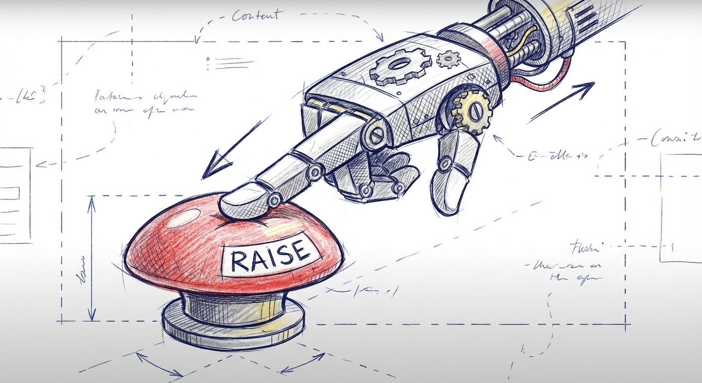

</div>
</div>

---

### The `raise` Syntax

You typically raise a specific type of Exception class with a custom message.

```python
def set_voltage(volts):
    """Sets the device voltage. Must be positive."""
    
    if volts < 0:
        # Manually raise an error
        raise ValueError("Voltage cannot be negative!")
        
    print(f"Voltage set to {volts}V")

# Usage
try:
    set_voltage(-5)
except ValueError as e:
    print(f"Caught an error: {e}")
```
**Output:** `Caught an error: Voltage cannot be negative!`

---

### Engineering Example: **Actuator Limits**

A linear actuator has a maximum extension length. We must prevent commands that exceed this.

```python
MAX_LENGTH_MM = 500

def extend_actuator(length_mm):
    if not isinstance(length_mm, (int, float)):
        raise TypeError("Length must be a number.")
        
    if length_mm < 0:
        raise ValueError("Length cannot be negative.")
        
    if length_mm > MAX_LENGTH_MM:
        raise ValueError(f"Length {length_mm} exceeds max limit of {MAX_LENGTH_MM}.")

    print(f"Actuator extending to {length_mm}mm...")
```

---

### Raising vs. Returning Errors

**Option A: Return an error code** (Old C-style)
```python
def divide(a, b):
    if b == 0: return -1 # Special "error value"
    return a / b
```
*Problem:* The caller might ignore the `-1` and use it in math!

**Option B: Raise an Exception** (Pythonic)
```python
def divide(a, b):
    if b == 0: raise ZeroDivisionError("Divisor cannot be zero")
    return a / b
```
*Benefit:* The caller *must* handle it, or the program stops safely. You can't accidentally calculate with an exception.

---

### Exercises: Raising Exceptions

1.  **Validation Function:** Write a function `calculate_speed(distance, time)` that calculates speed (`dist/time`).
    -   Raise a `ValueError` if `time` is negative.
    -   Raise a `ValueError` if `distance` is negative.
    -   (Note: Division by zero will raise `ZeroDivisionError` automatically, which is fine).

2.  **Inventory Check:** Write a function `remove_item(inventory, item)`. `inventory` is a list.
    -   If the item is not in the list, raise a `ValueError` with the message "Item not found in inventory".

---


## 5.4: Basic Debugging Techniques

When things go wrong, how do you find the root cause?

- The Debugging Mindset
- Print Debugging (The quick and dirty way)
- Rubber Duck Debugging
- Using the VS Code Debugger (The professional way)
- Breakpoints, Stepping, and Watch Variables
- The Call Stack

---

<div class="columns">
<div class="two">

### The Debugging Mindset

> "Debugging is twice as hard as writing the code in the first place. Therefore, if you write the code as cleverly as possible, you are, by definition, not smart enough to debug it." – Brian Kernighan

1.  **Don't Panic:** Errors are clues, not judgments.
2.  **Reproduce:** Can you make the error happen consistently?
3.  **Isolate:** Narrow down where the error is (which function? which line?).
4.  **Hypothesize:** What do you *think* is happening?
5.  **Verify:** Test your hypothesis.

</div>
<div class="two">

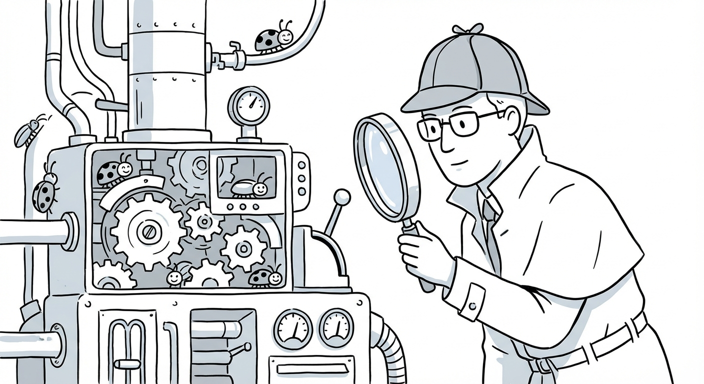

</div>
</div>

---

<div class="columns">
<div>

### The Fibonacci Sequence

The Fibonacci sequence is a classic mathe-matical series often used in programming interviews and debugging exercises.

**Definition:**
Each number is the sum of the two preceding ones.

$$
F_n = F_{n-1} + F_{n-2}
$$

**Base Cases:**
$$
F_0 = 0, \quad F_1 = 1
$$

**The Sequence:**
$$
0, 1, 1, 2, 3, 5, 8, 13, 21, 34, 55, \dots
$$

</div>
<div>

| Index ($n$) | Calculation ($F_{n-1} + F_{n-2}$) | Result ($F_n$) |
| :--- | :--- | :--- |
| 0 | Base Case | 0 |
| 1 | Base Case | 1 |
| 2 | $0 + 1$ | 1 |
| 3 | $1 + 1$ | 2 |
| 4 | $1 + 2$ | 3 |
| 5 | $2 + 3$ | 5 |
| 6 | $3 + 5$ | 8 |
| 7 | $5 + 8$ | 13 |
| 8 | $8 + 13$ | 21 |

</div>
</div>

---

<div class="columns">
<div>

### Example: The "Zero" Bug

Let's look at a common logical error in `Debugging.py`.

```python
def calculate_factorial(n):

    result = 1

    # Bug: range(n) starts at 0!
    for i in range(n):
        result = result * i

    return result

print(calculate_factorial(5))
# Output: 0 (Expected 120)
```

**Why is it 0?**
Let's use the debugger to find out.

</div>
<div>

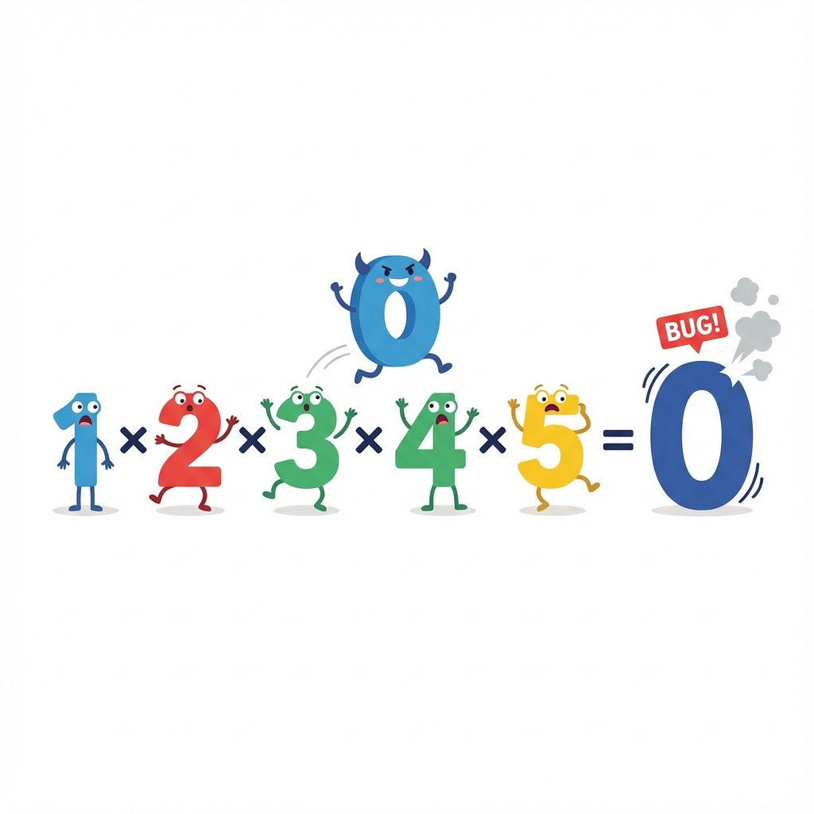


</div>
</div>

---

### Print Debugging

The simplest way to see what's happening is inserting `print()` statements.

```python
def calculate_factorial(n):
    result = 1
    for i in range(n):
        print(f"DEBUG: i={i}, result={result}") # Trace execution
        result = result * i
    return result
```

**Output:**
`DEBUG: i=0, result=1`
`DEBUG: i=1, result=0` ... *Ah! `i` starts at 0.*

**Pros:** fast, no tools needed.
**Cons:** messy, need to remove them later.

---

<div class="columns">
<div class="two">

### Rubber Duck Debugging

The method of debugging code by explaining it, line-by-line, to an inanimate object (like a rubber duck).

- **Why it works:** Explaining the problem forces you to slow down and articulate your logic.
- Often, you'll find the bug halfway through the explanation: *"So the loop starts at 0... wait, it shouldn't multiply by 0!"*

</div>
<div class="two">

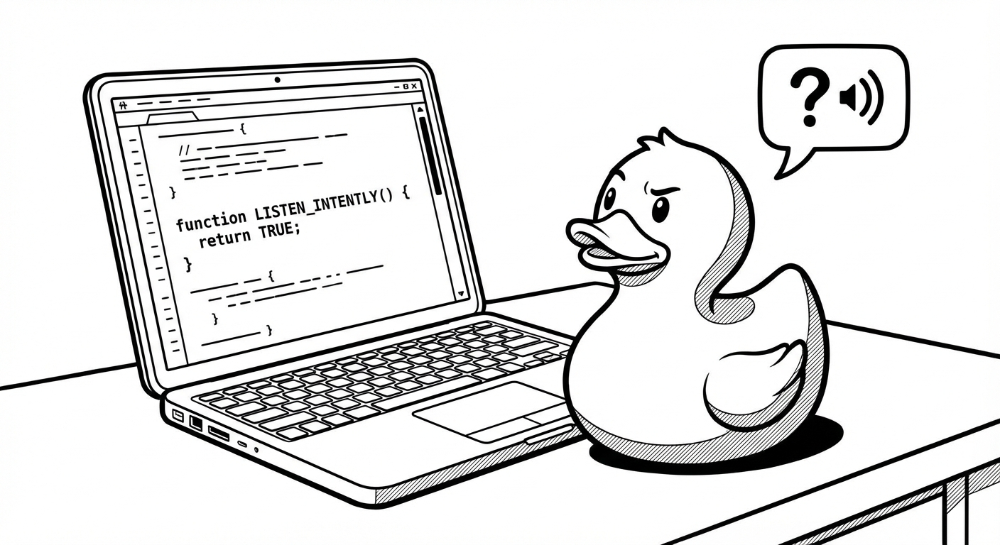

</div>
</div>

---

### The VS Code Debugger

VS Code has a powerful built-in debugger. Stop using `print()` for hard problems!

**Key Features:**
- **Breakpoints:** Click the red dot in the margin to tell Python to PAUSE execution at that line.
- **Variables Window:** See the current value of *every* variable while paused.
- **Watch Window:** Track specific expressions (e.g., `result * i`).
- **Call Stack Window:** View the active function calls.
- **Breakpoints Window:** Manage breakpoints and catch crashes.
- **Debug Toolbar:** Controls for moving through code.

---

<div class="columns">
<div>

### Setting a **Breakpoint**

A **breakpoint** is a marker that tells the debugger to **PAUSE** execution at a specific line.

- **How to set:** Click to the left of the line number in the editor (or press `F9`).
- **Visual:** A red dot appears.
- **Effect:** When Python reaches this line, it freezes, allowing you to inspect the state.

</div>
<div>

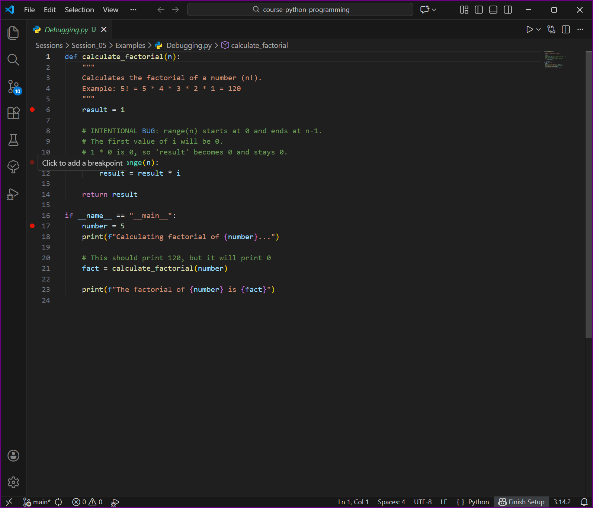

</div>
</div>

---

<div class="columns">
<div>

### Starting the **Debugger**

You must start the program in "Debug Mode" (not just Run).

- **Run Button:** Click the small down-arrow next to the Run button and select **"Debug Python File"**.
- **Sidebar:** Click the "Run and Debug" icon (Play button with a bug) and click "Run and Debug".
- **Shortcut:** Press `F5`.

</div>
<div>

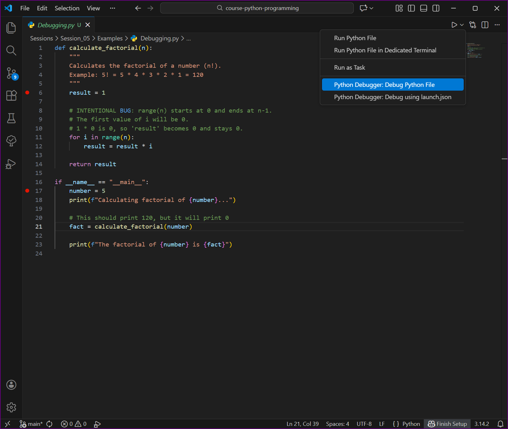

</div>
</div>

---

<div class="columns">
<div>

### The **Debug View**

When execution hits a breakpoint, VS Code enters debug mode.

- **Yellow Line:** The line that is *about to be executed*.
- **Debug Sidebar:** Opens on the left, displaying variables and stack.
- **Status Bar:** Turns orange to indicate debugging is active.

</div>
<div>

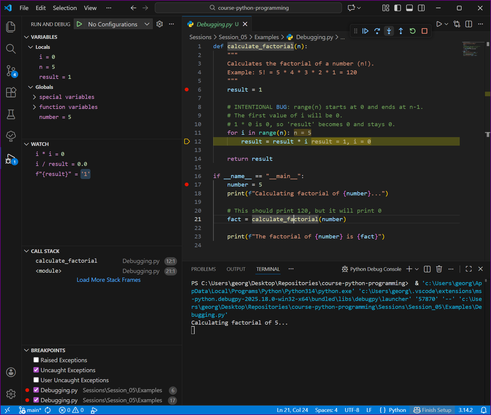

</div>
</div>

---

<div class="columns">
<div>

### The **Debug Toolbar**

Controls the flow of execution.

1.  **Continue (F5):** Resume running until the next breakpoint.
2.  **Step Over (F10):** Execute the current line. (Does not enter functions).
3.  **Step Into (F11):** Jump *inside* the function call.
4.  **Step Out (Shift+F11):** Finish current function and return.
5.  **Stop (Shift+F5):** Terminate the program.

</div>
<div>


</div>
</div>

---

<!-- class: blank -->

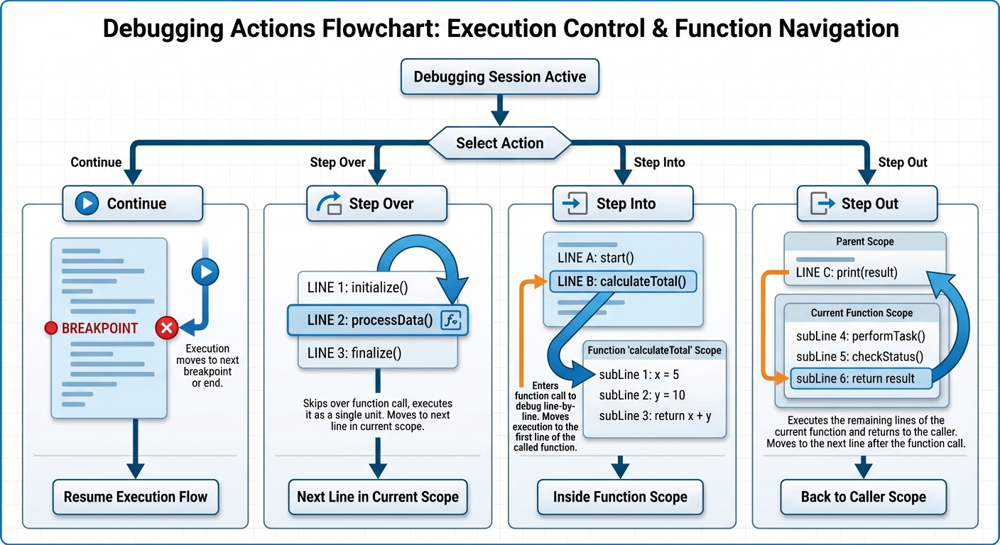

---

<div class="columns">
<div>

### Inspecting **Variables**

The **Variables** section shows the current memory state.

- **Locals:** Variables inside the current function scope.
- **Globals:** Variables defined at the module level.
- **Inspect:** Expand lists and objects to see their contents.
- **Modify:** You can double-click a value to change it while the program is paused!

</div>
<div>

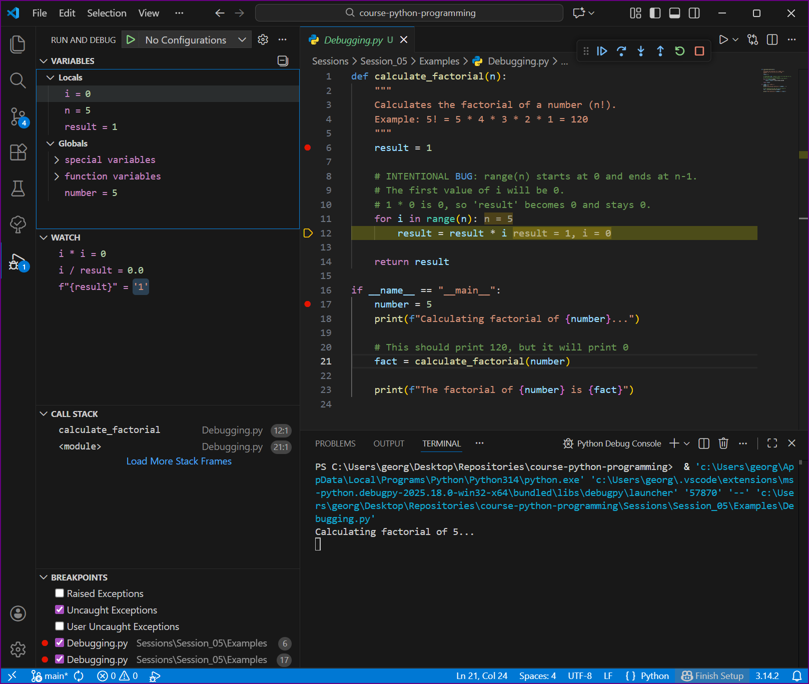

</div>
</div>

---

<div class="columns">
<div>

### The **Watch** Window

Track specific expressions that aren't just simple variables.

- **Custom Expressions:** Click `+` and type any valid Python code (e.g., `i * 2` or `len(my_list) > 0`).
- **Live Updates:** The value is re-calculated every time you step.
- **Focus:** Helps you ignore noise and focus on key data.

</div>
<div>

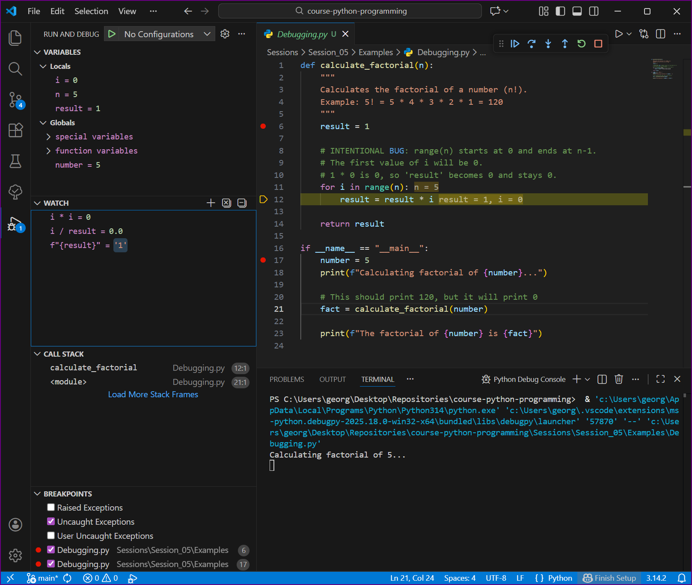

</div>
</div>

---

<div class="columns">
<div>

### The **Call Stack**

Shows the chain of function calls that led to the current line.

- **Stack Frames:** The top item is the current function. The item below called it, and so on.
- **Navigation:** Click on a lower frame to "jump back in time" and see the variables in that function's scope.
- **Context:** Essential for understanding *how* you got to a specific state.

</div>
<div>

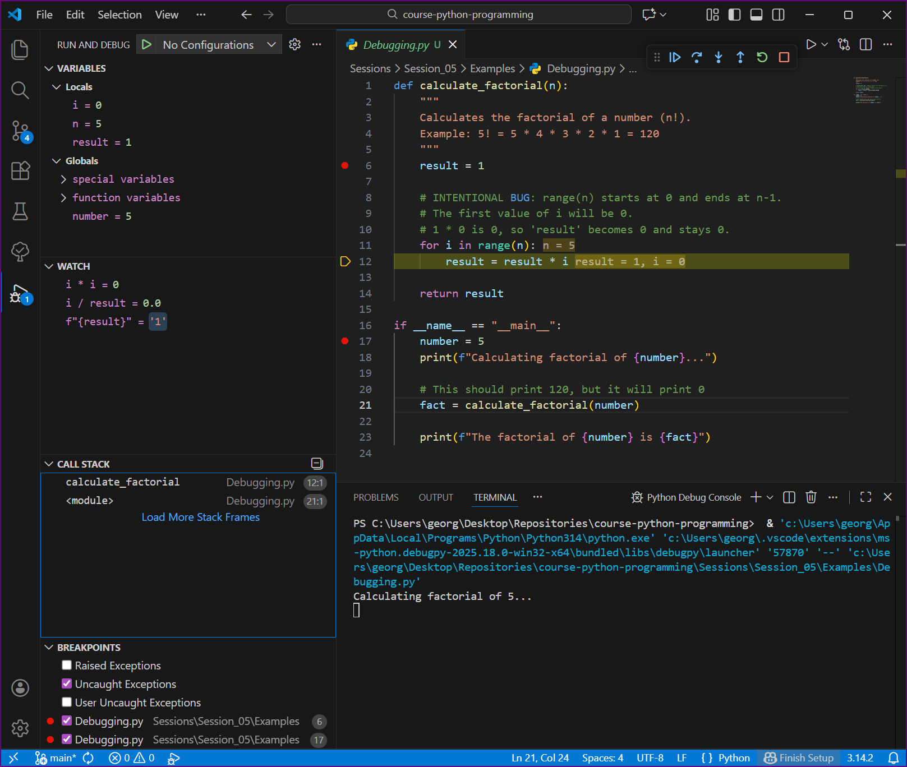

</div>
</div>

---

<div class="columns">
<div>

### Visualizing the **Call Stack**

- **LIFO Structure:** Last-In, First-Out. The most recent function is on top.
- **Stack Frames:** Each block represents a function call.
- **Active Frame:** The top frame is the one currently running.
- **Paused Frames:** Frames below are waiting for the function above to return.

</div>
<div>

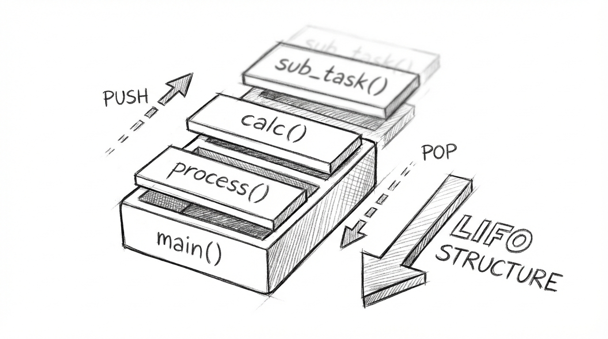

</div>
</div>

---

<div class="columns">
<div>

### The **Breakpoints** List

Manages where the debugger should stop.

- **Toggle:** Enable/Disable breakpoints without deleting them.
- **Exception Breakpoints:** Check **"Raised Exceptions"** to make the debugger stop *immediately* when a crash occurs (before the program exits).
    - This is the "Magic Button" for finding bugs!

</div>
<div>

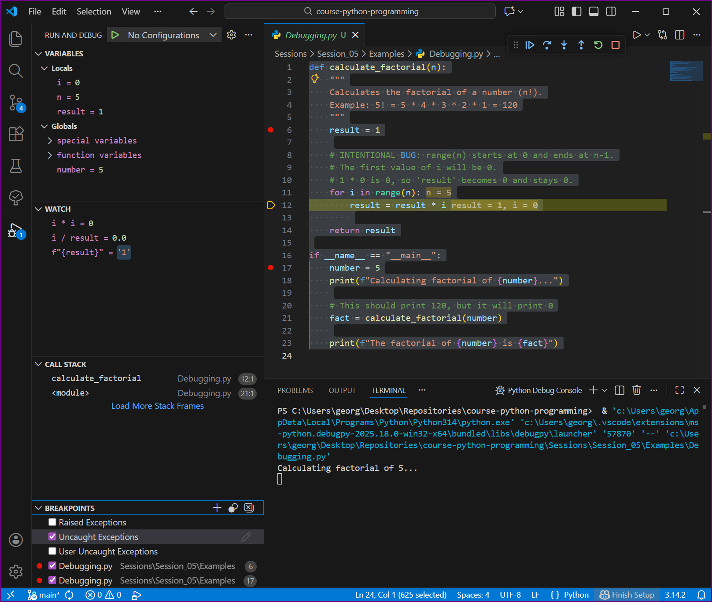

</div>
</div>

---

### The Fix: Adjusting the Range

To fix the logical error, we must ensure the loop starts at `1` or iterates over the correct values.

<div class="columns">
<div class="two">

**Option A: Range with Start**
```python
def calculate_factorial(n):
    result = 1
    # Start at 1, end at n
    for i in range(1, n + 1):
        result *= i
    return result
```

</div>
<div class="two">

**Option B: Using Math Library**
```python
import math

def calculate_factorial(n):
    return math.factorial(n)
```

</div>
</div>

---

### Engineering Example: Debugging a Control Loop

A heater control loop is misbehaving.

<div class="columns">
<div class="two">

**Scenario:** The heater never turns off.

**Debug Steps:**
1.  Set **Breakpoint** inside the `while` loop.
2.  **Watch** `current_temp` and `target_temp`.
3.  **Step** through the logic.
4.  **Discovery:** The sensor reading function is returning a string `"25.0"` instead of a float `25.0`. The comparison `str < float` logic might be failing or behaving unexpectedly.

</div>
<div class="two">

```python
while True:
    current_temp = read_sensor()
    # -> Returns "25.0"?
    
    target_temp = 100.0
    
    # Bug: String vs Float comparison logic
    if current_temp < target_temp:
        heater_on()
    else:
        heater_off()
        
    time.sleep(1)
```

</div>
</div>

---

### Exercises: Debugging

1.  **Analyze the Bug:** Look at the following code. It is supposed to count down from 5 to 1. Why does it run forever?
    ```python
    n = 5
    while n > 0:
        print(n)
        n + 1 # Error is here
    ```

2.  **Trace the Logic:** Manually trace the values of `a` and `b` in this snippet:
    ```python
    a = 10
    b = 5
    if a > b:
        a = a - 2
    else:
        b = b - 2
    # What are a and b now?
    ```

---

# Chapter 5: Summary

- **Types of Errors:**
    - **Syntax:** Code grammar is wrong (doesn't run).
    - **Runtime:** Code crashes (e.g., `/0`).
    - **Logical:** Code runs but result is wrong.
- **Exception Handling:** Use `try...except` to catch crashes and handle them safely.
    - Use `else` for success and `finally` for cleanup.
- **Raising Exceptions:** Use `raise` to stop execution when rules are violated.
- **Debugging:**
    - Don't just stare at code; **Trace** it.
    - Use **Breakpoints** and **Step Through** in VS Code to see variables change in real-time.