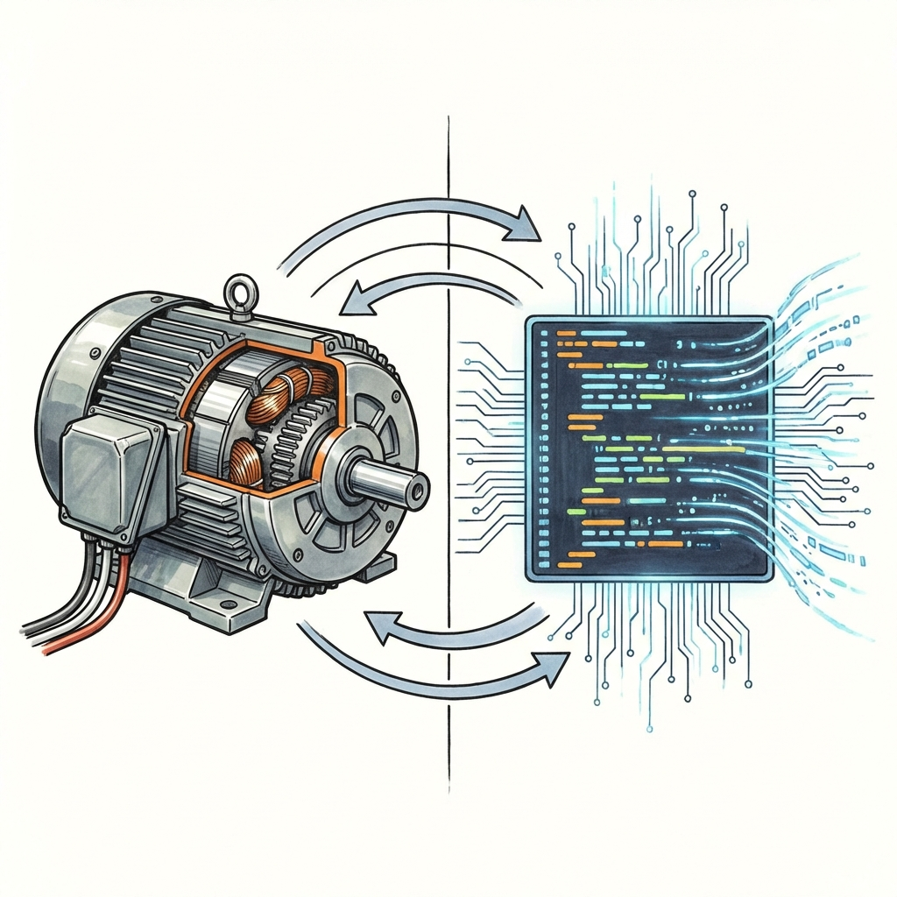
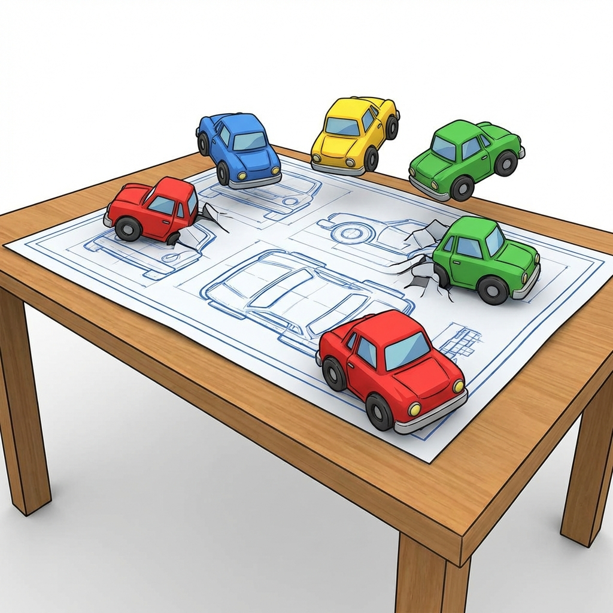
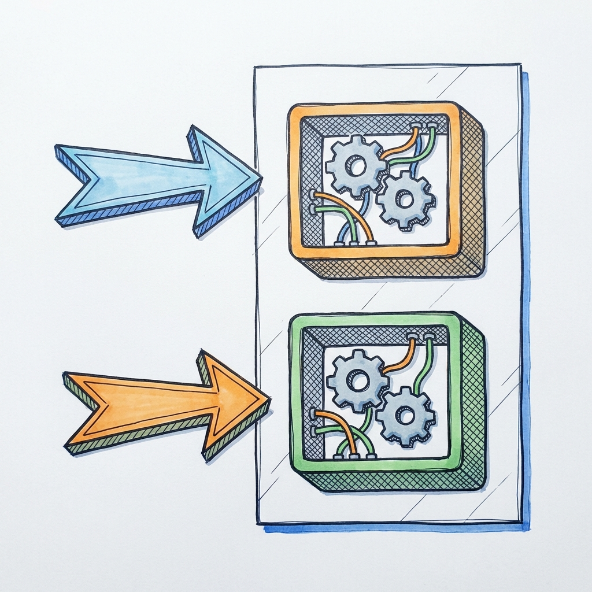
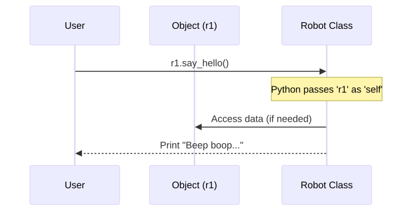
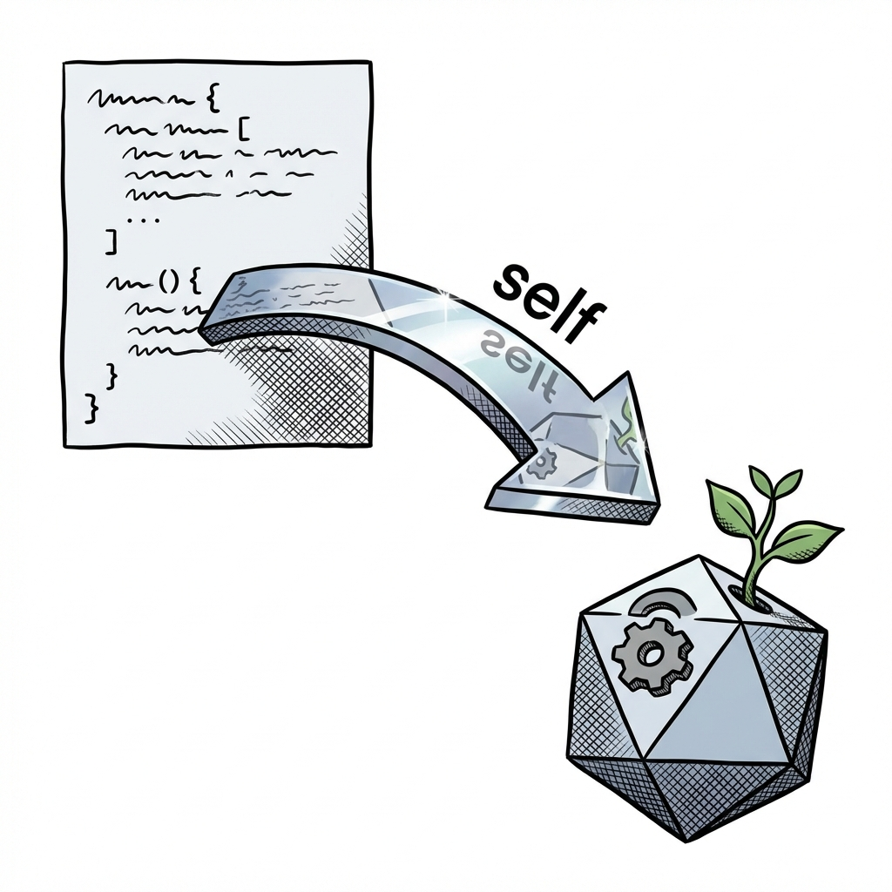
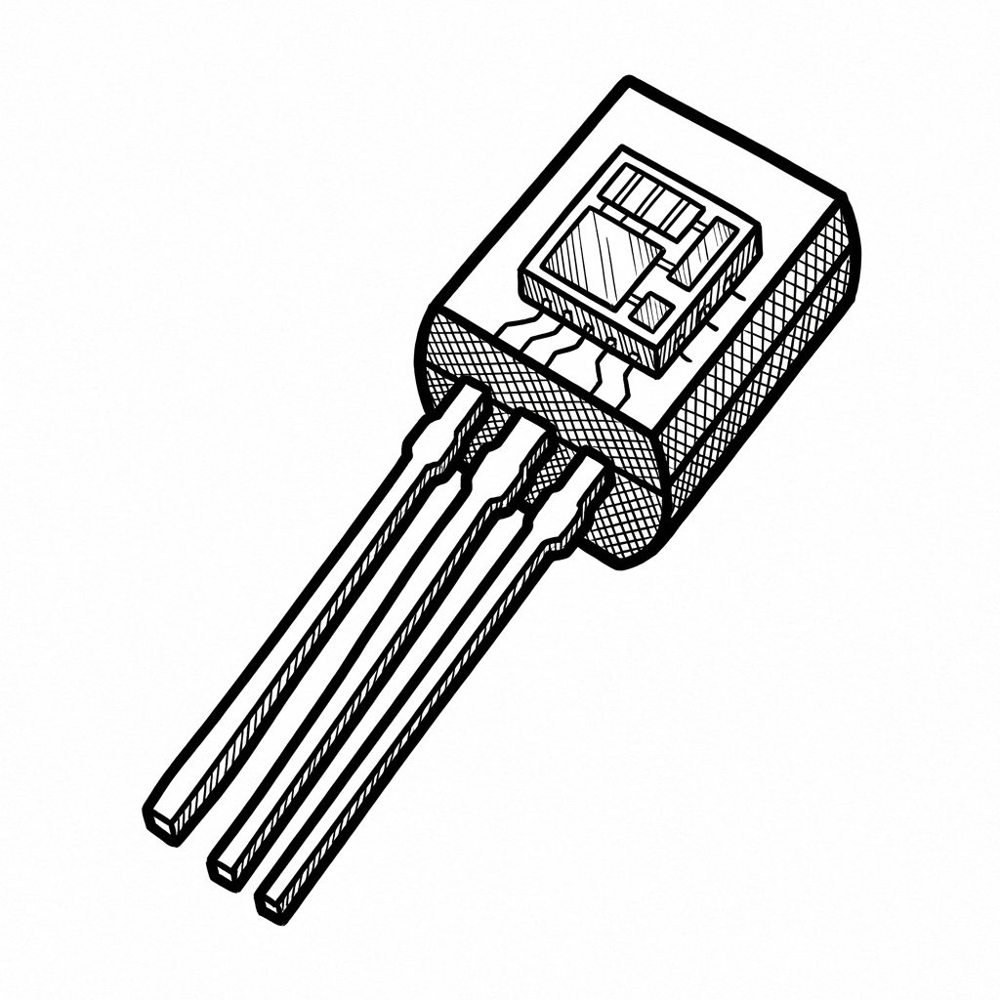

<!-- Abstract illustration of a blueprint transforming into a 3D object, symbolizing the transition from class to object. -->


# Chapter 6: Object-Oriented Programming (OOP) I

This chapter includes the following sections:

- 6.1: Introduction to OOP
- 6.2: Classes and Objects
- 6.3: Attributes and Methods
- 6.4: The `__init__` Method

---

<!-- Illustration of a messy pile of tools (procedural) vs. a well-organized toolbox (OOP). -->


## 6.1: Introduction to OOP

Shift your thinking from "steps" to "things".

- Procedural vs. Object-Oriented Programming
- The "Digital Twin" Concept
- Thinking in Objects
- Benefits of OOP

---

<div class="columns">
<div class="two">

### Procedural Programming Recap

So far, we have written code in a **Procedural** style.

- We write **functions** (procedures) that act on data.
- Data (variables) and Logic (functions) are separate.
- **Flow:** Step 1 -> Step 2 -> Step 3.

```python
# Data
length = 10
width = 20

# Function
def calculate_area(l, w):
    return l * w

# Execution
area = calculate_area(length, width)
```

</div>
<div>



</div>
</div>

---

### The Limit of Procedural Code

As programs grow, procedural code can become "Spaghetti Code".

- **Global Variables:** Data is scattered everywhere.
- **Dependency Hell:** Changing one function might break another.
- **Disconnect:** It's hard to see which functions belong to which data.

Imagine a car factory simulation with 1,000 global variables for wheels, engines, and doors. It would be a mess!

---

### Enter Object-Oriented Programming (OOP)

**OOP** is a programming paradigm based on the concept of "objects".

- **Bundling:** An object bundles **Data** (Attributes) and **Behavior** (Methods) into a single unit.
- **Modeling:** It allows us to model real-world entities directly in code.

Instead of `length` and `width` floating around, we have a `Rectangle` object that *knows* its size and *knows* how to calculate its area.

---

<div class="columns">
<div>

### The "Digital Twin" Concept

In Industry 4.0, we talk about **Digital Twins**: virtual replicas of physical systems. OOP is the natural language for this.

- A physical **Pump** has:
    - **Properties:** Pressure, Flow Rate, RPM.
    - **Actions:** Start, Stop, Increase Speed.
- A software **Pump Object** has:
    - **Attributes:** `pressure`, `flow_rate`, `rpm`.
    - **Methods:** `start()`, `stop()`, `set_speed()`.

</div>
<div>



</div>
</div>

---

### Thinking in Objects

When you look at a system, don't ask "What steps do I need?"
Ask **"What things are interacting?"**

**Example: A Traffic Simulation**
- **Procedural:** "Loop through array of positions, update generic x/y variables..."
- **OOP:** "The `Car` moves. The `TrafficLight` changes color. The `Pedestrian` waits."

---

### Real-World Analogy: The Car Factory

- **The Class (Blueprint):** The engineering design for a "Model T".
    - It defines that every car has 4 wheels, an engine, and a color.
    - It defines that every car can drive and brake.
    - *You cannot drive the blueprint.*
- **The Object (Instance):** The actual cars rolling off the line.
    - Car #1: Red, VIN 12345.
    - Car #2: Blue, VIN 67890.
    - *These are tangible and usable.*

---

<div class="columns">
<div>

### Analogy Visualization

The **Class** is the abstract definition.
The **Object** is the concrete instance.

You define the class **once**.
You create objects **many times**.

</div>
<div>



</div>
</div>

---

### Why OOP? Benefit 1: Modularity

Large systems are built from smaller, self-contained components.

- A `Car` object contains an `Engine` object and `Wheel` objects.
- If the `Engine` needs an upgrade, you modify the `Engine` class. The `Car` class doesn't need to know the details of *how* the engine works, just how to use it.
- This effectively isolates errors and makes testing easier.

---

### Why OOP? Benefit 2: Reusability

**"Write once, use everywhere."**

- You write a `TemperatureSensor` class for Project A.
- Project B also needs temperature sensors.
- You can simply copy the `TemperatureSensor` class (or import the module) to Project B.
- No need to rewrite the logic for reading voltages and converting to Celsius.

---

### Why OOP? Benefit 3: Maintainability

**"Single Source of Truth."**

- Suppose you find a bug in how humidity is calculated.
- In procedural code, this calculation might be copied in 10 different places.
- In OOP, it's in *one* method inside the `HumiditySensor` class.
- You fix it there, and *all* sensors in your application are fixed instantly.

---

<!-- Illustration showing a class definition code block transforming into multiple object instances. -->


## 6.2: Classes and Objects

Defining blueprints and creating instances.

- Syntax for defining a Class
- Naming Conventions
- Instantiation
- The `pass` keyword
- `type()` and `isinstance()`

---

### Defining a Class

We use the `class` keyword to define a new class.

```python
class Robot:
    # The body of the class (indented).
    # Here we define attributes and methods.
    pass
```

- **`class`**: The keyword that tells Python "We are making a new type of thing."
- **`Robot`**: The name of the class.
- **`:`**: Marks the start of the class body.

---

### Naming Conventions (PEP 8)

It is crucial to follow standard Python naming conventions so other developers can read your code.

| Concept | Convention | Example |
| :--- | :--- | :--- |
| **Class Names** | **PascalCase** | `Sensor`, `DataLogger`, `RobotArm` |
| **Variable Names** | **snake_case** | `sensor_value`, `my_robot` |
| **Function/Method** | **snake_case** | `calculate_speed`, `read_data` |
| **Constants** | **UPPER_CASE** | `MAX_SPEED`, `PI` |

*Note: PascalCase capitalizes the first letter of every word, including the first one. No underscores.*

---

### The `pass` Keyword

What if we want to define a class but add the details later?

We cannot leave the body empty, or Python will raise a `SyntaxError`.
We use `pass` as a placeholder.

```python
class EmptyClass:
    pass # Do nothing, just valid syntax

print("Class defined successfully.")
```

---

### Creating Objects (Instantiation)

Defining a class does not create any objects. It just defines the *pattern*.
To create an object, we **call** the class name like a function.

```python
# Definition
class Robot:
    pass

# Instantiation (Creating instances)
robot_1 = Robot()
robot_2 = Robot()
```

`robot_1` and `robot_2` are now **instances** of the class `Robot`.

---

<div class="columns">
<div>

### Independent Instances

`robot_1` and `robot_2` are separate entities.

- They are stored at different locations in memory.
- Modifying one does not affect the other.

```python
print(robot_1)
print(robot_2)
```

**Output:**
`<__main__.Robot object at 0x00A1...>`
`<__main__.Robot object at 0x00B2...>`

</div>
<div>



</div>
</div>

---

### Checking Types with `type()`

You can check what class an object belongs to.

```python
x = 5
r = Robot()

print(type(x)) 
# Output: <class 'int'>

print(type(r)) 
# Output: <class '__main__.Robot'>
```

Notice that even `int` is a class! In Python, **everything** is an object.

---

### Checking Types with `isinstance()`

A better way to check types in logic is `isinstance()`.

```python
r = Robot()

if isinstance(r, Robot):
    print("Yes, r is a Robot.")

if isinstance(r, int):
    print("r is an integer.")
else:
    print("r is NOT an integer.")
```

**Output:**
Yes, r is a Robot.
r is NOT an integer.

---

<div class="columns">
<div>

### Example: A Warehouse System

Imagine managing inventory. Instead of loose variables, we define an `Item` class.

```python
class InventoryItem:
    """
    Represents a product in a warehouse.
    """
    pass

# Instantiate items
item1 = InventoryItem()
item2 = InventoryItem()

# Check identity
print(item1 == item2) 
# False (Different instances)
```

</div>
<div>


</div>
</div>

---

<!-- Illustration of an object with labels pointing to its data (attributes) and actions (methods). -->


## 6.3: Attributes and Methods

Bringing objects to life with data and behavior.

- Instance Attributes
- Dot Notation
- Methods vs Functions
- The `self` parameter
- Method Arguments

---

### What are Attributes?

Attributes are **variables** that belong to a specific object.
They represent the **state** or **data** of that object.

Examples:
- A `Robot` has a `name` and a `battery_level`.
- A `Car` has a `color` and a `speed`.
- A `User` has a `username` and a `password`.

---

### Setting Attributes (Dot Notation)

In Python, you can add attributes to an object dynamically using the **dot operator** (`.`).

```python
class Robot:
    pass

# Create an object
r1 = Robot()

# Add attributes
r1.name = "R2-D2"
r1.battery = 100
r1.status = "Active"
```

The object `r1` now "carries" these three pieces of data with it.

---

### Accessing Attributes

We also use the dot operator to read the data back.

```python
print(f"Robot Name: {r1.name}")
print(f"Battery: {r1.battery}%")

# We can use them in calculations
range_km = r1.battery * 0.5
print(f"Estimated Range: {range_km} km")
```

---

### Attributes are Independent

Changing an attribute on one object does **not** change it on others.

```python
r1 = Robot()
r1.name = "Unit A"

r2 = Robot()
r2.name = "Unit B"

print(r1.name) # Unit A
print(r2.name) # Unit B

r1.name = "Unit A (Damaged)"
print(r2.name) # Still "Unit B"
```

---

### What are Methods?

Methods are **functions** that belong to a class.
They represent the **behavior** or **actions** of an object.

Examples:
- A `Robot` can `move_forward()` or `recharge()`.
- A `Sensor` can `read_value()`.
- A `File` can `save()`.

---

### Defining a Method

Methods are defined just like functions, but **inside** the class block.

**Crucial Rule:** The first parameter of an instance method must always be **`self`**.

```python
class Robot:
    
    # This is a method
    def say_hello(self):
        print("Beep boop! I am a robot.")
```

---

<div class="columns">
<div>

### Calling a Method

You call a method using the dot operator: `object.method()`.

```python
r1 = Robot()

# Call the method
r1.say_hello()
```

</div>
<div class="two">



**Wait!** We defined `say_hello(self)` with one parameter, but we called `r1.say_hello()` with zero arguments. Why didn't it crash?

</div>
</div>

---

### The `self` Parameter: What is it?

**`self`** is a reference to the **current object** (the instance) that is calling the method.

When you call `r1.say_hello()`, Python automatically converts it to:
`Robot.say_hello(r1)`

- It passes the object `r1` into the function as the first argument (`self`).
- This allows the method to know *which* object it is working on.

---

### Accessing Attributes inside Methods

We use `self` to access the object's own data.

```python
class Robot:
    def status_report(self):
        # We cannot just say 'print(battery)'
        # We must say 'print(self.battery)'
        print(f"Battery Level: {self.battery}%")

r1 = Robot()
r1.battery = 75

r1.status_report()
# Inside the method, 'self' becomes 'r1'.
# So it prints r1.battery.
```

---

<div class="columns">
<div>

### The `self` Parameter: Visualized

Think of `self` as a mirror. The method looks in the mirror to see the object that called it.

- If `r1` calls `status_report`, `self` is `r1`.
- If `r2` calls `status_report`, `self` is `r2`.

This is how one block of code (the method) can work for infinite different objects.

</div>
<div>



</div>
</div>

---

### Method Arguments

Methods can take additional arguments, just like normal functions. They come *after* `self`.

```python
class Robot:
    def move(self, distance, speed):
        print(f"Moving {distance}m at {speed}m/s.")
        
    def charge(self, amount):
        self.battery = self.battery + amount
        print(f"Charged by {amount}%. New level: {self.battery}%")

r1 = Robot()
r1.battery = 50

r1.move(10, 2) # distance=10, speed=2
r1.charge(20)  # amount=20 -> battery becomes 70
```

---

<div class="columns">
<div>

### Engineering Example: Sensor Class

```python
class TemperatureSensor:
    def read_value(self):
        # Simulate reading hardware
        return 23.5
    
    def calibrate(self, offset):
        # Store offset in THIS sensor object
        self.offset = offset
        print(f"Calibrated with offset: {offset}")

sensor = TemperatureSensor()
sensor.calibrate(0.5)

val = sensor.read_value()
print(f"Reading: {val}")
```

</div>
<div>



</div>
</div>

---

<!-- Illustration of a "Start" button or an initialization sequence checklist. -->


## 6.4: The `__init__` Method

The Constructor: Ensuring objects are born ready.

- The Initialization Problem
- The `__init__` Syntax
- Required and Default Arguments
- Data Validation in `__init__`
- Putting it all together

---

### The Initialization Problem

In previous examples, we created an object and *then* manually added attributes.

```python
r1 = Robot()
# Risk: What if we forget this line?
# r1.name = "R2-D2" 

r1.status_report() 
# AttributeError: 'Robot' object has no attribute 'name'
```

We need a way to ensure every object starts with a valid state.

---

<div class="columns">
<div class="six">

### The Constructor: `__init__`

Python has a special method named `__init__` (double underscore init double underscore).

- It is called **automatically** the moment an object is created.
- It is commonly known as the **Constructor**.
- Its purpose is to **Init**ialize attributes.

```python
class Robot:
    def __init__(self):
        print("A new robot is born!")
        self.battery = 100 # Set default attribute

r1 = Robot() 
# Output: "A new robot is born!"
print(r1.battery) # 100
```

</div>
<div>



</div>
</div>

---

### Passing Arguments to `__init__`

We usually pass data to `__init__` to customize the object.

```python
class Robot:
    def __init__(self, name, model):
        # Take argument 'name' and save it as attribute 'self.name'
        self.name = name
        self.model = model
        self.battery = 100

# Arguments are passed during creation
r1 = Robot("Wall-E", "WasteCollector")
r2 = Robot("Eve", "Probe")

print(r1.name) # Wall-E
print(r2.name) # Eve
```

---

<div class="columns">
<div class="two">

### The Pattern: `self.x = x`

This is the most common pattern in OOP.

1.  Receive value as argument `x`.
2.  Store it in object attribute `self.x`.

```python
class User:
    def __init__(self, username, email):
        self.username = username
        self.email = email
```

</div>
<div class="two">

**Why?**
Variables `username` and `email` die when `__init__` finishes.
Attributes `self.username` and `self.email` live as long as the object lives.

</div>
</div>

---

### Default Arguments in `__init__`

`__init__` is just a method, so it supports default parameters.

```python
class Motor:
    def __init__(self, voltage=12, max_rpm=3000):
        self.voltage = voltage
        self.max_rpm = max_rpm

# Uses defaults
m1 = Motor() 
print(m1.voltage) # 12

# Overrides defaults
m2 = Motor(voltage=24, max_rpm=5000)
print(m2.voltage) # 24
```

---

### Validating Data in `__init__`

Constructors are great places to check if the data makes sense (Defensive Programming).

```python
class Circle:
    def __init__(self, radius):
        if radius < 0:
            raise ValueError("Radius cannot be negative!")
            
        self.radius = radius

c1 = Circle(5) # OK
# c2 = Circle(-10) # Crashes with ValueError
```

---

<div class="columns">
<div>

### Example: Coordinate Point

A point in 2D space needs an X and a Y value. It makes no sense to have a "Point" without coordinates.

```python
class Point:
    def __init__(self, x, y):
        self.x = x
        self.y = y
        
    def __str__(self):
        # Special method for
        #  string representation
        # Called when we print(p1)
        return f"({self.x}, {self.y})"

p1 = Point(10, 20)
print(f"Point created at {p1}")
```

</div>
<div>


</div>
</div>

---

<div class="columns">
<div class="two">

### Engineering Example: Data Logger Class

Let's build a class to manage logging data to a list.

```python
class DataLogger:
    def __init__(self, sensor_id):
        self.sensor_id = sensor_id
        self.storage = [] # Initialize empty list
        
    def log(self, value):
        self.storage.append(value)
        print(f"[{self.sensor_id}] Logged: {value}")
        
    def get_average(self):
        if not self.storage: return 0
        return sum(self.storage) / len(self.storage)

logger = DataLogger("TEMP_01")
logger.log(22.5)
logger.log(23.0)
print(f"Average: {logger.get_average()}")
```

</div>
<div>


</div>
</div>

---

### Exercises: The `Dog` Class

1.  Define a class `Dog`.
2.  The `__init__` method should accept `name` and `breed`.
3.  Add a method `bark()` that prints "[Name] says Woof!".
4.  Create two dogs (e.g., "Rex", "German Shepherd" and "Fifi", "Poodle").
5.  Make them both bark.

---

### Exercises: The `BankAccount`

1.  Create a class `BankAccount`.
2.  `__init__`: Set `balance` to 0. (No arguments needed).
3.  `deposit(amount)`: Add amount to balance.
4.  `withdraw(amount)`: Subtract amount. **Bonus:** Check if funds are sufficient first!
5.  Create an account, deposit 100, withdraw 30, and print the `balance`.

---

### Exercises: The `Rectangle`

1.  Create a class `Rectangle`.
2.  `__init__` should take `width` and `height`.
3.  Add a method `area()` that returns `width * height`.
4.  Add a method `perimeter()` that returns `2 * (width + height)`.
5.  Instantiate a rectangle with size 5x10.
6.  Print: "Area: 50, Perimeter: 30".

---

# Chapter 6: Summary

- **OOP** structures code into **Objects** (Things) rather than just functions (Steps).
- A **Class** is a blueprint/template.
- An **Object** is a specific instance of a class.
- **Attributes** store data (`self.variable`).
- **Methods** define behavior (`def method(self):`).
- **`self`** refers to the current object instance.
- **`__init__`** is the constructor method, used to set up initial attributes.
