<!-- Abstract illustration showing a family tree or hierarchy of glowing geometric shapes. -->


# Chapter 7: Object-Oriented Programming (OOP) II

This chapter includes the following sections:

- 7.1: Inheritance
- 7.2: Polymorphism
- 7.3: Encapsulation
- 7.4: Abstract Classes
- 7.5: Composition vs. Inheritance

---

<!-- Illustration of a Russian Matryoshka doll or a tree structure showing parent-child relationships. -->

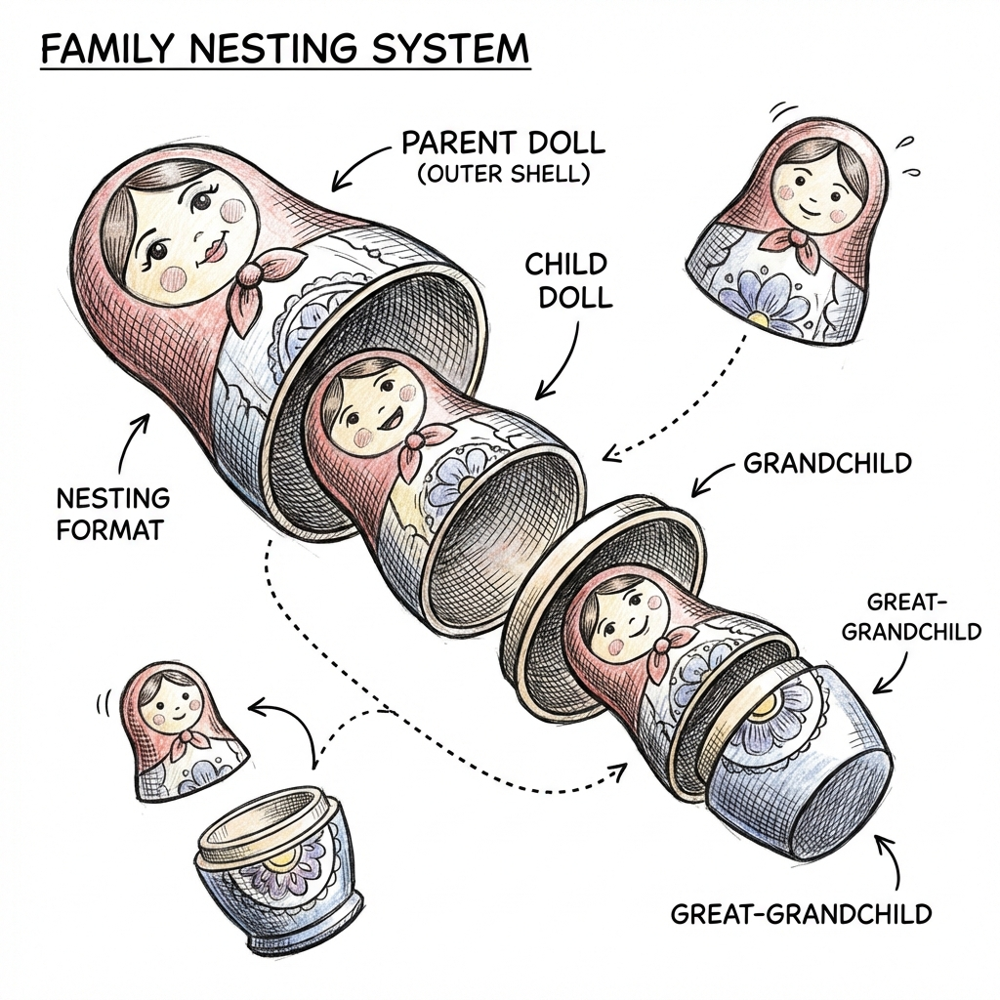

## 7.1: Inheritance

Don't start from scratch. Build upon what exists.

- The DRY Principle
- Parent and Child Classes
- The `is-a` Relationship
- The `super()` Function
- Overriding vs Extending
- The `object` Base Class

---

<div class="columns">
<div>

### The DRY Principle

**DRY: Don't Repeat Yourself.**

Imagine you are coding a traffic simulation.
- `Car` has speed, color, and can move.
- `Truck` has speed, color, and can move.
- `Motorcycle` has speed, color, and can move.

Writing the same code 3 times is inefficient and error-prone.

**Inheritance** is the solution to this redundancy.

</div>
<div>

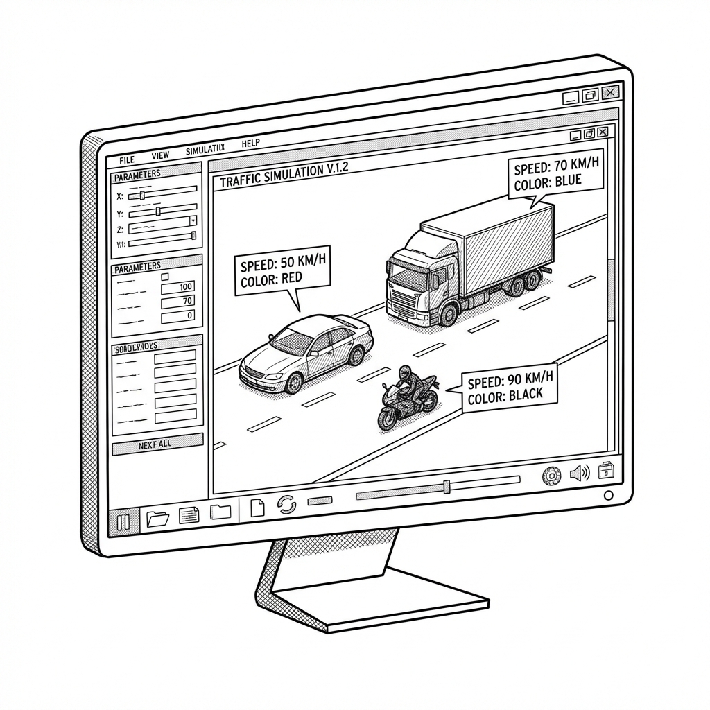

</div>
</div>

---

<div class="columns">
<div>

### Biological Analogy

Think of genetics.

- You inherit traits (attributes) like eye color or height from your parents.
- You inherit abilities (behaviors) like walking or talking.
- You also have unique traits (your specific job, your hobbies) that your parents don't have.

In programming:
- **Parent Class:** The generic ancestor (e.g., `Animal`).
- **Child Class:** The specific descendant (e.g., `Dog`).

</div>
<div>

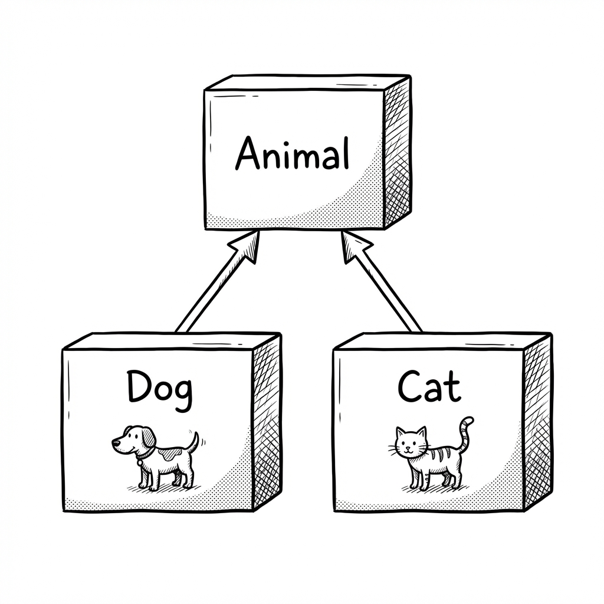

</div>
</div>

---

<div class="columns">
<div>

### The Concept of Inheritance

Inheritance allows us to define a generic **Parent Class** (Base Class / Superclass) and generic methods once.

**Child Classes** (Derived Classes / Subclasses) inherit all attributes and methods from the Parent automatically.

- **Vehicle** (Parent)
    - `Car` (Child)
    - `Truck` (Child)
    - `Motorcycle` (Child)

</div>
<div>

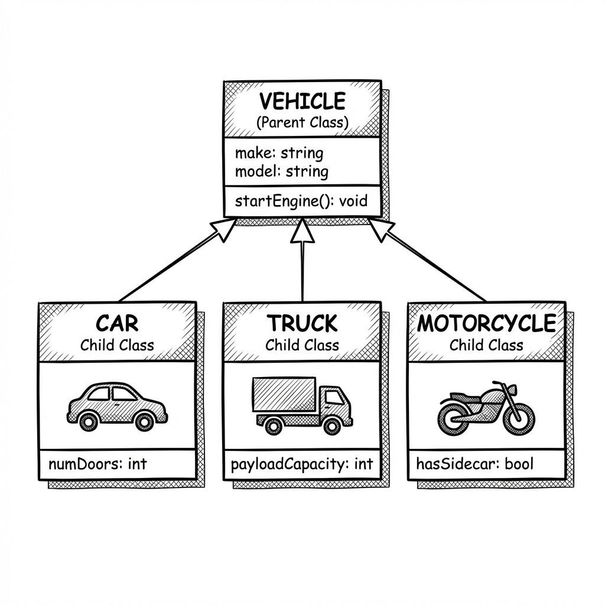

</div>
</div>

---

<div class="columns">
<div>

### Defining Inheritance

Syntax: `class Child(Parent):`

```python
# Parent Class (Base Class)
class Vehicle:
    def __init__(self, brand):
        self.brand = brand
    
    def drive(self):
        print(f"{self.brand} is moving.")

# Child Class (Derived Class)
class Car(Vehicle):
    # Car inherits everything!
    pass

c = Car("Toyota")
c.drive() # Output: Toyota is moving.
```

</div>
<div>



</div>
</div>

---

<div class="columns">
<div>

### The `is-a` Relationship

Inheritance models an **"is-a"** relationship. This is the "Golden Rule" of inheritance.

- A Car **is a** Vehicle.
- A Manager **is an** Employee.
- A Square **is a** Shape.

**Test it:** "Is a [Child] always a [Parent]?"
- Is a Truck a Vehicle? Yes.
- Is a Wheel a Car? No.

</div>
<div>

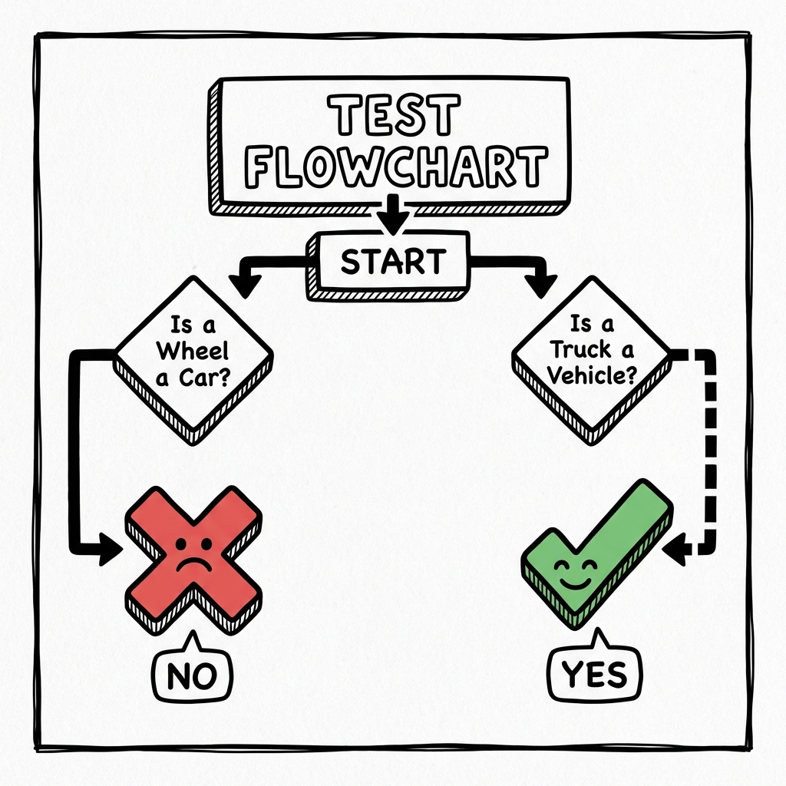

</div>
</div>

---

<div class="columns">
<div>

### Visualizing Hierarchy

Proper inheritance creates a taxonomy (classification system).

- **Animal**
    - **Mammal**
        - **Dog**
        - **Cat**
    - **Reptile**
        - **Snake**

Everything that applies to `Animal` (e.g., `eat()`) applies to `Dog`.
Everything that applies to `Mammal` (e.g., `produce_milk()`) applies to `Dog`.

</div>
<div>

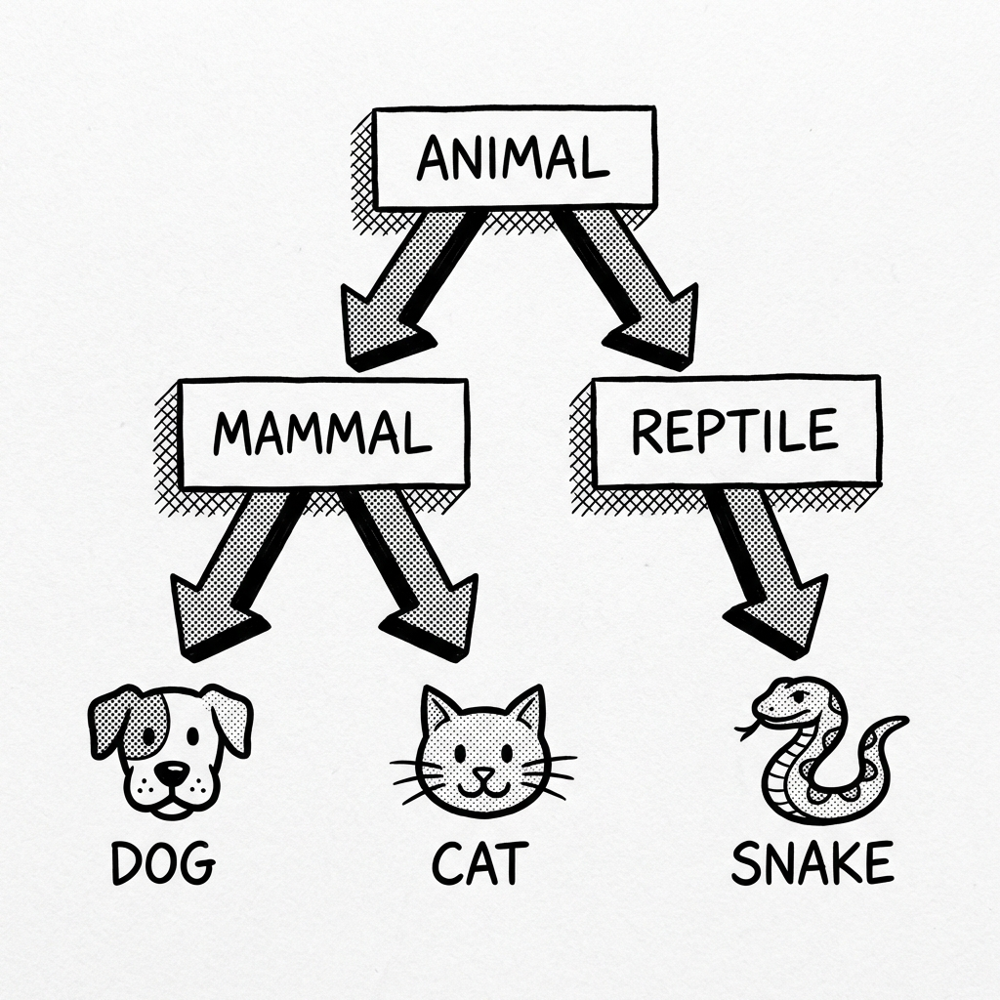

</div>
</div>

---

<div class="columns">
<div>

### Adding Specific Functionality

Child classes are not just clones. They are specialized versions.

```python
class Car(Vehicle):
    def honk(self):
        print("Beep beep!")

class Truck(Vehicle):
    def load_cargo(self):
        print("Loading heavy cargo...")

c = Car("BMW")
c.drive()     # Inherited from Vehicle
c.honk()      # Specific to Car

t = Truck("Volvo")
t.drive()     # Inherited from Vehicle
t.load_cargo()# Specific to Truck
# t.honk()    # Error! Truck has no honk method.
```

</div>
<div>

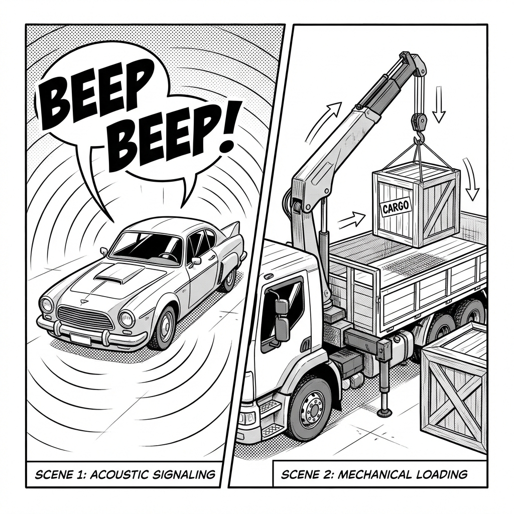

</div>
</div>

---

<div class="columns">
<div>

### Overriding Methods

Sometimes the parent's behavior isn't quite right for the child. The child can **Override** (replace) the method.

```python
class Vehicle:
    def drive(self):
        print("Vehicle moving...")

class ElectricCar(Vehicle):
    # Same method name as Parent -> Overrides it
    def drive(self):
        print("Electric Car moving silently...")

v = Vehicle()
v.drive() # Vehicle moving...

e = ElectricCar("Tesla")
e.drive() # Electric Car moving silently...
```

</div>
<div>


</div>
</div>

---

<div class="columns">
<div>

### The `super()` Function

Often, you don't want to *replace* the parent logic completely, but *extend* it.

`super()` gives you a reference to the Parent class.

Commonly used in `__init__` to ensure the parent sets up its part of the data.

```python
class Robot:
    def __init__(self, name):
        self.name = name

class FlyingRobot(Robot):
    def __init__(self, name, wingspan):
        # 1. Let Parent handle the name
        super().__init__(name)
        # 2. Handle specific stuff
        self.wingspan = wingspan
```

</div>
<div>

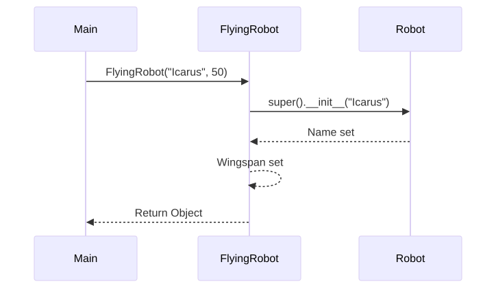

</div>
</div>

---

### Why use `super()`?

1.  **Code Reuse:** You don't have to re-type `self.name = name` in every child class.
2.  **Maintainability:** If the Parent's `__init__` logic changes (e.g., adding an ID generation), all children get the update automatically.
3.  **Consistency:** Ensures the object is fully initialized.

---

<div class="columns">
<div class="three">

### Engineering Example: Sensors

We have a generic `Sensor` and a specific `TempSensor`.

```python
class Sensor:
    def __init__(self, id):
        self.id = id
        self.status = "OK"

    def log(self):
        print(f"Sensor {self.id}: {self.status}")

class TempSensor(Sensor):
    def read_temp(self):
        return 24.5 # Simulated

ts = TempSensor("T-101")
ts.log()        # Inherited from Sensor
print(ts.read_temp()) # Specific to TempSensor
```

</div>
<div>



</div>
</div>

---

<div class="columns">
<div>

### The `object` Base Class

In Python 3, all classes inherit from a built-in base class called `object`, even if you don't specify it.

`class Robot:` is identical to `class Robot(object):`.

This is why every object comes with built-in "Magic Methods" like:
- `__init__` (Constructor)
- `__str__` (String representation)
- `__eq__` (Equality check `==`)

</div>
<div>

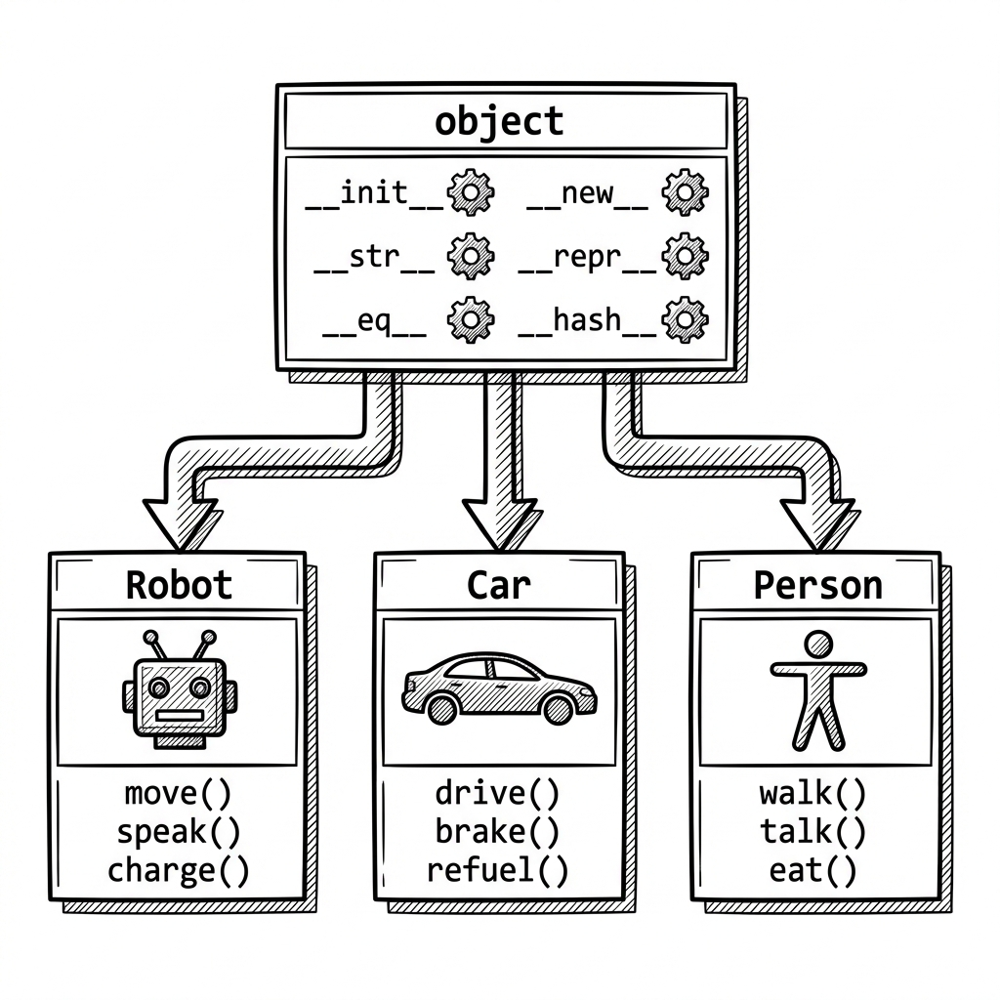

</div>
</div>

---

### Customizing `__str__`

By overriding the method inherited from `object`, we can change how our object prints.

```python
class Car(Vehicle):
    def __str__(self):
        return f"Car({self.brand})"

c = Car("Audi")

# Without __str__ override:
print(c) # <__main__.Car object at 0x7f...>

# With __str__ override:
print(c) # Car(Audi)
```

---

### Customizing `__eq__`

By default, `==` checks if two variables point to the **same object** in memory.

Overriding `__eq__` allows us to define what "equality" means for our data.

```python
class Car(Vehicle):
    def __eq__(self, other):
        # 1. Check if 'other' is also a Car
        if not isinstance(other, Car):
            return False
        # 2. Compare relevant attributes
        return self.brand == other.brand

c1 = Car("Audi")
c2 = Car("Audi")

print(c1 == c2) # True (Brands match)
print(c1 is c2) # False (Different objects in memory)
```

---

<!-- Illustration of shapes (circle, square, triangle) fitting into the same hole or interface. -->


## 7.2: Polymorphism

Many forms, one interface.

- What is Polymorphism?
- The "Plug and Play" Analogy
- Treating objects uniformly
- "Duck Typing"
- The Open/Closed Principle

---

<div class="columns">
<div>

### What is Polymorphism?

**Polymorphism** (Greek: "many forms") means that different classes can be used through the same **Interface**.

If `Car`, `Boat`, and `Plane` all have a `move()` method, I don't need to know explicitly which one I have. I just call `.move()`, and the object does the "right thing" for its type.

</div>
<div>

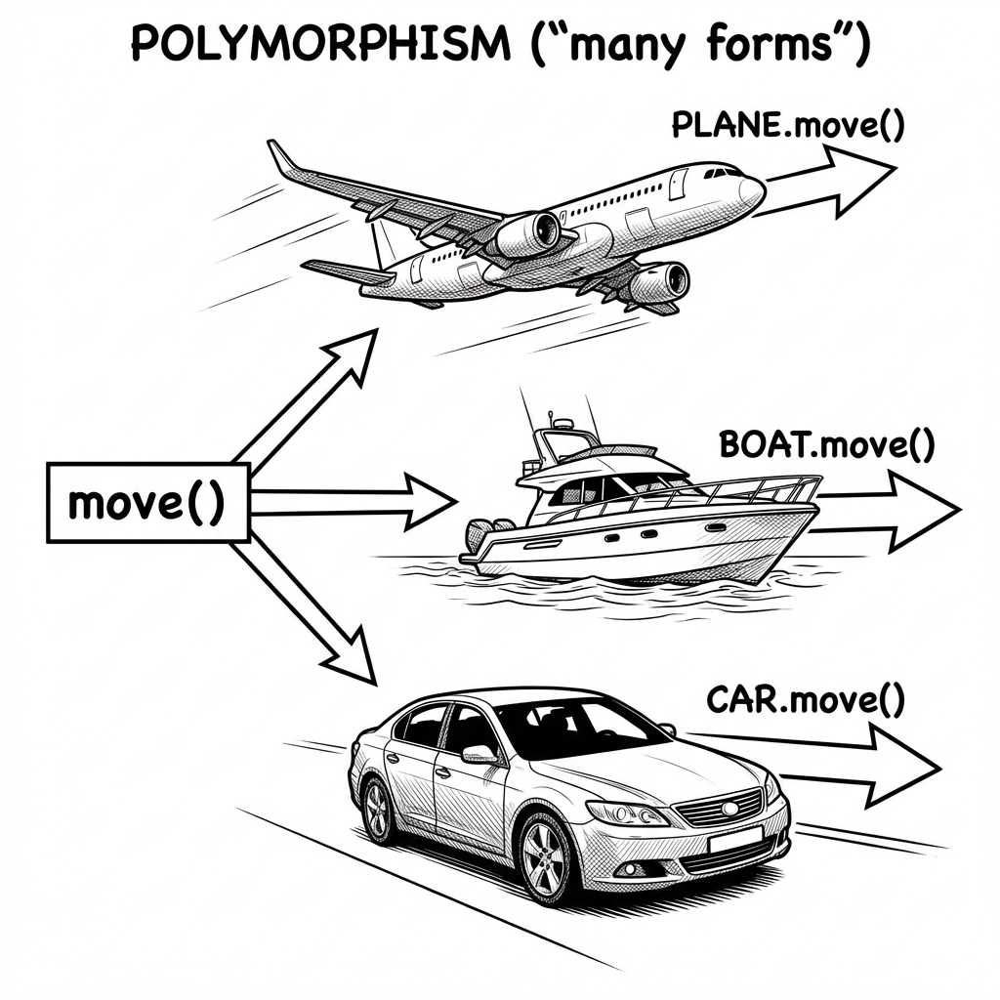

</div>
</div>

---

<div class="columns">
<div>

### "Plug and Play" Analogy

Think of a **USB Port**.

- You can plug in a Mouse, a Keyboard, a Printer, or a Flash Drive.
- It has a universal interface (USB).
- When you plug it in, the device behaves according to its own nature.

**Polymorphism** is the USB port of programming.

</div>
<div>

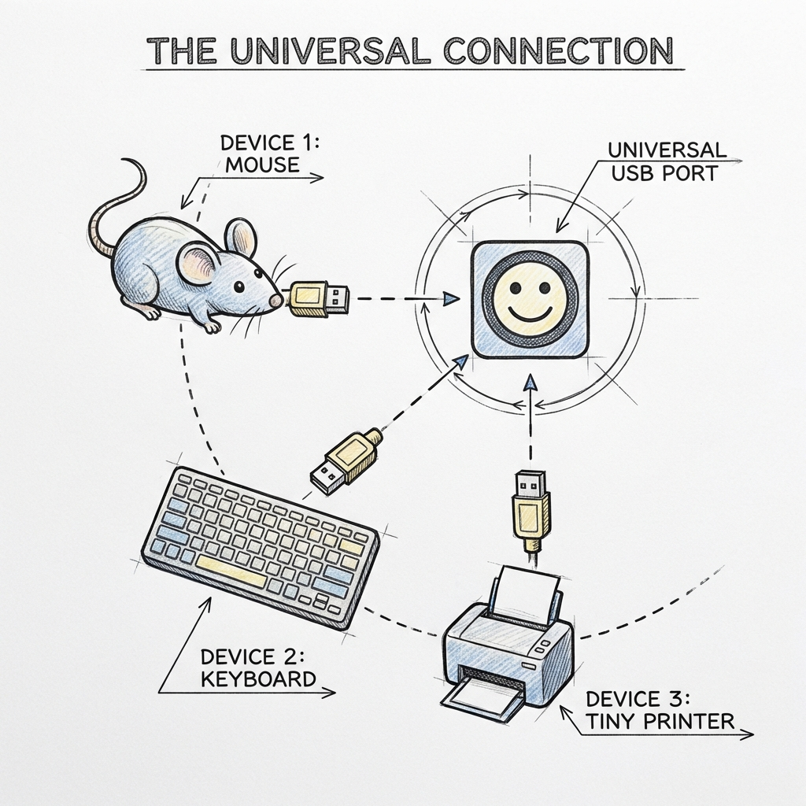

</div>
</div>

---

<div class="columns">
<div class="two">

### Polymorphism in Action

```python
class Car:
    def move(self):
        print("Driving on road")

class Boat:
    def move(self):
        print("Sailing on water")

# List of different objects
vehicles = [Car(), Boat()]

# The loop doesn't care about the type!
for v in vehicles: 
    v.move()
```

**Output:**
```
Driving on road
Sailing on water
```

</div>
<div>



</div>
</div>

---

<div class="columns">
<div>

### "Duck Typing"

Python is a dynamic language. It uses a concept called **Duck Typing**:

> "If it walks like a duck and quacks like a duck, then it must be a duck."

Python does not check "Is this object a Child of Vehicle?".
It simply checks "Does this object have a `.move()` method?" at runtime.

If yes, it runs. If no, it crashes (`AttributeError`).

</div>
<div>

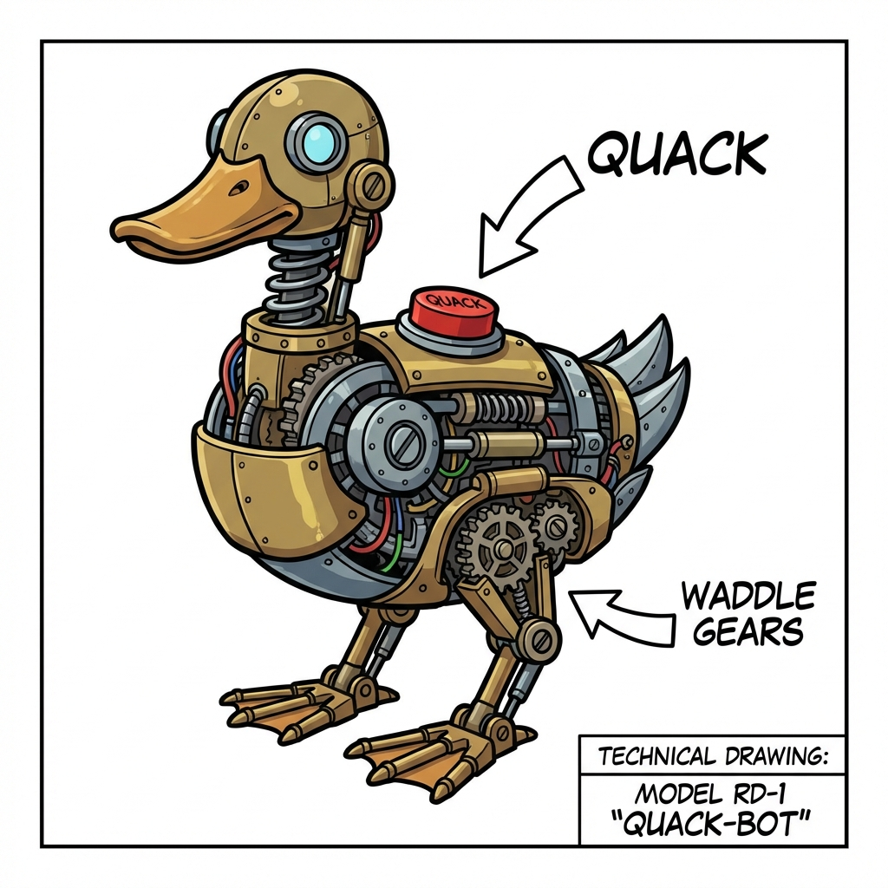

</div>
</div>

---

<div class="columns">
<div>

### Static vs. Dynamic Typing

- **Static (Java/C#):** You must declare "This function takes a `Vehicle`". The compiler ensures only children of `Vehicle` are passed.
- **Dynamic (Python):** You pass *anything*. Flexibility is higher, but you must ensure the object has the required methods.

```python
def start_trip(thing):
    thing.move() 
    # Works for Car, Boat, or even a 'GameCharacter' 
    # as long as it has .move()
```

</div>
<div>

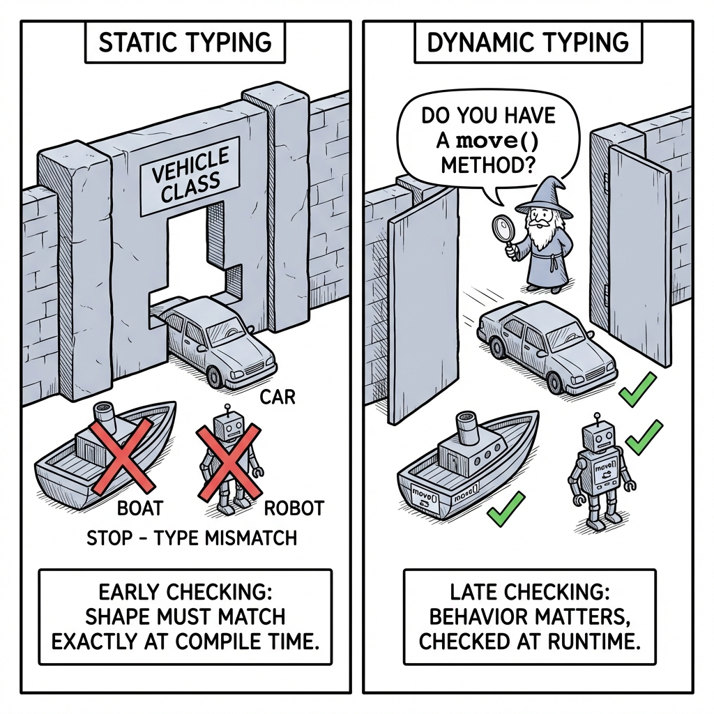

</div>
</div>

---

<div class="columns">
<div>

### Polymorphism in Functions

Functions become much more powerful when they can accept any object that satisfies an interface.

```python
def activate_device(device):
    print("Activating...")
    device.turn_on()
    print("Device is active.")

# Can be used with:
# - LightBulb
# - Motor
# - Heater
# - CoffeeMachine
```

This allows us to write generic code that works with objects we haven't even invented yet!

</div>
<div>

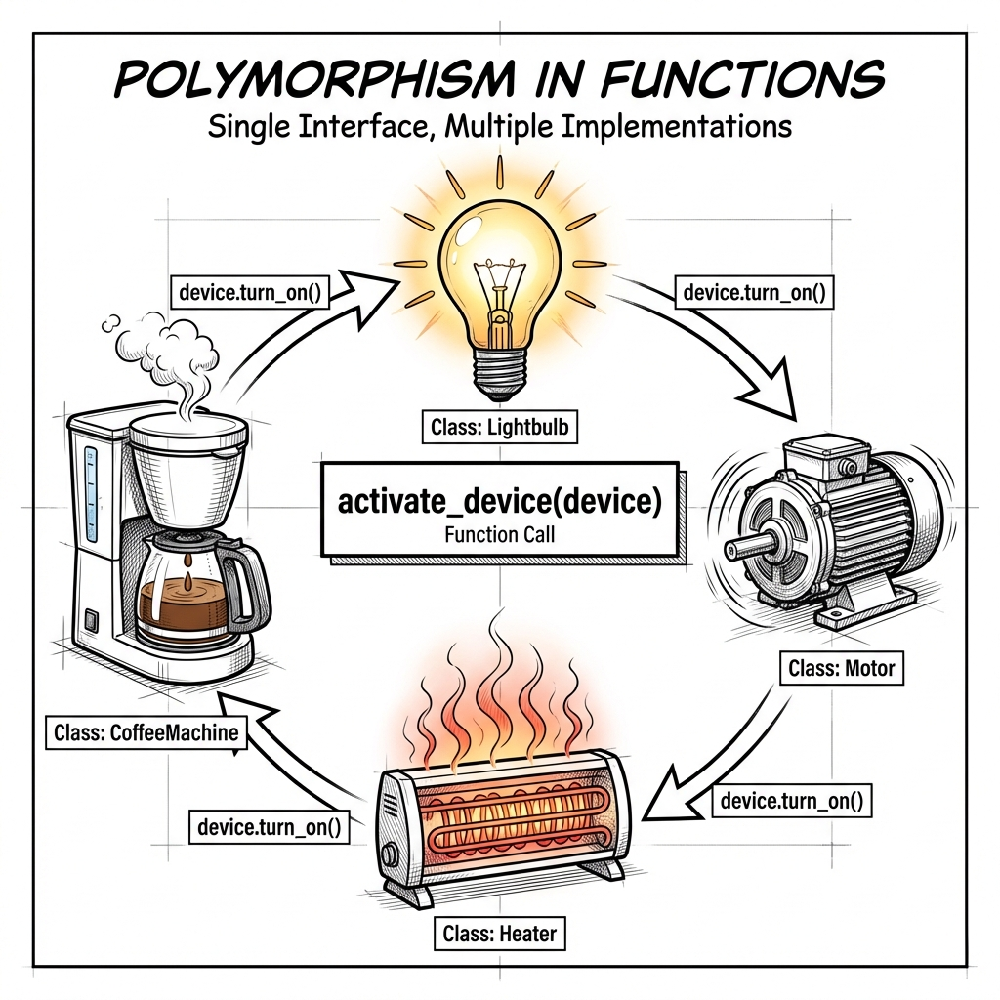

</div>
</div>

---

<div class="columns">
<div>

### Engineering Example: Simulation Loop

Imagine simulating a smart factory. Every machine has a `step()` function.

```python
class Conveyor:
    def step(self):
        print("Conveyor: Moving items...")

class RobotArm:
    def step(self):
        print("Arm: Welding...")

machines = [Conveyor(), RobotArm(), Conveyor()]

print("--- Step 1 ---")
for m in machines:
    m.step() 
```

</div>
<div>

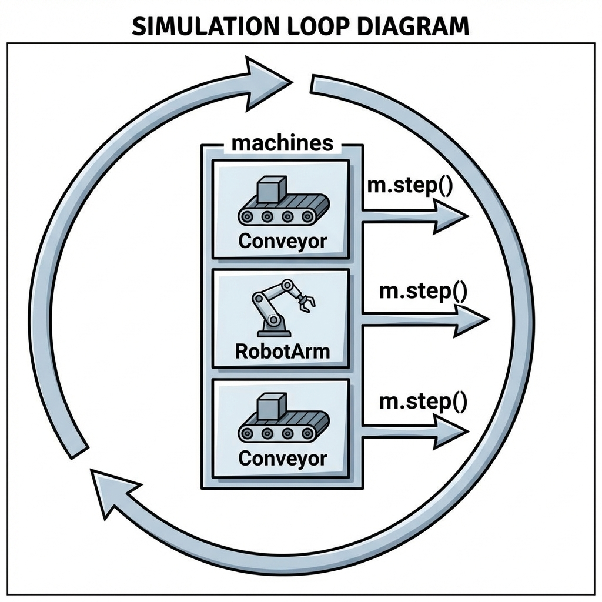

</div>
</div>

---

<div class="columns">
<div>

### The Open/Closed Principle

Polymorphism supports a key software design principle:

**Software entities should be open for extension, but closed for modification.**

- **Open for Extension:** We can add a new `Drone` class.
- **Closed for Modification:** We don't need to change the `simulation_loop` code.

</div>
<div>

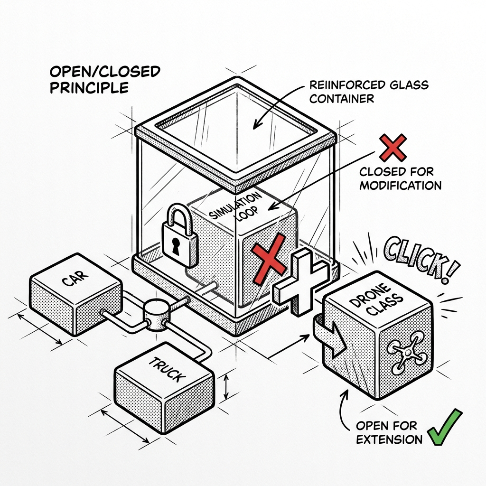

</div>
</div>

---

<!-- Illustration of a capsule or a safe, symbolizing protected contents. -->


## 7.3: Encapsulation

Protecting the inner workings.

- The "Black Box" Concept
- Public, Protected, Private
- Name Mangling
- Getters and Setters
- Python Properties (`@property`)

---

<div class="columns">
<div>

### The "Black Box" Concept

An object should be a **Black Box**.
- **Public:** Buttons and Screens (The Interface).
- **Private:** Wires, Chips, Gears (The Implementation).

**Why hide data?**
1.  **Safety:** Prevent invalid data (e.g., `speed = -100`).
2.  **Simplicity:** The user doesn't need to know how the engine works, just where the gas pedal is.
3.  **Flexibility:** You can change the internal code later without breaking other people's code.

</div>
<div>

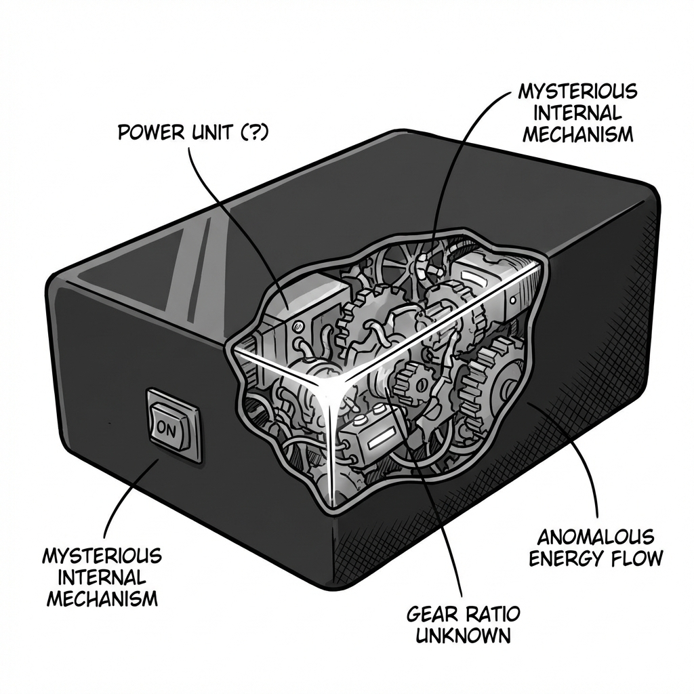

</div>
</div>

---

<div class="columns">
<div>

### Access Modifiers in Python

Unlike Java or C++, Python does not enforce strict privacy. It relies on **Naming Conventions**.

| Level | Syntax | Meaning |
| :--- | :--- | :--- |
| **Public** | `name` | Accessible |
| **Protected** | `_name` | "Internal use" |
| **Private** | `__name` | "Hard to access" |

</div>
<div>

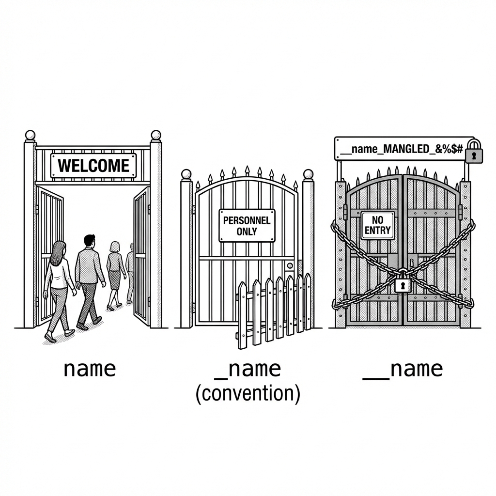

</div>
</div>

---

<div class="columns">
<div>

### Public vs Protected

```python
class Account:
    def __init__(self):
        self.balance = 100    # Public
        self._pin = 1234      # Protected

a = Account()

print(a.balance) # OK: 100

# This works, but VS Code will warn you,
# and other developers will frown at you.
print(a._pin)    # 1234 
```

**Rule:** If you see `_variable`, treat it as private. It's a "Keep Out" sign, not a locked door.

</div>
<div>


</div>
</div>

---

### Private Members

Double underscores (`__`) trigger **Name Mangling**. Python changes the variable name internally to make it harder to access.

```python
class Secret:
    def __init__(self):
        self.__code = "Top Secret"

s = Secret()

# print(s.__code) 
# AttributeError: 'Secret' object has no attribute '__code'
```

It's not truly secure (you can access it via `s._Secret__code`), but it prevents accidental access and namespace collisions.

---

<div class="columns">
<div>

### The Problem with Public Data

Why not just make everything public?

```python
class Person:
    def __init__(self, age):
        self.age = age

p = Person(25)
p.age = -5 # This makes no sense, but Python allows it!
```

We need a way to intercept the assignment and check if the value is valid.

</div>
<div>

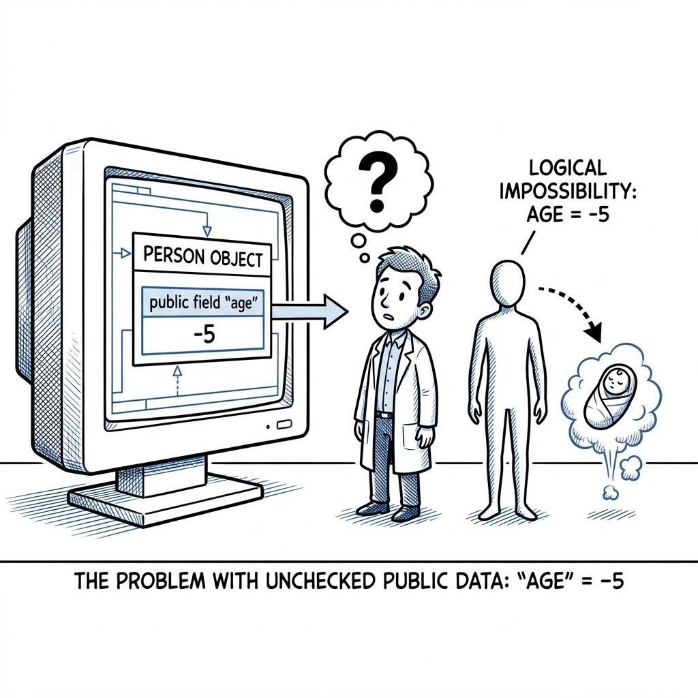

</div>
</div>

---

### Getters and Setters (Traditional)

In languages like Java/C++, you write methods to control access.

```python
class Person:
    def set_age(self, age):
        if age < 0:
            print("Error: Age cannot be negative.")
        else:
            self._age = age

    def get_age(self):
        return self._age
```

**Problem:** To read the age, you now have to type `p.get_age()` instead of `p.age`. This changes how you use the object.

---

### The Pythonic Way: `@property`

Python allows you to use methods as if they were attributes! You get the control of methods with the simplicity of variables.

```python
class Person:
    def __init__(self, age):
        self._age = age

    @property         # The Getter
    def age(self):
        return self._age

    @age.setter       # The Setter
    def age(self, value):
        if value < 0:
            raise ValueError("Age cannot be negative")
        self._age = value
```

---

<div class="columns">
<div>

### Using Properties

To the user, `age` looks like a normal variable. But underneath, it runs your methods!

```python
p = Person(30)

# Calls the setter (Validation logic runs!)
p.age = 40 
print("Set to 40")

# Calls the setter and crashes
# p.age = -5 
# ValueError: Age cannot be negative

# Calls the getter
print(p.age) # 40
```

</div>
<div>

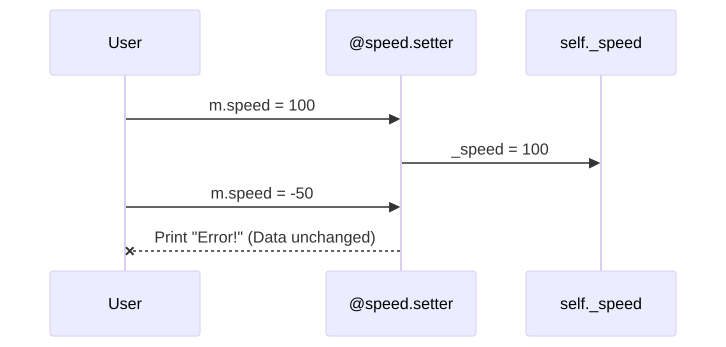

</div>
</div>

---

### Computed Properties

Properties are also great for values that are calculated on the fly, ensuring data consistency.

```python
class Rectangle:
    def __init__(self, width, height):
        self.width = width
        self.height = height

    @property
    def area(self):
        # We don't store 'area'. We calculate it.
        return self.width * self.height

r = Rectangle(5, 10)
print(r.area) # 50

r.width = 10
print(r.area) # 100 (Automatically updated!)
```

---

<!-- Illustration of a transparent blueprint or a ghost outline. -->


## 7.4: Abstract Classes

Blueprints for blueprints.

- The Concept of Abstraction
- The `abc` Module
- Abstract Methods
- Enforcing Interfaces
- The "Contract" Analogy

---

<div class="columns">
<div>

### The Concept of Abstraction

Sometimes, a Parent Class is so generic that it shouldn't exist as an object.

**Example: `Shape`**
- What is the area of a "Shape"? It depends.
- You can't calculate it until you know if it's a Circle or Square.
- `Shape` is an **Abstract Concept**.

We want to enforce that *every* child of `Shape` *must* implement an `area()` method.

</div>
<div>

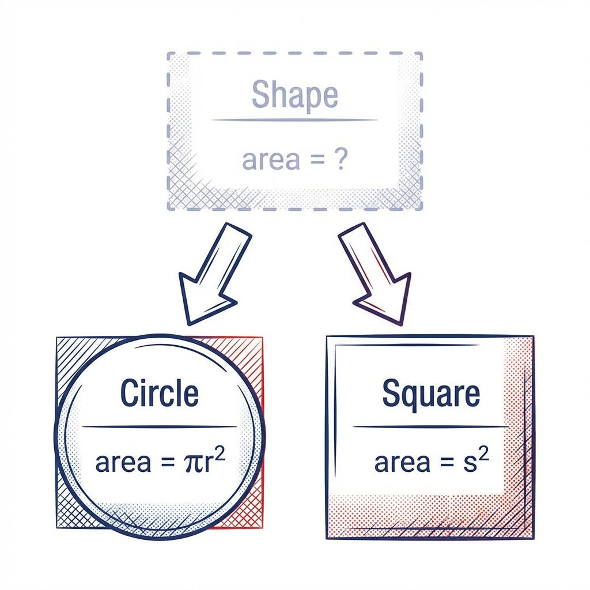

</div>
</div>

---

<div class="columns">
<div>

### The Contract Analogy

Think of an Abstract Class as a **Contract**.

- **The Contract:** "If you want to be a `Shape`, you MUST provide a way to calculate `area`."
- **The Signatories:** `Circle` and `Square` sign the contract by writing the code for `area`.
- **Enforcement:** If `Triangle` tries to be a `Shape` but forgets to write `area`, Python forbids it from being created.

</div>
<div>

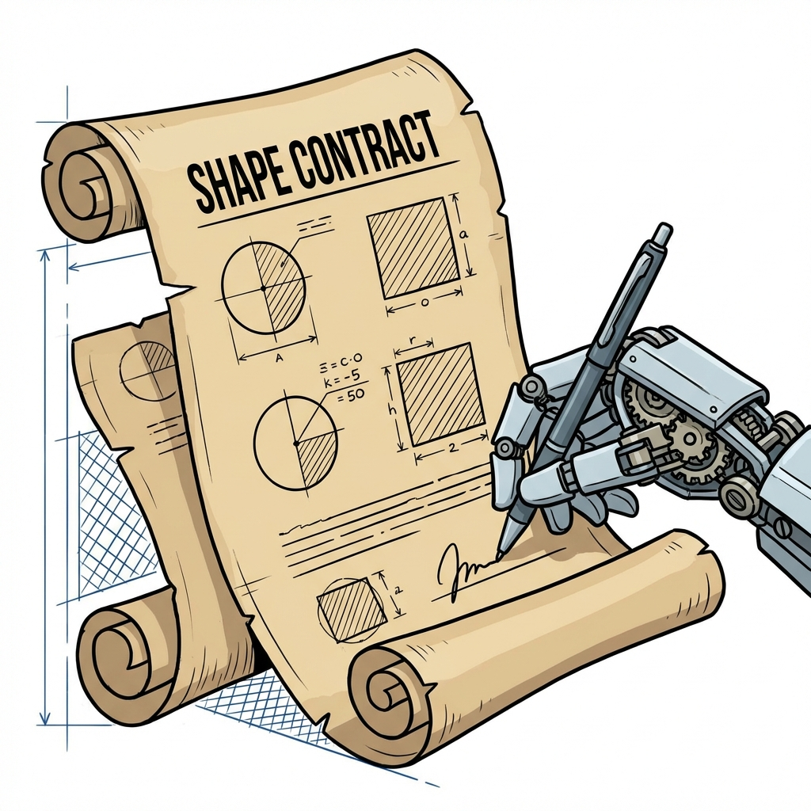

</div>
</div>

---

<div class="columns">
<div>

### Abstract Base Classes (ABCs)

Python provides the `abc` module to create Abstract Classes.

1.  Inherit from `ABC`.
2.  Use the `@abstractmethod` decorator.

```python
from abc import ABC, abstractmethod

class Shape(ABC):
    
    @abstractmethod
    def area(self):
        pass 
        # No implementation. Just a rule.
```

</div>
<div>

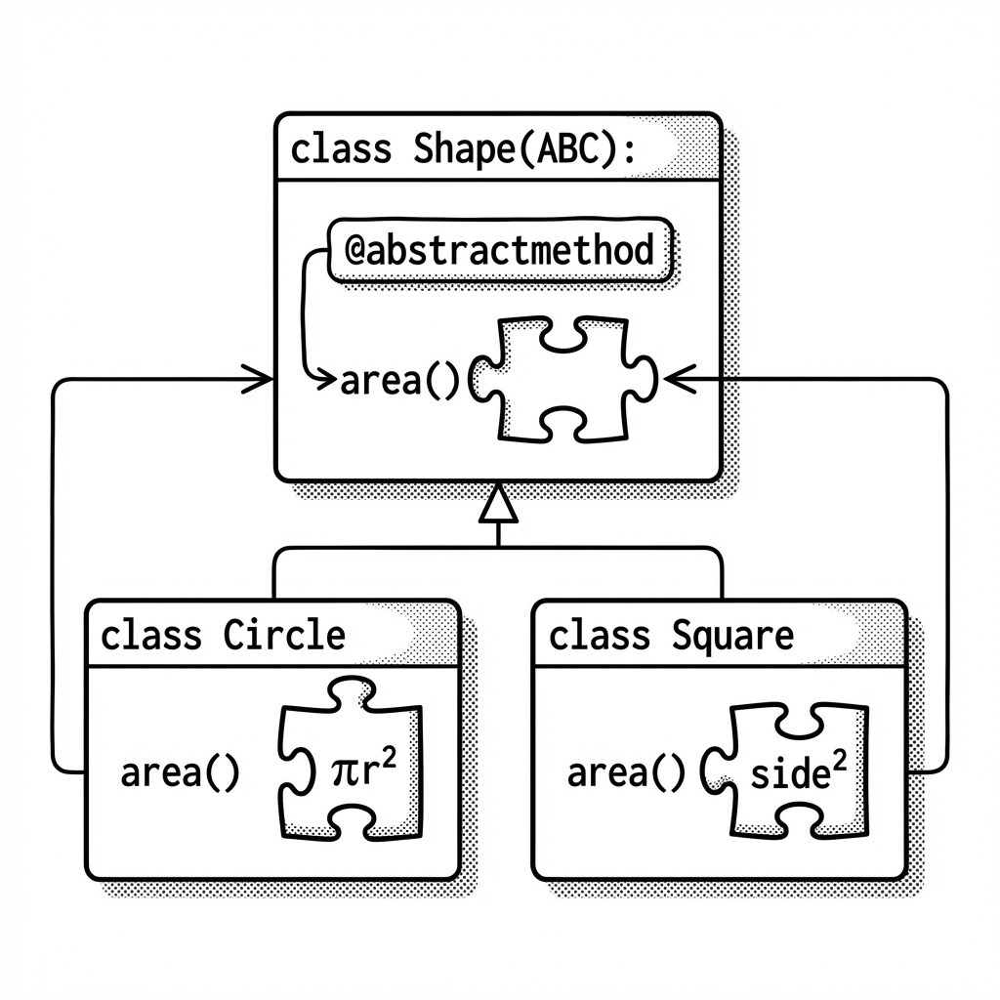

</div>
</div>

---

<div class="columns">
<div>

### Enforcing Rules

```python
# 1. You cannot instantiate the Abstract Class
# s = Shape() 
# TypeError: Can't instantiate abstract class...

# 2. Child classes MUST implement abstract methods
class Square(Shape):
    def __init__(self, side):
        self.side = side
        
    # If we forget to define area(), this class 
    # will ALSO be abstract and cannot be instantiated.
    def area(self):
        return self.side * self.side

sq = Square(5) # This works!
```

</div>
<div>

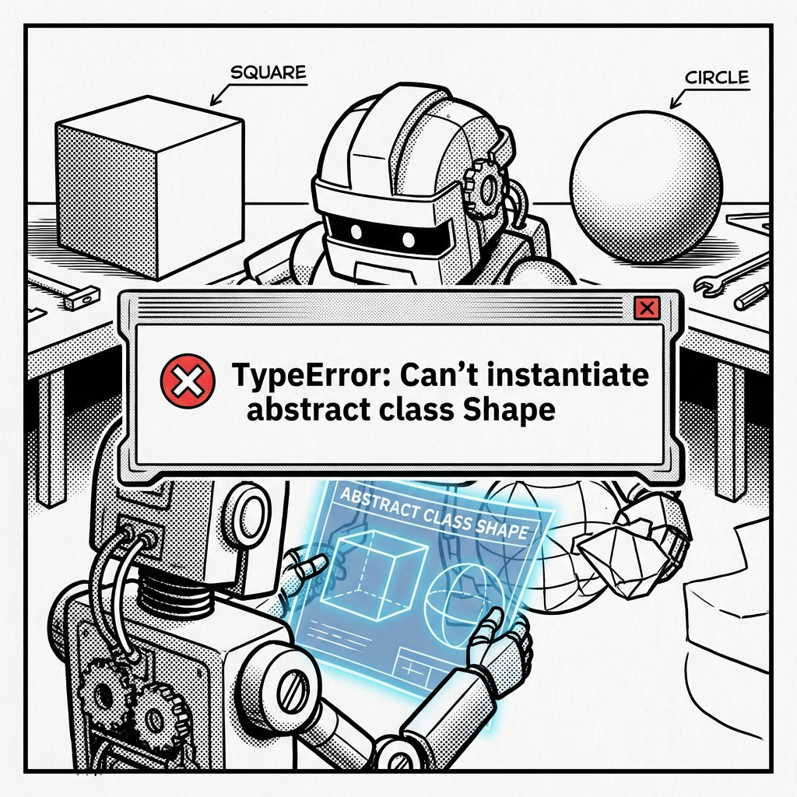

</div>
</div>

---

### Why use Abstract Classes?

1.  **Guarantees:** You know for sure that any `Shape` object has an `area()` method.
2.  **Design:** It forces you to think about the "Interface" of your system before writing details.
3.  **Teamwork:** One person defines the Interface (`PLCDriver`), others implement specific versions (`SiemensDriver`, `AllenBradleyDriver`).

---

<div class="columns">
<div>

### Engineering Example: Universal Driver

Imagine writing a control system that talks to different PLCs.

```python
class PLCDriver(ABC):
    @abstractmethod
    def connect(self, ip): pass
    @abstractmethod
    def read_register(self, addr): pass

class SiemensDriver(PLCDriver):
    def connect(self, ip):
        print(f"Connecting to S7 at {ip}")
    def read_register(self, addr):
        return 0 # Real logic here

def startup(driver: PLCDriver):
    # We are 100% sure 'driver' has .connect()
    driver.connect("192.168.0.1")
```

</div>
<div>

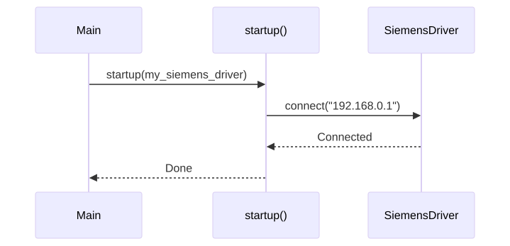



</div>
</div>

---

<!-- Illustration of Lego blocks snapping together (composition) vs a family tree (inheritance). -->


## 7.5: Composition vs. Inheritance

The two pillars of OOP design.

- "Is-a" vs. "Has-a"
- When to use Inheritance
- When to use Composition
- Why Composition is often better

---

<div class="columns">
<div>

### The Two Relationships

1.  **Inheritance ("Is-a"):**
    - A `Car` **is a** `Vehicle`.
    - A `Dog` **is an** `Animal`.
    - Relationship is permanent and rigid.

2.  **Composition ("Has-a"):**
    - A `Car` **has an** `Engine`.
    - A `Computer` **has a** `Monitor`.
    - Relationship is flexible and modular.

</div>
<div>

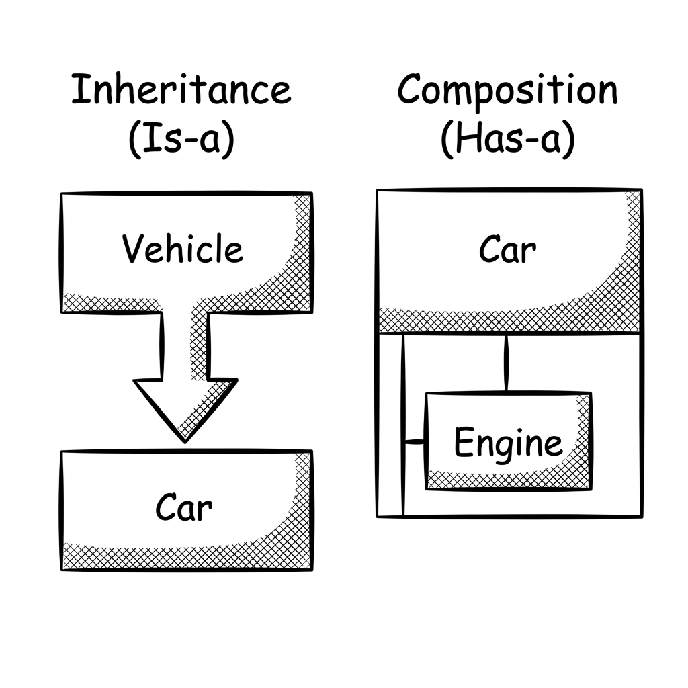

</div>
</div>

---

<div class="columns">
<div>

### The Trap of Inheritance

Newcomers often over-use inheritance.

**Bad Example:**
`class Car(Engine): ...`

- Is a Car an Engine? No.
- If you inherit, the Car gets `spark_plugs` mixed into its own attributes. It's messy.

</div>
<div>

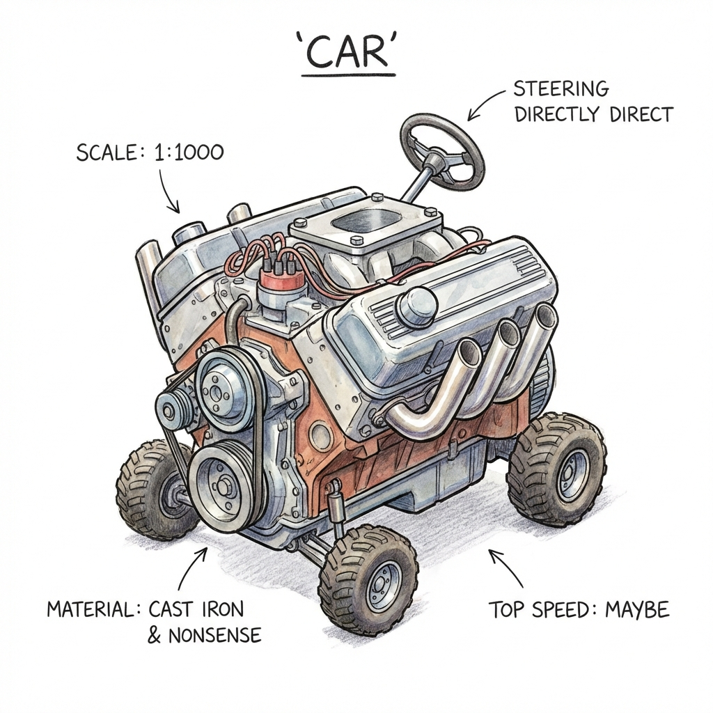

</div>
</div>

---

<div class="columns">
<div>

### Using Composition

Instead of inheriting, we store the object as an attribute.

```python
class Engine:
    def start(self):
        print("Vroom!")

class Car:
    def __init__(self):
        # The Car HAS AN Engine
        self.engine = Engine()
    
    def drive(self):
        self.engine.start()
        print("Car moving")
```

This is **Composition**. The `Car` is composed of an `Engine`.

</div>
<div>

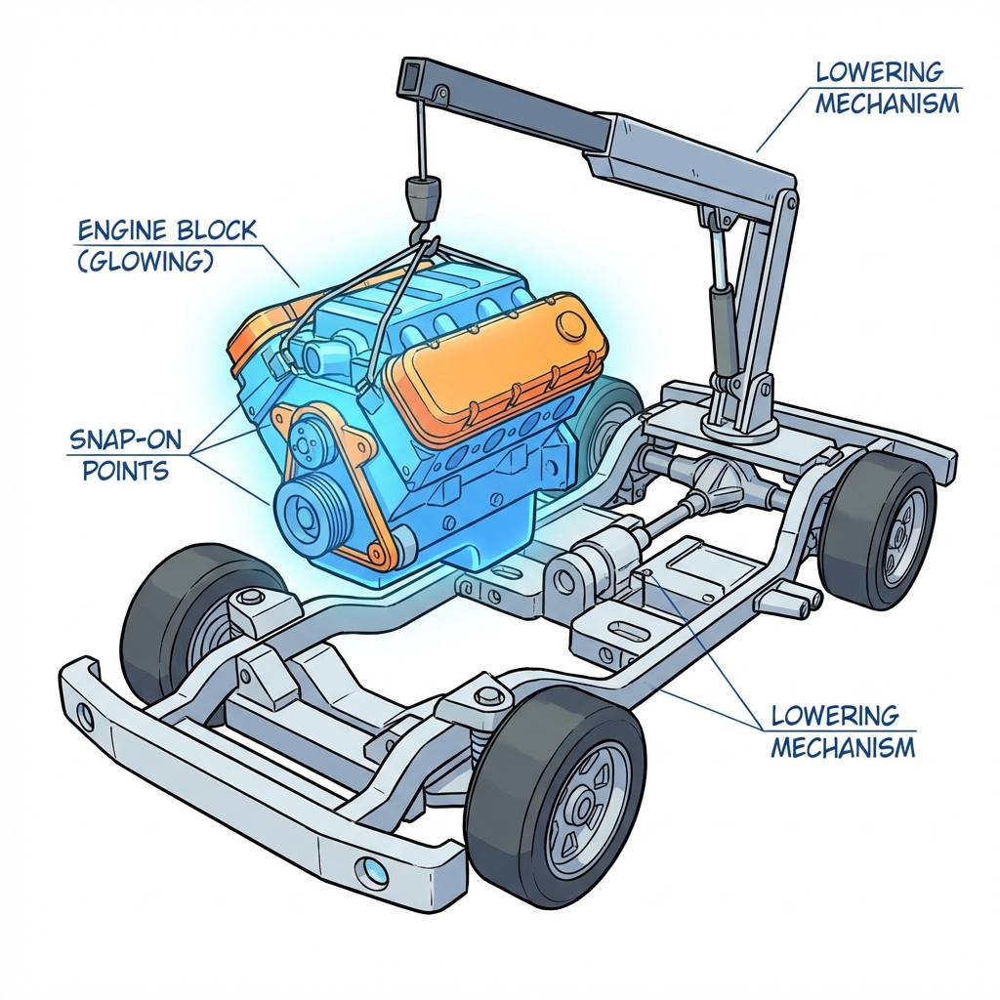

</div>
</div>

---

<div class="columns">
<div class="three">

### Flexibility of Composition

With composition, we can swap parts easily.

```python
class ElectricEngine:
    def start(self):
        print("Hummmm...")

class Car:
    def __init__(self, engine_type):
        self.engine = engine_type
```

Now we can build a Gas Car or an Electric Car without changing the `Car` class!

`c = Car(ElectricEngine())`

</div>
<div>



</div>
</div>

---

### Rule of Thumb

- Use **Inheritance** only when the child is a proper subtype of the parent and you want to reuse the parent's code *exactly* as is or slightly modified.
- Use **Composition** when you want to use another class's features but aren't that "thing".

> **"Favor Composition over Inheritance."**
> *(Design Patterns, Gang of Four)*

---

# Chapter 7: Summary

- **Inheritance (`class Child(Parent)`)**: "Is-a" relationship. Code reuse.
- **Polymorphism**: Treating different objects as the same type. "Duck Typing".
- **Encapsulation**: "Black Box". Protect data. Use `@property` for getters/setters.
- **Abstract Classes (`ABC`)**: Define contracts. Enforce implementation of methods.
- **Composition**: "Has-a" relationship. Flexible building blocks. Often better than inheritance.

---

### Final Exercises

1.  **Inheritance:** Create `Employee`, `Manager`, `Developer`. `Manager` has a `team_size`. `Developer` has `programming_languages`.
2.  **Polymorphism:** Create a list of employees. Loop through and call `work()`. Manager prints "Managing...", Dev prints "Coding...".
3.  **Encapsulation:** Make `salary` private. Add a property to read it, but only allow setting it if the new value is higher (raise).
4.  **Composition:** Create a `Team` class that **has a** list of `Employee` objects. Add methods to `add_member()` and `show_team()`.