<!-- Abstract illustration of glowing geometric data nodes, intricate algorithmic paths, and recursive fractals floating in a vast, dark galaxy. The image is in a square format and contains no text. -->


# Chapter 8: Advanced Data Structures & Algorithms

This chapter includes the following sections:

- 8.1: Stacks and Queues
- 8.2: Linked Lists
- 8.3: Recursion
- 8.4: Basic Sorting Algorithms

---

<!-- Abstract illustration of glowing data blocks stacking vertically into a pillar of light and a stream of particles flowing through a cosmic tunnel, representing Stacks and Queues. Set against a deep, dark galaxy background. The image is in a square format and contains no text. -->


## 8.1: Stacks and Queues

This section includes the following content:

- The Stack Data Structure (LIFO)
- Analogy: The Stack of Plates
- Core Operations: Push, Pop, Peek
- Implementing a Stack with Python Lists
- Real-world Application: Undo/Redo
- The Queue Data Structure (FIFO)
- Analogy: The Checkout Line
- Core Operations: Enqueue, Dequeue
- Performance: Lists vs. Deque
- Real-world Application: Task Scheduling

---

<div class="columns">
<div class="two">

### What is a Stack?

A **Stack** is a linear data structure that follows a particular order in which operations are performed.

- **LIFO Principle:** Last-In, First-Out.
- The last element added to the stack is the first one to be removed.
- Think of it as a **vertical container** where you can only interact with the top.

</div>
<div class="two">

<!-- A technical-style drawing of a vertical glass container representing a stack. Colorful data blocks are stacked vertically. The topmost block is clearly labeled 'Last In / First Out'. An arrow points to the top block showing it being removed. Cartoon-like shading, white background, square format. -->

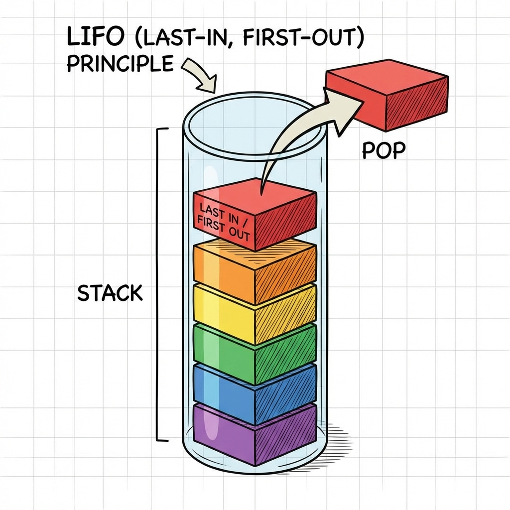

</div>
</div>

---

<div class="columns">
<div class="two">

### Analogy: The Stack of Plates

Imagine a stack of plates in a cafeteria:

- You place a new plate **on top** of the others.
- You take the **top plate** to use it.
- You cannot take a plate from the middle without removing all plates above it first.

In programming, this "top" is the only point of entry and exit for data.

</div>
<div class="two">

<!-- A detailed drawing of a stack of clean plates. Arrows indicate "Push" (adding a plate to the top) and "Pop" (removing the top plate). The plates at the bottom are labeled "Older" and the ones at the top "Newer". -->

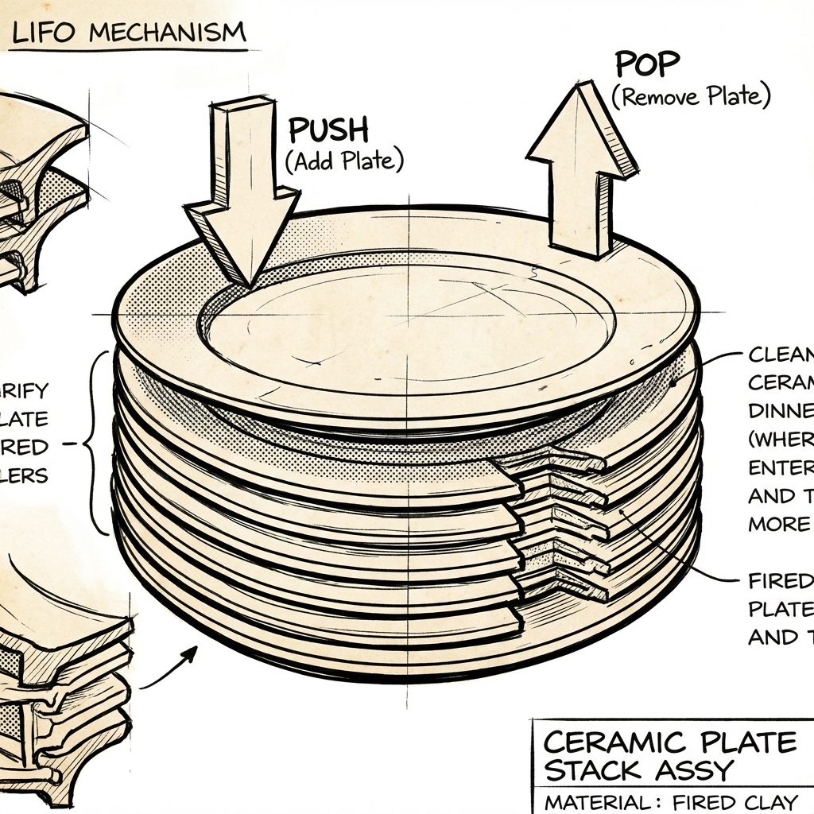

</div>
</div>

---

<div class="columns">
<div class="two">

### Stack Operations: Push

**Push** adds an element to the **top** of the stack.

- If the stack has a limited size and is full, this results in a **Stack Overflow**.
- In Python lists, we use the `.append()` method to push an item.

</div>
<div class="two">

<!-- Mermaid diagram showing a stack with 3 elements, and a 4th element being added to the top with an arrow labeled "Push". (Mermaid.js) -->



</div>
</div>

---

<div class="columns">
<div class="two">

### Stack Operations: Pop

**Pop** removes the element from the **top** of the stack.

- If the stack is empty and you try to pop, it results in a **Stack Underflow**.
- In Python lists, we use the `.pop()` method (without arguments) to remove and return the last item.

</div>
<div class="two">

<!-- Mermaid diagram showing a stack where the top element is being removed by an arrow pointing away, labeled "Pop". (Mermaid.js) -->



</div>
</div>

---

<div class="columns">
<div class="two">

### Stack Operations: Peek and Size

- **Peek (or Top):** Returns the value of the top element without removing it. In Python: `my_stack[-1]`.
- **is_empty:** Checks if the stack has no elements. In Python: `len(my_stack) == 0`.
- **Size:** Returns the number of elements currently in the stack. In Python: `len(my_stack)`.

</div>
<div class="two">

```python
stack = [10, 20, 30]

# Peek: Look at the top
top_element = stack[-1] 
print(f"Top: {top_element}") # 30

# Size: How many items?
print(f"Size: {len(stack)}") # 3

# Check if empty
is_empty = len(stack) == 0
print(f"Empty: {is_empty}") # False
```

</div>
</div>

---

<div class="columns">
<div class="two">

### Implementing a Stack Class

While a list works, a class provides a cleaner interface and encapsulates the behavior.

</div>
<div class="two">

```python
class Stack:
    def __init__(self):
        self._items = []

    def push(self, item):
        self._items.append(item)

    def pop(self):
        if not self.is_empty():
            return self._items.pop()
        raise IndexError("Pop from empty stack")

    def peek(self):
        return self._items[-1]

    def is_empty(self):
        return len(self._items) == 0
```

</div>
</div>

---

<div class="columns">
<div>

### Application: Undo/Redo

Most modern software uses stacks to manage history:

1.  **Undo Stack:** Every action you take is **pushed** onto this stack.
2.  **Undo Action:** The top action is **popped** from the Undo stack and applied in reverse.
3.  **Redo Stack:** Popped actions can be **pushed** onto a Redo stack if the user wants to "undo the undo".

</div>
<div>

<!-- Tikz diagram showing two stacks: "Undo" and "Redo". An arrow shows an action moving from the top of the Undo stack to the top of the Redo stack during an "Undo" command. -->

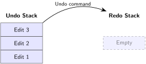

</div>
</div>

---

<div class="columns">
<div class="two">

### Stack Memory and the Call Stack

Recall the **Call Stack** from Session 5:

- When a function is called, a "Frame" is **pushed** onto the stack.
- When the function returns, its frame is **popped**.
- This is how Python keeps track of where to return after a function finishes.

</div>
<div class="two">

<!-- A simple, clear technical drawing of a vertical call stack with three rectangular frames. The bottom two frames are light blue, and the top frame is a distinct bright orange to indicate the active frame. Cartoon-like shading, white background, square format. -->

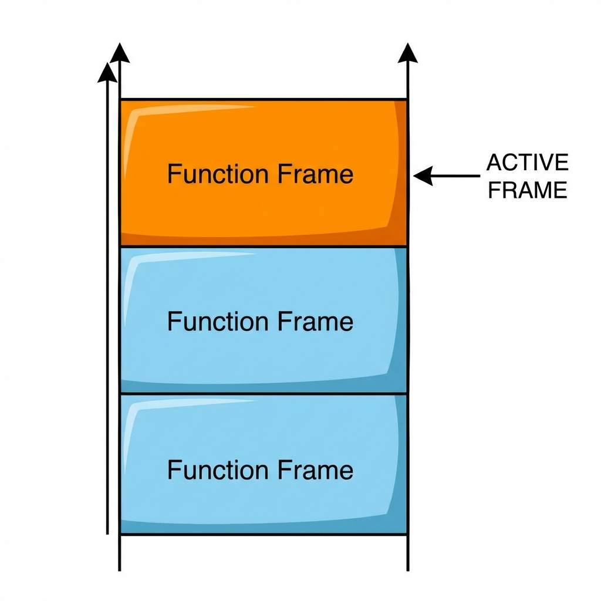

</div>
</div>

---

<div class="columns">
<div class="two">

### What is a Queue?

A **Queue** is a linear data structure that follows a specific order for adding and removing elements.

- **FIFO Principle:** First-In, First-Out.
- The first element added to the queue is the first one to be removed.
- Think of it as a **horizontal pipe** where items enter at one end and leave at the other.

</div>
<div class="two">

<!-- A fun technical drawing of a horizontal conveyor belt system. Geometric data blocks enter from the right and exit from the left in an orderly sequence. Cartoon-like shading, white background, square format. -->

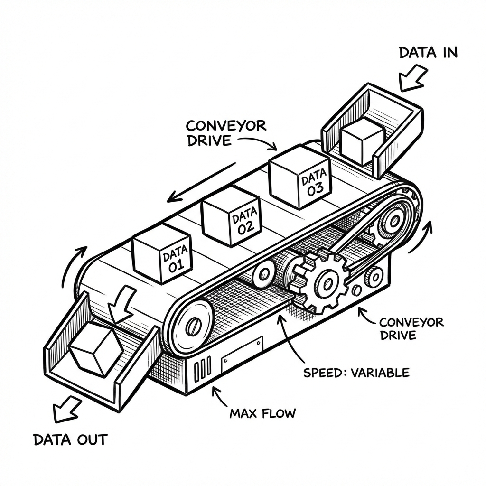

</div>
</div>

---

<div class="columns">
<div class="two">

### Analogy: The Checkout Line

Imagine a queue at a supermarket checkout:

- New customers join at the **end** (Rear).
- The customer at the **front** is served first and then leaves.
- This is the fairest way to handle requests in order of arrival.

In programming, this ensures that tasks are processed in the exact order they were received.

</div>
<div class="two">

<!-- A humorous technical illustration of a line of modular data units waiting at a "Data Processing" station. The unit at the front is currently being scanned. Cartoon-like shading, white background, square format. -->


</div>
</div>

---

<div class="columns">
<div class="two">

### Queue Operations: Enqueue

**Enqueue** adds an element to the **rear** (end) of the queue.

- In a Python list implementation, this is typically `list.append()`.
- This operation is **extremely fast** and takes the same amount of time regardless of how many items are in the queue.

</div>
<div class="two">

<!-- Mermaid diagram showing a queue with 3 elements. A 4th element is being added to the "Rear" with an arrow labeled "Enqueue". (Mermaid.js) -->



</div>
</div>

---

<div class="columns">
<div class="two">

### Queue Operations: Dequeue

**Dequeue** removes the element from the **front** (beginning) of the queue.

- In a Python list, this would be `list.pop(0)`.
- **Problem:** Removing the first element requires shifting all other elements one position to the left.
- This makes `pop(0)` **much slower** as the list grows larger.

</div>
<div class="two">

<!-- Mermaid diagram showing a queue where the "Front" element is being removed with an arrow labeled "Dequeue". (Mermaid.js) -->



</div>
</div>

---

<div class="columns">
<div class="two">

### Efficient Queues: `collections.deque`

To avoid the performance penalty of shifting elements, Python provides `deque` (double-ended queue).

- Optimized for fast additions and removals at **both** ends.
- Both `append()` and `popleft()` are **instant**, no matter the size of the queue.

</div>
<div class="two">

```python
from collections import deque

# Create a queue
queue = deque(["Alice", "Bob", "Charlie"])

# Enqueue: Add to the right
queue.append("David")

# Dequeue: Remove from the left
first = queue.popleft() 

print(f"Served: {first}") # Alice
print(f"Remaining: {list(queue)}")
# ['Bob', 'Charlie', 'David']
```

</div>
</div>

---

### Comparison: Stack vs. Queue

| Feature | **Stack** | **Queue** |
| :--- | :--- | :--- |
| **Principle** | LIFO (Last-In, First-Out) | FIFO (First-In, First-Out) |
| **Main Operations** | Push / Pop | Enqueue / Dequeue |
| **Efficiency** | Always fast | Depends on implementation |
| **Analogy** | Stack of plates | Wait line |
| **Common Use** | Undo, Call Stack, DFS | Printing, Task Scheduling, BFS |

---

### Exercise 1: Task Manager

**Scenario:** You need to manage a list of emergency repairs in a factory.

1.  Create a class `RepairStack` that implements a Stack using a list.
2.  The stack should store strings (e.g., "Fix Pump", "Repair Belt").
3.  Add a method `add_task(task)` and `get_next_task()`.
4.  If the stack is empty, `get_next_task()` should return "No pending repairs".

---

### Solution 1: Task Manager

```python
class RepairStack:
    def __init__(self):
        self.tasks = []

    def add_task(self, task):
        self.tasks.append(task)

    def get_next_task(self):
        if not self.tasks:
            return "No pending repairs"
        return self.tasks.pop()

# Test
manager = RepairStack()
manager.add_task("Fix Pump")
manager.add_task("Repair Belt")
print(manager.get_next_task()) # Repair Belt
```

---

### Exercise 2: Print Buffer

**Scenario:** You are simulating a shared network printer.

1.  Use `collections.deque` to implement a `PrinterQueue`.
2.  Add a method `submit_job(filename)` that adds a job to the queue.
3.  Add a method `process_next_job()` that removes the oldest job and prints "Printing: [filename]".
4.  Add a method `get_queue_length()` that returns the number of waiting jobs.
5.  Simulate adding 3 jobs and processing 1.

---

<!-- Abstract illustration of glowing nodes connected by luminous threads of light, forming an intricate, floating chain that meanders through a dark, star-filled galaxy. The image is in a square format and contains no text. -->


## 8.2: Linked Lists

This section includes the following content:

- Introduction to Linked Lists
- Nodes: Data and Pointers
- Memory Management: Contiguous vs. Linked
- Singly Linked Lists
- Core Operations: Traversal, Insertion, Deletion
- Linked Lists vs. Python Lists
- Advanced Types: Doubly and Circular Linked Lists
- Practical Applications

---

<div class="columns">
<div class="two">

### What is a Linked List?

A **Linked List** is a linear data structure where elements are not stored at contiguous memory locations.

- Instead, elements are linked using **pointers**.
- Each element is called a **Node**.
- A node contains:
    1.  The **Data**.
    2.  A **Pointer** (reference) to the next node.

</div>
<div class="two">

<!-- A technical-style drawing of a tethered chain of floating data modules. Each module has a visible glowing link pointing directly to the next one in sequence. Cartoon-like shading, white background, square format. -->

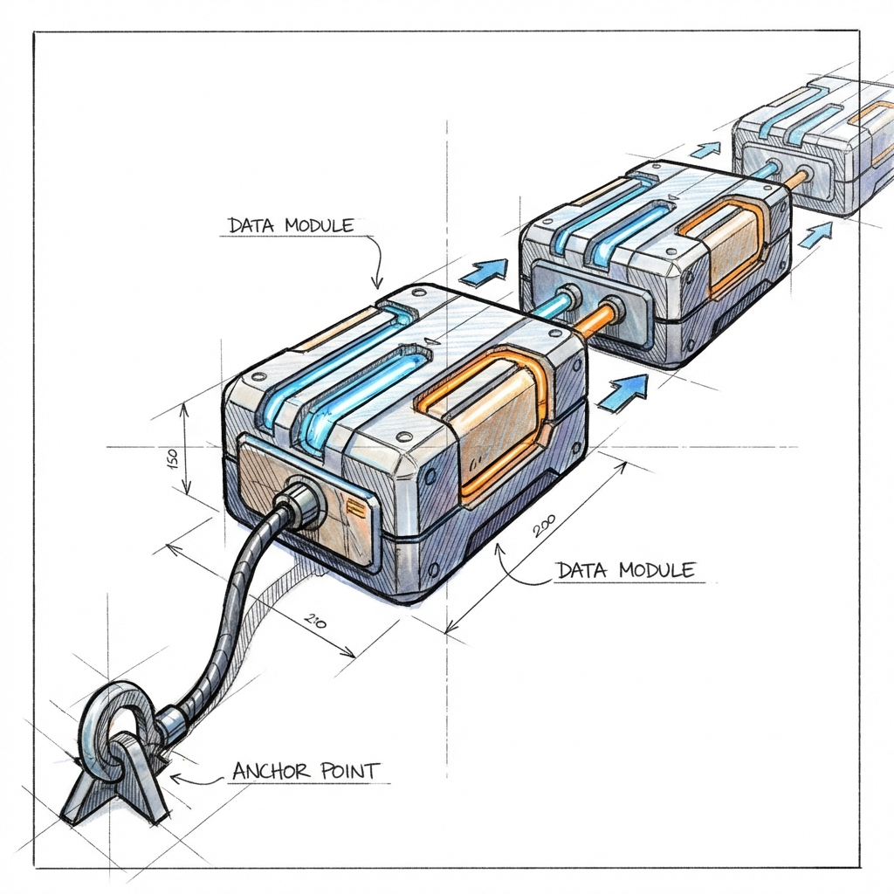

</div>
</div>

---

<div class="columns">
<div class="two">

### Arrays vs. Linked Lists in Memory

- **Arrays (Python Lists):** Elements are stored in one single, continuous block of memory. Access is fast, but resizing is expensive.
- **Linked Lists:** Elements are scattered across memory. Each node "knows" where the next one is. Resizing is easy, but access requires walking through the chain.

</div>
<div class="two">

<!-- Tikz diagram showing memory cells. Array: 4 contiguous cells highlighted. Linked List: 4 scattered cells with arrows jumping between them. -->

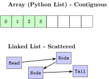

</div>
</div>

---

<div class="columns">
<div class="three">

### The Building Block: The Node

To build a Linked List, we first need to define what a single **Node** looks like.

- **Data:** Can be anything (int, string, object).
- **Next:** A reference to another `Node` object, or `None` if it's the last node.

</div>
<div>

<!-- Mermaid diagram showing a single box divided into two parts: "Data" and "Next". An arrow points from "Next" to a placeholder for another node. (Mermaid.js) -->



</div>
</div>

---

<div class="columns">
<div class="two">

### The `Node` Class

In Python, we use a simple class to represent a node.

</div>
<div class="two">

```python
class Node:
    def __init__(self, data):
        # The value stored in this node
        self.data = data
        # Pointer to the next node
        self.next = None

# Create nodes
n1 = Node(10)
n2 = Node(20)

# Link them!
n1.next = n2
```

</div>
</div>

---

<div class="columns">
<div class="two">

### The `LinkedList` Class

The `LinkedList` class manages the nodes. It only needs to keep track of the **Head** (the first node).

</div>
<div class="two">

```python
class LinkedList:
    def __init__(self):
        # The starting point
        self.head = None

# Usage:
llist = LinkedList()
llist.head = Node("First")
llist.head.next = Node("Second")
```

</div>
</div>

---

<div class="columns">
<div class="two">

### Traversing a Linked List

To access data, we must start at the **head** and follow the `next` pointers until we reach `None`. This is called **Traversal**.

- The time it takes is **proportional to the number of items**.
- Twice the items = twice the time.

</div>
<div class="two">

```python
def print_list(self):
    current = self.head
    while current:
        print(current.data, end=" -> ")
        current = current.next
    print("None")
```

</div>
</div>

---

<div class="columns">
<div class="three">

### Insertion at the Beginning

This is where Linked Lists shine!

1.  Create a new node.
2.  Set its `next` to the current `head`.
3.  Update the `head` to be the new node.

- **Efficiency:** This is **instant**. It takes the same time whether you have 10 items or 10 million.

</div>
<div>

<!-- Mermaid diagram showing a new node being inserted before the current head. (Mermaid.js) -->



</div>
</div>

---

<div class="columns">
<div class="five">

### Insertion at the End

To insert at the end, we must find the last node first.

1.  Traverse until `current.next` is `None`.
2.  Set `current.next` to the new node.

- **Efficiency:** Like traversal, this takes longer as the list grows.

</div>
<div>

<!-- Mermaid diagram showing a new node being appended to the last node of the list. (Mermaid.js) -->



</div>
</div>

---

<div class="columns">
<div class="two">

### Deleting a Node

To delete a node, we "skip" it by updating the pointer of the **previous** node.

1.  Find the node *before* the one you want to delete.
2.  Change its `next` to point to `to_delete.next`.

The deleted node is then cleaned up by Python's Garbage Collector.

</div>
<div>

<!-- Mermaid diagram showing three nodes. An arrow from Node 1 skips Node 2 and points directly to Node 3. Node 2 is shown in a faded color. (Mermaid.js) -->



</div>
</div>

---

### Linked Lists vs. Python Lists

| Operation | **Python List (Array)** | **Linked List** |
| :--- | :--- | :--- |
| **Access Index** | Instant (Direct) | Proportional to size |
| **Insert at Start** | Slow (requires shifting) | Instant (rerouting) |
| **Insert at End** | Fast (usually) | Proportional to size |
| **Delete at Start** | Slow (requires shifting) | Instant (rerouting) |
| **Memory** | Efficient (Pure data) | Higher (Data + Pointer) |

---

<div class="columns">
<div class="two">

### Doubly Linked Lists

Each node has **two** pointers:
1.  `next`: Points to the following node.
2.  `prev`: Points to the previous node.

- **Advantage:** Can be traversed in both directions.
- **Disadvantage:** Uses more memory and requires more complex pointer updates.

</div>
<div class="two">

<!-- Illustration of nodes with arrows pointing both forwards and backwards between them. -->

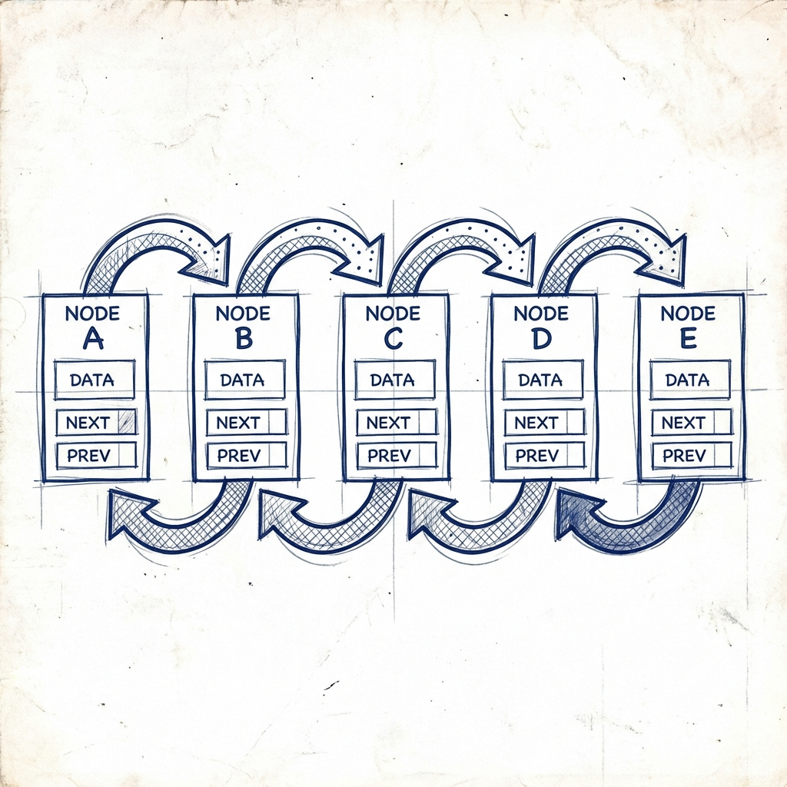

</div>
</div>

---

<div class="columns">
<div class="two">

### Circular Linked Lists

The last node's `next` pointer points back to the **head** instead of `None`.

- **Application:** Used in round-robin scheduling or representing a repeating loop (e.g., repeating a playlist).

</div>
<div class="two">

<!-- Illustration showing a chain of nodes where the last node has a curved arrow pointing back to the first node, forming a circle. -->

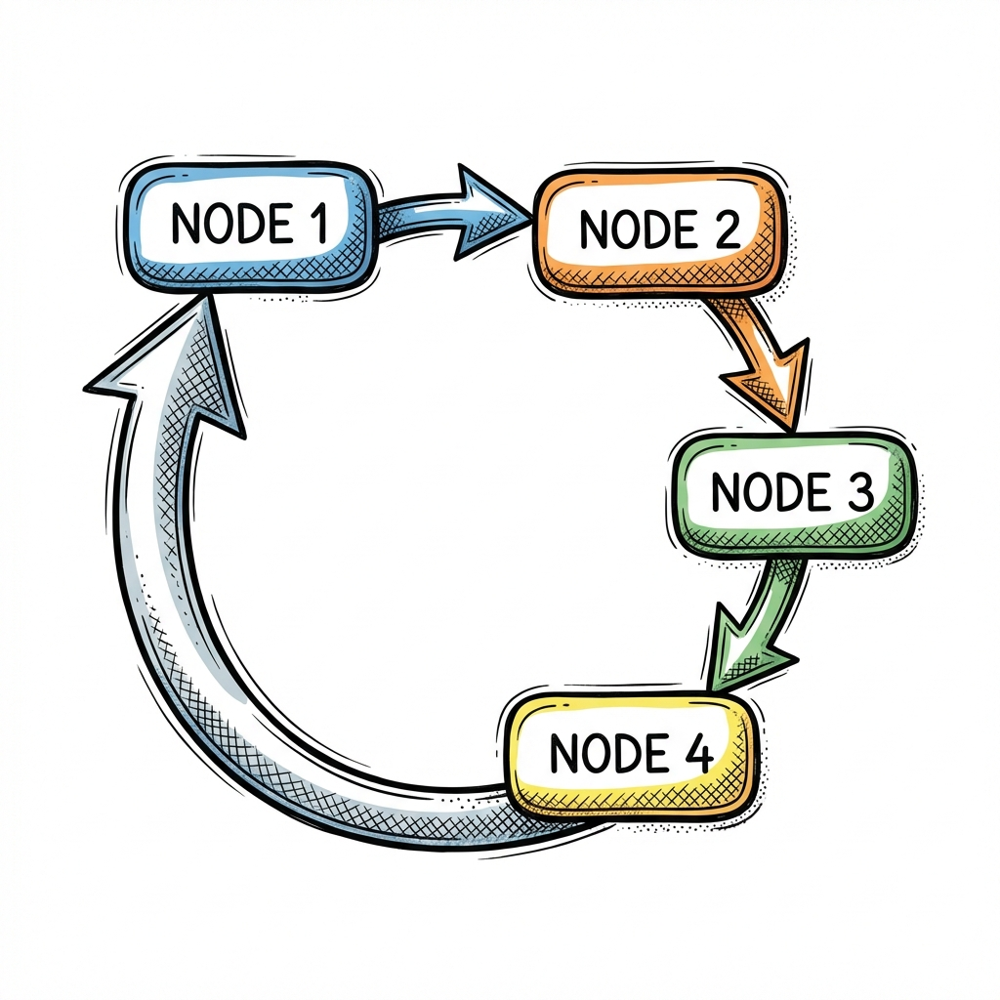

</div>
</div>

---

<div class="columns">
<div class="two">

### Application: Browser Navigation

Your browser's "Back" and "Forward" buttons can be modeled with a **Doubly Linked List**.

- Each webpage visited is a node.
- "Back" moves to the `prev` node.
- "Forward" moves to the `next` node.

</div>
<div class="two">

<!-- A fun illustration of a simplified web browser interface. Below the browser window, a chain of circular nodes represents a navigation history path. Technical drawing style, cartoon-like shading, white background, square format. -->

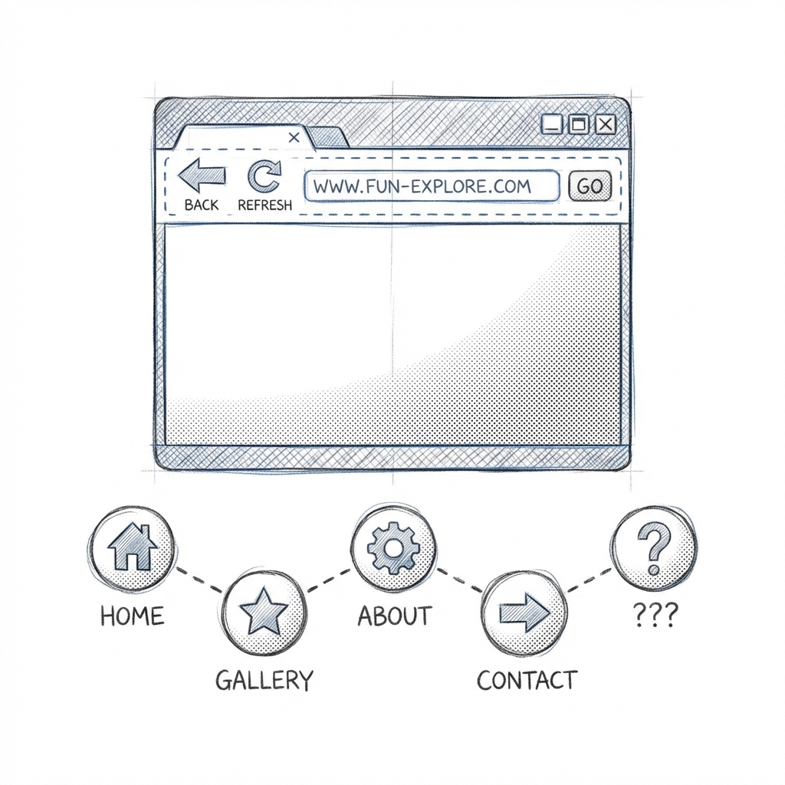

</div>
</div>

---

### Summary of Efficiency

| Operation | Best Case | Average / Worst Case |
| :--- | :--- | :--- |
| **Search** | Instant (at Head) | Proportional to list length |
| **Insertion** | Instant (at Head) | Proportional to list length |
| **Deletion** | Instant (at Head) | Proportional to list length |

*Note: Linked Lists are only efficient for insertions/deletions if you already have a pointer to the location.*

---

### Exercise 1: Linked List Length

**Task:** Add a method `length()` to the `LinkedList` class.

- It should traverse the list and count how many nodes it contains.
- Return the final count.
- If the list is empty (`head is None`), it should return 0.

---

### Solution 1: Linked List Length

```python
def length(self):
    count = 0
    current = self.head
    while current:
        count += 1
        current = current.next
    return count
```

---

### Exercise 2: Searching for Data

**Task:** Add a method `contains(value)` to the `LinkedList` class.

- It should traverse the list.
- If it finds a node where `node.data == value`, it returns `True`.
- If it reaches the end of the list without finding the value, it returns `False`.

---

<!-- Abstract illustration of a complex, self-similar fractal pattern with infinite depth, glowing brilliantly against the backdrop of a swirling, dark galaxy. The image is in a square format and contains no text. -->


## 8.3: Recursion

This section includes the following content:

- What is Recursion?
- The Concept of Self-Reference
- The Base Case and Recursive Step
- Visualizing Recursion with the Call Stack
- Example: Factorial
- Example: Fibonacci Sequence
- Recursion vs. Iteration
- Practical Applications (Fractals, Directory Trees)

---

<div class="columns">
<div class="two">

### What is Recursion?

**Recursion** is a method of solving a problem where the solution depends on solutions to smaller instances of the same problem.

- In programming, it occurs when a **function calls itself**.
- It is a powerful tool for tasks that have a naturally repeating, nested structure.

</div>
<div class="two">

<!-- A technical illustration of a glowing geometric structure consisting of nested data cubes within data cubes, showing self-similarity. Clean lines, fun cartoon-like shading, white background, square format. -->

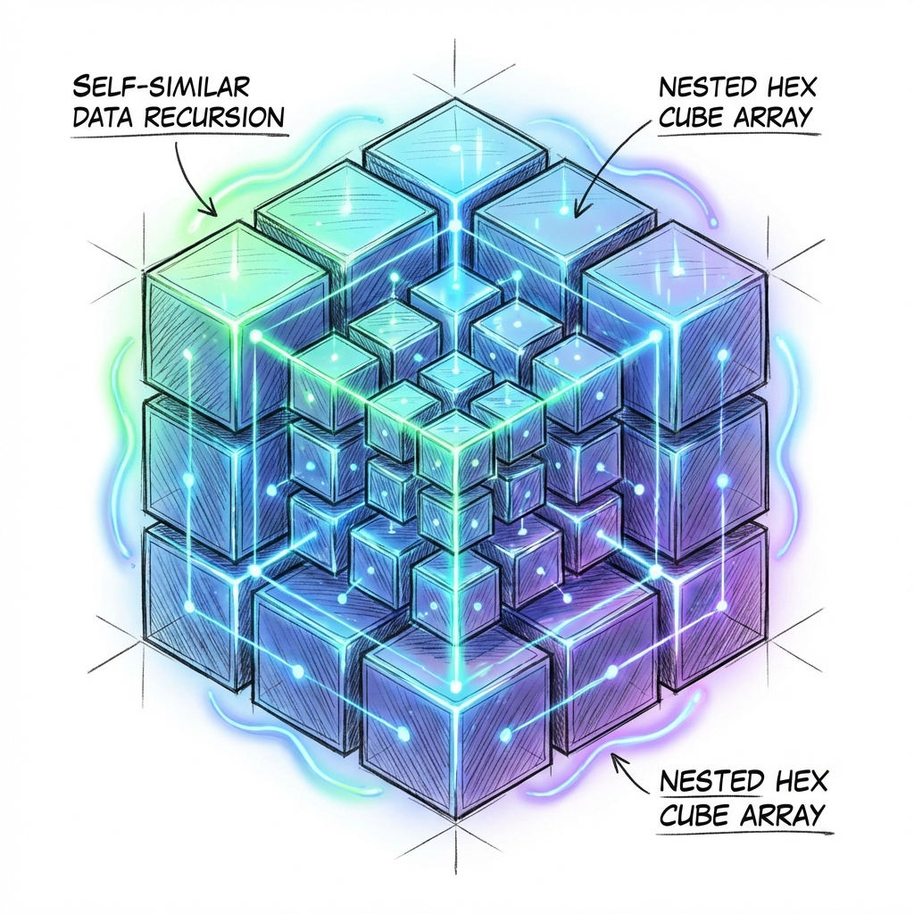

</div>
</div>

---

<div class="columns">
<div class="two">

### Analogy: Matryoshka Dolls

Think of a Russian Matryoshka doll:

- To get to the smallest doll, you must open the current doll.
- Inside, you find a **smaller version** of the same doll.
- You keep repeating this process until you reach the **base doll** that cannot be opened.

This is exactly how recursion works: breaking a task into a smaller version of itself until it becomes trivial.

</div>
<div class="two">

<!-- Illustration of a set of nested Russian dolls (Matryoshka). The largest one is labeled "Original Problem" and the smallest, solid one is labeled "Base Case". -->

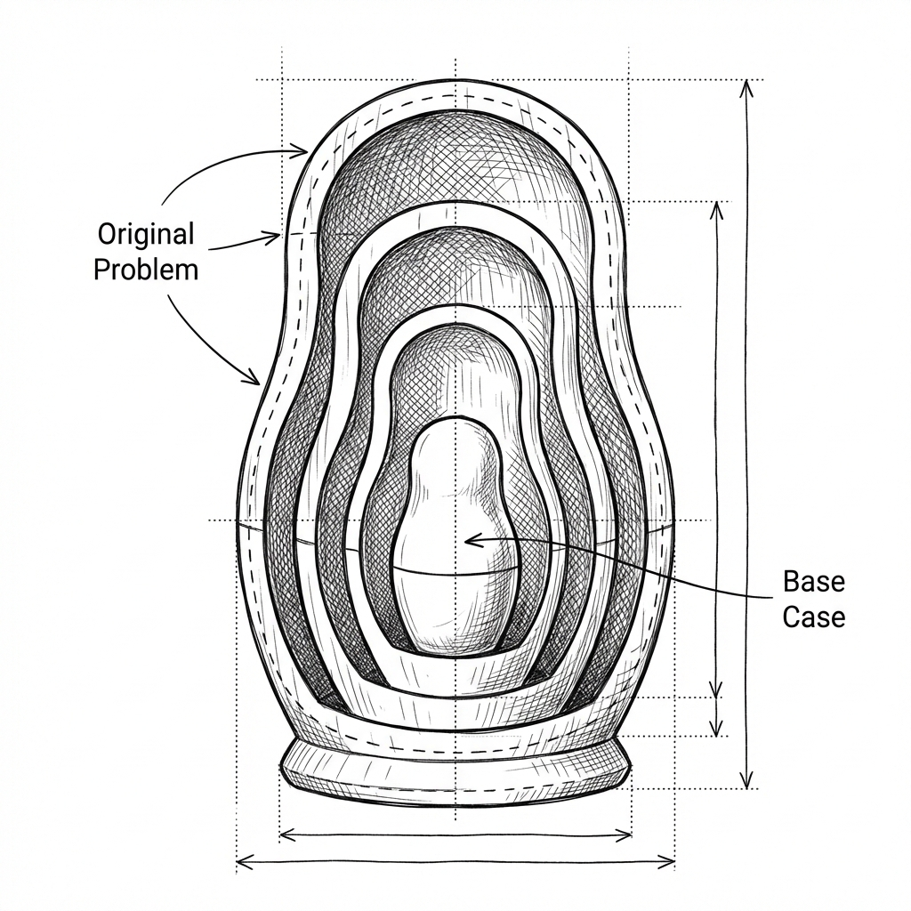

</div>
</div>

---

### The Two Golden Rules

For a recursive function to work (and not run forever), it **must** have two parts:

1.  **The Base Case:** A simple condition where the function returns a value **without** calling itself. This is the "stop" signal.
2.  **The Recursive Step:** The part where the function calls itself, but with a **simpler or smaller** input that moves it closer to the base case.

---

<div class="columns">
<div class="two">

### The Base Case: The Stop Signal

Without a base case, the function will call itself infinitely, leading to a **Stack Overflow**.

- It handles the simplest possible input.
- Example: For a factorial function, the base case is $0! = 1$.

</div>
<div class="two">

```python
def countdown(n):
    # BASE CASE
    if n <= 0:
        print("Blast off!")
        return
    
    # ... recursive part ...
```

</div>
</div>

---

<div class="columns">
<div class="two">

### The Recursive Step: Moving Forward

The recursive step must ensure that each call brings the problem closer to the base case.

- It "delegates" part of the work to a new call of the same function.

</div>
<div class="two">

```python
def countdown(n):
    if n <= 0:
        print("Blast off!")
        return
    
    # RECURSIVE STEP
    print(n)
    countdown(n - 1) # Smaller n!
```

</div>
</div>

---

<div class="columns">
<div class="six">

### Example: Factorial ($n!$)

The product of all positive integers up to $n$.

**Mathematical definition:**
$$n! = n \times (n-1)!$$
$$0! = 1 \text{ (Base Case)}$$

**Recursive logic for 3!:**
$3! = 3 \times 2!$
$2! = 2 \times 1!$
$1! = 1 \times 0!$
$0! = 1$

</div>
<div class="four">

```python
def factorial(n):
    # Base Case
    if n == 0:
        return 1
    
    # Recursive Step
    return n * factorial(n - 1)

print(factorial(3)) # 6
```

</div>
</div>

---

<div class="columns">
<div class="two">

### Visualizing the Call Stack

Each recursive call creates a new **Stack Frame**. These frames "wait" for the ones above them to return a value.

1.  `factorial(3)` calls `factorial(2)`
2.  `factorial(2)` calls `factorial(1)`
3.  `factorial(1)` calls `factorial(0)`
4.  `factorial(0)` returns `1`
5.  Values start "bubbling up" back to the original caller.

</div>
<div class="two">

<!-- Tikz diagram showing a stack growing upwards as calls are made (Push), and then shrinking downwards as values are returned (Pop). Arrows show the flow of data. -->

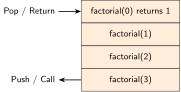

</div>
</div>

---

<div class="columns">
<div class="two">

### The Cost of Recursion

Every recursive call uses memory on the **Call Stack**.

- **Pros:** Often produces cleaner, more mathematical code. Great for hierarchical data.
- **Cons:** High memory usage. Can be slower than loops.
- **Memory Growth:** The memory used increases with the **depth of recursion** (how many times the function calls itself).

</div>
<div class="two">

<!-- A humorous technical drawing of a skyscraper-tall, wobbly stack of digital system logs and function call folders, leaning precariously. Cartoon-like shading, white background, square format. -->

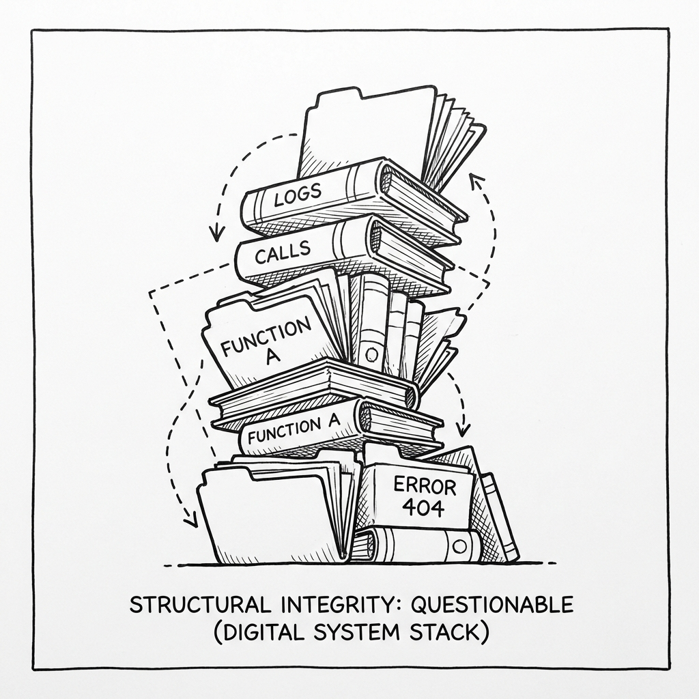

</div>
</div>

---

<div class="columns">
<div class="four">

### Example: Fibonacci Sequence

Each number is the sum of the two preceding ones.
$0, 1, 1, 2, 3, 5, 8, 13, \dots$

**Definition:**
$$F(n) = F(n-1) + F(n-2)$$
$$F(0) = 0, F(1) = 1 \text{ (Base Cases)}$$

Note: This function calls itself **twice** in the recursive step!

</div>
<div class="four">

```python
def fib(n):
    # Base Cases
    if n == 0: return 0
    if n == 1: return 1
    
    # Recursive Step
    return fib(n-1) + fib(n-2)
```

</div>
</div>

---

<div class="columns">
<div class="two">

### The Recursion Tree

Calling `fib(4)` creates a tree of calls.

- Notice how many times `fib(2)` is calculated!
- This is why simple recursion for Fibonacci is **extremely slow** for larger numbers.
- The amount of work **doubles or triples** with each step.

</div>
<div class="two">

<!-- Mermaid diagram showing the tree of calls for fib(4). (Mermaid.js) -->



</div>
</div>

---

### Recursion vs. Iteration

| Feature | **Recursion** | **Iteration (Loops)** |
| :--- | :--- | :--- |
| **Logic** | Self-calling function | Repetitive block (for/while) |
| **State** | Managed by Stack Frames | Managed by variables |
| **Speed** | Slower (Call overhead) | Faster |
| **Memory** | Higher (scales with depth) | Lower (constant) |
| **Readability** | High for complex structures | High for simple repeats |

---

<div class="columns">
<div class="two">

### Summing a List Recursively

We can sum a list by adding the first element to the sum of the **rest** of the list.

**Logic:**
Sum of `[1, 2, 3]` is `1 + sum([2, 3])`.

</div>
<div class="two">

```python
def recursive_sum(numbers):
    # Base Case: Empty list
    if not numbers:
        return 0
    
    # Recursive Step
    # head + sum(tail)
    return numbers[0] + \
           recursive_sum(numbers[1:])
```

</div>
</div>

---

<div class="columns">
<div class="two">

### Application: File Systems

Folders can contain files **and** other folders.

- To calculate the size of a folder, you sum the sizes of its files.
- But if you find another folder, you must call the "calculate size" function on **that** folder too.
- This is a perfectly recursive real-world problem.

</div>
<div class="two">

<!-- Illustration of a folder icon being opened to reveal more folder icons inside, representing a nested directory structure. -->

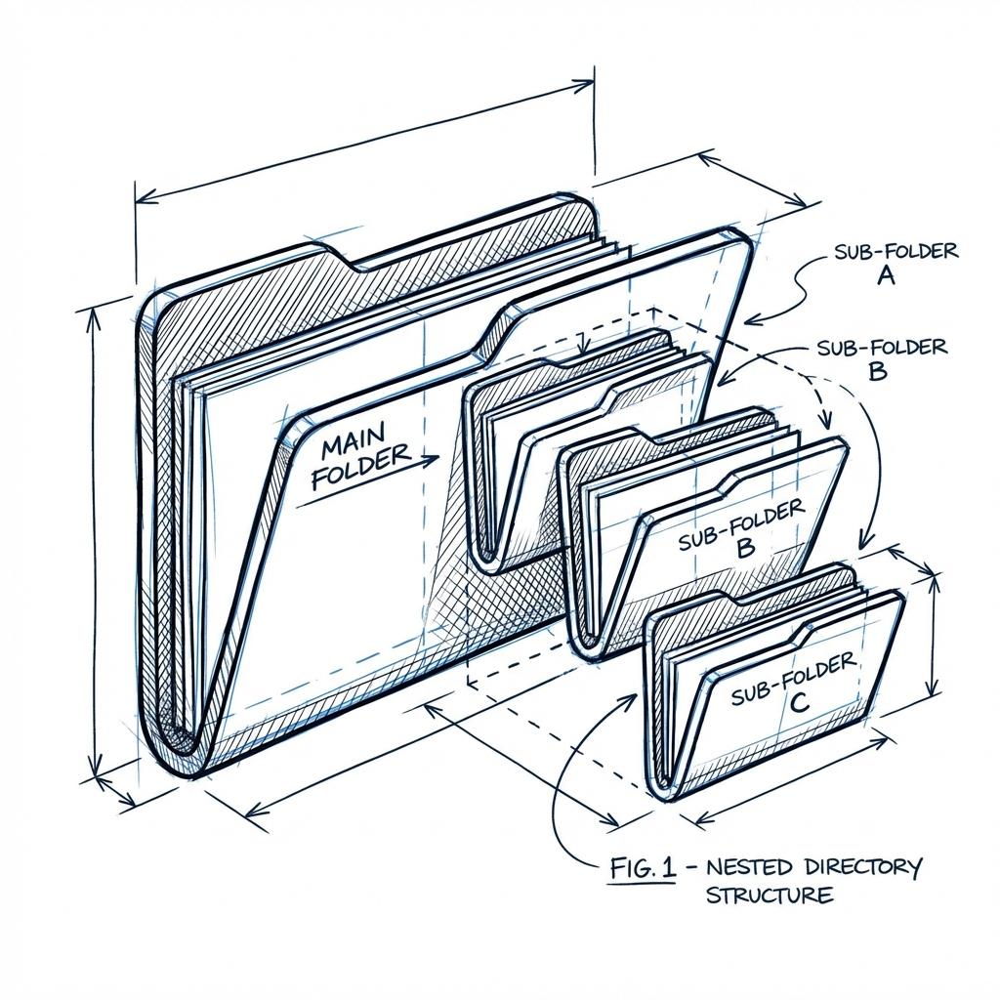

</div>
</div>

---

### Summary: Thinking Recursively

To write a recursive function, always follow these steps:

1.  **Identify the Base Case:** When should the function stop? What is the simplest answer?
2.  **Define the Recursive Step:** How can I make the problem smaller? How do I use the result of the smaller call?
3.  **Trust the Recursion:** Assume the function call on the smaller input *already works*. Use its result to build your answer.

---

### Exercise 1: Recursive Power

**Task:** Write a recursive function `power(base, exp)` that calculates $base^{exp}$.

- **Base Case:** Any number to the power of 0 is 1 ($a^0 = 1$).
- **Recursive Step:** $base^{exp} = base \times base^{exp-1}$.
- Example: `power(2, 3)` should return 8.

---

### Solution 1: Recursive Power

```python
def power(base, exp):
    # Base Case
    if exp == 0:
        return 1
    
    # Recursive Step
    return base * power(base, exp - 1)

print(power(2, 3)) # 8
```

---

### Exercise 2: Recursive String Reversal

**Task:** Write a recursive function `reverse_string(s)`.

- **Base Case:** If the string is empty or has only one character, it's already reversed!
- **Recursive Step:** The reverse of a string is the **reverse of the rest** followed by the **first character**.
- Example: `reverse_string("abc")` -> `reverse_string("bc") + "a"`.

---

<!-- Abstract illustration of glowing bars of light in varying lengths and colors, gradually aligning into a perfectly ordered and rhythmic structure amidst the cosmic clouds of a dark galaxy. The image is in a square format and contains no text. -->


## 8.4: Basic Sorting Algorithms

This section includes the following content:

- Introduction to Sorting
- Why we Sort Data
- Understanding Time Complexity (Big O)
- Bubble Sort: Simple Swapping
- Selection Sort: Finding the Minimum
- Insertion Sort: The Card Player Analogy
- Comparing Performance
- Python's Built-in Sorting Methods

---

<div class="columns">
<div class="two">

### Introduction to Sorting

**Sorting** is the process of arranging a collection of items into a specific order (e.g., numerical or alphabetical).

- It is one of the most fundamental problems in computer science.
- Most data processing tasks require sorting at some point.
- Common Orders: **Ascending** (1, 2, 3) or **Descending** (3, 2, 1).

</div>
<div class="two">

<!-- A technical-style illustration comparing a chaotic heap of numbered geometric blocks to a perfectly ordered and aligned row. Fun cartoon-like shading, white background, square format. -->

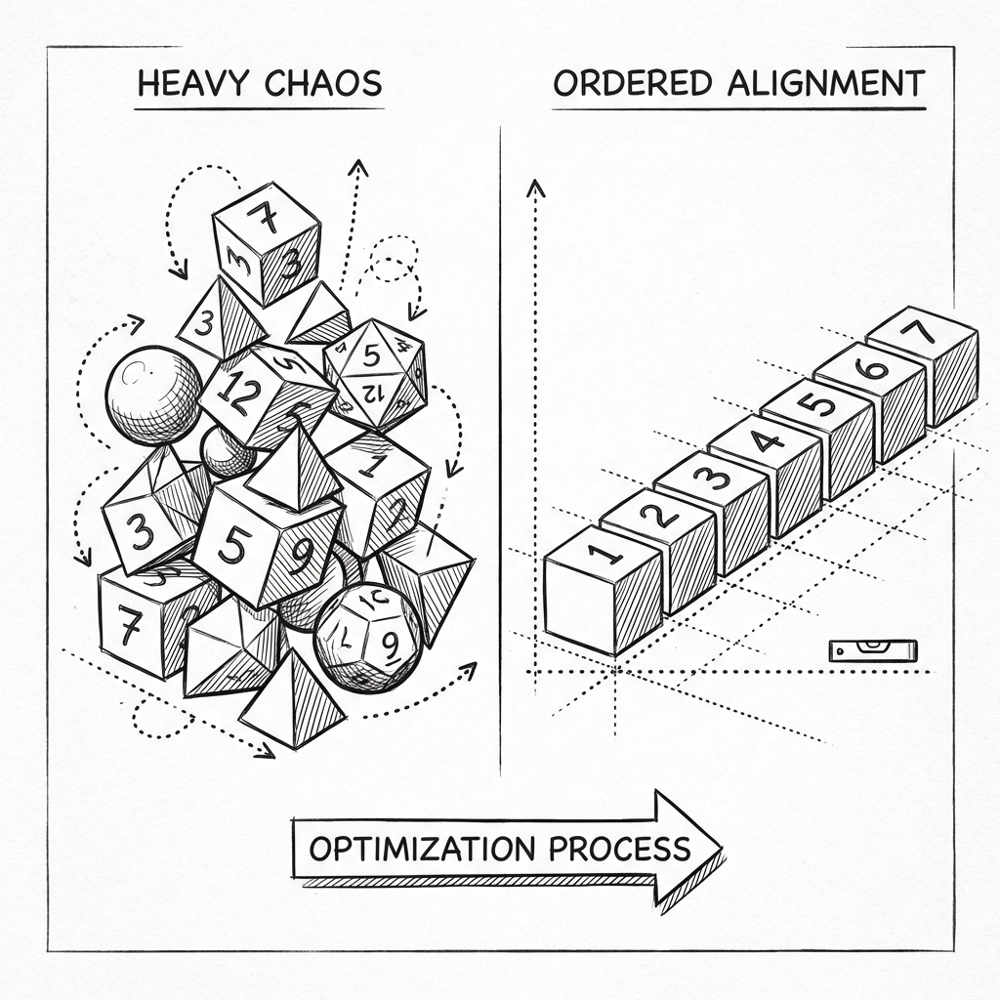

</div>
</div>

---

<div class="columns">
<div class="two">

### Why Sorting Matters

1.  **Searching:** Searching for an item is much faster in a sorted list (e.g., Binary Search).
2.  **Organization:** Humans find it easier to read sorted data (reports, logs).
3.  **Optimization:** Many other algorithms (like finding duplicates) become simpler if the data is already sorted.
4.  **Data Analysis:** Finding the median, minimum, or maximum is trivial in sorted data.

</div>
<div class="two">

<!-- A fun technical drawing of a mechanical gripper quickly grabbing a specific data block from a neatly sorted rack, contrasted with a disorganized pile. Cartoon-like shading, white background, square format. -->

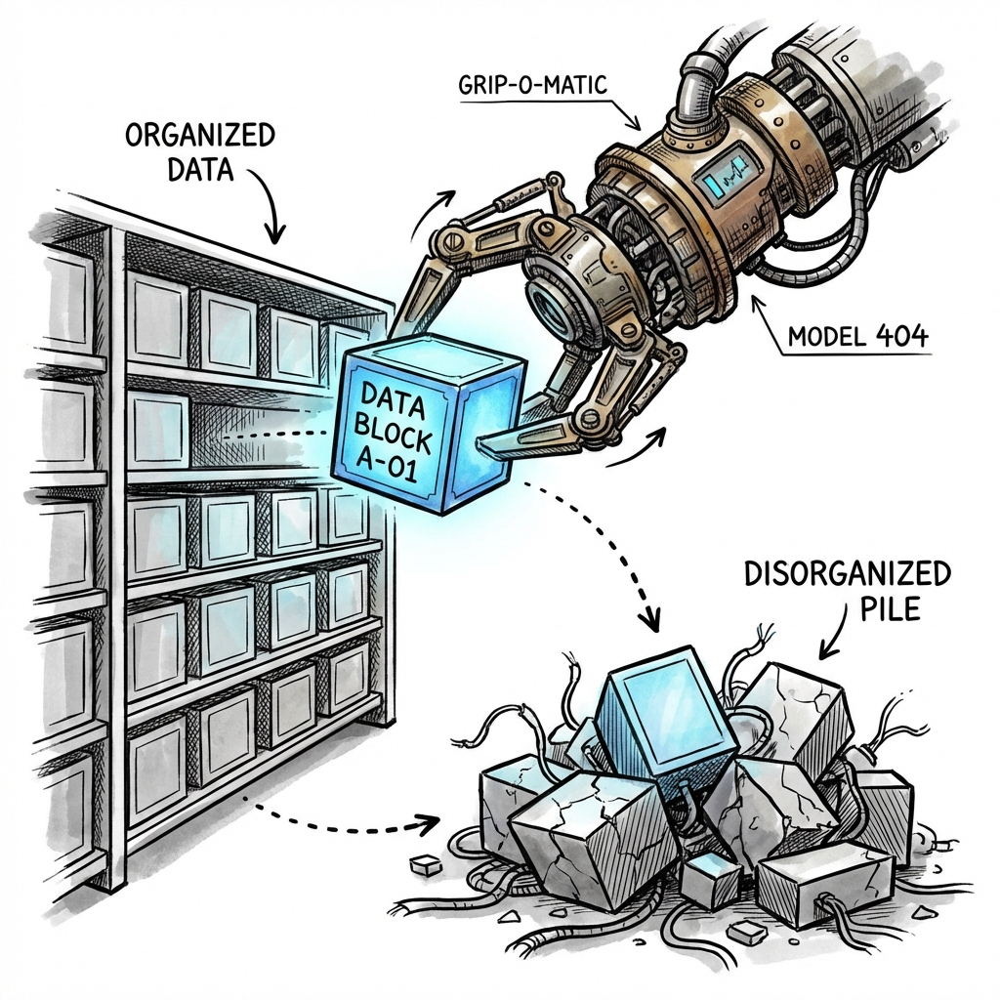

</div>
</div>

---

<div class="columns">
<div class="two">

### Concept: Algorithm Performance

How do we measure if an algorithm is "good"? We look at how it **scales**.

- **Scaling:** How much longer does it take if the data size doubles?
- **Linear Scaling:** Double data = double time. Good!
- **Quadratic Scaling:** Double data = **four times** the time. Problematic for large data.
- **Logarithmic Scaling:** Grows very slowly. Excellent!

</div>
<div class="two">

<!-- Tikz diagram showing a graph with two curves: one steep curve labeled "Slow Scaling" and one shallow curve labeled "Fast Scaling". The X-axis is "Input Size" and Y-axis is "Time". -->

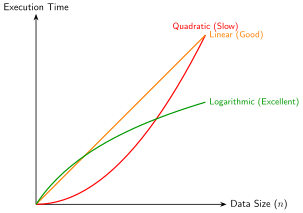

</div>
</div>

---

<div class="columns">
<div class="three">

### Bubble Sort: The Idea

**Bubble Sort** is the simplest sorting algorithm.

1.  Compare adjacent elements.
2.  If they are in the wrong order, **swap** them.
3.  Repeat until the end of the list.
4.  The largest element "bubbles up" to its correct position.
5.  Repeat for the rest of the list.

</div>
<div class="two">

<!-- Mermaid diagram showing a pass of Bubble Sort. Two adjacent elements are compared, and an arrow shows them swapping places. (Mermaid.js) -->
<!--
graph LR
    subgraph Step 1
    A1[5] --- B1[2] --- C1[9]
    end
    subgraph Step 2
    B2[2] -- Swap! -- A2[5] --- C2[9]
    end
-->



</div>
</div>

---

<div class="columns">
<div class="two">

### Visualizing Bubble Sort

Imagine air bubbles in water:

- Larger bubbles move faster and reach the top first.
- In each "pass", the next largest unsorted element reaches its final position at the end.
- It is easy to implement but **becomes very slow** as you add more data.

</div>
<div class="two">

<!-- A technical-style drawing of a water tank where numbered bubbles are rising; the larger numbers are buoyant and floating at the very top. Fun cartoon-like shading, white background, square format. -->

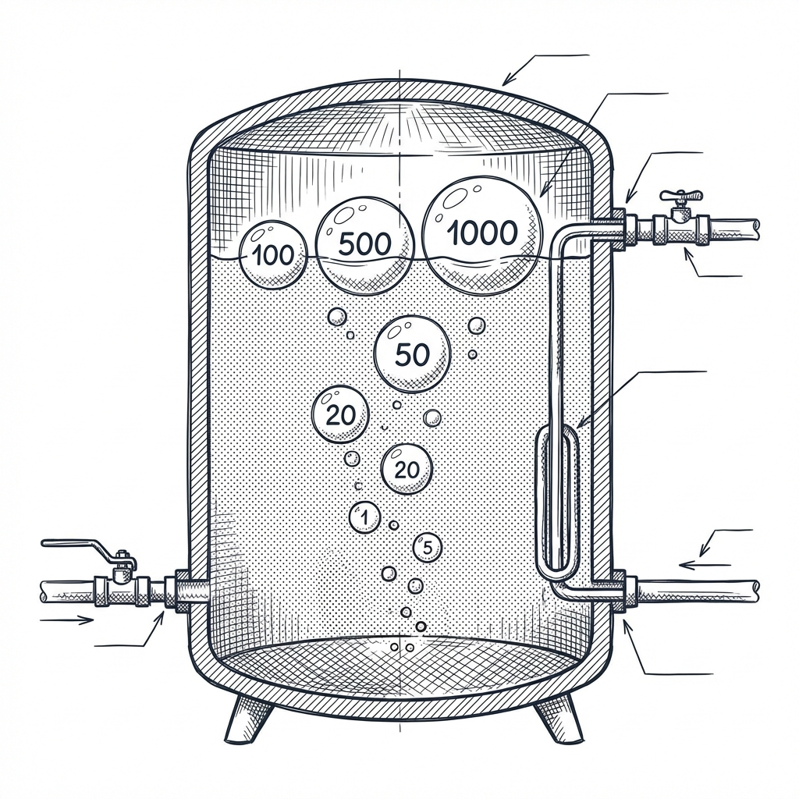

</div>
</div>

---

### Bubble Sort Implementation

```python
def bubble_sort(arr):
    n = len(arr)

    # Outer loop for each pass
    for i in range(n):

        # Inner loop for comparisons
        for j in range(0, n - i - 1):

            if arr[j] > arr[j + 1]:

                # Swap elements
                arr[j], arr[j + 1] = arr[j + 1], arr[j]

nums = [64, 34, 25, 12, 22]
bubble_sort(nums)
print(nums) # [12, 22, 25, 34, 64]
```

---

<div class="columns">
<div class="six">

### Selection Sort: The Minimum Hunt

Selection sort works by repeatedly finding the smallest element.

1.  Find the minimum element in the **unsorted** part.
2.  Swap it with the first element of the unsorted part.
3.  Move the boundary between sorted and unsorted.

- **Efficiency:** Slow for large datasets because it scans the list many times.

</div>
<div class="five">

<!-- Mermaid diagram showing a list divided into "Sorted" and "Unsorted". An arrow points to the smallest item in the unsorted part, labeled "Find Min". (Mermaid.js) -->



</div>
</div>

---

<div class="columns">
<div class="two">

### Visualizing Selection Sort

- The list is divided into two parts: Sorted (left) and Unsorted (right).
- We "select" the best candidate (the minimum) and move it to the sorted side.
- It is straightforward but doesn't scale well to large lists.

</div>
<div class="two">

<!-- A humorous technical illustration of a high-tech magnifying glass hovering over a row of blocks, highlighting the smallest one to be moved to a sorted section. Cartoon-like shading, white background, square format. -->

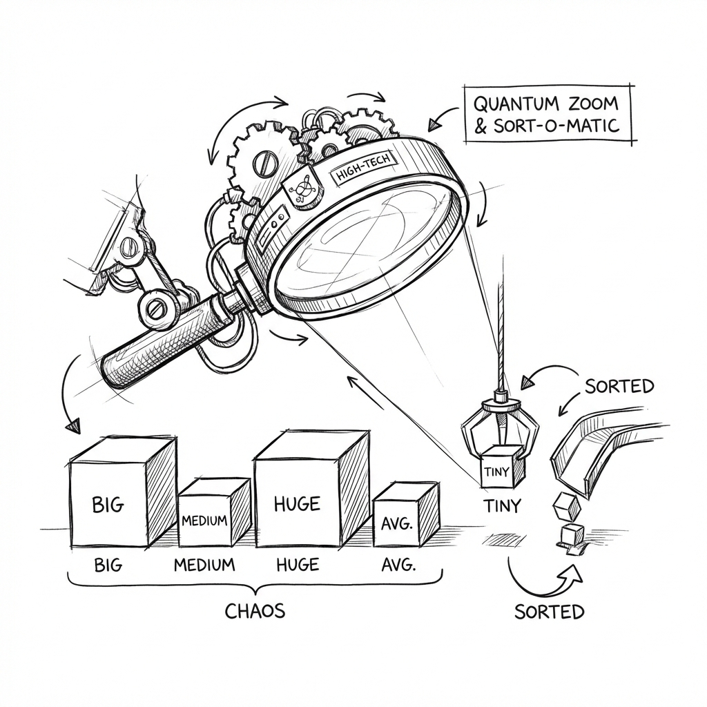

</div>
</div>

---

### Selection Sort Implementation

```python
def selection_sort(arr):
    n = len(arr)

    for i in range(n):
        min_idx = i

        # Find the smallest remaining
        for j in range(i + 1, n):
            if arr[j] < arr[min_idx]:
                min_idx = j
        
        # Swap with the current position
        arr[i], arr[min_idx] = arr[min_idx], arr[i]
```

---

<div class="columns">
<div class="two">

### Insertion Sort: The Card Player

Insertion Sort builds the final sorted array one item at a time.

1.  Take the next element from the unsorted part.
2.  Insert it into the **correct position** within the sorted part.
3.  Shift larger elements to the right to make room.

- **Analogy:** Sorting a hand of playing cards.

</div>
<div>

<!-- Mermaid diagram showing a card being inserted into a sorted hand. Arrows show other cards shifting over. (Mermaid.js) -->



</div>
</div>

---

<div class="columns">
<div class="two">

### Visualizing Insertion Sort

- Very efficient for lists that are already "almost sorted".
- It handles small datasets very well.
- Like Bubble and Selection sort, it becomes slow for very large, random lists.

</div>
<div class="two">

<!-- A fun technical drawing of a robotic hand carefully sliding a new numbered card into its correct position within an already sorted sequence of cards. Cartoon-like shading, white background, square format. -->

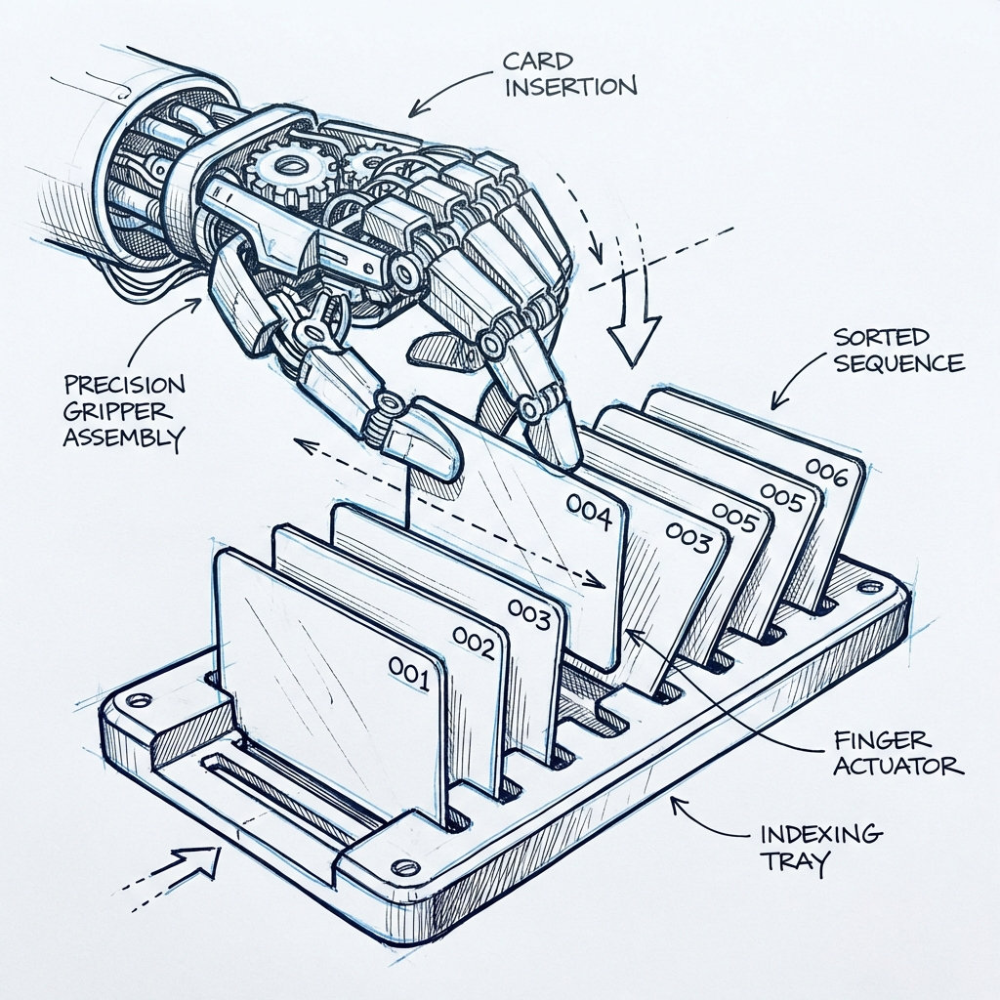

</div>
</div>

---

### Insertion Sort Implementation

```python
def insertion_sort(arr):

    for i in range(1, len(arr)):
        
        key = arr[i]
        
        j = i - 1

        # Shift elements of arr[0..i-1] that are greater than key
        while j >= 0 and key < arr[j]:

            arr[j + 1] = arr[j]
            
            j -= 1

        arr[j + 1] = key
```

---

### Algorithm Comparison

| Algorithm | Best Case | Worst Case | Scaling |
| :--- | :--- | :--- | :--- |
| **Bubble** | Fast (if sorted) | Very Slow | Poor |
| **Selection**| Slow | Very Slow | Poor |
| **Insertion**| Fast (if sorted) | Very Slow | Poor |
| **Python's** | Very Fast | Fast | Excellent |

**Note:** In practice, always use Python's built-in `sort()` or `sorted()`. They are highly optimized and use advanced techniques to stay fast even with massive amounts of data.

---

### Python's Built-in Sorting

Python uses **Timsort**, a hybrid of Merge Sort and Insertion Sort.

```python
data = [5, 2, 9, 1, 5, 6]

# Option 1: sorted() returns a NEW list
new_data = sorted(data)

# Option 2: .sort() modifies the list IN-PLACE
data.sort()

# Custom Sorting (e.g., sort strings by length)
words = ["banana", "apple", "kiwi"]
words.sort(key=len)
print(words) # ['kiwi', 'apple', 'banana']
```

---

### Exercise 1: Optimized Bubble Sort

**Task:** Improve the `bubble_sort` function.

- If the inner loop finishes without performing a single swap, it means the list is **already sorted**.
- Add a boolean flag `swapped` to check this.
- If `swapped` is `False` after the inner loop, `break` the outer loop immediately.
- Test it with a sorted list like `[1, 2, 3, 4, 5]`.

---

### Solution 1: Optimized Bubble Sort

```python
def bubble_sort_optimized(arr):
    n = len(arr)
    for i in range(n):
        swapped = False
        for j in range(0, n - i - 1):
            if arr[j] > arr[j + 1]:
                arr[j], arr[j + 1] = arr[j + 1], arr[j]
                swapped = True
        if not swapped:
            print(f"Early exit at pass {i+1}")
            break
```

---

### Exercise 2: Case-Insensitive Sorting

**Task:** Sort a list of names.

- `names = ["alice", "Bob", "charlie", "David"]`
- Use the built-in `sorted()` function.
- By default, Python sorts uppercase before lowercase.
- Use the `key` parameter with `str.lower` to perform a case-insensitive sort.
- Result should be: `['alice', 'Bob', 'charlie', 'David']`.
