<!-- Abstract illustration of a digital ecosystem with glowing nodes representing different libraries connecting to a central Python core, set against a dark, swirling galaxy background. Square format. -->


# Chapter 9: Working with External Libraries

This chapter includes the following sections:

- 9.1: Installing Packages with pip
- 9.2: Introduction to NumPy
- 9.3: Introduction to Pandas
- 9.4: Introduction to Matplotlib

---

<!-- Abstract illustration of a package being delivered by a drone or a robotic arm, symbolizing software installation and management. Technical drawing style with cartoon-like shading, white background, square format. -->


## 9.1: Installing Packages with pip

Expanding Python's capabilities beyond the standard library.

- The Python Package Index (PyPI)
- Using `pip` to manage packages
- Installing, Upgrading, and Uninstalling
- Managing dependencies with `requirements.txt`
- Best practices for virtual environments

---

<div class="columns">
<div class="two">

### What is a Package?

Python is great, but its real power comes from the **Ecosystem**.

- **Module:** A single `.py` file.
- **Package:** A collection of modules.
- **Library:** A loose term, often meaning a large package or collection of packages.

**Analogy:**
- Python Standard Library = "Apps pre-installed on your phone" (Calendar, Calculator).
- External Packages = "App Store" (Spotify, Instagram, Games).

</div>
<div class="two">

<!-- Illustration of a smartphone screen showing "Pre-installed Apps" vs an "App Store" icon, symbolizing the difference between the standard library and external packages. Technical drawing style. -->


</div>
</div>

---

<div class="columns">
<div>

### PyPI: The Python Package Index

**PyPI** (pypi.org) is the official repository for third-party software for Python.

- **Huge:** Over 400,000 projects.
- **Diverse:** Everything from web frameworks (Django) to AI (TensorFlow) to game engines (Pygame).
- **Open Source:** Mostly free and open to use.

When you install something, you are usually downloading it from here.

</div>
<div>

<!-- Illustration of a massive digital library or warehouse labeled "PyPI", with packages flying out to different computers. Technical drawing style. -->


</div>
</div>

---

### Introduction to `pip`

**`pip`** is the standard **P**ackage **I**nstaller for **P**ython.

It connects to PyPI, downloads the requested package, and installs it into your current environment.

**Check if you have it:**
```bash
# In your terminal
pip --version
```

*Note: In some installations, you might need to use `pip3`.*

---

<div class="columns">
<div class="two">

### Installing Packages

The magic command is `install`.

```bash
# General syntax
pip install <package_name>

# Example: Install the 'requests' library
# (A popular library for making HTTP requests)
pip install requests
```

**What happens?**
1.  pip looks for `requests` on PyPI.
2.  It downloads the latest compatible version.
3.  It checks if `requests` needs other packages (dependencies) and installs them too.

</div>
<div class="two">

<!-- Mermaid diagram showing the flow: User types command -> pip contacts PyPI -> PyPI sends package -> pip installs to Lib folder. -->



</div>
</div>

---

<div class="columns">
<div class="two">

### Specifying Versions

Software changes. Sometimes you need a specific version to ensure your code doesn't break.

```bash
# Install exactly version 2.25.1
pip install requests==2.25.1

# Install version 2.25.1 or higher
pip install requests>=2.25.1

# Install a version compatible with 2.25 
# (2.25.x but not 3.0)
pip install requests~=2.25.1
```

</div>
<div class="two">

<!-- Technical illustration showing how version specifiers select different ranges of software versions. Technical drawing style with cartoon-like shading. -->

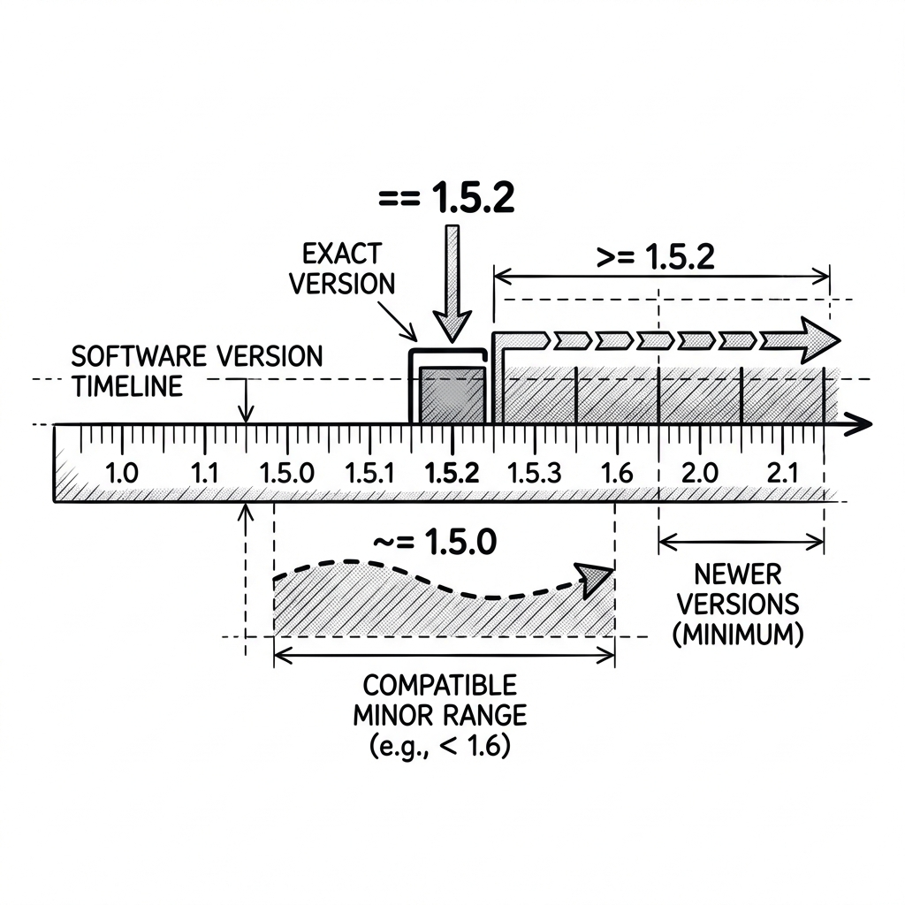

</div>
</div>

---

### Upgrading and Uninstalling

Keep your packages fresh or remove the ones you don't need.

**Upgrade:**
```bash
# Upgrade to the absolute latest version
pip install --upgrade requests
```

**Uninstall:**
```bash
# Remove a package
pip uninstall requests
```
*Note: This usually asks for confirmation (y/n).*

---

<div class="columns">
<div class="two">

### Listing Installed Packages

Curious what's in your environment?

```bash
# List all installed packages and their versions
pip list
```

**Output example:**
```
Package    Version
---------- -------
certifi    2020.12.5
idna       2.10
pip        21.0.1
requests   2.25.1
urllib3    1.26.4
```

</div>
<div class="two">

<!-- Illustration of a computer terminal window displaying a list of installed Python packages and their version numbers. -->

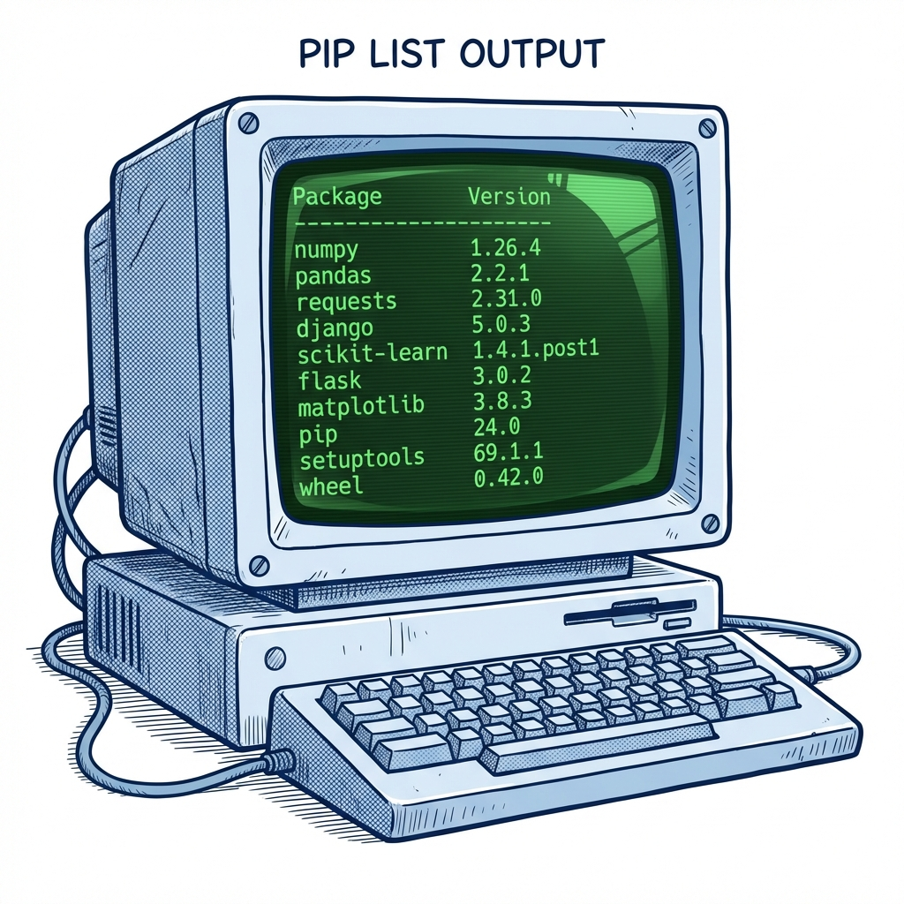

</div>
</div>

---

<div class="columns">
<div class="two">

### Dependency Management: `requirements.txt`

When you share your project, others need to know which packages to install.

We list them in a file named `requirements.txt`.

**Format:**
```
requests==2.25.1
numpy>=1.20.0
pandas
```

</div>
<div class="two">

<!-- Illustration of a recipe card labeled "requirements.txt" listing ingredients (packages) needed to bake a cake (run the project). Technical drawing style. -->


</div>
</div>

---

<div class="columns">
<div class="three">

### Freezing Dependencies

You don't have to write `requirements.txt` manually. `pip` can generate it for you based on your current environment.

```bash
# Output current packages to the file
pip freeze > requirements.txt
```

**Best Practice:** Do this inside a **clean virtual environment** so you only list packages relevant to *this* project, not everything you've ever installed.

</div>
<div>

<!-- Mermaid diagram showing the flow of data: Current Environment -> pip freeze command -> requirements.txt file. -->



</div>
</div>

---

### Installing from Requirements

When you download someone else's project (e.g., from GitHub), the first step is usually:

```bash
# Install everything listed in the file
pip install -r requirements.txt
```

This ensures you have the exact same setup as the original developer, preventing "It works on my machine" issues.

---

<div class="columns">
<div class="two">

### Common Issues and Troubleshooting

1.  **"Command not found":** You might need to add Python/Scripts to your system PATH, or use `python -m pip ...` instead of just `pip ...`.
2.  **Permission Error:** On Linux/Mac, you might need `sudo` (avoid this if possible!) or use `pip install --user ...`.
3.  **Conflict:** Package A needs `numpy 1.15`, Package B needs `numpy 1.20`. This is "Dependency Hell". Virtual Environments solve this!

</div>
<div class="two">

<!-- Illustration showing common error icons: a "Command Not Found" terminal alert, a "Permission Denied" padlock, and a "Conflict" warning sign. -->


</div>
</div>

---

### Exercise: Installing & Using a Package

1.  Open your terminal.
2.  Install the package `colorama` (makes terminal text colorful).
    `pip install colorama`
3.  Create a Python script `color_test.py`:
    ```python
    from colorama import Fore, Style
    print(Fore.RED + "This is red text!")
    print(Fore.GREEN + "This is green text!")
    print(Style.RESET_ALL + "Back to normal.")
    ```
4.  Run the script and verify the output.

---

### Solution: Installing & Using a Package

**Terminal:**
```bash
pip install colorama
python color_test.py
```

**Python Code:**
```python
import colorama
from colorama import Fore, Style

# Initialize colorama (needed for Windows CMD)
colorama.init()

print(Fore.RED + "Error: Something went wrong!")
print(Fore.GREEN + "Success: Package installed.")
print(Style.RESET_ALL + "System status: Nominal")
```

---

### Additional Exercise: Dependency File

1.  Use `pip freeze` to see what is currently installed.
2.  Save this list to a file named `my_reqs.txt`.
3.  Open the text file and verify that `colorama` is listed there.
4.  (Optional) Uninstall colorama (`pip uninstall colorama`), then reinstall it using your file (`pip install -r my_reqs.txt`).

---

<!-- Abstract illustration of a grid of numbers transforming into a 3D data landscape, representing NumPy arrays. Technical drawing style with cartoon-like shading, white background, square format. -->


## 9.2: Introduction to NumPy

The foundation of scientific computing in Python.

- Why Lists aren't enough
- The `ndarray` object
- Creating and inspecting arrays
- Element-wise operations (Vectorization)
- Indexing and Slicing dimensions

---

### What is NumPy?

**NumPy** (Numerical Python) is the core library for numerical computing.

- It provides the **`ndarray`** (N-dimensional array) object.
- It contains tools for linear algebra, Fourier transforms, and random number generation.
- It is the building block for almost all other data science libraries (Pandas, Matplotlib, Scikit-learn).

To use it:
```python
import numpy as np
# 'np' is the standard alias. Everyone uses it.
```

---

<div class="columns">
<div class="two">

### Lists vs. NumPy Arrays

Why not just use Python lists?

1.  **Performance:** NumPy arrays are written in C. They are much faster and use less memory.
2.  **Functionality:** NumPy allows mathematical operations on whole arrays at once (Vectorization).
3.  **Homogeneity:** Lists can hold anything (`[1, "a", True]`). Arrays must hold elements of the **same type** (e.g., all `float`), allowing optimization.

</div>
<div class="two">

<!-- Tikz diagram comparing a scattered Python list in memory vs a tightly packed contiguous NumPy array. -->

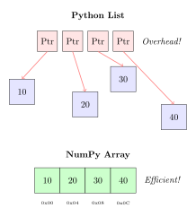

</div>
</div>

---

### Creating Arrays

You can create arrays from regular lists.

```python
import numpy as np

# From a list
data = [1, 2, 3, 4, 5]
arr = np.array(data)

print(arr)       # [1 2 3 4 5]
print(type(arr)) # <class 'numpy.ndarray'>
```

---

<div class="columns">
<div class="two">

### Generating Data

NumPy has functions to generate arrays from scratch.

```python
# Array of zeros (length 5)
z = np.zeros(5) 

# Array of ones (3x3 Matrix)
o = np.ones((3, 3)) 

# Range: Start, Stop, Step
r = np.arange(0, 10, 2) 

# Linspace: Start, Stop, Points
l = np.linspace(0, 1, 5) 
```

</div>
<div class="two">

<!-- Illustration visualizing the output of generation functions: a row of empty boxes for zeros, filled boxes for ones, a ruler for arange, and evenly spaced markers for linspace. -->

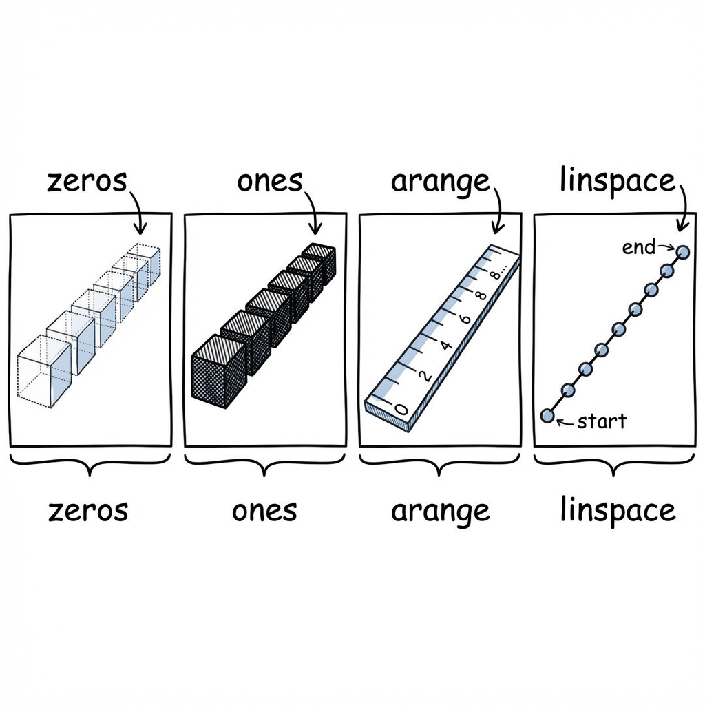

</div>
</div>

---

<div class="columns">
<div class="two">

### Array Attributes

Inspect your data to understand its structure.

```python
arr = np.ones((2, 4)) 
# 2 rows, 4 columns

print(f"Dimensions: {arr.ndim}")  
# 2

print(f"Shape: {arr.shape}")      
# (2, 4)

print(f"Size: {arr.size}")        
# 8 (total elements)
```

**Shape** is the most important attribute. Always check it when debugging!

</div>
<div class="two">

<!-- Illustration of a 3D cube of data blocks, with arrows clearly labeling "ndim" (axes), "shape" (dimensions like 3x3x3), and "size" (total blocks). -->

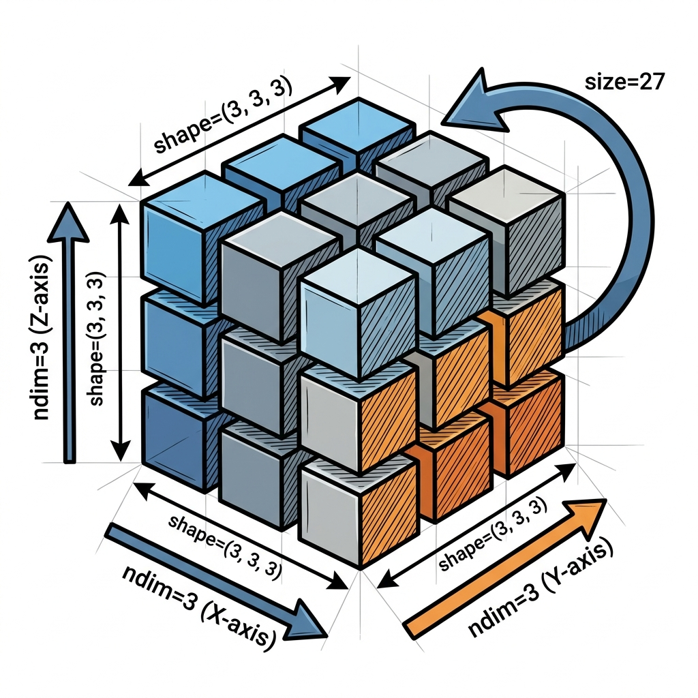

</div>
</div>

---

<div class="columns">
<div class="two">

### Element-wise Operations

This is NumPy's superpower. You can do math on arrays as if they were single numbers.

**No loops required!**

```python
a = np.array([1, 2, 3])
b = np.array([10, 20, 30])

# Add
print(a + b) # [11 22 33]

# Multiply
print(a * b) # [10 40 90]

# Scalar Math
print(a * 10) # [10 20 30]
```

</div>
<div class="two">

<!-- Illustration of two arrays being added element by element, resulting in a third array. Technical drawing style. -->

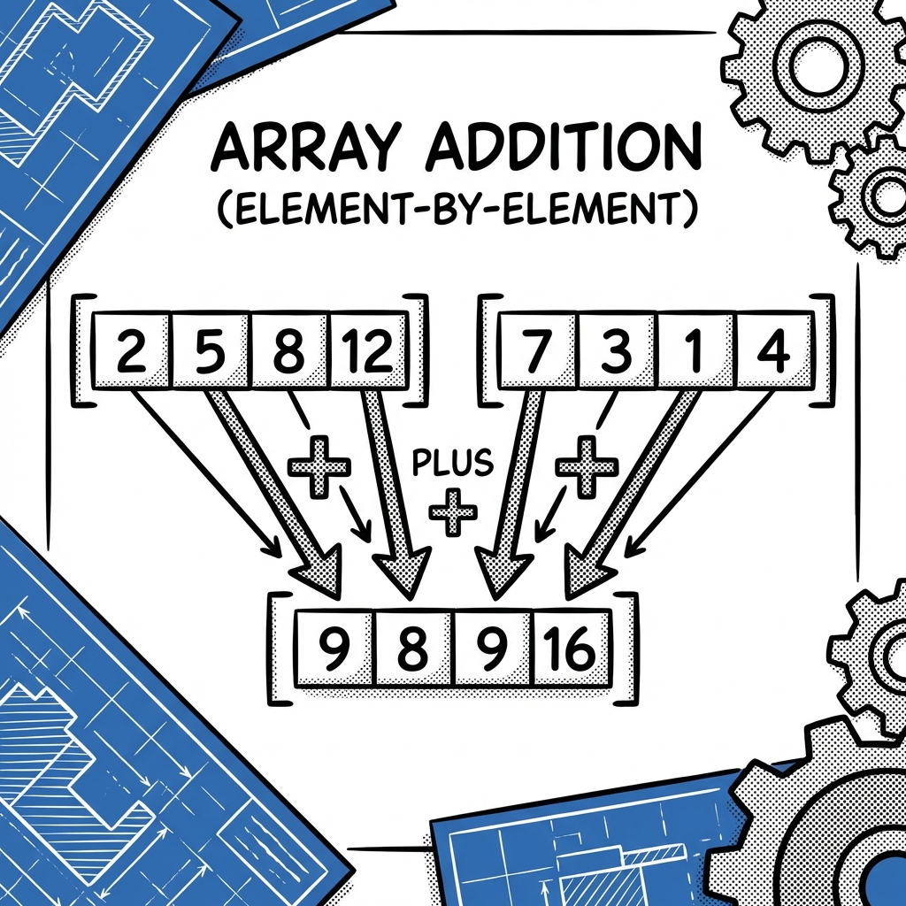

</div>
</div>

---

<div class="columns">
<div class="two">

### Broadcasting

What if dimensions don't match perfectly? NumPy tries to "Broadcast" the smaller array across the larger one.

```python
matrix = np.ones((3, 3))
row = np.array([1, 2, 3])

# The row is added to EACH row
result = matrix + row

print(result)
# [[2. 3. 4.]
#  [2. 3. 4.]
#  [2. 3. 4.]]
```

</div>
<div class="two">

<!-- Illustration showing a 1D array being visually "stretched" or duplicated to match the shape of a 2D matrix so they can be added together. -->

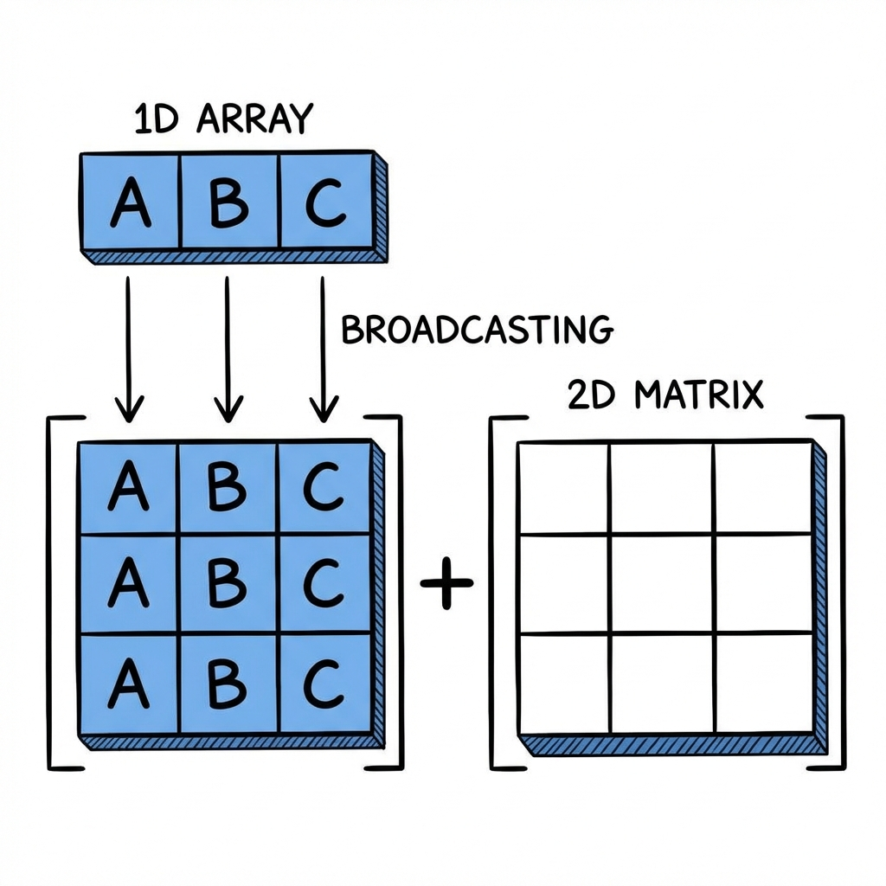

</div>
</div>

---

### Indexing and Slicing (1D)

Similar to Python lists, but more powerful.

```python
arr = np.array([10, 20, 30, 40, 50])

# Simple indexing
print(arr[0])    # 10
print(arr[-1])   # 50

# Slicing [start:stop:step]
print(arr[1:4])  # [20 30 40]

# Assignment works on slices!
arr[0:2] = 99
print(arr)       # [99 99 30 40 50]
```

---

<div class="columns">
<div class="two">

### Indexing and Slicing (2D)

Use comma-separated indices: `[row, column]`.

```python
matrix = np.array([
    [1, 2, 3],
    [4, 5, 6],
    [7, 8, 9]
])

# Slice: First two rows, all cols
print(matrix[:2, :])
# [[1 2 3]
#  [4 5 6]]

# Slice: All rows, column 1
print(matrix[:, 1]) # [2 5 8]
```

</div>
<div class="two">

<!-- Illustration of a matrix grid where a specific rectangular sub-region corresponding to '[:2, :]' is highlighted in a different color. -->

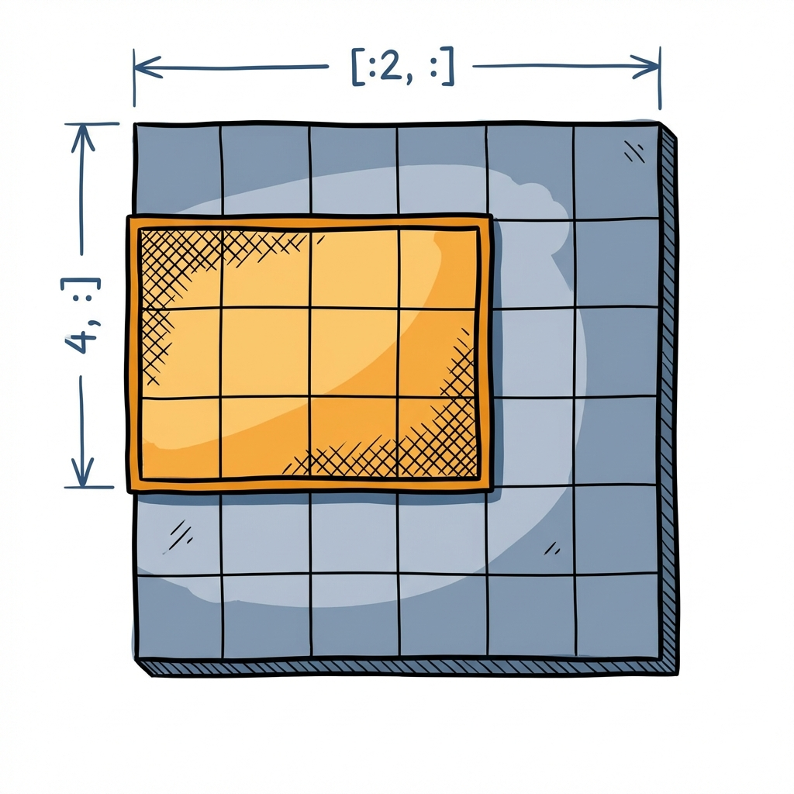

</div>
</div>

---

<div class="columns">
<div class="two">

### Basic Aggregation

Get summary statistics instantly.

```python
arr = np.array([
    [1, 2],
    [3, 4]
])

print(np.sum(arr))  # 10 (Total)

# Axis-specific
print(np.sum(arr, axis=0)) 
# [4 6] (Sum of columns)

print(np.sum(arr, axis=1)) 
# [3 7] (Sum of rows)
```

</div>
<div class="two">

<!-- Diagram showing a 2D array with arrows collapsing it downwards for 'axis=0' (summing columns) and sideways for 'axis=1' (summing rows). -->

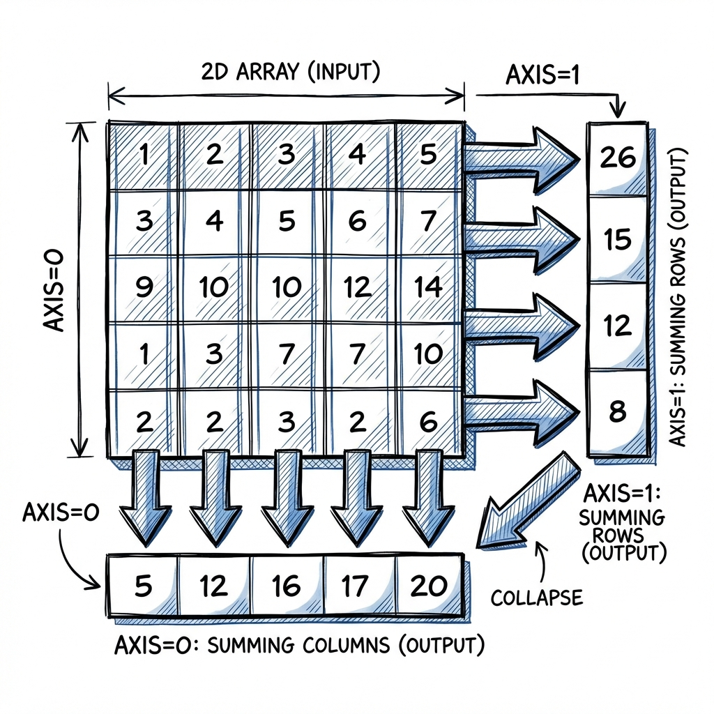

</div>
</div>

---

### Exercise: Array Math

1.  Create a NumPy array `x` with values `[1, 2, 3, 4, 5]`.
2.  Create a second array `y` using `x ** 2` (values squared).
3.  Calculate the sum of all elements in `y`.
4.  Print the result.

---

### Solution: Array Math

```python
import numpy as np

# 1. Create array
x = np.array([1, 2, 3, 4, 5])

# 2. Square values
y = x ** 2
print(f"Squared: {y}") 
# Output: [ 1  4  9 16 25]

# 3. Sum
total = np.sum(y)

# 4. Result
print(f"Sum of squares: {total}")
# Output: 55
```

---

### Additional Exercise: 2D Slicing

1.  Create a 3x3 matrix with values 1 to 9.
    *(Hint: You can use `np.arange(1, 10).reshape(3, 3)`)*
2.  Print the value in the center (5).
3.  Print the bottom row (7, 8, 9).
4.  Print the last column (3, 6, 9).

---

<!-- Abstract illustration of data rows and columns assembling into a structured dataframe, resembling a futuristic spreadsheet. Technical drawing style with cartoon-like shading, white background, square format. -->


## 9.3: Introduction to Pandas

Data Analysis made easy.

- What is Pandas?
- The `Series` and `DataFrame` objects
- Loading data from files
- Inspecting and Selecting data
- Filtering and Basic Stats

---

### What is Pandas?

**Pandas** is the standard library for structured (tabular) data analysis.

- Think of it as **"Excel for Python"**—but much more powerful and programmable.
- Built on top of NumPy.
- Key features: handling missing data, time series analysis, merging/joining datasets.

To use it:
```python
import pandas as pd
# 'pd' is the standard alias.
```

---

<div class="columns">
<div class="two">

### The `Series` Object

A **Series** is a one-dimensional labeled array.
- It's like a single column in Excel or a super-powered Python list.
- It has an **Index** (labels) and **Values** (data).

```python
s = pd.Series([10, 20, 30], 
    index=['a', 'b', 'c'])

print(s['a']) # 10
```

</div>
<div class="two">

<!-- Illustration of a vertical strip of data cells with labels on the left, representing a Pandas Series. Technical drawing style. -->

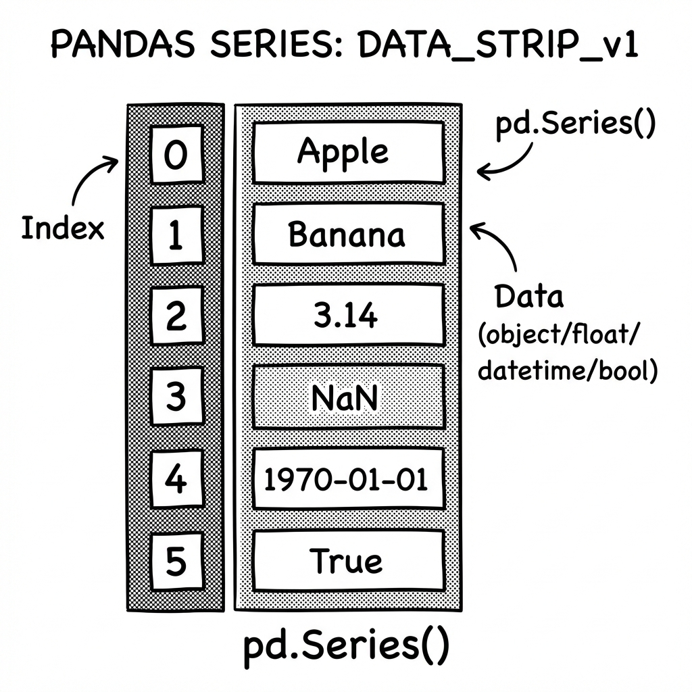

</div>
</div>

---

<div class="columns">
<div class="two">

### The `DataFrame` Object

A **DataFrame** is a 2-dimensional labeled data structure.
- It's a table with rows and columns.
- Each column is a `Series`.
- It has a Row Index and Column Names.

```python
data = {
    "Name": ["Alice", "Bob"],
    "Age": [25, 30],
    "City": ["London", "Paris"]
}
df = pd.DataFrame(data)
```

</div>
<div class="two">

<!-- Illustration of a grid table with headers, representing a Pandas DataFrame. Technical drawing style. -->

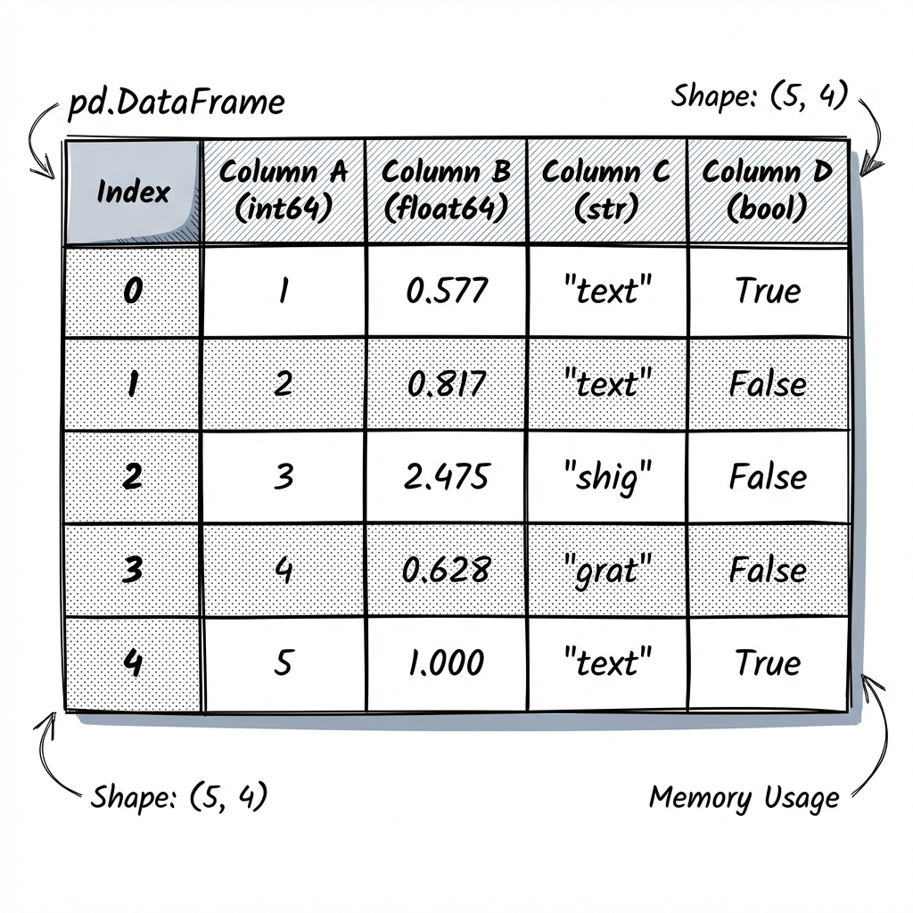

</div>
</div>

---

<div class="columns">
<div class="three">

### Loading Data

In the real world, you usually load data from files, not dictionaries.

```python
# Read a CSV file 
# (Comma Separated Values)
df = pd.read_csv("data.csv")

# Read an Excel file
# df = pd.read_excel("data.xlsx")
```

Pandas automatically detects headers and data types.

</div>
<div>

<!-- Mermaid diagram showing the process: CSV File Icon -> read_csv() function -> DataFrame Object. -->



</div>
</div>

---

<div class="columns">
<div class="two">

### Inspecting Data

When you load a huge file, you can't print the whole thing.

```python
# View the first 5 rows
print(df.head())

# View the last 3 rows
print(df.tail(3))

# Get summary of types
print(df.info())

# Get statistical summary
print(df.describe())
```

</div>
<div class="two">

<!-- Screenshot of a terminal showing the tabular output of the 'df.head()' command. -->

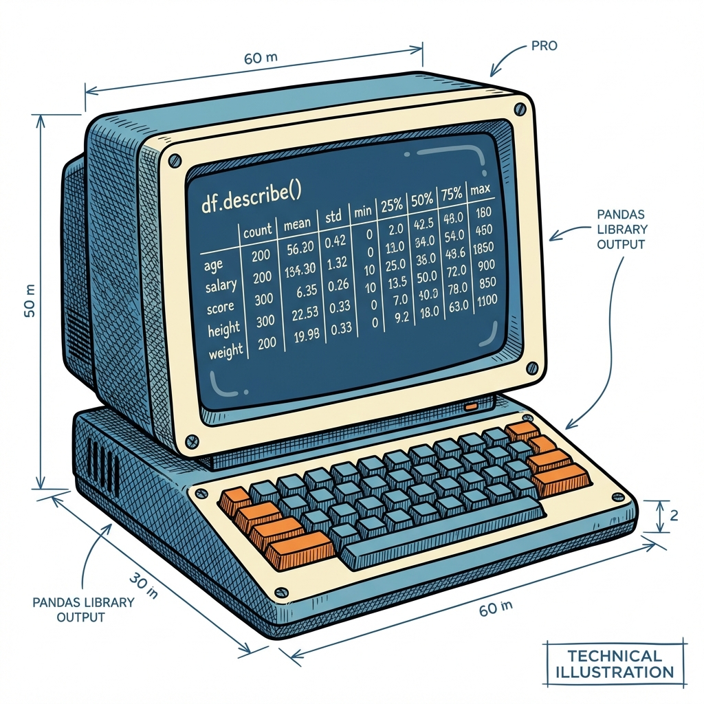

</div>
</div>

---

### Selecting Columns

You can select a column by name. It returns a `Series`.

```python
# Select 'Age' column
ages = df["Age"]

# Alternative (dot syntax) - only works if name has no spaces
ages = df.Age

print(ages.mean()) # Calculate mean of that column
```

---

<div class="columns">
<div class="two">

### Selecting Rows: `loc` and `iloc`

- **`.loc[label]`**: Select by **Label** (Index name).
- **`.iloc[index]`**: Select by **Integer Position** (0, 1, 2...).

```python
# Get the row at position 0
first_row = df.iloc[0]

# Get rows 0 to 4 (exclusive)
subset = df.iloc[0:4]

# If index was names: 
# df.loc["Alice"]
```

</div>
<div class="two">

<!-- Illustration of a table comparing 'loc' and 'iloc', showing pointers to the named index column for loc and the hidden row number for iloc. -->

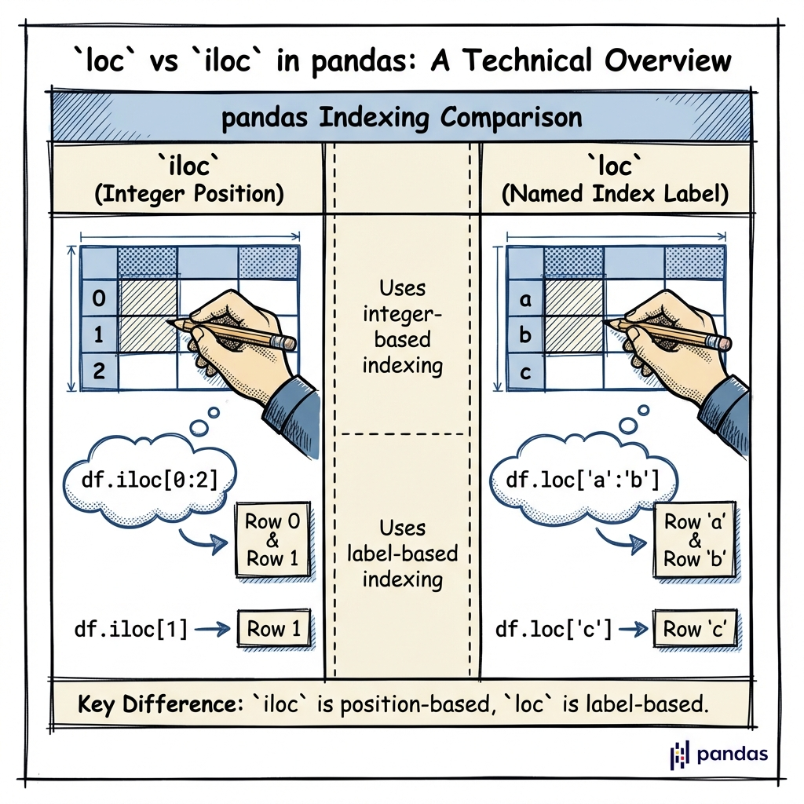

</div>
</div>

---

<div class="columns">
<div class="two">

### Filtering Data (Boolean Indexing)

Select rows based on a condition. This is very powerful!

```python
# Step 1: Create a boolean mask
mask = df["Age"] > 25

# Step 2: Apply mask
adults = df[mask]

# One-liner version (Common)
paris_residents = df[ 
    df["City"] == "Paris" 
]
```

</div>
<div class="two">

<!-- Illustration of a funnel. A full DataFrame enters the top, passes through a "Condition Filter" (e.g., Age > 25), and a smaller DataFrame comes out the bottom. -->

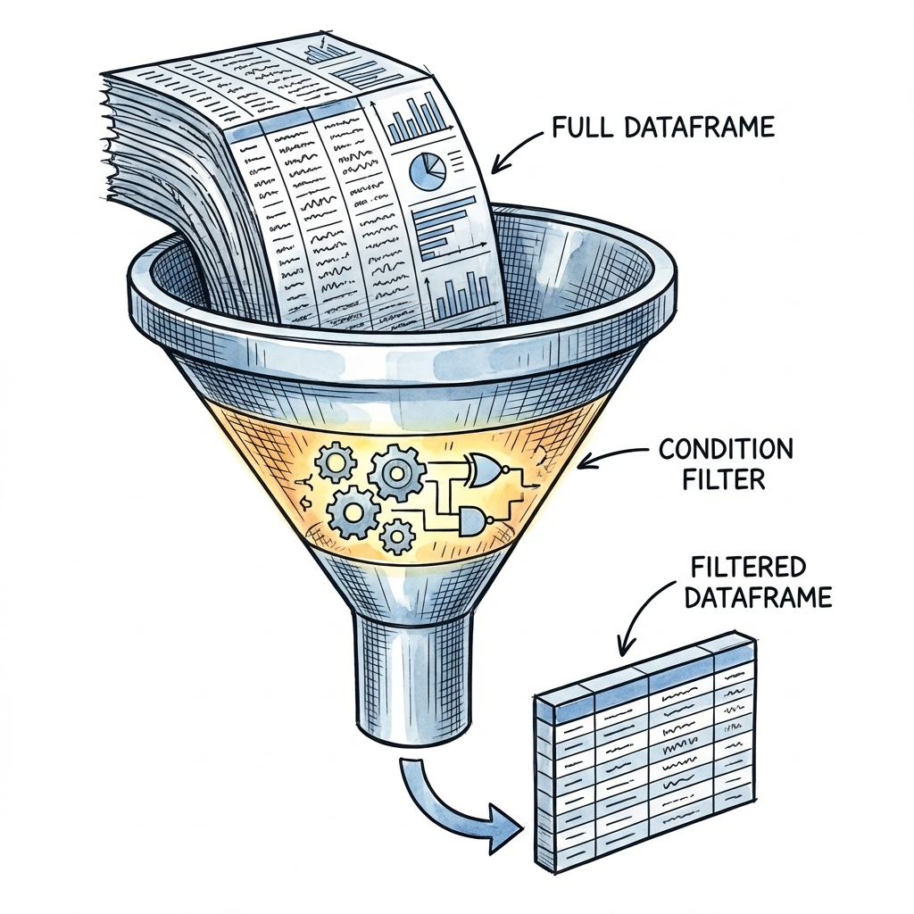

</div>
</div>

---

### Sorting and Statistics

```python
# Sort by Age (Youngest first)
sorted_df = df.sort_values(by="Age")

# Sort by Age (Oldest first)
sorted_df = df.sort_values(by="Age", ascending=False)

# Correlation matrix
print(df.corr()) 

# Unique values in a column
print(df["City"].unique())
```

---

<div class="columns">
<div class="four">

### Engineering Example: Sensor Logs

```python
import pandas as pd

# Load log
df = pd.read_csv("sensors.csv")

# Filter: Temperature > 100
overheating = df[ df["Temp"] > 100 ]

# Save report
overheating.to_csv("alerts.csv")

print(f"Found {len(overheating)} alerts.")
```

</div>
<div>

<!-- Flowchart showing CSV input -> Pandas DataFrame -> Filter Operation -> CSV Output. -->



</div>
</div>

---

### Exercise: Analyze Grades

1.  Create a DataFrame manually:
    ```python
    data = {
        "Student": ["A", "B", "C", "D"],
        "Math": [85, 90, 78, 92],
        "Science": [88, 85, 80, 95]
    }
    df = pd.DataFrame(data)
    ```
2.  Calculate the average Math score.
3.  Filter for students with Science score > 85.
4.  Print the result.

---

### Solution: Analyze Grades

```python
import pandas as pd

data = {
    "Student": ["A", "B", "C", "D"],
    "Math": [85, 90, 78, 92],
    "Science": [88, 85, 80, 95]
}
df = pd.DataFrame(data)

# Average Math
avg_math = df["Math"].mean()
print(f"Average Math: {avg_math}")

# Filter Science > 85
top_science = df[ df["Science"] > 85 ]
print("\nTop Science Students:")
print(top_science)
```

---

### Additional Exercise: Sales Data

1.  Assume a DataFrame `sales` with columns `["Item", "Price", "Quantity"]`.
2.  Create a new column `Total` by multiplying `Price` * `Quantity`.
3.  Find the `Item` with the highest `Total` value.
    *(Hint: You can use `df.sort_values(...)` and take the head, or use `idxmax()`)*

---

<!-- Abstract illustration of data points transforming into a clean, elegant line chart. Technical drawing style with cartoon-like shading, white background, square format. -->

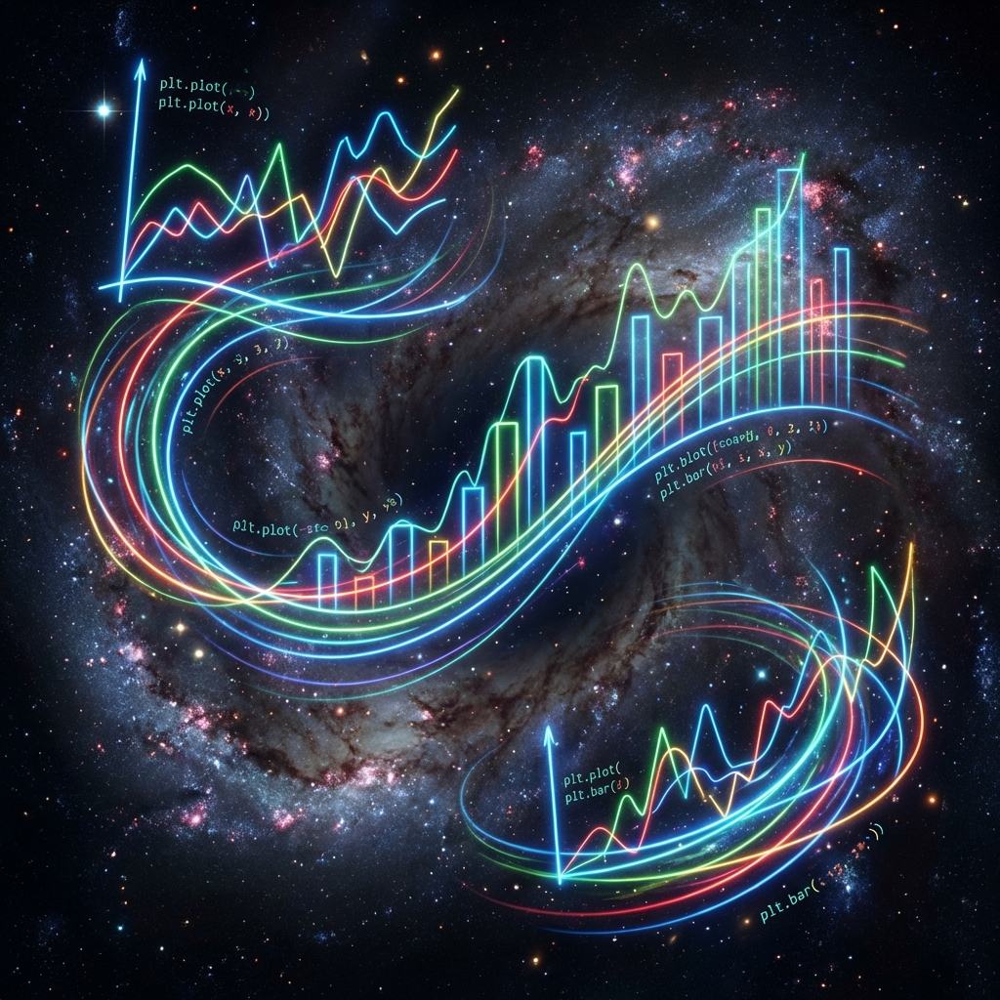

## 9.4: Introduction to Matplotlib

Visualizing your results.

- What is Matplotlib?
- The `pyplot` interface
- Basic Plots (Line, Scatter, Bar)
- Customizing Plots (Labels, Legends, Grid)
- Saving Figures

---

### What is Matplotlib?

**Matplotlib** is the most widely used plotting library for Python.

- It creates publication-quality figures.
- It is highly customizable (you can control every pixel).
- Works perfectly with NumPy arrays and Pandas DataFrames.

**Convention:**
```python
import matplotlib.pyplot as plt
```

---

<div class="columns">
<div class="two">

### The `pyplot` Interface

We interact with the `pyplot` module (aliased as `plt`). It behaves like a state machine: you command it to create a figure, add lines, add labels, and then show it.

```python
import matplotlib.pyplot as plt

x = [1, 2, 3, 4]
y = [10, 20, 25, 30]

plt.plot(x, y) # Create a line plot
plt.show()     # Display the window
```

</div>
<div class="two">

<!-- Mermaid sequence diagram showing the steps: Import -> Prepare Data -> Plot Command -> Style Command -> Show Command. -->

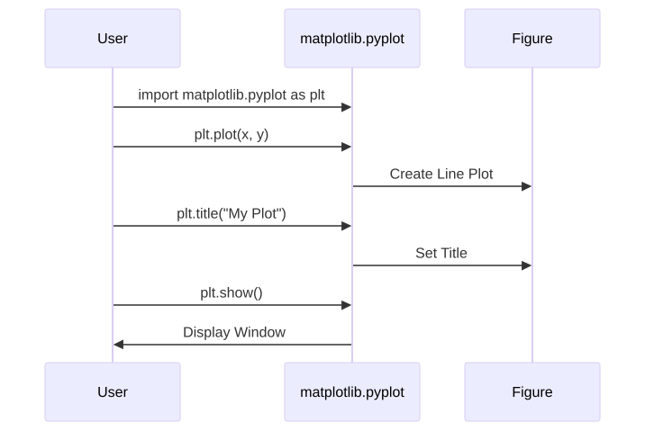

</div>
</div>

---

### Basic Line Plot

Customizing the look of the line.

```python
import numpy as np
x = np.linspace(0, 10, 100)
y = np.sin(x)

# Plot with color, linestyle, and marker
plt.plot(x, y, color="blue", linestyle="--", linewidth=2)

plt.show()
```

*Styles: `"-"` (solid), `"--"` (dashed), `":"` (dotted).*

---

<div class="columns">
<div class="two">

### Adding Metadata

A plot without labels is useless!

```python
plt.plot(x, y, label="Sine Wave")

plt.title("Simple Harmonic Motion")
plt.xlabel("Time (s)")
plt.ylabel("Amplitude (m)")

plt.legend() # Show the label
plt.grid(True) # Add grid lines

plt.show()
```

</div>
<div class="two">

<!-- Illustration of a plot with bright red arrows pointing to and labeling the "Title", "X Label", "Y Label", "Legend", and "Grid Lines". -->

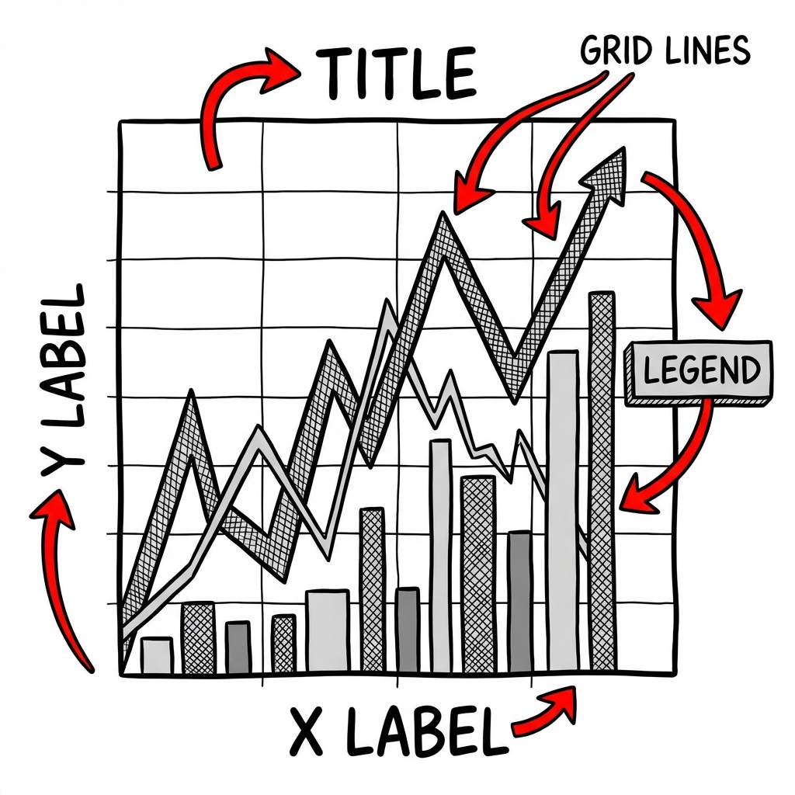

</div>
</div>

---

<div class="columns">
<div class="two">

### Scatter Plots

Used to show the relationship between two variables (e.g., experimental data points).

```python
x = [1, 2, 3, 4, 5]
y = [2.1, 3.9, 6.1, 8.2, 9.8]

# 'o' makes dots, 'x' makes crosses
plt.scatter(x, y, marker='o', color='red')
plt.title("Sensor Calibration")
plt.show()
```

</div>
<div class="two">

<!-- Illustration of a scatter plot with data points showing a linear trend. Technical drawing style. -->

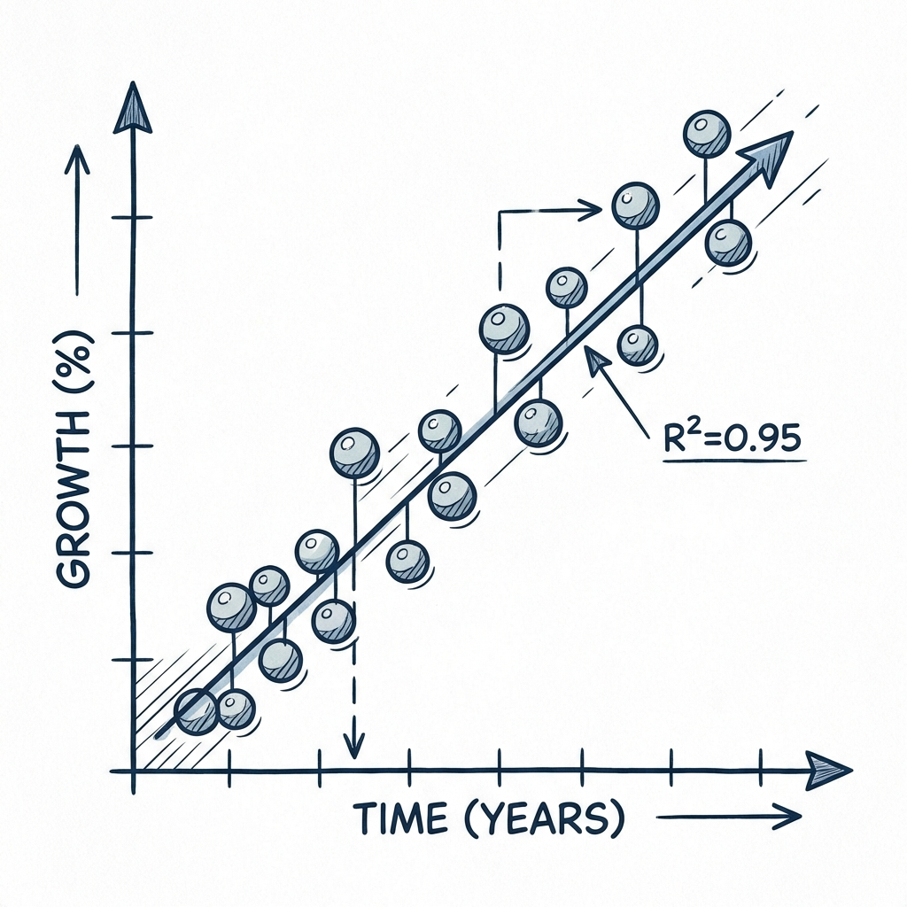

</div>
</div>

---

<div class="columns">
<div class="two">

### Bar Charts

Used for categorical data.

```python
categories = ["A", "B", "C"]
values = [10, 24, 36]

plt.bar(categories, values, color="green")
plt.title("Sales by Category")
plt.show()
```

</div>
<div class="two">

<!-- Illustration of a bar chart comparing three categories. Technical drawing style. -->

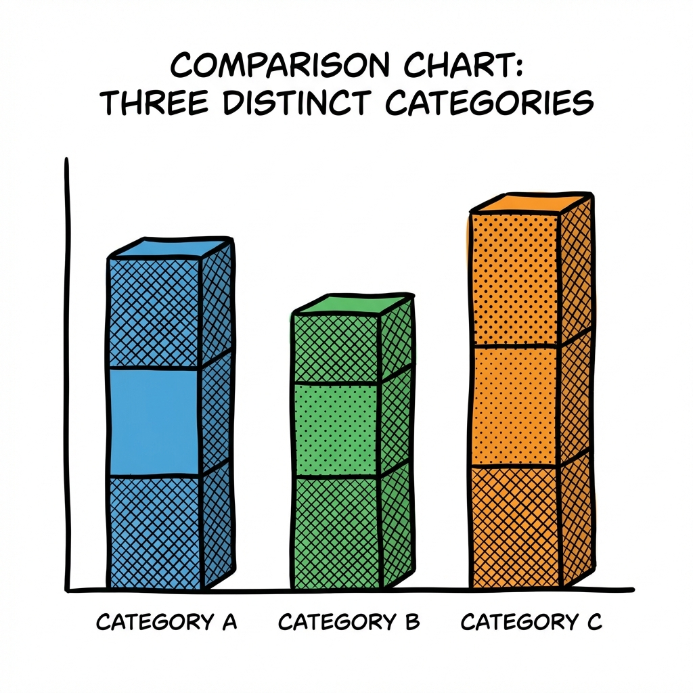

</div>
</div>

---

<div class="columns">
<div class="two">

### Histograms

Used to see the distribution of data.

```python
# Generate random data
data = np.random.randn(1000)

# Bins = number of bars
plt.hist(data, bins=30, 
    alpha=0.7, color='purple')
    
plt.title("Data Distribution")
plt.show()
```

</div>
<div class="two">

<!-- Illustration of balls falling into different vertical bins, accumulating to form the bars of a histogram. -->

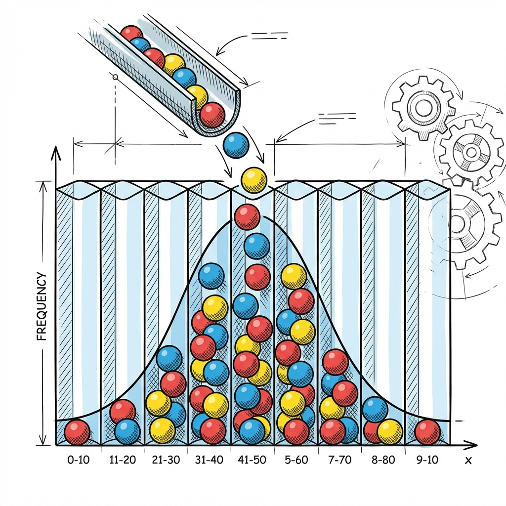

</div>
</div>

---

<div class="columns">
<div class="two">

### Subplots

You can put multiple plots in one figure.

```python
# 1 row, 2 columns

# Plot 1
plt.subplot(1, 2, 1) # (Rows, Cols, Idx)
plt.plot(x, y)
plt.title("Line")

# Plot 2
plt.subplot(1, 2, 2)
plt.scatter(x, y)
plt.title("Scatter")

plt.show()
```

</div>
<div class="two">

<!-- Diagram showing a layout grid for a figure divided into two parts side-by-side, labeled "Subplot 1" and "Subplot 2". -->

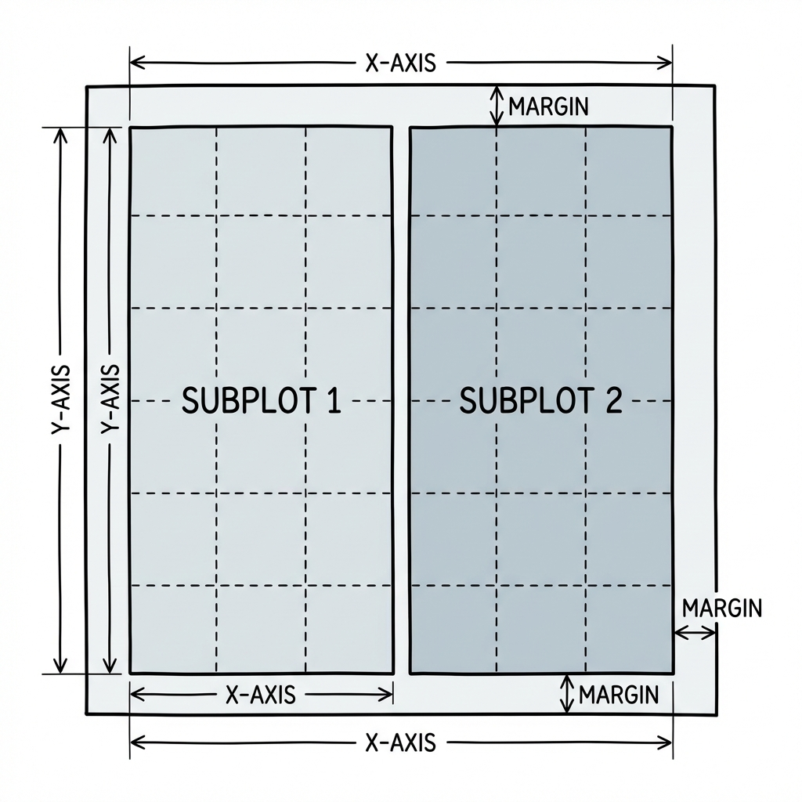

</div>
</div>

---

<div class="columns">
<div class="two">

### Saving Figures

Instead of showing the plot on screen, you can save it to a file for your report.

```python
plt.plot(x, y)
plt.title("Final Results")

# Save as PNG, PDF, SVG, etc.
# dpi = dots per inch (resolution)
plt.savefig("results.png", dpi=300)

print("Plot saved to results.png")
```

</div>
<div class="two">

<!-- Illustration of a chart on a screen being transferred into a document file icon labeled "results.png" on a hard drive. -->


</div>
</div>

---

### Integration with Pandas

Pandas has built-in wrappers for Matplotlib, making it even easier.

```python
import pandas as pd

df = pd.DataFrame({
    "A": [1, 2, 3],
    "B": [4, 5, 6]
})

# Plot column 'A' vs index
df["A"].plot(kind='line')

# Scatter plot A vs B
df.plot(kind='scatter', x='A', y='B')

plt.show()
```

---

### Exercise: Plotting Sine Wave

1.  Use NumPy to generate `x` values from 0 to $2\pi$ (use `np.pi`).
2.  Calculate `y1 = sin(x)` and `y2 = cos(x)`.
3.  Plot both on the same graph.
4.  Make the sine wave **blue** and cosine wave **red**.
5.  Add a **legend** identifying each line.
6.  Add a **title** "Trigonometric Functions".

---

### Solution: Plotting Sine Wave

```python
import numpy as np
import matplotlib.pyplot as plt

x = np.linspace(0, 2 * np.pi, 100)
y1 = np.sin(x)
y2 = np.cos(x)

plt.plot(x, y1, color="blue", label="sin(x)")
plt.plot(x, y2, color="red", label="cos(x)")

plt.title("Trigonometric Functions")
plt.legend()
plt.grid(True)

plt.show()
```

---

### Additional Exercise: Bar Chart Comparison

1.  Create a list of months: `['Jan', 'Feb', 'Mar']`.
2.  Create two lists of sales figures for two products:
    - Product A: `[100, 150, 120]`
    - Product B: `[80, 110, 140]`
3.  Create a bar chart. *Challenge: How do you put bars side-by-side?* (You might need to offset the x-positions manually or search for "grouped bar chart matplotlib").
    - *Simple version:* Just plot Product A first.

---

# Chapter 9: Summary

- **pip** is your gateway to the Python ecosystem (PyPI).
- **NumPy** provides fast, efficient Arrays for numerical computing.
- **Pandas** provides DataFrames for structured data analysis (like Excel).
- **Matplotlib** provides powerful tools for visualizing data.
- These three libraries form the "Holy Trinity" of Python Data Science.