<!-- Abstract illustration of interconnected gears and digital data streams, symbolizing the integration of different software systems and professional standards. Set against a dark, cosmic background. -->


# Chapter 10: Web APIs, Testing & Documentation

This chapter includes the following sections:

- 10.1: Introduction to Web APIs (REST)
- 10.2: Consuming APIs with the `requests` Library
- 10.3: Automated Testing with `pytest`
- 10.4: Documentation and Professional Best Practices

---

<!-- Abstract illustration showing a bridge between two glowing digital islands, representing the connection between different software services via APIs. -->


## 10.1: Introduction to Web APIs (REST)

This section includes the following content:

- What are Web APIs?
- The Client-Server Model
- Understanding REST (Representational State Transfer)
- HTTP Methods (GET, POST, PUT, DELETE)
- Anatomy of a URL and Query Parameters
- Status Codes (200, 404, 500, etc.)

---

<div class="columns">
<div>

### What is an API?

**API** stands for **Application Programming Interface**.

- It is a set of rules and protocols that allows one software application to interact with another.
- It acts as a bridge or a translator between different systems.
- In the context of the web, it allows your Python script to "talk" to services like Google Maps, Spotify, or Weather data providers.

</div>
<div>

<!-- Image description: A conceptual illustration of two digital gears (representing different software) being connected by a glowing, translucent bridge (the API). The bridge is labeled with binary code. -->

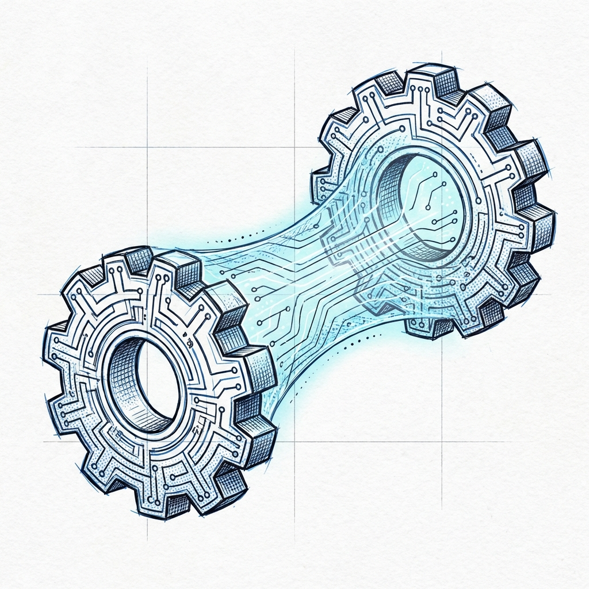

</div>
</div>

---

<div class="columns">
<div>

### The "Waiter" Analogy

Imagine you are at a restaurant:

- **You (The Customer):** The application requesting data.
- **The Kitchen:** The system (Server) that prepares the data.
- **The Menu:** The list of available requests you can make.
- **The Waiter (The API):** Takes your order (Request), tells the kitchen what to do, and brings the food (Response) back to you.

</div>
<div>

<!-- Image description: A professional infographic showing a customer at a table, a waiter holding a notepad (labeled 'Request'), and a kitchen hatch where a chef is placing a plate (labeled 'Response'). High contrast, clean design. -->


</div>
</div>

---

<div class="columns">
<div>

### The Client-Server Model

Most web interactions follow this pattern:

- **Client:** The requester (your Python script or a web browser).
- **Server:** The provider (a computer in the cloud that holds data).
- The Client sends a **Request**.
- The Server sends back a **Response**.

</div>
<div>

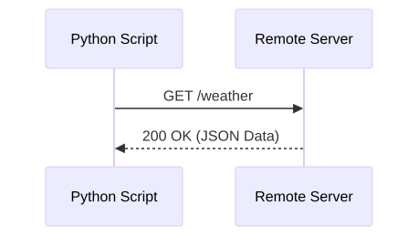

</div>
</div>

---

<div class="columns">
<div>

### What is REST?

**REST** stands for **Representational State Transfer**.

- It is an architectural style for designing networked applications.
- It uses standard HTTP methods.
- It is **Stateless**: Each request must contain all the information the server needs to understand it. The server doesn't "remember" previous requests.
- It is based on **Resources** (data objects).

</div>
<div>

<!-- Image description: A minimalist icon set representing 'Statelessness' (a series of independent clouds) and 'Resources' (various geometric shapes like cubes and spheres labeled 'User', 'Order', 'Product'). -->


</div>
</div>

---

<div class="columns">
<div class="two">

### Resources and URIs

In REST, everything is a **Resource**.

- A resource is an object or representation of data (e.g., a specific User, a Product, or a Weather report).
- Each resource is identified by a **URI** (Uniform Resource Identifier).
- Usually, these look like web addresses.

</div>
<div>

| Resource | URI Example |
| :--- | :--- |
| All Users | `/api/users` |
| Specific User | `/api/users/42` |
| User's Orders | `/api/users/42/orders` |

</div>
</div>

---

<div class="columns">
<div>

### HTTP Methods: The "Verbs"

To interact with resources, we use HTTP methods that define the **action** we want to perform.

- **GET:** Retrieve data (Read).
- **POST:** Create new data (Create).
- **PUT:** Update existing data (Update/Replace).
- **DELETE:** Remove data (Delete).

These correspond to the **CRUD** operations in database management.

</div>
<div>

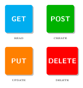

</div>
</div>

---

### HTTP GET vs. POST

<div class="columns top">
<div>

### GET
- Used to **fetch** data.
- Data is sent in the **URL** (Query Parameters).
- Should be "Idempotent": Doing it many times has the same effect as doing it once.
- Safe to bookmark.

</div>
<div>

### POST
- Used to **submit** or **create** data.
- Data is sent in the **Request Body**.
- Not Idempotent: Sending twice might create two items.
- Used for passwords or large data.

</div>
</div>

---

### Anatomy of a URL

A URL is more than just an address; it's a precise instruction.

1. **Protocol:** `https://`
2. **Domain/Host:** `api.example.com`
3. **Path:** `/v1/products/`
4. **Query Params:** `?category=electronics&sort=price`

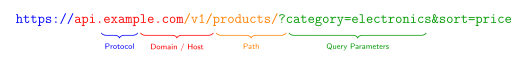

---

<div class="columns">
<div>

### Query Parameters

Query parameters allow us to **filter**, **sort**, or **paginate** resources.

- They start with a `?`.
- They use key-value pairs: `key=value`.
- Multiple parameters are joined with `&`.

Example:
`https://shop.com/items?color=red&size=L`

</div>
<div>

```python
# Conceptual representation
params = {
    "color": "red",
    "size": "L"
}
# URL: .../items?color=red&size=L
```

</div>
</div>

---

<div class="columns">
<div>

### JSON: The Language of APIs

Most modern APIs exchange data in **JSON** (JavaScript Object Notation) format.

- It looks almost exactly like a **Python Dictionary**.
- It supports nested structures (lists inside dictionaries, etc.).
- It is text-based and lightweight.

</div>
<div>

```json
{
  "status": "success",
  "data": {
    "id": 101,
    "name": "Widget",
    "tags": ["metal", "small"]
  }
}
```

</div>
</div>

---

<div class="columns">
<div>

### HTTP Status Codes (Overview)

The server tells the client how the request went using a 3-digit number.

- **2xx (Success):** Everything is OK.
- **3xx (Redirection):** Go somewhere else.
- **4xx (Client Error):** You did something wrong (e.g., 404 Not Found).
- **5xx (Server Error):** The server crashed.

</div>
<div>

<!-- Image description: A row of three traffic lights. The first is solid Green (labeled 200 OK). The second is solid Orange (labeled 400 Bad Request). The third is solid Red (labeled 500 Server Error). -->

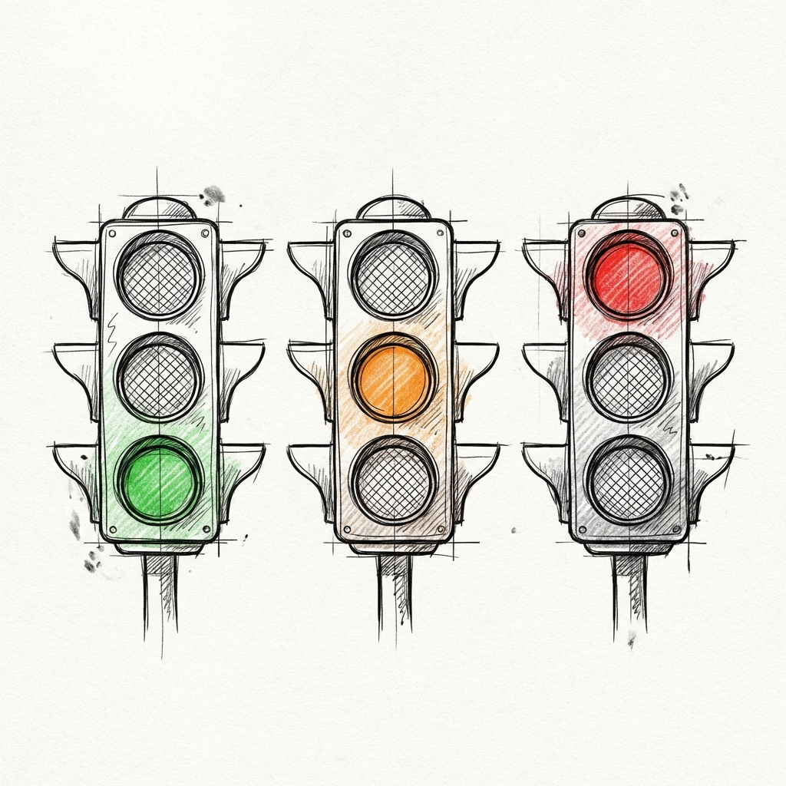

</div>
</div>

---

### Important Status Codes to Know

<div class="columns">
<div>

| Code | Meaning |
| :--- | :--- |
| **200** | **OK** - Success! |
| **201** | **Created** - New resource made. |
| **400** | **Bad Request** - Invalid syntax. |
| **401** | **Unauthorized** - Need API Key. |

</div>
<div>

| Code | Meaning |
| :--- | :--- |
| **403** | **Forbidden** - No permission. |
| **404** | **Not Found** - Doesn't exist. |
| **500** | **Internal Server Error** - Server bug. |
| **503** | **Service Unavailable** - Overloaded. |

</div>
</div>

---

<div class="columns">
<div>

### Why PMs Should Care About APIs

- **Connectivity:** Can our product integrate with others?
- **Cost/Quotas:** APIs often cost money per request.
- **Reliability:** If an external API goes down, does our product break?
- **Scalability:** How many requests per second can our system handle?

Understanding these concepts helps you define better technical requirements.

</div>
<div>

<!-- Image description: A product manager looking at a dashboard with various connected service logos (Twitter, Stripe, AWS) showing green checkmarks and uptime percentages. -->


</div>
</div>

---

### Exercise: API Concept Mapping

Match the REST concept to its real-world counterpart:

<div class="columns">
<div>

1. **GET Method**
2. **404 Status Code**
3. **Resource**
4. **Query Parameter**

</div>
<div>

A. A specific book in a library.
B. Asking a librarian for a book.
C. The librarian saying "We don't have that book".
D. Asking for books *by a specific author*.

</div>
</div>

---

<div class="columns">
<div>

### Solution: API Concept Mapping

**Correct Matches:**

1. **GET Method** $\rightarrow$ **B** (Asking for a book)
2. **404 Status Code** $\rightarrow$ **C** (Not found)
3. **Resource** $\rightarrow$ **A** (The book itself)
4. **Query Parameter** $\rightarrow$ **D** (Filtering by author)

</div>
<div>

<!-- Image description: A simple illustration of a librarian shaking their head 'no' next to an empty shelf labeled '404'. -->


</div>
</div>

---

### Final Exercise: URL Breakdown

Identify the **Domain**, **Path**, and **Query Parameters** in the following URL:

`https://api.github.com/search/repositories?q=python&sort=stars`

*(Write down your answer and check it with your neighbor.)* 

---

<!-- Abstract illustration of a digital hand grabbing data packets from a cloud, representing the process of consuming data from an external API. -->


## 10.2: Consuming APIs with the `requests` Library

This section includes the following content:

- Introduction to the `requests` library
- Making GET requests
- Handling JSON data
- Sending data with POST requests
- Error handling in network communication
- Practical Example: Fetching weather data or currency rates

---

<div class="columns">
<div>

### Why the `requests` Library?

Python has built-in tools for the web (`urllib`), but they are complex and "unfriendly".

- **`requests`** is the "HTTP for Humans" library.
- It is the industry standard for making API calls.
- Simple, readable, and handles most complexity automatically.
- **Note:** It is an external library; you must install it.

</div>
<div>

<!-- Image description: A side-by-side comparison of two code snippets. Left: 15 lines of complex, nested 'urllib' code. Right: 3 lines of clean 'requests' code. The 'requests' side is highlighted with a soft green glow. -->

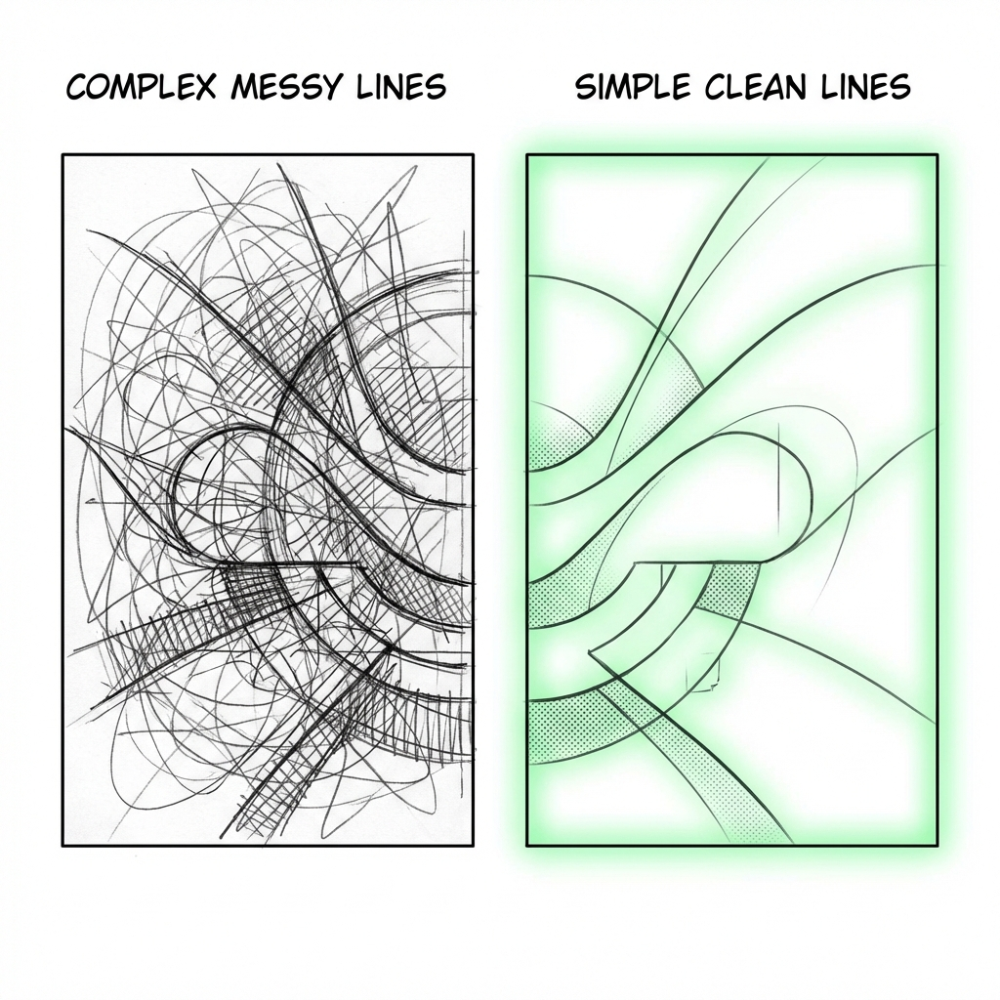

</div>
</div>

---

<div class="columns">
<div>

### Installation and First Steps

Since `requests` is an external package, we install it via `pip`:

```bash
pip install requests
```

In your script, simply import it:

```python
import requests
```

</div>
<div>

<!-- Screenshot description: A terminal window showing the successful output of 'pip install requests' followed by a Python REPL successfully importing the library. -->

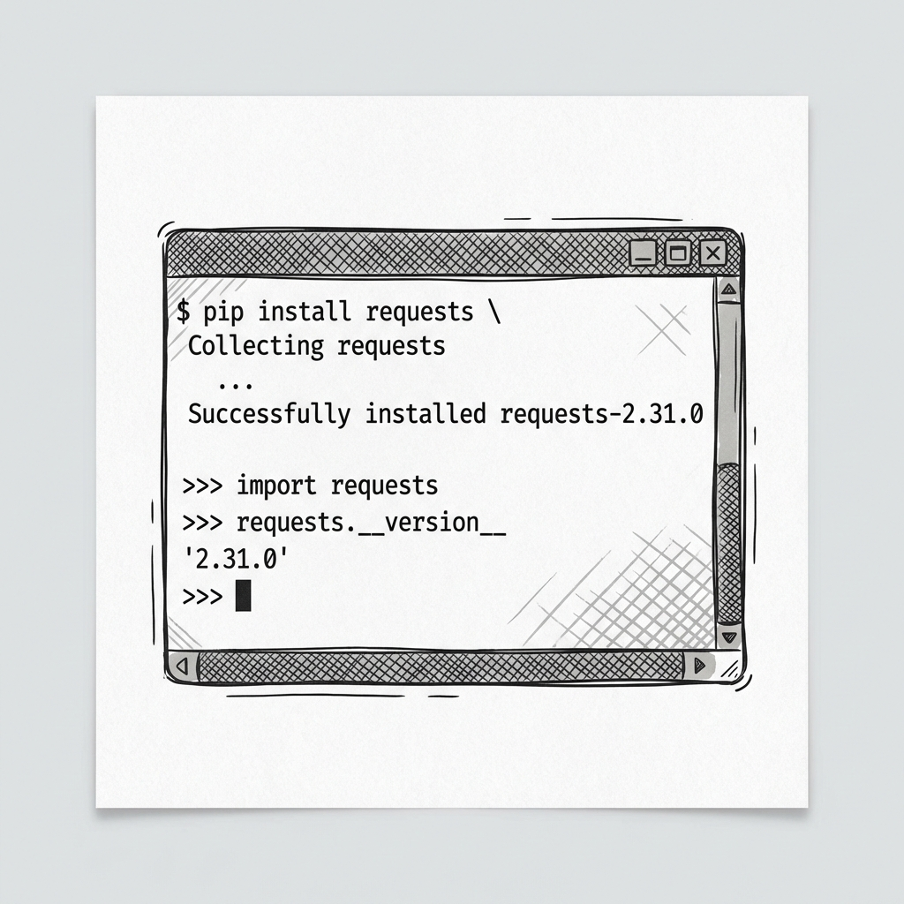

</div>
</div>

---

<div class="columns">
<div class="three">

### Making a Simple GET Request

To fetch data, we use the `requests.get()` function.

```python
import requests

# The URL of the API
url = "https://api.github.com"

# Sending the request
response = requests.get(url)

print(response.status_code)
```

This returns a **Response Object**.

</div>
<div>



</div>
</div>

---

<div class="columns">
<div>

### Exploring the Response Object

The Response object contains everything the server sent back:

- `.status_code`: The HTTP code (e.g., 200).
- `.text`: The raw body content as a string.
- `.headers`: Dictionary of metadata (e.g., Content-Type).
- `.json()`: A method to parse the body as JSON.

</div>
<div>

```python
response = requests.get("https://api.github.com")

if response.status_code == 200:
    print("Success!")
    print(response.headers['Content-Type'])
```

</div>
</div>

---

<div class="columns">
<div>

### Handling JSON Data

Most APIs return JSON. The `.json()` method converts it directly into a **Python Dictionary or List**.

```python
response = requests.get("https://api.github.com/zen")
# (GitHub Zen returns a simple string, 
# but imagine a dictionary response)

data = response.json()
print(type(data)) # <class 'dict'>
```

No manual string parsing needed!

</div>
<div>

<!-- Image description: A visual metaphor showing a 'JSON package' (a box labeled with curly braces) being put through a machine (the .json() method) and coming out as a neatly organized 'Python Filing Cabinet'. -->

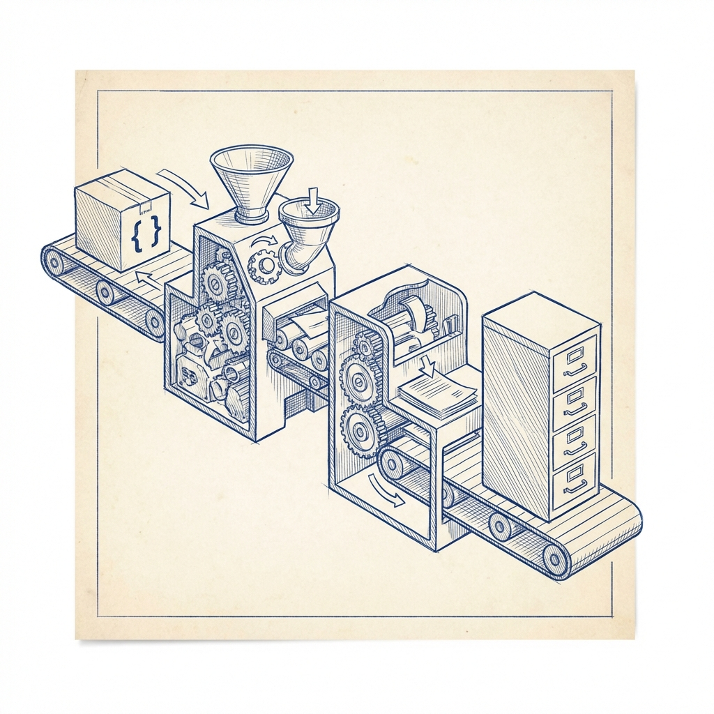

</div>
</div>

---

<div class="columns">
<div>

### Sending Query Parameters

Instead of building long URLs manually, pass a dictionary to the `params` argument.

- **Cleaner code.**
- **Automatic encoding:** Handles spaces and special characters (like `?` or `&`) correctly.
- **Easy to modify:** Just change the dictionary.

</div>
<div >

```python
payload = {
    'q': 'python',
    'sort': 'stars'
}

response = requests.get(
    "https://api.github.com/search/repositories", 
    params=payload
)

print(response.url)
# api.github.com/.../repositories?q=python&sort=stars
```

</div>
</div>

---

<div class="columns">
<div>

### API Keys and Authentication

Many APIs are not public. They require an **API Key** (a secret password) to track usage and bill you.

- Often sent in the **Headers**.
- **Security Warning:** NEVER hardcode keys in public code. Use environment variables.

</div>
<div>

```python
headers = {
    "Authorization": "Bearer YOUR_SECRET_KEY"
}

response = requests.get(url, headers=headers)
```

<!-- Image description: A digital key entering a lock on a server rack. The key is labeled 'API Key'. -->

</div>
</div>

---

<div class="columns">
<div>

### Sending Data: POST Requests

To create data on a server, use `requests.post()`.

- Use the `json` argument to send a dictionary as a JSON body.
- The server will process this data and usually return a `201 Created` status.

</div>
<div>

```python
new_post = {
    "title": "Hello World",
    "body": "This is my first post via API",
    "userId": 1
}

r = requests.post(
    "https://jsonplaceholder.typicode.com/posts",
    json=new_post
)

print(r.status_code) # 201
```

</div>
</div>

---

<div class="columns">
<div>

### Basic Error Handling

What if the internet is down? Or the URL is wrong?

- `response.raise_for_status()`: Throws an exception if the status code is a 4xx or 5xx error.
- Use `try...except` to catch these errors gracefully.

</div>
<div>

```python
try:
    r = requests.get("https://bad-url.com")
    r.raise_for_status()
except requests.exceptions.HTTPError as err:
    print(f"HTTP error: {err}")
except Exception as err:
    print(f"Other error: {err}")
```

</div>
</div>

---

<div class="columns">
<div>

### Timeouts: Don't Wait Forever

By default, `requests` will wait indefinitely for a response. This can hang your program.

- Always use the `timeout` parameter (in seconds).
- If the server doesn't respond in time, it raises a `Timeout` exception.

</div>
<div>

```python
try:
    # Wait max 3 seconds
    r = requests.get(url, timeout=3)
except requests.exceptions.Timeout:
    print("The request timed out!")
```

<!-- Image description: A clock icon with a warning exclamation mark, representing a process being cut off after a time limit. -->

</div>
</div>

---

<div class="columns">
<div>

### Rate Limiting (The PM's Headache)

APIs usually have **Rate Limits** (e.g., 60 requests per hour).

- If you exceed the limit, you get a **429 Too Many Requests** error.
- **Check Headers:** Many APIs tell you how many requests you have left in the response headers.

</div>
<div>

<!-- Screenshot description: A dictionary of response headers showing 'X-RateLimit-Limit: 60' and 'X-RateLimit-Remaining: 5'. -->

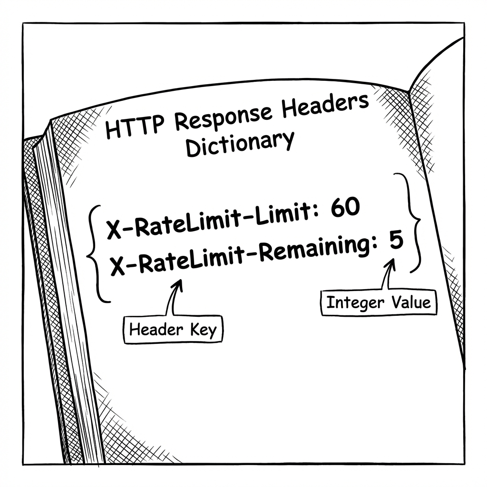

</div>
</div>

---

<div class="columns">
<div>

### Practical Example: Weather Data

Let's fetch current weather for Wels.

1. Set up the URL.
2. Define parameters (API key, location, units).
3. Send GET request.
4. Extract temperature from JSON.

</div>
<div>

```python
import requests

url = "https://api.openweathermap.org/data/2.5/weather"
params = {
    "q": "Wels,AT",
    "appid": "your_api_key",
    "units": "metric"
}

r = requests.get(url, params=params)
data = r.json()

temp = data["main"]["temp"]
print(f"Current temp in Wels: {temp}°C")
```

</div>
</div>

---

<div class="columns">
<div>

### Exercise: Fetching Data

**Task:**
Write a Python script that:
1. Imports `requests`.
2. Makes a GET request to `https://api.github.com/users/octocat`.
3. Prints the "name" and the "company" of the user.
4. Handles the case where the user might not be found (404).

</div>
<div>

<!-- Image description: The GitHub Octocat mascot waving. -->

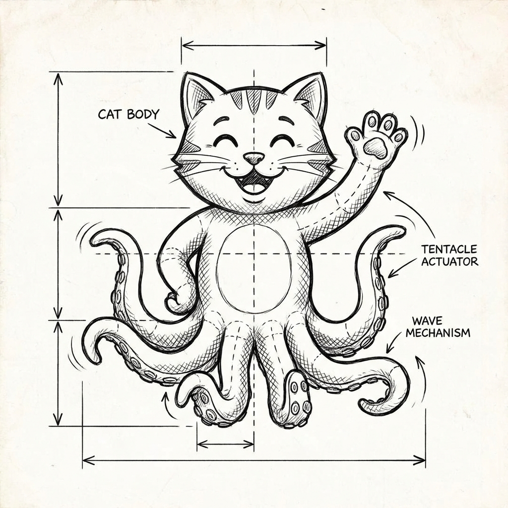

</div>
</div>

---

### Solution: Fetching Data

```python
import requests

url = "https://api.github.com/users/octocat"
response = requests.get(url)

if response.status_code == 200:
    data = response.json()
    print(f"Name: {data.get('name')}")
    print(f"Company: {data.get('company')}")
elif response.status_code == 404:
    print("User not found!")
else:
    print("An error occurred.")
```

---

### Final Exercise: Post a Data Point

Find a public test API (like JSONPlaceholder) and attempt to **POST** a new "To-Do" item. 

1. Create a dictionary with a `title` and `completed` (boolean) status.
2. Send it via `requests.post`.
3. Verify that you receive a `201 Created` status code.

---

<!-- Abstract illustration of a digital magnifying glass inspecting a complex circuit board, symbolizing the process of automated testing and quality assurance. -->


## 10.3: Automated Testing with `pytest`

This section includes the following content:

- Why do we test? (Quality Assurance in Product Management)
- Manual vs. Automated Testing
- Introduction to `pytest`
- Writing your first test case
- Using Assertions
- Running tests and interpreting results

---

<div class="columns">
<div>

### The Cost of a Bug

Why do we test?

- **Economic Impact:** Fixing a bug in production is 10x - 100x more expensive than fixing it during development.
- **Reputation:** Bugs lose customers and trust.
- **Complexity:** As code grows, it becomes impossible to check everything manually.
- **Safety:** In engineering contexts, bugs can cause physical damage.

</div>
<div>

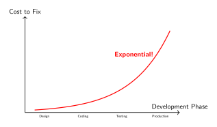

</div>
</div>

---

### Manual vs. Automated Testing

<div class="columns">
<div class="five">

### Manual Testing
- Human clicking through the app.
- Slow and prone to errors.
- Good for UI/UX feel.
- Hard to repeat exactly.

</div>
<div class="five">

### Automated Testing
- Code testing code.
- Fast, precise, and repeatable.
- Run thousands of tests in seconds.
- Essential for "Continuous Integration".

</div>
</div>

---

<div class="columns">
<div>

### What is Unit Testing?

**Unit Testing** focuses on the smallest testable parts of an application (usually single functions or classes).

- It isolates a piece of code and verifies its correctness.
- It doesn't test the whole system at once.
- If all units work, we have high confidence in the overall system.

</div>
<div>

<!-- Image description: A wall of Lego bricks. One brick is highlighted and being inspected by a magnifying glass, while the rest of the wall is slightly dimmed. This represents testing a single 'unit' in a larger structure. -->


</div>
</div>

---

<div class="columns">
<div>

### Introduction to `pytest`

**`pytest`** is the most popular testing framework for Python.

- **Simple Syntax:** No boilerplate code required.
- **Powerful Features:** Supports fixtures, parameterization, and plugins.
- **Easy to Run:** Just type `pytest` in your terminal.
- **Informative:** Provides detailed reports on why a test failed.

</div>
<div>

<!-- Screenshot description: A terminal showing 'pytest' running with several green dots and one red 'F' for failure, followed by a clear explanation of the expected vs. actual value. -->

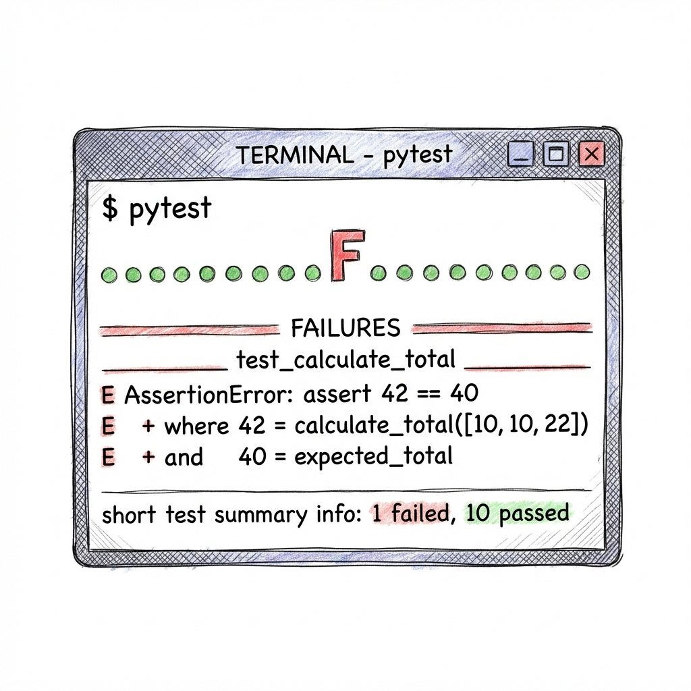

</div>
</div>

---

<div class="columns">
<div>

### Installation of `pytest`

Install it via pip:

```bash
pip install pytest
```

Verify the installation:

```bash
pytest --version
```

</div>
<div>

<!-- Image description: A checklist where 'Install pytest' is checked with a green marker. -->


</div>
</div>

---

<div class="columns">
<div>

### Writing Your First Test

Create a file named `test_math.py`.
- Function names must start with `test_`.
- Use the standard Python `assert` keyword.

</div>
<div>

```python
# test_math.py

def add(a, b):
    return a + b

def test_add_positive_numbers():
    assert add(2, 3) == 5

def test_add_negative_numbers():
    assert add(-1, -1) == -2
```

</div>
</div>

---

<div class="columns">
<div>

### The `assert` Keyword

The `assert` keyword evaluates an expression.
- If `True`, the program continues (the test passes).
- If `False`, it raises an `AssertionError` (the test fails).

Think of it as a formal "I promise that X is true".

</div>
<div>

```python
x = 10
assert x > 5  # Passes
assert x < 5  # Fails!
```

<!-- Image description: A judge's gavel striking a block, symbolizing a final decision or verification. -->

</div>
</div>

---

<div class="columns">
<div>

### Testing Edge Cases

Good developers test the "Happy Path". Great developers test the **Edge Cases**.

- Empty inputs (lists, strings).
- Zero or negative numbers.
- Large data sets.
- `None` values.

</div>
<div>

```python
def average(numbers):
    if not numbers:
        return 0
    return sum(numbers) / len(numbers)

def test_average_empty():
    assert average([]) == 0

def test_average_single():
    assert average([5]) == 5
```

</div>
</div>

---

<div class="columns">
<div>

### Running Tests from CLI

Navigate to your project folder and run:

```bash
pytest
```

- `.` means Pass.
- `F` means Fail.
- `E` means Error (the test code itself crashed).

</div>
<div>

<!-- Screenshot description: A terminal window showing the output of a successful pytest run with 100% passing and 'passed in 0.05s'. -->

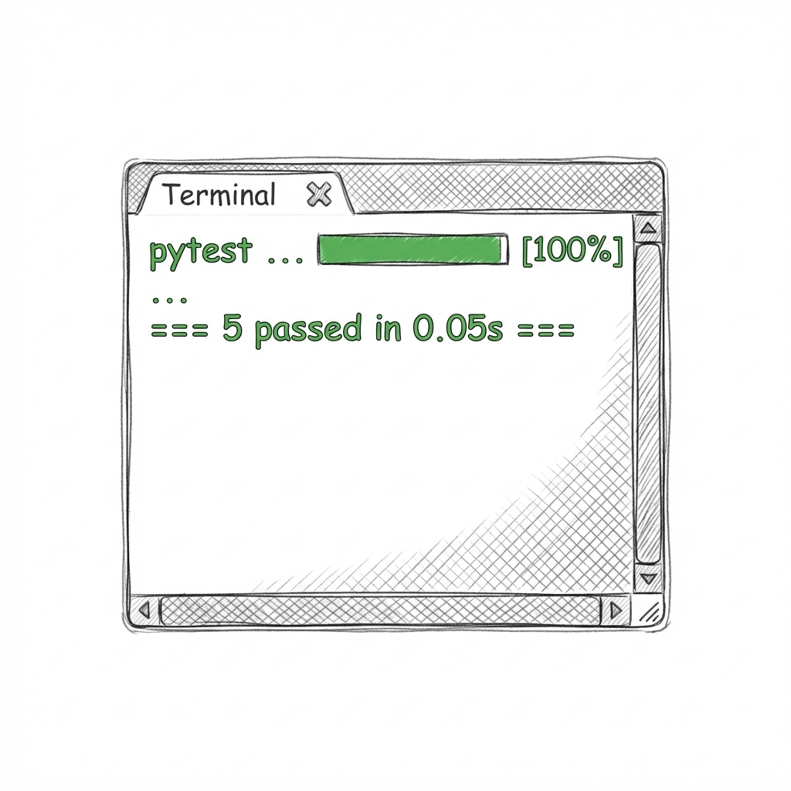

</div>
</div>

---

<div class="columns">
<div>

### Interpreting Failures

`pytest` gives you a "diff" when a test fails.

It shows:
1. Which line failed.
2. What the value was.
3. What the value **should** have been.

</div>
<div>

```text
>       assert add(2, 2) == 5
E       assert 4 == 5
E        +  where 4 = add(2, 2)
```

<!-- Image description: A red 'X' mark next to a line of code, with a magnifying glass zooming in on the incorrect number. -->

</div>
</div>

---

<div class="columns">
<div class="two">

### Test-Driven Development (TDD)

1. **Red:** Write a test that fails (because the function doesn't exist yet).
2. **Green:** Write the minimum code to make the test pass.
3. **Refactor:** Clean up the code.

Repeat!

</div>
<div>



</div>
</div>

---

<div class="columns">
<div>

### Regression Testing

**Regression** is when a new feature breaks an old one.

- By keeping your tests and running them often, you ensure that your progress doesn't destroy what already works.
- This is vital when refactoring (cleaning up) old code.

</div>
<div>

<!-- Image description: A wall with many supports. A hand is adding a new block at the top, and all the bottom blocks remain stable and glowing green. -->


</div>
</div>

---

<div class="columns">
<div>

### Testing as a Quality Gate

In professional teams, code is not allowed to be merged into the main product if the tests fail.

- This is part of **CI/CD** (Continuous Integration / Continuous Deployment).
- It takes the "guessing" out of software quality.

</div>
<div>

<!-- Image description: A digital gate labeled 'Testing'. Code packets are trying to pass. Ones with green checkmarks pass through; ones with red 'X's are blocked. -->

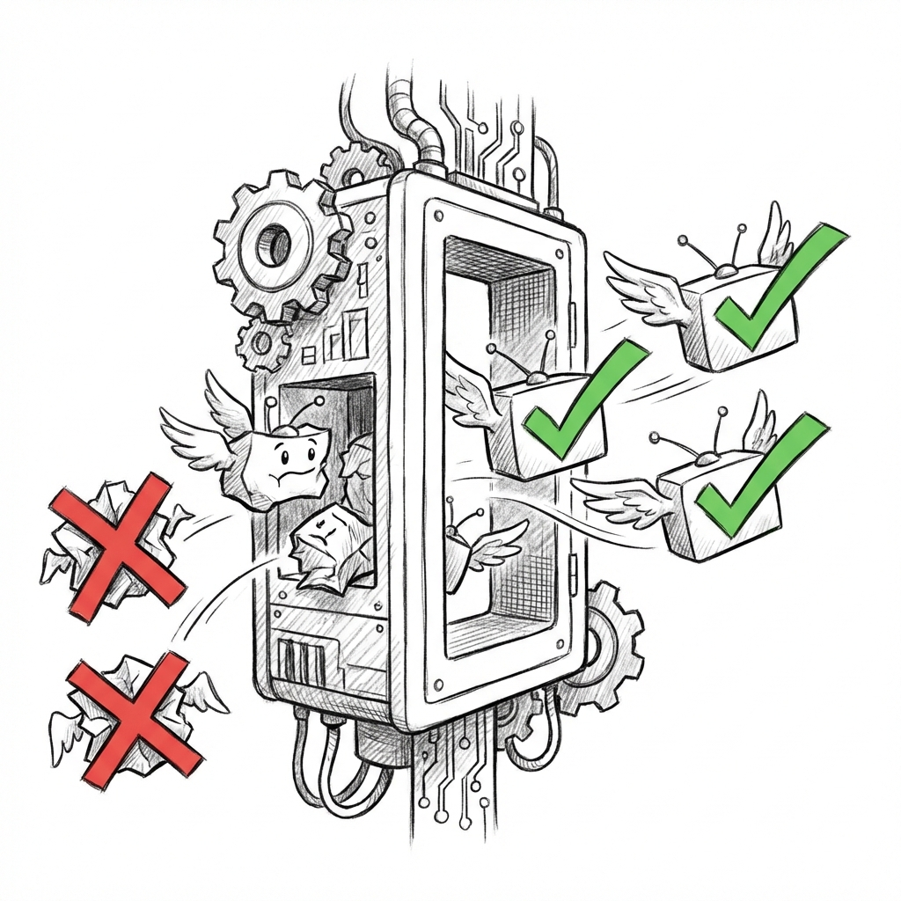

</div>
</div>

---

<div class="columns">
<div>

### Exercise: Testing a Math Function

**Task:**
1. Create a function `is_even(n)` that returns `True` if a number is even, and `False` otherwise.
2. Write at least 3 tests for this function in a `pytest` format.
3. Test a positive even number, a positive odd number, and zero.

</div>
<div>

```python
# Your code here...
```

</div>
</div>

---

### Solution: Testing a Math Function

```python
# logic.py
def is_even(n):
    return n % 2 == 0

# test_logic.py
def test_is_even_with_even():
    assert is_even(4) is True

def test_is_even_with_odd():
    assert is_even(7) is False

def test_is_even_with_zero():
    assert is_even(0) is True
```

---

### Final Section Exercise: Debugging with Tests

I have provided a "broken" function that is supposed to count vowels in a string but has bugs. 

**Your Task:**
1. Write a test suite for `count_vowels(text)`.
2. Run `pytest` to see where it fails.
3. Fix the function until all tests pass.

*(Think about: case sensitivity, empty strings, and special characters!)*

---

<!-- Abstract illustration of a well-organized library of digital scrolls and glowing icons, representing clean code and comprehensive documentation. -->


## 10.4: Documentation and Professional Best Practices

This section includes the following content:

- The Importance of Documentation
- Writing Docstrings (PEP 257)
- Introduction to Type Hinting
- Clean Code Principles for Python
- Generating Documentation with Tools
- Career Outlook: The Role of the "Technical Product Manager"

---

<div class="columns">
<div>

### Code is Written for Humans

"Code is read much more often than it is written." – Guido van Rossum

- Computers don't care about variable names or comments.
- **Your future self** and **your teammates** do.
- Good documentation is a sign of a professional engineer and a responsible product manager.

</div>
<div>

<!-- Image description: A mirror reflecting a programmer. The reflection is wearing a wizard hat, symbolizing the 'Future Self' who has to understand the 'Magic' code written today. -->


</div>
</div>

---

### What is Documentation?

<div class="columns top">
<div>

### Internal (Code-level)
- Explains **how** and **why** specific logic exists.
- Docstrings and Comments.
- Intended for developers.

</div>
<div>

### External (User-level)
- Explains **what** the software does and how to use it.
- README files, Wikis, API Docs.
- Intended for users/customers.

</div>
</div>

---

<div class="columns">
<div>

### Python Docstrings (PEP 257)

A **Docstring** is a string literal that occurs as the first statement in a module, function, class, or method definition.

- Surrounded by triple quotes `"""`.
- Python automatically associates this string with the object's `__doc__` attribute.

</div>
<div>

```python
def calculate_roi(investment, gain):
    """
    Calculates the Return on Investment. 
    
    :param investment: Float, initial cost.
    :param gain: Float, total return.
    :return: Float, ROI percentage.
    """
    return (gain - investment) / investment
```

</div>
</div>

---

<div class="columns">
<div>

### Why Docstrings are Better Than Comments

- **Standardization:** Tools can read them to generate websites automatically.
- **Accessibility:** IDEs (like VS Code) show them when you hover over a function.
- **Introspection:** You can see them at runtime using `help(function_name)`.

</div>
<div>

<!-- Screenshot description: VS Code showing a tooltip popup with the formatted docstring of a function when the mouse hovers over the function call. -->

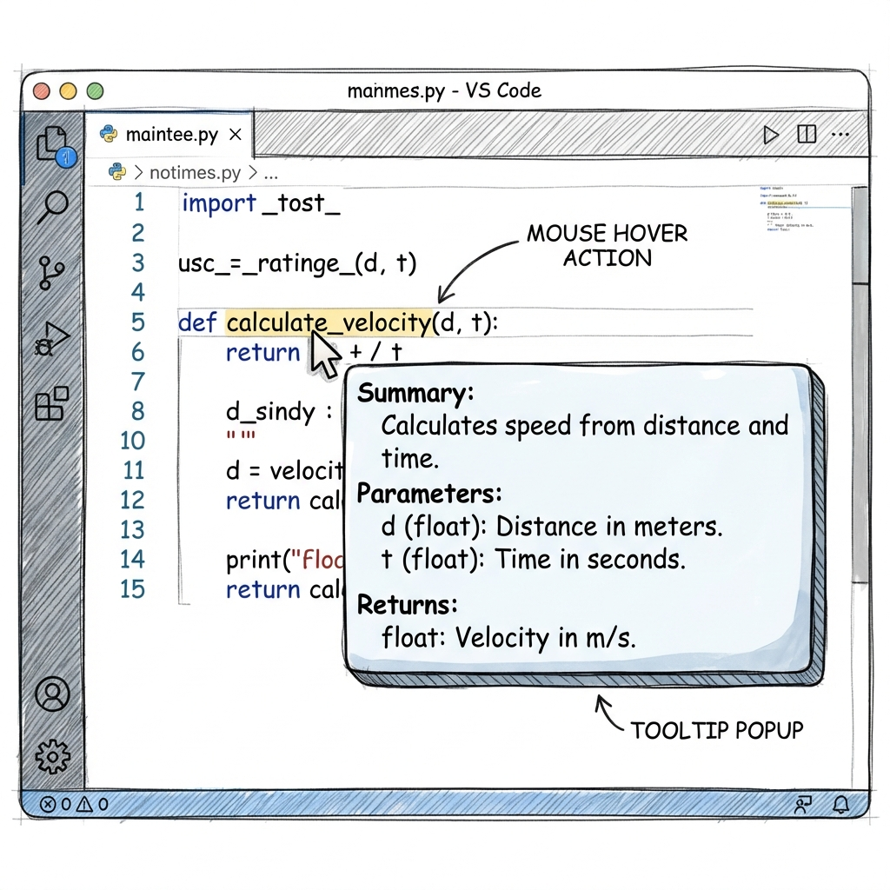

</div>
</div>

---

<div class="columns">
<div>

### Type Hinting: Clarity through Constraints

Python is "Dynamically Typed", but modern Python (3.5+) supports **Type Hints**.

- They tell the reader (and the IDE) what data types are expected.
- They don't enforce types at runtime, but help catch bugs early.

</div>
<div>

```python
# Without hints
def greet(name):
    return "Hello " + name

# With hints
def greet(name: str) -> str:
    return "Hello " + name
```

</div>
</div>

---

### Clean Code: Meaningful Names

<div class="columns">
<div class="five">

### Bad ❌
```python
def p(d, i):
    return d * (1 + i)

x = p(100, 0.05)
```

</div>
<div class="five">

### Good ✅
```python
def calculate_total_price(price, tax_rate):
    return price * (1 + tax_rate)

total = calculate_total_price(100, 0.05)
```

</div>
</div>

---

<div class="columns">
<div>

### Clean Code: The "One Job" Rule

A function should do **one thing** and do it well.

- If a function is 100 lines long, it's likely doing too much.
- Break it into smaller, descriptive pieces.
- This makes testing and debugging much easier.

</div>
<div>

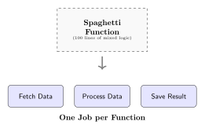

</div>
</div>

---

<div class="columns">
<div>

### Comments: The "Why", Not the "What"

- **Don't** comment things that the code already says clearly.
- **Do** comment unusual decisions, business logic, or "hacks".

</div>
<div>

```python
# Bad: Increment i by 1
i += 1 

# Good: Adjusted for index 
# because the API is 1-based
offset = index + 1
```

</div>
</div>

---

<div class="columns">
<div>

### Automated Quality: Linting

A **Linter** is a tool that analyzes your source code to flag programming errors, bugs, stylistic errors, and suspicious constructs.

- **Flake8 / Ruff:** Checks for PEP 8 style violations.
- **MyPy:** Checks for type-hinting consistency.

</div>
<div>

<!-- Image description: A digital vacuum cleaner sucking up 'messy code' particles and leaving behind 'neat, aligned code' lines. -->

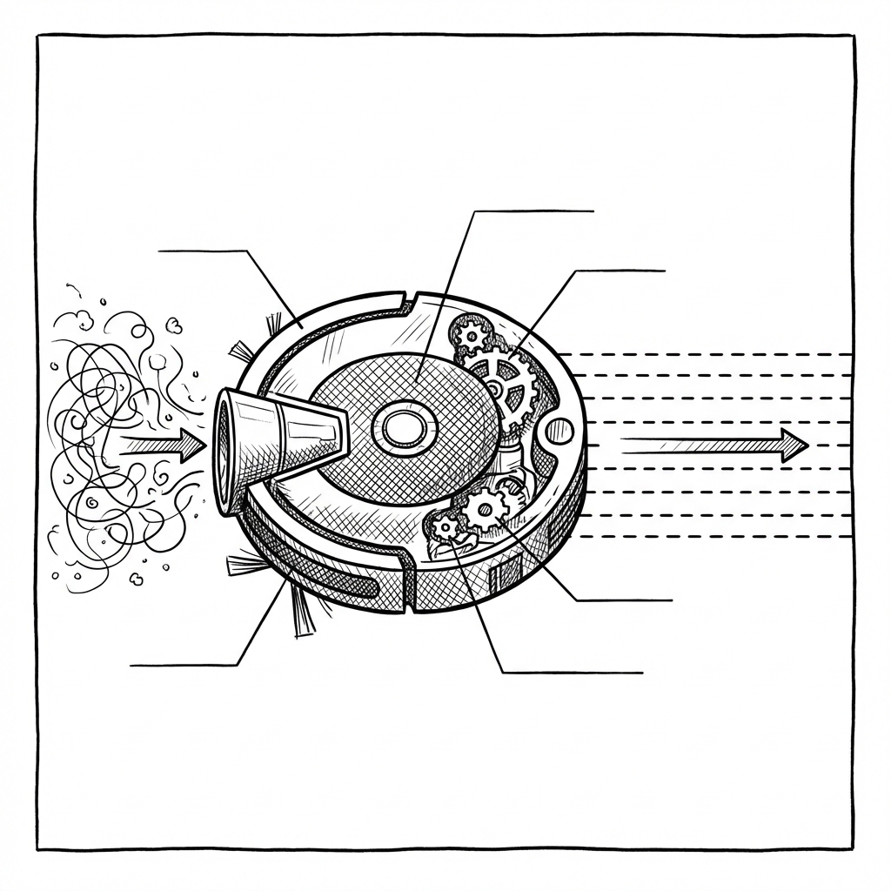

</div>
</div>

---

### Documentation Tools

<div class="columns">
<div>

Professional projects use tools to turn docstrings into beautiful websites.

- **Sphinx:** The gold standard for Python.
- **MkDocs:** Modern, markdown-based documentation.
- **Swagger/OpenAPI:** Specifically for documenting Web APIs.

</div>
<div>

<!-- Screenshot description: A high-quality documentation website (like the official Python docs) with a sidebar, search bar, and formatted function descriptions. -->

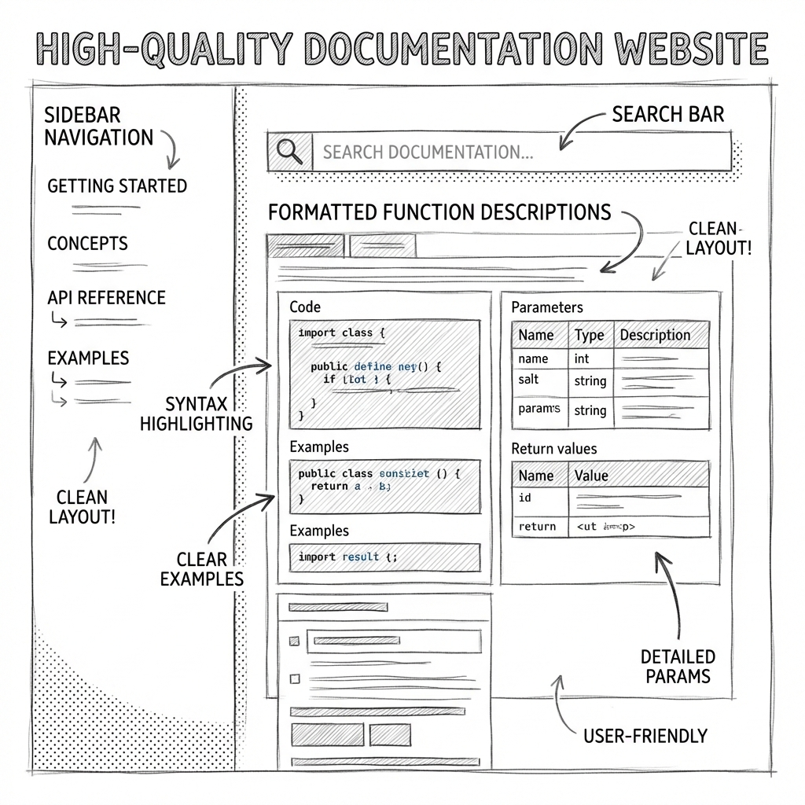

</div>
</div>

---

<div class="columns">
<div>

### The Role of the "Technical Product Manager"

As a PM, you are the bridge.

- You don't need to write every line of code.
- You **do** need to understand the architecture.
- You must ensure that the technical debt (untested, undocumented code) doesn't kill the product's future.

</div>
<div>

<!-- Image description: A Venn diagram with three circles: 'Business', 'User Experience', and 'Technology'. The center intersection is labeled 'Product Manager'. -->


</div>
</div>

---

### Career Outlook & Next Steps

- **Python is a tool, not the goal.** Use it to automate your work, analyze data, or communicate with engineers.
- **Keep Learning:** Libraries change, but the fundamentals (logic, data structures, testing) are eternal.

### Recommended Paths:
1. Data Science (Pandas, Scikit-Learn).
2. Web Development (FastAPI, Django).
3. Automation (Selenium, Scripting).


---

### Exercise: Documenting a Function

<div class="columns">
<div class="six">

**Task:**
Take the following function and add:
1. Type hints for input and output.
2. A proper triple-quoted docstring explaining the logic.

```python
def convert_currency(amount, rate):
    return amount * rate
```

</div>
<div class="four">

<!-- Image description: A pencil writing into a digital notebook. -->

</div>
</div>

---

### Solution: Documenting a Function

<div class="columns">
<div class="ten">

```python
def convert_currency(amount: float, rate: float) -> float:
    """
    Converts an amount from one currency to another using a rate.
    
    Args:
        amount (float): The value in the base currency.
        rate (float): The conversion factor.
        
    Returns:
        float: The converted value.
    """
    return amount * rate
```

</div>
</div>

---

### Final Exercise: Refactoring and Typing

I will give you a script that is functional but "messy" (vague names, no types, no documentation, no tests).

**Your Final Challenge:**
1. Rename variables and functions to be descriptive.
2. Add type hints and docstrings.
3. Write two unit tests to prove it works.

---

# Chapter 10: Summary

- **Web APIs (REST)** allow software systems to communicate using standard HTTP methods and JSON data.
- The **`requests`** library is the industry standard for consuming APIs in a human-friendly way.
- **Automated Testing** with **`pytest`** ensures code quality, prevents regressions, and reduces long-term costs.
- **Documentation** (Docstrings) and **Clean Code** principles are essential for collaboration and maintainability.
- Professional engineering requires a balance of functional code, robust testing, and clear communication.

---

**Congratulations on completing the course!**